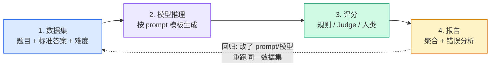

# 3. 标准评估流程：数据集 → 推理 → 评分 → 报告

> **如果只读一节**：评估四步法 = (1) 准备数据集 (2) 模型推理 (3) 评分 (4) 报告。每一步都有"坑"。

## 3.1 本章目标与读者

读完后你能：

- 画出标准评估流程图
- 知道每个步骤的关键决策
- 独立跑通一个 100 题的小型评估
- 知道常见的工程化坑（并发、限流、缓存）

**前置知识**：读完第 1-2 章。会用 TypeScript 写 async/await。

## 3.2 四步法概览



> **前端类比**：数据集 ≈ `__tests__/fixtures`，推理 ≈ 被测函数调用，评分 ≈ `expect` 断言，报告 ≈ CI 的测试报告页。虚线箭头就是"回归测试"——改任何一环都回到固定数据集重跑。

## 3.3 第 1 步：准备数据集

**数据集结构（JSONL 格式）**

```jsonl
{"id": "q001", "input": "What is 2+2?", "expected": "4", "category": "arithmetic", "difficulty": "easy"}
{"id": "q002", "input": "Capital of France?", "expected": "Paris", "category": "geography", "difficulty": "easy"}
{"id": "q003", "input": "Explain quantum entanglement in one sentence", "expected": null, "category": "physics", "difficulty": "hard"}
```

**关键字段**：
- `id` — 唯一标识
- `input` — 题目
- `expected` — 标准答案（可空，表示无参考答案）
- `category` — 分类（用于分组报告）
- `difficulty` — 难度（用于分层分析）

**数据集来源**

| 来源 | 优点 | 缺点 |
|---|---|---|
| 公开基准 | 标准、可对比 | 可能污染、过时 |
| 业务数据 | 真实场景 | 隐私、量少 |
| 合成生成 | 量大、可控 | 可能不真实 |
| 众包标注 | 质量高 | 贵、慢 |

**常见坑**

- **数据泄露**（leakage）：训练数据里已有测试题 → 评估分数虚高
- **分布偏移**（distribution shift）：训练用英语、评估用中文 → 分数大幅下降
- **样本太少**：100 道题的"95% 准确率"置信区间 [88%, 98%]
- **题目太简单**：所有模型都 99%，看不出差别

## 3.4 第 2 步：模型推理

**Prompt 模板化**

```typescript
const PROMPT_TEMPLATE = (question: string) => `
请回答以下问题。如果不知道，请回答"不知道"。

问题：${question}

回答：
`;
```

**为什么要模板化？**
- 同一模板下不同模型才能公平对比
- 模板变化 = 重新评估

**工程化要点**

```typescript
// 1. 并发控制（避免触发 API 限流）
import pLimit from "p-limit";
const limit = pLimit(10); // 最多 10 个并发

const results = await Promise.all(
  tasks.map(task => limit(() => runOneTask(task)))
);

// 2. 重试与超时
async function callModelWithRetry(input: string, retries = 3) {
  for (let i = 0; i < retries; i++) {
    try {
      return await Promise.race([
        openai.chat.completions.create({...}),
        new Promise((_, reject) => setTimeout(() => reject(new Error("timeout")), 30000))
      ]);
    } catch (e) {
      if (i === retries - 1) throw e;
      await new Promise(r => setTimeout(r, 1000 * (i + 1))); // 指数退避
    }
  }
}

// 3. 缓存（省钱）
import { LRUCache } from "lru-cache";
const cache = new LRUCache<string, string>({ max: 10000 });
```

## 3.5 第 3 步：评分

**三种评分方式对比**

| 方式 | 适用 | 成本 | 可靠性 |
|---|---|---|---|
| 规则匹配（exact / regex） | 答案固定的任务 | 极低 | 高（但脆） |
| LLM-as-Judge | 开放式任务 | 中（API 费） | 中（有偏差） |
| 人类评估 | 最高质量 | 高 | 最高（但慢） |

**规则评分示例**

```typescript
function exactMatch(output: string, expected: string): boolean {
  return output.trim().toLowerCase() === expected.trim().toLowerCase();
}

function numberMatch(output: string, expected: string): boolean {
  // 容忍格式差异："答案是 42" / "42" / "42.0"
  const num = output.match(/-?\d+\.?\d*/)?.[0];
  return num === expected;
}
```

**LLM-as-Judge 评分示例**

```typescript
const JUDGE_PROMPT = (question: string, answer: string, reference: string) => `
你是一个严格的评分员。判断模型的回答是否正确。

题目：${question}
参考答案：${reference}
模型回答：${answer}

如果模型回答语义上正确，回答"正确"。
如果错误或答非所问，回答"错误"。
只回答一个字：正确 / 错误
`;

async function llmJudge(question: string, answer: string, reference: string): Promise<boolean> {
  const res = await openai.chat.completions.create({
    model: "gpt-4o",
    messages: [{ role: "user", content: JUDGE_PROMPT(question, answer, reference) }],
    temperature: 0, // 评分要稳定
  });
  return res.choices[0].message.content?.trim() === "正确";
}
```

## 3.6 第 4 步：报告

**最小报告模板**

```markdown
# 评估报告 — {模型} on {基准} — {日期}

## 总体结果
- 样本数：N
- 总体准确率：X.X% ± Y.Y% (95% CI)
- 平均延迟：Z.Z s
- 成本：$W.W

## 分类结果
| 类别 | 准确率 | 样本数 |
|---|---|---|
| 推理 | 85% | 200 |
| 代码 | 78% | 150 |
| 数学 | 72% | 100 |

## 错误分析
- 错误率最高：数学 > 推理 > 代码
- 典型错误：[列举 3-5 个]

## 决策建议
- 是否发布：是 / 否
- 优先改进：[方向]
```

**置信区间（CI）— 必看**

100 题里答对 80 题 = 80% 准确率。但**真值**可能在 [71%, 87%]（95% 置信区间）。

**前端类比**：A/B 测试也要算显著性。LLM 评估同理。

**计算方法**（Wilson Score Interval，简化版）：

```typescript
function wilsonInterval(p: number, n: number, z = 1.96): [number, number] {
  const denom = 1 + (z * z) / n;
  const center = (p + (z * z) / (2 * n)) / denom;
  const margin = (z * Math.sqrt(p * (1 - p) / n + (z * z) / (4 * n * n))) / denom;
  return [center - margin, center + margin];
}
```

## 3.7 完整流程代码（TypeScript）

```typescript
import OpenAI from "openai";
import fs from "node:fs";
import pLimit from "p-limit";

const openai = new OpenAI();
const MODEL = "gpt-4o-mini";

interface Task { id: string; input: string; expected: string; category: string; }
interface Result { id: string; input: string; output: string; expected: string; correct: boolean; category: string; }

async function runOne(task: Task): Promise<Result> {
  const res = await openai.chat.completions.create({
    model: MODEL,
    messages: [{ role: "user", content: task.input }],
  });
  const output = res.choices[0].message.content ?? "";
  const correct = output.trim() === task.expected;
  return { ...task, output, correct };
}

async function main() {
  // 1. 加载数据集
  const tasks: Task[] = fs.readFileSync("eval-data.jsonl", "utf-8")
    .trim().split("\n").map(l => JSON.parse(l));

  console.log(`Loaded ${tasks.length} tasks`);

  // 2. 模型推理（并发 5）
  const limit = pLimit(5);
  const results = await Promise.all(tasks.map(t => limit(() => runOne(t))));

  // 3. 评分（已并入 step 2）

  // 4. 报告
  const total = results.length;
  const correct = results.filter(r => r.correct).length;
  const acc = correct / total;
  const byCategory = results.reduce((acc, r) => {
    acc[r.category] ??= { total: 0, correct: 0 };
    acc[r.category].total++;
    if (r.correct) acc[r.category].correct++;
    return acc;
  }, {} as Record<string, { total: number; correct: number }>);

  console.log(`\n=== Eval Report ===`);
  console.log(`Model: ${MODEL}`);
  console.log(`Total: ${total}, Correct: ${correct}, Accuracy: ${(acc * 100).toFixed(1)}%`);
  console.log(`\nBy category:`);
  for (const [cat, s] of Object.entries(byCategory)) {
    console.log(`  ${cat}: ${(s.correct / s.total * 100).toFixed(1)}% (${s.correct}/${s.total})`);
  }

  // 保存原始结果
  fs.writeFileSync("eval-results.jsonl", results.map(r => JSON.stringify(r)).join("\n"));
}

main().catch(console.error);
```

**运行**：`npx tsx eval.ts`

## 3.8 实战与陷阱

**陷阱 1：推理结果未缓存**

跑了 1000 题，重跑一次 = 浪费 $50。**所有推理结果必须缓存到本地 JSONL**。

**陷阱 2：评分时改了 prompt**

模型 A 用 prompt X 推理，模型 B 用 prompt Y 推理 → 分数不可比。

**对策**：所有模型用同一 prompt 模板。

**陷阱 3：忽视温度参数**

温度 0 = 稳定，温度 1.0 = 随机波动。**评估必须固定 temperature=0**（除非测的就是鲁棒性）。

**陷阱 4：没看错误样例**

只看总分 = 错的只看数字。一句"模型在长数学题上失败"比"准确率 72%"信息量大 10 倍。

## 3.9 验收自测

1. **选择**：评估的 4 步中，哪步最常被跳过？
   - A. 数据集准备
   - B. 模型推理
   - C. 评分
   - D. 报告

2. **简答**：为什么评估要固定 temperature=0？

3. **实操**：把上面 100 行的 TypeScript 跑通。准备 5 道简单数学题的 JSONL，跑一次评估，输出报告。

## 3.10 📋 本章 Cheat Sheet

| 概念 | 一句话 | 详见 |
|---|---|---|
| 四步法 | 数据集 → 推理 → 评分 → 报告 | §3.2 |
| JSONL | 数据集存储格式,每行一个 JSON | §3.3 |
| 数据泄露 leakage | 训练数据含测试题 | §3.3 |
| pLimit | 并发控制,避免 API 限流 | §3.4 |
| Wilson Score Interval | 置信区间计算方法 | §3.6 |
| temperature = 0 | 评估必须固定 | §3.4 |


## 3.11 ⚠️ 5 个常见错误

1. **推理结果没缓存** — 1000 题重跑一次浪费 $50,所有推理结果必须落本地 JSONL。
2. **评分时改了 prompt** — 模型 A 用 prompt X、模型 B 用 prompt Y → 分数不可比。
3. **temperature 不固定** — 温度 0.7 跑 5 次平均 ≠ 温度 0,评估必须固定 temperature=0。
4. **没看错误样例** — 只看总分 = 错的只看数字,错误样例的信息量大 10 倍。
5. **代码 fence 没闭合** — 四步法写报告时 markdown 没闭合 → 下游解析炸。

## 3.12 延伸阅读

⭐⭐⭐
- [lm-evaluation-harness: Architecture](https://github.com/EleutherAI/lm-evaluation-harness/tree/main/lm_eval) — 工业级实现
- [OpenAI Evals: Framework](https://github.com/openai/evals) — OpenAI 官方框架设计

⭐⭐
- [Designing ML Evaluation Systems (Chip Huyen)](https://huyenchip.com/2023/05/15/designing-ml-evaluation-systems.html) — 必读长文

⭐
- [Wilson Score Interval 详解](https://en.wikipedia.org/wiki/Binomial_proportion_confidence_interval) — 置信区间数学
