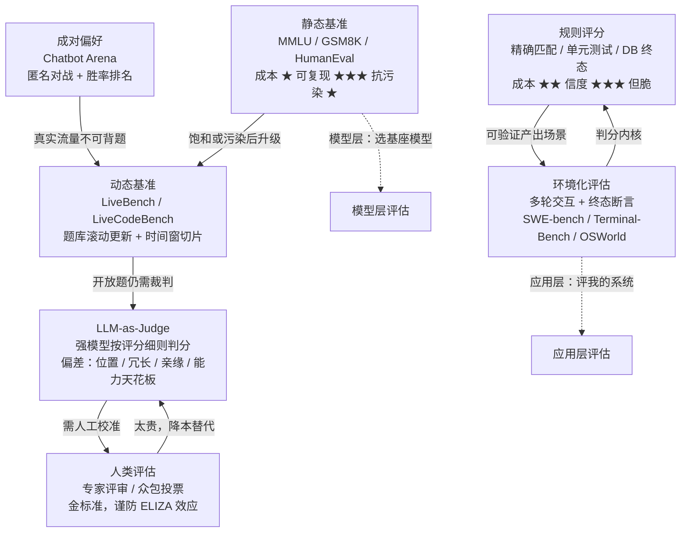

# 4. 核心原理：构念效度、方法家族与统计置信

> **如果只读一节**：好评估有 4 条原则——(1) 可复现 (2) 统计显著 (3) 与人类判断一致 (4) 反映真实任务。但在这 4 条之前还有更根本的一课：**分数只是构念的代理，不是构念本身**——"MMLU 90 分"到"知识渊博"之间的每一步推断都要单独举证。

## 4.1 本章目标与读者

读完后你能：

- 说出"构念效度"是什么，并拆解"MMLU 90 分 = 知识渊博"这条推断链在哪里可能断
- 用"方法家族地图"（七族对比表）为任意评估需求选对方法家族——这是全书的骨架
- 区分准确率 / 精确率 / 召回率 / F1，知道不平衡数据为什么会让 accuracy 骗人
- 理解置信区间、McNemar 检验、Cohen's Kappa、ECE 各自回答什么问题
- 用实验数字（而不是直觉）理解 LLM-as-Judge 的四类偏差

**前置知识**：读完第 1-3 章。本章有少量统计概念，每个都先口述含义再给公式或代码。

## 4.2 构念效度：分数背后的推断链

**构念（construct）**是心理测量学术语，指"知识渊博""用户体验好"这类无法直接观测、只能通过代理指标间接测量的抽象概念。**构念效度（construct validity）**问的是：一个量表分数，能在多大程度上代表它声称测量的那个构念。

这是评估哲学的核心一课，用一个你可能天天挂在嘴边的推断来演示：

> "这个模型 MMLU 考了 90 分，所以它知识渊博。"

这条推断链至少有三段，每一段都可能断：

```text
答对这 1.4 万道四选题 → 掌握这些学科的知识点 → 知识渊博（能迁移到新问题）
        第 1 段：这 1.4 万题是合格量表吗？        第 2 段：考分能代表可迁移的能力吗？
```

**断点 1：题目本身不合格。** 2024 年论文 *Are We Done with MMLU?* 估计 MMLU 约 6.5% 的题目本身有错误（来源：[arXiv:2406.04127](https://arxiv.org/abs/2406.04127)）。量表刻度不准，读数再精确也白搭。

**断点 2：题目被背过（泄漏）。** MMLU 的题目来自公开考试的练习材料，就在互联网上，而模型在互联网文本上训练。GSM1k 实验已经证明这条断点是实打实的：同考纲换新卷，分差最高 8 个百分点（来源：[arXiv:2405.00332](https://arxiv.org/abs/2405.00332)）。此时分数测的是记忆力，不是知识。

**断点 3：四选一可以猜和排除。** 随机基线是 25%；用排除法去掉两个明显错误选项后，真实猜中率远高于 25%。分数里混着"推理能力"和"应试技巧"，两者不可分。

**断点 4：换分布就垮。** Apple 的 GSM-Symbolic 只改变 GSM8k 题目里的数字，模型性能即显著下降（来源：[arXiv:2410.05229](https://openreview.net/forum?id=AjXkRZIvjB)）——说明相当部分分数来自模式匹配，而不是可迁移的理解。**"能迁移"恰恰是"知识渊博"这个构念的定义性要求。**

**断点 5：构念本身从未被建立。** Raji、Bender、Paulladan、Gebru 在 NeurIPS 2021 的 *AI and the Everything in the Whole Wide World Benchmark* 中系统论证：机器学习的基准范式与"在欠规范的通用任务上的表现"这类主张不相容——GLUE、ImageNet 这类基准被行业自然化为"通用能力"的度量，但从未建立过这条推断链（来源：[arXiv:2111.15366](https://arxiv.org/abs/2111.15366)）。

**前端类比**："Lighthouse 分数高 = 用户体验好"并不成立——Lighthouse 测的是实验室条件下的一组代理指标，真实体验还取决于弱网、真实设备与业务场景。没有人会因为 Lighthouse 100 分就向老板宣称产品好用；对模型分数，你需要同样的警觉。

**落地成工程动作**：分数高只严格意味着"在这批题上答对多"。要主张更大的结论，每个推断单独举证——例如：换一套新题分数不衰减（抗泄漏）、题面等价改写分数稳定（抗模式匹配）、跨语言表现一致（抗分布偏移）。**结论：分数是构念的代理，不是构念本身。**

## 4.3 方法家族地图：全书的骨架

第 1 章的 76 年历史，沉淀出 7 个评估方法家族。这张对比表是全书的骨架：第 2 部分逐族展开基准，第 4 部分讲它们的工程实现，选型决策最终都回到这张表。

| 家族 | 原理 | 成本 | 信度 | 适用场景 | 代表 |
|---|---|---|---|---|---|
| **静态基准** | 固定题库 + 客观判分 | ★（极低，完全可复现） | 随时间衰减（污染 + 饱和） | 横向选型、快速回归 | MMLU、GSM8K、HumanEval |
| **动态基准** | 题库滚动更新或按时间窗切片 | ★★ | 高（抗污染） | 长期追踪模型演进 | LiveBench、LiveCodeBench |
| **成对偏好** | 匿名两两对战，用户投票后做胜率排名统计 | ★★（单次低） | 取决于投票者；测偏好不测正确 | 通用对话质量 | Chatbot Arena |
| **规则评分** | 精确匹配、单元测试、终态断言 | ★★（需环境） | 高但脆（会把合理变体判失败） | 一切可验证产出 | SWE-bench、τ-bench 判分 |
| **LLM-as-Judge** | 强模型按评分细则打分或两两判优 | ★（可扩展） | 有已知偏差谱系，需人工校准 | 开放式产出 | MT-Bench、AlpacaEval |
| **人类评估** | 专家评审、众包投票、一致性校验 | ★★★（最贵最慢） | 金标准，但人也会被表演欺骗 | 校准裁判、主观维度 | MT-Bench 的 3K 专家票 |
| **环境化评估** | 真实/仿真环境中多轮交互 + 终态断言 | ★★★（最高） | 最接近真实能力 | agent 与高价值自动化 | SWE-bench、Terminal-Bench、WebArena、OSWorld |



（图与表的口径与 Anthropic 官方对三类判分器的对比一致，来源：[Anthropic 工程博客](https://www.anthropic.com/engineering/demystifying-evals-for-ai-agents)。）

**怎么用这张表**：三步。第一步，问你的产出物"有没有可验证的正确答案"——有，走静态/动态/规则评分；没有，走偏好/judge/人类。第二步，问评估结果要多可信、花得起多少钱——成本从 ★ 到 ★★★ 差两个数量级以上（环境化评估每个任务要冷启动容器 + 完整 agent 轮次 + 多次 trial）。第三步，几乎没有生产系统只用一族：常见组合是"动态题库防污染 + LLM-as-Judge 处理开放题 + 人类抽检校准裁判"。

前端类比收束：这七族就是测试金字塔的 LLM 版——静态基准是快照测试套件，规则评分是单元/集成测试断言，LLM-as-Judge 是自动 review bot，人类评估是人工走查，环境化评估是容器化 E2E 矩阵。

## 4.4 指标设计：4 个基础

**Accuracy（准确率）**

```text
accuracy = (TP + TN) / (TP + TN + FP + FN)
```

> 前端类比：单元测试通过率。

**陷阱**：数据不平衡时 accuracy 会骗人：

```text
100 道题里 95 道"是"、5 道"否"
模型只会答"是" → 95% 准确率（但毫无用处）
```

→ 这时该用 **precision / recall / F1**。

**Precision（精确率）**：`precision = TP / (TP + FP)`——"模型说'是'的里面，多少真对了？"

**Recall（召回率）**：`recall = TP / (TP + FN)`——"真正'是'的里面，模型找出了多少？"

**F1 Score**：`F1 = 2 * precision * recall / (precision + recall)`——precision 和 recall 的调和平均，综合指标。

**多分类与多标签**：多分类用 macro-F1（各类平等）或 weighted-F1（按样本量加权）；多标签每个标签独立算再平均。

## 4.5 生成任务的指标

开放式生成（写作、对话）不能简单用 accuracy。2002 年 BLEU 开创的自动指标家族至今仍是基础词汇（来源：[Papineni et al., ACL 2002](https://aclanthology.org/P02-1040/)），但要记住第 1 章的结论：**它们测"和参考答案像不像"，不测"对不对"**。

| 指标 | 测什么 | 范围 | 例子 |
|---|---|---|---|
| BLEU | n-gram 重叠（精确率视角） | 0-1 | 翻译 |
| ROUGE | n-gram 覆盖（召回率视角） | 0-1 | 摘要 |
| METEOR | 同义词 + 词序惩罚 | 0-1 | 翻译 |
| BERTScore | 语义相似度 | 0-1 | 通用 |
| pass@k | k 次采样至少一次通过 | 0-1 | HumanEval |
| Win Rate | 偏好胜率 | 0-100% | Arena |

**经验法则**：
- 翻译/摘要：BLEU/ROUGE + 人类抽检
- 代码：pass@k + 实际执行
- 对话：Arena 胜率 + 人类标注
- RAG：Faithfulness（答案是否忠于检索内容）+ Answer Relevance（回答是否切题），即开源 RAG 评估框架 RAGAS 的两项核心指标

## 4.6 统计置信：从"看起来好"到"真的好"

**核心问题**：模型 A 准确率 80.5%，模型 B 准确率 79.8%。A 真的更好吗？

**答案**：要看置信区间和样本量。第 1 章 GLUE 饱和的历史教训在这里兑现——**分数差距小于噪声时，停止解读**。

**置信区间（CI）**

95% 置信区间 = "如果重复这个实验 100 次，大约 95 次真值落在这个区间里"。

```typescript
// 1000 题，A 答对 805 道 = 80.5%
// 95% 置信区间 ≈ [78.0%, 82.8%]
// B 答对 798 道 = 79.8%
// 95% 置信区间 ≈ [77.2%, 82.1%]
// 两区间重叠 → 差异不显著
```

两个工程提醒：其一，正态近似（上面用的简化算法）在样本少于约 100 时会失真，小样本要用 Wilson 区间这类修正，此处记住结论即可——**少于 100 题的评估，置信区间要加倍怀疑**；其二，评估报告里必须把区间画出来（误差条），让"70% vs 68% 不可区分"对非技术干系人可见。

**显著性检验（配对比较）**

```typescript
// McNemar 检验：只看两模型"结论不一致"的题目
// 直觉：如果 A、B 真的一样强，"A 对 B 错"和"A 错 B 对"的题数应大致相等
function pairedMcNemar(aResults: boolean[], bResults: boolean[]): number {
  let b01 = 0, b10 = 0;
  for (let i = 0; i < aResults.length; i++) {
    if (aResults[i] && !bResults[i]) b01++;  // A 对 B 错
    if (!aResults[i] && bResults[i]) b10++;  // A 错 B 对
  }
  // 统计量近似服从卡方分布，> 3.84 对应 p < 0.05
  return (Math.abs(b01 - b10) - 1) ** 2 / (b01 + b10);
}
```

**何时需要显著性检验**：准确率差异 < 2%；样本量 < 500；决策影响重大（是否切换主模型）。

## 4.7 人类一致性：评估的黄金标准

**核心洞见**：如果两个标注员对同一道题看法不一致，那么这道题就不该用来评估模型。

**Cohen's Kappa**：衡量两个标注员的一致性，并剔除"碰巧一致"的成分：

```text
κ = (p_o - p_e) / (1 - p_e)
```

先口述变量：`p_o` 是实际一致的比例，`p_e` 是纯靠随机猜也能达到的一致比例。κ = 1.0 完全一致；κ = 0 和随机一样；κ < 0 比随机还差。**经验阈值：κ > 0.7 才算"高度一致"，可作为评估的地面真相**（对应 Landis & Koch 分级里的"substantial agreement"档）。

为什么不能只看"一致百分比"？一个永远输出 "Correct" 的裁判，在 70% 答案正确的数据集上有 70% 一致率，但零判别力——kappa 把这种水分挤掉了。

**LLM-as-Judge 与人类的一致性**：理想情况是一致率 ≥ 80%。提升方法：用更强的裁判模型、写更详细的评分细则（带例子）、让裁判先写推理再判分、多次采样投票。

## 4.8 四条评估原则

| 原则 | 含义 | 检查方法 |
|---|---|---|
| **可复现** | 同一模型 + 同一数据集 = 同一分数 | 跑两遍对比 |
| **统计显著** | 差异不是随机 | 置信区间 + 显著性检验 |
| **人类一致** | 自动评分与人类判断一致 | Cohen's Kappa |
| **任务相关** | 测的是真实业务能力 | 错误样例分析 |

**任何评估缺一条，结论都要打折扣。** 注意第 4 条正是 4.2 节构念效度的操作化：任务相关要靠"推断链每段单独举证"来兑现。

## 4.9 LLM-as-Judge 的偏差：从直觉到实验数据

4.3 节的家地图里，LLM-as-Judge 是性价比最高也最常用的一族，它的偏差不该停留在"听说有偏差"，Zheng 等人 2023 年的奠基论文给出了定量数据（来源：[Judging LLM-as-a-Judge, arXiv:2306.05685](https://arxiv.org/abs/2306.05685)）：

**位置偏差**：把 A、B 两个回答的顺序对调再问一次，所有被测裁判都表现出强位置偏差，多数偏爱第一个位置；只有 GPT-4 能在 60% 以上的对调中给出一致判决。

**冗长偏差**："重复列表攻击"——把回答扩写得更长更啰嗦（内容实质不变），GPT-3.5 与 Claude-v1 都判"变好了"，只有 GPT-4 识别了该攻击。这正是 AlpacaEval 2.0 做长度控制修正的动机。

**自我增强偏差**：GPT-4 裁判给自家回答的胜率高出约 10%，Claude-v1 高出约 25%（论文注明样本量小、未能最终定论，但"运动员兼裁判"必须回避是明确的）。

**判分能力天花板**：10 道数学题上，判断"错误答案是否正确"的失败率——Claude-v1 与 GPT-3.5 均为 91.3%，GPT-4 为 8.7%；给 GPT-4 换上更好的提示（默认 → 思维链 → 附参考答案）后，失败从 14/20 降到 3/20。**裁判自身能力是天花板：用弱模型当裁判评强模型，评的是噪声。**

**正面结果同样重要**：GPT-4 裁判与人类专家的一致率（去平局后）达 85%，高于人类彼此之间的 81%；人类认为 GPT-4 判断"合理"的比例为 75%，并愿意在 34% 的情况下因此改变自己的选择。**LLM-as-Judge 可用，但必须像审查 review 工具一样审查它的偏差谱系，并定期用人工抽样校准。**

**对策与代码**：

```typescript
// 位置偏差缓解：交换 A/B 顺序跑两次，两次不一致判平局
async function judgeWithDebias(
  question: string, answerA: string, answerB: string
): Promise<'A' | 'B' | 'tie'> {
  const order1 = await judge(question, answerA, answerB); // A 在前
  const order2 = await judge(question, answerB, answerA); // B 在前
  if ((order1 === 'A' && order2 === 'B') || (order1 === 'B' && order2 === 'A')) return 'tie';
  return order1;
}
```

其余对策：控制答案长度后再送审、评 GPT 系模型时换非 GPT 裁判、多次采样取平均、固定 temperature 为 0。

## 4.10 校准：模型说"我确定"时真的对吗

准确率之外还有一层：**模型的置信度是否诚实**。准确率 70% 的模型，如果答对时自评 0.9、答错时也自评 0.9，它的置信度对下游系统毫无决策价值。度量叫 **ECE（Expected Calibration Error）**：把样本按置信度分桶（如 10 桶），每桶算"平均置信度"与"实际准确率"的差，按桶内样本数加权求和。

```typescript
function ece(predictions: { confidence: number; correct: boolean }[], nBins = 10): number {
  let err = 0;
  for (let i = 0; i < nBins; i++) {
    const lo = i / nBins, hi = (i + 1) / nBins;
    const inBin = predictions.filter(p => p.confidence >= lo && p.confidence < hi);
    if (inBin.length === 0) continue;
    const avgConf = inBin.reduce((a, p) => a + p.confidence, 0) / inBin.length;
    const avgAcc = inBin.filter(p => p.correct).length / inBin.length;
    err += inBin.length / predictions.length * Math.abs(avgConf - avgAcc);
  }
  return err;
}
```

> 前端类比：天气预报说"90% 降雨概率"时，真的 10 次里下 9 次吗？

**好模型**：ECE < 0.05。**坏模型**：自信地胡说（高置信但错）——它会被下游当成可靠信号消费，破坏力大于诚实的错误。这也是 HELM 把 calibration 列为七个核心维度之一的原因（来源：[HELM, arXiv:2211.09110](https://arxiv.org/pdf/2211.09110)）。

## 4.11 实战与陷阱

**陷阱 1：只报点估计，不报区间。** "模型 A 准确率 85.3%"缺信息；"85.3% ± 1.2%（95% CI, n=2000）"才完整。

**陷阱 2：用 accuracy 评估不平衡数据。** 90% 是负样本时，永远预测"负"就能拿 90%。改用 F1。

**陷阱 3：LLM 裁判没固定参数。** temperature 不固定，同输入不同分数。必须固定 temperature = 0，并记录裁判模型版本。

**陷阱 4：跨家族直接比数字。** "Arena 胜率第 3"与"MMLU 88 分"不可比——成对偏好测的是人群偏好，静态基准测的是固定题库正确率（4.3 节家族地图的用途正在于此）。跨家族比较只做方向性参考。

## 4.12 验收自测

1. **选择**：1000 题里 800 题答对，95% 置信区间大约是？
   - A. [78%, 82%]
   - B. [70%, 90%]
   - C. [80%, 80%]
   - D. [50%, 95%]

2. **选择**："MMLU 90 分 = 知识渊博"这条推断链，下面哪条**不是**它的断点？
   - A. 约 6.5% 题目本身有错
   - B. 题目可能在训练语料里出现过
   - C. 四选一结构允许排除法得分
   - D. MMLU 的学科数量有 57 个

3. **选择**：裁判模型在数学题上判分失败率高达 91.3%，说明什么？
   - A. 位置偏差
   - B. 冗长偏差
   - C. 裁判自身能力是天花板
   - D. 自我增强偏差

4. **简答**：为什么 Cohen's Kappa < 0.7 的题目不适合作为评估基准？为什么不能只看一致百分比？

5. **简答**：你的团队想评估"客服机器人的回答质量"，预算只够建一个方法。用 4.3 节的家族地图说明你选哪族、为什么、要补什么防护。

6. **实操**：用 TypeScript 实现一个函数，输入两个模型的 boolean 结果数组，输出 McNemar 统计量与是否显著（> 3.84）。用两个真实模型的评估结果各跑一遍验证。

## 4.13 本章 Cheat Sheet

| 概念 | 一句话 | 详见 |
|---|---|---|
| 构念效度 | 分数是构念的代理，推断链每段单独举证 | §4.2 |
| 方法家族七族 | 静态/动态/成对/规则/Judge/人类/环境化 | §4.3 |
| Accuracy | 通过率，不平衡数据会骗人 | §4.4 |
| Precision / Recall / F1 | "说是的对的比例 / 找全的比例 / 调和平均" | §4.4 |
| BLEU / ROUGE | 测"像不像"，不测"对不对" | §4.5 |
| 95% CI | 真值 95% 落进的区间 | §4.6 |
| McNemar | 配对比较，> 3.84 即 p < 0.05 | §4.6 |
| Cohen's Kappa | 剔除随机一致，> 0.7 才信 | §4.7 |
| Judge 四偏差 | 位置/冗长/亲缘/能力天花板 | §4.9 |
| ECE | 校准误差，< 0.05 才信 | §4.10 |

## 4.14 五个常见错误

1. **只报点估计不报区间**——必须给 95% CI 与 n，否则 80.5% vs 79.8% 的差异是噪声。
2. **把基准分数当构念本身**——"MMLU 90 = 知识渊博"需要抗泄漏、抗改写、跨分布的额外证据。
3. **用 accuracy 评估不平衡数据**——永远预测多数类就能拿高分，改用 F1。
4. **裁判不固定 temperature、不做位置交换**——分数波动与顺序偏差会淹没模型差异。
5. **跨家族直接比数字**——Arena 胜率与 MMLU 分数测的不是同一个东西，只能做方向性参考。

## 4.15 延伸阅读

⭐⭐⭐
- [AI and the Everything in the Whole Wide World Benchmark](https://arxiv.org/abs/2111.15366) — 构念效度批判的原始论文
- [Holistic Evaluation of Language Models (HELM)](https://arxiv.org/abs/2211.09110) — 多维评估与校准维度
- [Judging LLM-as-a-Judge (Zheng et al. 2023)](https://arxiv.org/abs/2306.05685) — 裁判偏差的定量实验

⭐⭐
- [Are We Done with MMLU?](https://arxiv.org/abs/2406.04127) — 题目质量审计
- [Length-Controlled AlpacaEval](https://arxiv.org/html/2404.04475) — 冗长偏差的工程修正

⭐
- [Cohen's Kappa](https://en.wikipedia.org/wiki/Cohen%27s_kappa) — 一致性指标词条
- [GSM-Symbolic](https://openreview.net/forum?id=AjXkRZIvjB) — 分布偏移敏感性实验
