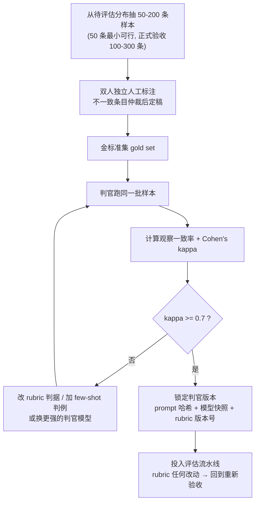
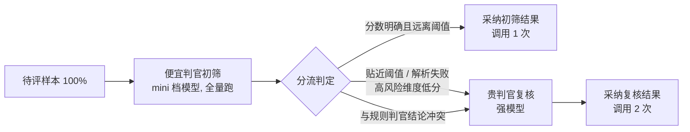

# 5. LLM-as-Judge 工程化：从判官 prompt 到偏差控制

> **如果只读一节**：LLM-as-Judge 就是用一个模型按评分细则给另一个模型的输出打分。写一个"能跑"的判官只要十行代码，写一个"能被信任"的判官是四件事：判官 prompt 的五要素（角色 / 判据 / 判例 / 输出契约 / 阈值）、上线前的人工校准（与人工标注的 Cohen's kappa ≥ 0.7 才投入使用）、四大偏差的代码级对策（位置 / 冗长 / 自我增强 / 判分能力天花板）、以及成本工程（便宜判官初筛 + 贵判官复核的两段式）。
>
> **前置知识**：读完第 4 章（标准评估流水线）与第 20 章（自建 mini evaluator）后可读。
>
> **与相邻章节的分工**：第 17 章讲"偏好类基准与榜单生态"——帮你读懂 Arena 这类榜单；本章讲"怎么把判官写进你自己的评估流水线"——面向动手写判官的工程师；第 6 章讲"怎么组织一场人类评估"——判官校准所需的人工标注从哪来。本章不展开 Arena 与榜单统计，需要时直接引用第 17 章。

## 5.1 本章目标与读者

读完后你能：

- 按五要素写出一个可版本化、可验收的判官 prompt，并用 TypeScript 落成可运行的判官服务
- 实现交换协议的 pairwise 判官，并能解读"交换一致率"这个判官健康指标
- 跑通校准闭环：人工标 50 条 → 判官跑同一批 → 算 Cohen's kappa → 不到 0.7 就改 rubric，达标后锁定版本
- 对四大偏差逐条给出代码级对策，并在自己的流水线里布好探针
- 用两段式架构把判官成本压下来，同时不牺牲贴近阈值样本的判定质量

第 17 章已经用实验数字告诉你裁判会错在哪，本章把这些"知道"变成"防住"——每一节都对应一段可以直接抄进项目的代码。

## 5.2 概念引入：判官是一个"异步断言函数"

**前端类比**：LLM-as-Judge 相当于把人工 code review 外包给一个自动 review bot——单次调用就是一个 async 断言函数：输入被评内容，输出 `{ score, reason }`。它与 `expect()` 的本质区别只有一条：这个断言自己也是一个概率系统，所以你必须像审查 review 工具一样审查它。

最小可用判官只要十行：

```typescript
// minimal-judge.ts —— 最小判官：判断回答是否正面回应了问题
// 依赖：npm i openai
// 运行：OPENAI_API_KEY=sk-占位 npx tsx minimal-judge.ts （需联网，付费）
import OpenAI from "openai";
const client = new OpenAI();

export async function isRelevant(question: string, answer: string): Promise<boolean> {
  const r = await client.chat.completions.create({
    model: "gpt-4o-mini-2024-07-18", // pin 快照版本，不用漂浮别名（第 4 章可复现性）
    temperature: 0,                  // 判分要可复现：禁随机采样
    messages: [
      { role: "system", content: "你是评估判官。只回答 yes 或 no。" },
      { role: "user", content: `问题：${question}\n回答：${answer}\n这个回答是否正面回应了问题？` },
    ],
  });
  return (r.choices[0].message.content ?? "").trim().toLowerCase().startsWith("yes");
}
```

这十行能跑，但直接上生产有四个坑：判据靠模型自己猜（没有评分细则）、输出靠解析自由文本（脆弱）、没有校准（不知道它和人工差多少）、偏差没设防。本章后面各节逐一解决。

先立一条选型原则：判官适合"判别"而不是"生成"。OpenAI 官方评估指南明确建议，评估设计应偏向 pairwise 比较、分类或按明确标准打分，而非开放式生成（来源：developers.openai.com/api/docs/guides/evaluation-best-practices）。"让它写一份更好的回答"是被评模型的事，"判断这两份哪个好"才是判官的事。

## 5.3 单答案打分：rubric 五要素与完整实现

### 5.3.1 五要素

综合 LangSmith、Langfuse、OpenAI Graders 三家官方文档反复出现的要素，可以归纳为五条（来源：research/framework-practice.md §3.2.4）：

| 要素 | 解决什么问题 | 反面教材 |
|---|---|---|
| 1. 角色 | 定死判官身份与依据边界，防止它自由发挥 | "你是评估专家"——评什么、依据什么都没说 |
| 2. 判据 | 每档给可观察的证据条件，消除档位歧义 | "请评估回答质量"——没有区分档位的依据 |
| 3. 判例 | 2-5 条含边界案例的 few-shot，稳定判分口径 | 只给规则不给例子，边界题每次判得不一样 |
| 4. 输出契约 | 结构化 JSON + 理由字段；解析失败单独成状态 | 自由文本输出，靠正则抠分数 |
| 5. 阈值 | 分数如何映射为通过 / 失败的业务决策 | 判完 1-5 分，没人说得清 3 分能不能上线 |

两个依据：LangSmith 官方明确指出"在判官 prompt 中包含输入、输出、期望等级的示例通常能提升表现"（来源：docs.langchain.com/langsmith/vitest-jest）；判据的写法基准是"每档都有可观察的证据条件"——"5 分 = 完整回答且引用了上下文原句"可用，"5 分 = 很好"不可用（来源：Langfuse 官方判官文档 llm-as-a-judge 节）。

### 5.3.2 完整实现：score-judge.ts

下面是一个可以直接落地的单答案打分判官，五要素全部声明式（可进 git、可版本化、可回溯）：

```typescript
// score-judge.ts —— 单答案打分判官：rubric 五要素完整实现
// 依赖：npm i openai；Node >= 20
// 运行：OPENAI_API_KEY=sk-占位 npx tsx score-judge.ts （需联网，付费）
import OpenAI from "openai";
const client = new OpenAI();

// ---------- 要素 1-3：角色、判据锚点、判例，全部声明式 ----------
export type Rubric = {
  role: string;                        // 要素 1：角色——判官是谁、依据什么判
  criteria: {                          // 要素 2：判据——行为锚点，不是形容词
    name: string;
    weight: number;
    anchors: Record<string, string>;   // 档位 → 证据条件
  }[];
  examples?: {                         // 要素 3：判例（few-shot，含边界案例）
    question: string; answer: string; expected: Record<string, number>;
  }[];
  neutrality: string[];                // 反偏差声明（长度、格式中立，见 5.6.3）
  scale: [number, number];
};

export const RUBRIC_V1: Rubric = {
  role: "你是客服知识库问答的质量评估专家。你只依据<参考上下文>判分，不做上下文之外的补充推断。",
  criteria: [
    {
      name: "faithfulness", weight: 0.5,
      anchors: {
        "5": "每个论断都能在参考上下文中找到原句支撑",
        "3": "主体论断有支撑，但存在 1-2 处超出上下文的引申",
        "1": "出现上下文明确不支持的编造内容",
      },
    },
    {
      name: "relevancy", weight: 0.3,
      anchors: {
        "5": "直接回应提问的全部要点",
        "3": "只覆盖部分要点，或夹杂明显离题内容",
        "1": "答非所问",
      },
    },
    {
      name: "clarity", weight: 0.2,
      anchors: {
        "5": "结构清晰，一次读完即可理解",
        "1": "表述混乱，需要反复重读",
      },
    },
  ],
  examples: [{
    question: "退货期限是多久？",
    answer: "根据政策，签收后 30 天内可退货（参考上下文第 2 条）。",
    expected: { faithfulness: 5, relevancy: 5, clarity: 5 },
  }],
  neutrality: [
    "评分与回答长度无关：短而准确的回答不因太短扣分。",
    "评分与排版格式无关：不因使用或未使用 Markdown、列表、加粗而加减分。",
  ],
  scale: [1, 5],
};

// ---------- 要素 4：输出契约（JSON + 理由） ----------
export function buildPrompt(rubric: Rubric, question: string, answer: string, context: string): string {
  const dims = rubric.criteria
    .map(c => {
      const anchors = Object.entries(c.anchors).map(([s, cond]) => `  ${s} 分：${cond}`).join("\n");
      return `- ${c.name}（权重 ${c.weight}）\n${anchors}`;
    })
    .join("\n");
  const fields = rubric.criteria.map(c => `"${c.name}": <1-${rubric.scale[1]}>`).join(", ");
  const parts = [
    `# 角色\n${rubric.role}`,
    `# 评分判据（按档位锚点判分）\n${dims}`,
    `# 中立性约束\n${rubric.neutrality.map(s => `- ${s}`).join("\n")}`,
    `# 待评内容\n<问题>${question}</问题>\n<参考上下文>${context}</参考上下文>\n<回答>${answer}</回答>`,
    `# 输出契约\n只输出一个 JSON 对象：{"perDim":{${fields}},"reason":"逐判据给出一句话依据"}`,
  ];
  if (rubric.examples?.length) {
    const ex = rubric.examples
      .map((e, i) => `判例 ${i + 1}：问题「${e.question}」回答「${e.answer}」→ ${JSON.stringify(e.expected)}`)
      .join("\n");
    parts.splice(3, 0, `# 判例（few-shot）\n${ex}`);
  }
  return parts.join("\n\n");
}

export type ScoreResult =
  | { status: "ok"; total: number; perDim: Record<string, number>; reason: string }
  | { status: "parse_error"; raw: string };

export async function judgeOnce(
  model: string, rubric: Rubric, question: string, answer: string, context: string,
): Promise<ScoreResult> {
  const r = await client.chat.completions.create({
    model,                     // 必须传快照版本，如 gpt-4o-mini-2024-07-18
    temperature: 0,            // 判分要可复现
    response_format: { type: "json_object" },
    messages: [{ role: "user", content: buildPrompt(rubric, question, answer, context) }],
  });
  const raw = r.choices[0].message.content ?? "";
  try {
    const j = JSON.parse(raw) as { perDim: Record<string, number>; reason?: string };
    const perDim: Record<string, number> = {};
    let total = 0;
    for (const c of rubric.criteria) {
      const v = Math.min(rubric.scale[1], Math.max(rubric.scale[0], Number(j.perDim[c.name])));
      perDim[c.name] = v;
      total += v * c.weight;
    }
    return { status: "ok", total, perDim, reason: j.reason ?? "" };
  } catch {
    return { status: "parse_error", raw };   // 单独统计，不混入分数（见 18.8 陷阱 1）
  }
}

// ---------- 要素 5：阈值（业务决策，与 rubric 分开声明） ----------
export const GATE_V1 = { totalMin: 4.0, blocking: ["faithfulness"] as string[] };

export function passes(res: ScoreResult, gate: typeof GATE_V1): boolean | "invalid" {
  if (res.status !== "ok") return "invalid";
  const blocked = gate.blocking.some(d => (res.perDim[d] ?? 0) < 3); // 合取语义：一票否决
  return !blocked && res.total >= gate.totalMin;
}
```

这段代码有三个值得注意的设计决策：

1. **rubric 是数据不是字符串拼接**。`Rubric` 对象可序列化、可算哈希、可进 git——第 20 章 20.5 的判官版本管理（`rubricVersion` 字段）就是靠它落地。
2. **`parse_error` 是独立状态而不是 0 分**。判官输出坏了应该被观测到（错误率进报告），而不是悄悄把样本判成最低分——这是答案抽取"静默失败"教训（来源：research/methodology-deep.md §2.3.5）在判官上的翻版。
3. **阈值是合取语义**：`blocking` 维度不达标则整体失败，与 DeepEval"每个带判决的指标都成功用例才通过"的语义一致（来源：deepeval.com/docs/introduction）。

### 5.3.3 有参考答案时：reference-based 判官

有参考答案时，判官的任务从"按 rubric 评好差"变成"对照参考判断等价 / 覆盖"。三种常用形态，按主观性从低到高：

| 形态 | 输出 | 适用 |
|---|---|---|
| 0/1 语义等价 | score 0 或 1 | SQL、翻译、抽取类有唯一语义的产出 |
| 对照 rubric 打 1-5 | 分数 + 理由 | 摘要覆盖度、要点完整性 |
| 逐论断核验 | 每个论断的支撑判定 | RAG faithfulness（参考上下文即"参考答案"） |

第一种的实现最薄，签名对齐 LangSmith 的 evaluator 约定（返回 `{ key, score }`，改编自 LangSmith 官方 Vitest 集成文档，来源：docs.langchain.com/langsmith/vitest-jest）：

```typescript
// reference-judge.ts —— 有参考答案时的语义等价判官
// 运行：OPENAI_API_KEY=sk-占位 npx tsx reference-judge.ts （需联网，付费）
export const semanticEquivalent = async (params: {
  outputs: { sql: string };
  referenceOutputs?: { sql: string };
}) => {
  const { outputs, referenceOutputs } = params;
  const instructions = [
    "如果 ACTUAL 与 EXPECTED 在语义上等价，返回 1；否则返回 0。",
    "只返回 0 或 1，不要输出其他内容。",
  ].join("\n");
  const grade = await client.chat.completions.create({
    model: "gpt-4o-mini-2024-07-18",
    temperature: 0,
    messages: [
      { role: "system", content: instructions },
      { role: "user", content: `ACTUAL: ${outputs.sql}\nEXPECTED: ${referenceOutputs?.sql}` },
    ],
  });
  return { key: "correctness", score: parseInt(grade.choices[0].message.content ?? "", 10) || 0 };
};
```

0/1 判官的好处是统计上干净（二项比例 + Wilson 区间，见第 20 章统计护栏），坏处是丢失"差多少"的信息。折中做法：0/1 做门禁、1-5 做观测，两层并存。


## 5.4 Pairwise 判官：交换协议与一致性判定

### 5.4.1 为什么优先 pairwise

单答案打分要求判官内化一把"绝对的尺"——3 分到底什么样，两次调用可能给得不一样；pairwise 只要求判"哪个更好"，判断空间小得多，这也是人类评估选 pairwise 的同一个理由（第 6 章 6.3）。代价是需要两个答案、且会撞上位置偏差——所以下面的实现把交换协议直接做进代码。

### 5.4.2 交换协议完整实现

同一个问题，两个回答按两种顺序各判一次，只有两种顺序指向同一个赢家才采纳结论：

```typescript
// swap-pairwise.ts —— 交换协议 pairwise 判官
// 运行：OPENAI_API_KEY=sk-占位 npx tsx swap-pairwise.ts （需联网，付费）
type Verdict = "A" | "B" | "tie";
type Outcome = "A_win" | "B_win" | "position_split" | "double_tie";

async function pairwiseOnce(q: string, first: string, second: string): Promise<Verdict> {
  const r = await client.chat.completions.create({
    model: "gpt-4o-2024-08-06",          // pairwise 判别用强模型（锚点见 5.4.3）
    temperature: 0,
    response_format: { type: "json_object" },
    messages: [{
      role: "user",
      content:
        `问题：${q}\n\n[回答一]\n${first}\n\n[回答二]\n${second}\n\n` +
        `哪个更好？只输出 JSON：{"winner":"A"|"B"|"tie"}，A 指回答一，B 指回答二。`,
    }],
  });
  const w = JSON.parse(r.choices[0].message.content ?? "{}").winner;
  return w === "A" || w === "B" ? w : "tie";
}

export async function pairwise(q: string, answerA: string, answerB: string) {
  const [r1, r2] = await Promise.all([
    pairwiseOnce(q, answerA, answerB),   // 顺序一：A 在前
    pairwiseOnce(q, answerB, answerA),   // 顺序二：B 在前
  ]);
  // 一致性判定：四种结局的语义
  let outcome: Outcome;
  if (r1 === "A" && r2 === "B") outcome = "A_win";          // 两种顺序都指向 A → 采纳
  else if (r1 === "B" && r2 === "A") outcome = "B_win";     // 两种顺序都指向 B → 采纳
  else if (r1 === "tie" && r2 === "tie") outcome = "double_tie"; // 两次平局 → 平
  else outcome = "position_split";                          // 判决跟着位置走 → 丢弃
  return { winner: outcome === "A_win" ? "A" : outcome === "B_win" ? "B" : "tie", outcome };
}
```

注意 `position_split` 的语义：r1 判"回答一好"、r2 也判"回答二好"（两次都是第一个位置赢），说明判决被位置驱动而不是内容驱动——这种样本宁可丢弃进人工复核，也不能记成 A 或 B 的胜利。判平或丢弃都是保守策略，方向正确比数字好看重要。

### 5.4.3 交换一致率：判官的健康指标

交换协议顺手送给你一个判官健康指标：**交换一致率 =（A_win + B_win）/ 总对数**。MT-Bench 论文的锚点是：所有被测裁判都表现出强位置偏差，只有 GPT-4 能在 60% 以上的对调中给出一致判决（来源：arXiv:2306.05685）。如果你的判官在一批样本上交换一致率显著低于这个锚点，先怀疑判官（太弱、rubric 太模糊），再怀疑两个回答真的难分伯仲。

### 5.4.4 多判官投票

自增强偏差的对策之一是多判官投票——用异源模型各判一次取多数：

```typescript
// ensemble-judge.ts —— 三判官多数投票（成本 ×3，建议只用于高争议样本）
export async function ensembleJudge(
  q: string, a: string, b: string,
  judges: string[] = ["gpt-4o-2024-08-06", "claude-3-5-sonnet-20241022", "gemini-1.5-pro-002"],
): Promise<"A" | "B" | "tie"> {
  // pairwiseOnceWithModel = 5.4.2 的 pairwiseOnce 加一个 model 参数，逻辑完全一致
  const votes = await Promise.all(judges.map(m => pairwiseOnceWithModel(m, q, a, b)));
  const aWins = votes.filter(v => v === "A").length;
  const bWins = votes.filter(v => v === "B").length;
  return aWins > bWins ? "A" : bWins > aWins ? "B" : "tie"; // 平票 → 交人工
}
```

三个判官必须异源（不同厂商或至少不同家族），否则"三个裁判来自同一家"只是把自增强偏差投了三票。成本按倍数涨，实践中只在低置信样本上启用——5.7 的两段式会把它接到分流条件里。

## 5.5 校准：判官上线前的验收流程

### 5.5.1 为什么 percent agreement 不够

判官上线前必须回答一个问题：它和人工判断差多少？最直觉的指标是观察一致率（percent agreement），但它有一个致命盲区——**没有扣除"瞎蒙也能蒙对"的部分**。一个永远输出"correct"的判官，在一批 70% 答案正确的数据上有 70% 的观察一致率，却毫无判别力（来源：AWS Cohen's Kappa for LLM Judges 指南，github.com/aws-samples/sample-GEDD）。

正确指标是 Cohen's kappa：从观察一致率里扣掉机遇一致率。它的杀伤力有实测证据：一项研究发现，不同判官模型在观察一致率接近的情况下，kappa 相差可达 53 个点（来源：arXiv:2406.12624，转引自 research/methodology-deep.md §2.4.3）——只报一致率会严重高估判官质量。

### 5.5.2 Cohen's kappa 实现

```typescript
// cohens-kappa.ts —— 判官与人工标注的一致性验收
// 运行：npx tsx cohens-kappa.ts （无需联网）
export function cohensKappa(human: number[], judge: number[]) {
  if (human.length !== judge.length || human.length === 0) throw new Error("length mismatch");
  const n = human.length;
  const cats = [...new Set([...human, ...judge])];
  const po = human.filter((h, i) => h === judge[i]).length / n;   // 观察一致率
  const pe = cats.reduce((s, c) =>                                 // 机遇一致率
    s + (human.filter(x => x === c).length / n) * (judge.filter(x => x === c).length / n), 0);
  return { po, pe, kappa: pe === 1 ? 0 : (po - pe) / (1 - pe) };
}

// 例：10 条样本，人工与判官只在第 3、8 条上分歧
const human = [1, 1, 0, 0, 1, 1, 0, 1, 0, 0];
const judge = [1, 1, 0, 1, 1, 1, 0, 1, 1, 0];
console.log(cohensKappa(human, judge));
// 期望输出：{ po: 0.8, pe: 0.5, kappa: 0.6 }
// 读法：观察一致率 0.8 看着很高，扣掉机遇后真实超出一致的部分只剩 0.6
```

验收阈值：**κ ≥ 0.7 才投入使用**。这个数字对应 Landis & Koch 一致性分级里 0.61-0.80 的 substantial（相当一致）档（来源：Landis & Koch 1978，经 AWS Cohen's Kappa for LLM Judges 指南引用）。作为参照，MT-Bench 论文测得 GPT-4 裁判与人类专家的一致率（去平局）约 85%，人类彼此之间约 81%——那是成对偏好任务上的最优锚点，你业务 rubric 上的数字必须自己校准，不能外推（来源：arXiv:2306.05685）。

### 5.5.3 校准闭环与版本锁定

校准不是一次性的，是一个循环：人工标 → 判官跑 → 算 kappa → 不达标就改 → 达标才锁版本。



样本量依据：一致性校准最少需要约 50 条人工标注，正式验收建议 100-300 条（来源：research/framework-practice.md §3.4.5；research/methodology-deep.md §2.4.3）。锁版本的依据：判官是"prompt + 模型 + 参数"的组合，三者任一变化都可能改变判分分布——判官配置变更后必须重跑金标准集回归（第 20 章 20.7.2 的判官健康检查），报告里也要留 `judge_calibration_kappa` 字段（research/methodology-deep.md §2.6.3 的运行记录 schema）。


## 5.6 四大偏差的工程对策

### 5.6.1 对照表

四大偏差的正典数据来自 Zheng et al. 2023（来源：arXiv:2306.05685 v4，与第 3 章 3.9、第 17 章 17.4 同一口径）：

| 偏差 | 论文实验数据 | 一句话 | 本章对策 |
|---|---|---|---|
| 位置偏差 | 所有被测裁判都表现出强位置偏差，多数偏爱第一个位置；只有 GPT-4 能在 60% 以上对调中给出一致判决 | 判决跟着谁在前走 | 交换协议（5.4.2）或改单答案打分 |
| 冗长偏差 | "重复列表攻击"下 GPT-3.5 与 Claude-v1 被攻破，GPT-4 识别了该攻击 | 写长就赢 | rubric 中立声明 + 长度相关性探针（5.6.3） |
| 自我增强偏差 | GPT-4 裁判给自家回答的胜率高出约 10%，Claude-v1 约 25%（论文注明样本量小、未定论） | 运动员兼裁判 | 异源判官 + 多判官投票 + 披露（5.6.4） |
| 判分能力天花板 | 10 道数学题上判断"错误答案是否正确"：Claude-v1 与 GPT-3.5 失败率均 91.3%，GPT-4 为 8.7% | 裁判能力是评估的天花板 | 有真值任务不进判官 + 判官自测门禁（5.6.5） |

### 5.6.2 位置偏差：交换协议或改单答案

代码在 18.4.2。两个补充判断：

- **交换协议让调用量翻倍**。预算紧时，另一个根除方案是放弃 pairwise、改用单答案独立打分——FastChat 的 MT-Bench 官方实现正是这么做的，理由就是从根上消除顺序效应（来源：github.com/lm-sys/FastChat llm_judge 文档）。
- 交换一致率（5.4.3）是位置偏差的监控探针，建议每次跑批量评估都顺带输出。

### 5.6.3 冗长偏差：中立声明 + 长度相关性探针

两层对策。第一层是 prompt 层：rubric 里写明长度中立（5.3.2 的 `neutrality` 字段），这是四条偏差里工程上最容易缓解的一条（来源：research/framework-practice.md §3.2.4）。

第二层是监控层：在批量评估报告里加一个"分数与长度的相关性"探针。如果判官分数和回答长度强正相关，你的 rubric 中立声明就没起作用：

```typescript
// length-drift.ts —— 冗长偏差探针：分数与长度的 Spearman 相关
// 运行：npx tsx length-drift.ts （无需联网）
function rank(a: number[]): number[] {
  return a.map((v, i) => [v, i] as const)
    .sort((p, q) => p[0] - q[0])
    .reduce<number[]>((r, [, i], k) => (r[i] = k + 1, r), []);
}
export function spearman(x: number[], y: number[]): number {
  const rx = rank(x), ry = rank(y), n = x.length;
  const mx = rx.reduce((s, v) => s + v, 0) / n, my = ry.reduce((s, v) => s + v, 0) / n;
  const cov = rx.reduce((s, v, i) => s + (v - mx) * (ry[i] - my), 0);
  const sx = Math.sqrt(rx.reduce((s, v) => s + (v - mx) ** 2, 0));
  const sy = Math.sqrt(ry.reduce((s, v) => s + (v - my) ** 2, 0));
  return cov / (sx * sy);
}
const scores  = [3, 4, 2, 5, 3, 4];            // 判官输出
const lengths = [180, 900, 150, 1200, 260, 860]; // 对应回答长度（字符数）
console.log(spearman(scores, lengths).toFixed(2));
// 期望输出：0.94 —— 强正相关：这个判官在给"长"加分，rubric 中立声明失效
```

工程阈值（本书经验法则）：Spearman 相关绝对值持续超过 0.7 时报警，先人工抽 10 条最高分长回答确认是否"长而空洞"。产业界的根治方案是统计控制——AlpacaEval 2.0 的长度控制胜率与 Arena 的风格控制都属此类（第 17 章 17.6、17.5.4），自建评估里最实用的等价物就是上面的探针加人工抽查。

### 5.6.4 自我增强偏差：异源判官与披露

方向上明确的结论是：裁判与被评模型同源时，偏向自家的风险真实存在（GPT-4 偏自家约 10%、Claude-v1 约 25%，样本量小未定论，来源：arXiv:2306.05685）。对策按成本从低到高：

1. **异源判官**：判官模型与被评对象来自不同厂商或不同模型家族——选型阶段一条配置的事；
2. **多判官投票**（5.4.4）：异源判官各判一次取多数，稀释单一判官的亲缘倾向；
3. **披露**：评估报告里写明判官身份及其与被评对象的关系。第 17 章 17.9 的陷阱 1 说过：做不到异源时，"报告里写清楚"是底线。

### 5.6.5 判分能力天花板：路由与判官自测

这是最容易被低估的一条：**用弱模型当裁判去评强模型，评出来的不是信号而是噪声**。论文数字：数学题上判断"错误答案是否正确"，弱裁判失败率 91.3%，GPT-4 也要 8.7%（来源：arXiv:2306.05685）。工程对策两条：

**第一，路由规则**——有客观真值的任务根本不该进判官：

```typescript
// routing.ts —— 评分器路由：能用规则评的不进判官
export type Route = "rule" | "judge";
export function routeGrader(item: { kind: "math" | "code" | "fact" | "open" }): Route {
  if (item.kind === "math")  return "rule";  // 精确匹配或符号等价（SymPy 类）
  if (item.kind === "code")  return "rule";  // 单元测试
  if (item.kind === "fact")  return "rule";  // 参考答案 + 0/1 语义等价（5.3.3）
  return "judge";                            // 只有开放式产出进判官
}
```

**第二，判官自测门禁**——判官上线前先当一次"考生"：构造一组已知对错的小样本（例如 10 道"错误答案伪装成正确"的题），判官必须全部识破才允许上岗。数学判分 91.3% 的失败率说明弱判官过不了这个门禁，也说明为什么这章反复强调"强模型当裁判"。

### 5.6.6 其他已知偏差：格式与名字

四大偏差之外，MT-Bench 实验里还记录了两个小偏差，自建判官时顺手设防：

- **格式偏好**：裁判容易偏爱 Markdown、列表、加粗这类"看起来更用心"的排版。对策是把判官输入做渲染归一化——评之前剥掉格式修饰，只留内容：

```typescript
// normalize.ts —— 判官输入的格式归一化：剥离 Markdown 修饰，只留内容
// 运行：npx tsx normalize.ts （无需联网）
export function stripMarkdown(s: string): string {
  return s
    .replace(/```[\s\S]*?```/g, "（代码块）")  // 代码块用占位符，防长度剧变
    .replace(/!\[[^\]]*\]\([^)]*\)/g, "")       // 图片
    .replace(/\[([^\]]*)\]\([^)]*\)/g, "$1")    // 链接只留文字
    .replace(/[*_#>]+/g, "")                     // 强调与标题符号
    .replace(/\n{3,}/g, "\n\n");
}
```

- **名字偏差**：实验中 Claude-v1 的判决受助手命名影响——把回答者改名为 Assistant A/B 会改变判决（来源：arXiv:2306.05685）。对策：判官输入里只用"回答一 / 回答二"这类中性占位名，绝不把模型名带进判官 prompt。


## 5.7 成本工程：两段式判官

### 5.7.1 成本量级

判官是评估流水线里唯一按次付费的评分器。量级参考：Langfuse 官方 FAQ 自述强判官与人工在多数质量维度上达成 80-90% 一致，单次评估成本约 0.01-0.10 美元（来源：Langfuse 官方文档自述，非独立复现值，见 research/framework-practice.md §3.2.2）。按这个量级，日均十万会话、1% 采样、每次两次调用，日成本约 20-200 美元；如果全量跑强模型还要再乘一个数量级。

### 5.7.2 两段式：便宜判官初筛 + 贵判官复核

思路与前端监控的分级告警同构：便宜的探针跑全量，可疑样本才升级人工（这里是升级强模型）。关键在分流条件——不是"便宜判官说不行"才升级，而是"便宜判官没把握"就升级：



```typescript
// two-stage-judge.ts —— 两段式判官：分流条件决定谁复核
// 依赖 18.3.2 的 judgeOnce 与 RUBRIC
const CHEAP = "gpt-4o-mini-2024-07-18";
const STRONG = "gpt-4o-2024-08-06";
const NEAR = 0.5; // 距阈值多近算"贴近"（本书经验值，按业务调）

export async function twoStageJudge(q: string, answer: string, ctx: string) {
  const cheap = await judgeOnce(CHEAP, RUBRIC_V1, q, answer, ctx);   // 第一段：全量初筛
  if (cheap.status !== "ok")                                          // 解析失败 → 复核
    return { escalated: true, final: await judgeOnce(STRONG, RUBRIC_V1, q, answer, ctx) };
  const near = Math.abs(cheap.total - GATE_V1.totalMin) <= NEAR;      // 贴近阈值 → 复核
  const risky = GATE_V1.blocking.some(d => (cheap.perDim[d] ?? 5) <= 3); // 阻断维度低分 → 复核
  const conflicted = !near && !risky && !(cheap.total >= GATE_V1.totalMin + 1); // 分数漂在中间带
  return near || risky || conflicted
    ? { escalated: true, final: await judgeOnce(STRONG, RUBRIC_V1, q, answer, ctx) }
    : { escalated: false, final: cheap };
}
```

效果：大多数"明显好 / 明显差"的样本一次调用解决，只有中间带和高风险样本花第二次。两个配套动作：

1. **缓存**：判官结果按 `(itemId, 输出内容哈希, rubric 版本, 判官模型)` 缓存——温度 0 下同一输入重判是纯浪费（来源：research/framework-practice.md §3.4.6）。
2. **批处理**：夜间全量走供应商的 batch API（价格减半，接受小时级延迟）；并发用有界并发池，拒绝无限 `Promise.all`（来源：research/framework-practice.md §3.4.6）。

### 5.7.3 什么时候不该用两段式

两段式的隐性成本是"同一批样本被两套判分口径覆盖"——便宜判官和强判官的分布可能系统性不同，报告里若混用两种来源的分数，回归对比会失真。对策：报告把"初筛采纳"与"复核采纳"分开统计；或者只在探测 / 日常监控用两段式，发布决策那一次全量跑强模型。

## 5.8 实战与陷阱

**陷阱 1：解析失败记 0 分（静默失败）**。判官输出坏 JSON、被截断、带了前后缀文字，解析失败后随手记 0 分——错误被淹没在低分里，你以为是模型变差了。对策：`parse_error` 独立状态 + 错误率进报告（5.3.2 已实现），错误率超过 5% 时整批作废重跑而不是硬出分（来源：research/framework-practice.md §3.4.7）。

**陷阱 2：判官版本漂移**。两个来源：模型用漂浮别名（厂商静默更新底层权重，你的判分分布变了），rubric 改了一行没有重新校准。对策：pin 快照版本 + prompt 哈希 + rubric 版本号三件套（5.5.3），判官配置变更必跑金标准集。

**陷阱 3：被评对象当裁判**。评估自家模型时顺手用同家族模型当判官，自增强偏差直接进分数。对策：异源判官 + 报告披露（5.6.4）。

**陷阱 4：数学与代码进判官**。有客观真值的任务交给任何 LLM 判官都是在付钱买噪声（判分失败率可达 91.3%）。对策：路由规则先行（5.6.5）。

**陷阱 5：只有总分没有理由留存**。分数异常时无据可查。理由字段是调试判官的入口，也是给人复核成本最低的材料——OpenAI Graders 的结构化输出 `{ result, steps }` 就是这个思路的官方实现（来源：developers.openai.com/api/docs/guides/graders，转引自 research/framework-practice.md §3.2.5）。

## 5.9 验收自测

1. **选择**：判官与人工标注的观察一致率是 80%，但 Cohen's kappa 只有 0.6。最可能的解释是？
   - A. 计算代码写错了
   - B. 类别分布导致机遇一致率高，观察一致率高估了判别力
   - C. kappa 只适用于多分类
   - D. 判官比人工强

2. **选择**：交换协议下两次判决分别是"回答一好"和"回答二好"（都偏向第一个位置）。应该怎么处理？
   - A. 采纳第一次的结果
   - B. 记为平局并计入 position_split，可疑样本转人工
   - C. 再跑五次取多数
   - D. 直接丢弃这批数据

3. **选择**：以下哪个任务不应该交给 LLM 判官？
   - A. 客服回答的语气是否得体
   - B. 摘要是否覆盖要点
   - C. 数学题的答案是否正确
   - D. 两个开放回答哪个更好

4. **简答**：为什么"永远输出 correct"的判官在一批 70% 正确的数据上能拿到 70% 观察一致率，但 kappa 为 0？

5. **实操**：把 5.3.2 的 score-judge 跑在你业务的 20 条真实样本上；双人独立人工标注后算 kappa；改动一处判据锚点再跑一次，记录修改前后的 kappa 变化，把两次结果写进你的判官版本记录。

## 5.10 本章 Cheat Sheet

| 概念 | 一句话 | 详见 |
|---|---|---|
| rubric 五要素 | 角色 / 判据锚点 / 判例 / 输出契约 / 阈值 | §5.3.1 |
| 判别优先 | 判官适合判断与分类，不适合开放式生成 | §5.2 |
| parse_error | 解析失败是独立状态，不是 0 分 | §5.3.2 |
| 交换协议 | 两种顺序各判一次，只采纳一致结论 | §5.4.2 |
| 交换一致率 | 判官健康指标，锚点 60% 以上（GPT-4 级） | §5.4.3 |
| 多判官投票 | 异源判官取多数，稀释自增强偏差 | §5.4.4 |
| 校准闭环 | 人工标 50 条 → 判官 → κ≥0.7 → 锁版本 | §5.5.3 |
| κ ≥ 0.7 | Landis & Koch substantial 档，判官上线门槛 | §5.5.2 |
| 位置偏差 | 交换协议 / 单答案打分 / 交换一致率监控 | §5.6.2 |
| 冗长偏差 | 中立声明 + 分数-长度相关性探针 | §5.6.3 |
| 自我增强偏差 | 异源判官 + 投票 + 披露 | §5.6.4 |
| 能力天花板 | 有真值任务不进判官；判官先过自测门禁 | §5.6.5 |
| 两段式 | 便宜判官全量初筛，贴近阈值升级强模型复核 | §5.7.2 |

## 5.11 5 个常见错误

1. **rubric 用形容词** — "很好 / 较好 / 一般"没有判别依据，档位间漂移；每档写成可观察的证据条件。
2. **判官模型与被评对象同源** — 自增强偏差方向明确；异源，做不到就多判官投票并在报告披露。
3. **输出不结构化** — 自由文本靠正则抠分数，解析失败悄悄变 0 分；强制 JSON + 理由字段 + 错误率监控。
4. **不校准就上线** — 观察一致率好看不代表判别力；κ ≥ 0.7 验收，变更后重跑金标准集。
5. **温度不固定、版本不 pin** — 温度非 0 让判分不可复现，漂浮别名让判分分布随厂商更新漂移；温度 0 + 快照版本 + prompt 哈希。

## 5.12 延伸阅读

⭐⭐⭐
- [Judging LLM-as-a-Judge（Zheng et al. 2023）](https://arxiv.org/abs/2306.05685) — 四大偏差实验的原始出处，本章所有偏差数字的来源
- [OpenAI Evaluation best practices](https://developers.openai.com/api/docs/guides/evaluation-best-practices) — "判别优于生成"与评估反模式清单
- [AWS: Cohen's Kappa for LLM Judges](https://github.com/aws-samples/sample-GEDD/blob/main/grounded-evals/docs/cohens-kappa-for-llm-judges.md) — 为什么用 kappa 而不是 raw agreement 验收判官

⭐⭐
- [LangSmith Vitest/Jest 集成](https://docs.langchain.com/langsmith/vitest-jest) — 本章 reference-judge 代码的出处（TS evaluator 签名）
- [Langfuse: LLM-as-a-Judge](https://langfuse.com/docs/evaluation/evaluation-methods/llm-as-a-judge) — evaluator 双层配置与成本自述口径
- [FastChat llm_judge](https://github.com/lm-sys/FastChat/tree/main/fastchat/llm_judge) — MT-Bench 官方实现（单答案 1-10 打分方案）
- [Judge 判官 kappa 相差 53 点的研究（arXiv:2406.12624）](https://arxiv.org/abs/2406.12624) — 观察一致率会高估判官质量
- [位置偏差系统研究（arXiv:2406.07791）](https://arxiv.org/abs/2406.07791) — 位置偏差是系统性而非随机噪声

⭐
- [Prometheus](https://github.com/kaistAI/Prometheus) — 开源专用判官模型（rubric 可自定义）
- [Auto-J](https://github.com/GAIR-NLP/auto-j) — 自动化多场景判官
- [自偏好偏差研究（arXiv:2410.21819）](https://arxiv.org/abs/2410.21819) — 自我增强偏差的后续系统研究
