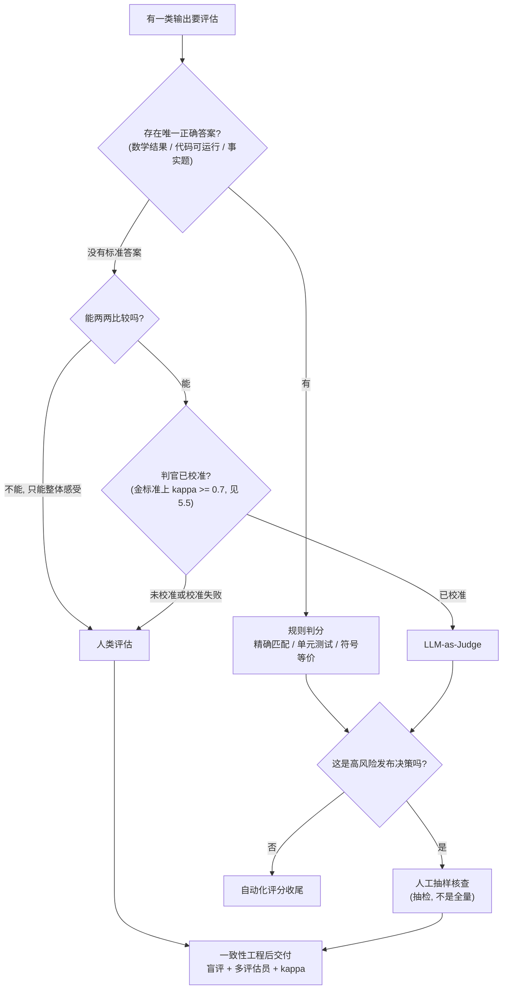
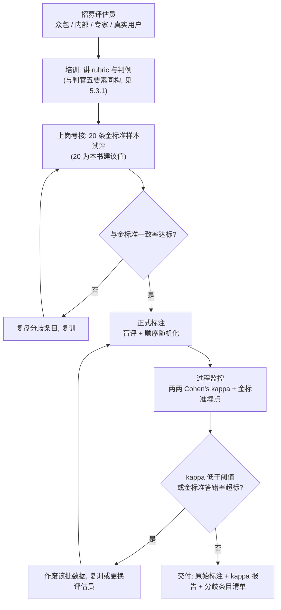

# 6. 人类评估设计：招募、盲评与一致性工程

> **核心导读与精读建议**：人类评估是校准一切自动化评估的基准锚点。工程落地的核心在于：优先选用更符合人类认知习惯的 pairwise 相对判断范式、严格核算 Cohen's kappa（κ ≥ 0.7 交付线）并执行全流程双盲防污染。建议重点精读：§6.2 何时必须上人类：决策树与 §6.6 一致性工程：培训、kappa 与金标准。
>
> **前置知识**：读完第 17 章（偏好评估生态）与第 5 章（LLM-as-Judge 工程）后可读。
>
> **与相邻章节的分工**：第 17 章讲偏好类基准与榜单生态（Arena 的盲评与排名算法已在 17.5 深拆）；第 5 章讲怎么写一个可信的判官；本章讲怎么组织一场人类评估——评估员从哪来、怎么培训、怎么量一致性、怎么交付。本章的 Elo 只讲原理与最小实现，Arena 级的 Bradley-Terry 拟合与置信区间在第 17 章。

## 6.1 本章目标与读者

读完后你能：

- 用决策树判断一类任务该走规则判分、判官还是人类，并把"必须上人类"的场景说得出理由
- 在 Likert、pairwise、ranking 三种范式里做选型，并解释为什么 pairwise 更可靠
- 用 Elo 与 Bradley-Terry 把 pairwise 标注聚合成分数与排名
- 按成本-质量权衡选评估员来源（众包 / 内部 / 专家 / 真实用户），并设计培训与考核
- 用 Cohen's kappa 量化评估员一致性，把金标准样本埋进任务流做过程监控
- 用 Label Studio 落地一场带盲评与随机化的 pairwise 评估

人类评估在方法家族里是成本最高的一档（来源：https://github.com/zenHeart/evals/blob/main/research/academic-history.md §C 方法家族地图），所以这章的重心是"别浪费"：该上人类的时候上对范式、招对人、量对一致性；不该上人类的时候坚决走自动化。

## 6.2 何时必须上人类：决策树

**前端类比**：这是评估版的测试策略选择——单元测试（规则判分）、快照对比（判官）、用户可用性测试（人类评估）各管一段，没有谁取代谁。



按这条树走，能落到"必须人类"的场景有明确特征——评估对象本身就是人的感受，或判官校准不过关。对照表：

| 场景 | 是否必须人类 | 理由与替代方案 |
|---|---|---|
| 创意写作质量 | 必须 | 无标准答案，风格偏好判官难以覆盖 |
| 客服对话满意度 | 必须 | 满意度本身就是人的感受 |
| 教学 / 解释清晰度 | 必须 | 清晰度由接受方定义 |
| 角色扮演一致性 | 推荐 | 判官可初筛，语气与分寸需人复核 |
| 事实问答准确性 | 不必 | 规则判分或 0/1 语义等价判官 |
| 代码可运行性 | 不必 | 单元测试执行判分 |
| 数学计算 | 不必 | 规则判分——判官判数学题失败率可达 91.3%（来源：arXiv:2306.05685，见 17.4.4） |

两个补充判断：

1. **"必须人类"不等于"全量人类"**。高频做法是：人类标一批做金标准 → 校准判官 → 判官跑全量 → 人类定期抽检（第 5 章 5.5 的校准闭环 + 第 20 章 20.7.2 的判官健康检查）。
2. **人类评估也有校准物**。MT-Bench 论文发布了约 3K 条专家投票与 30K 条 Arena 偏好对话，是少见的公开人类偏好数据，可以直接用作判官校准与评估员培训材料（来源：arXiv:2306.05685）。

## 6.3 三种评分范式：Likert、Pairwise、Ranking

### 6.3.1 Likert 量表（单回答打分）

```
请评价这段回答的质量（1-5）：
1 = 非常差  2 = 差  3 = 一般  4 = 好  5 = 非常好
[回答内容]
```

优点是简单、每条样本只需一次判断；缺点是**每个人的"5 分"不一样**——评估员各自内化了一把尺，分数分布因人而异。改进方向与判官 rubric 同构：把形容词换成行为锚点，"5 = 覆盖全部要点且引用了原文"比"5 = 非常好"可判别得多（第 5 章 5.3.1 的判据写法直接适用）。

### 6.3.2 Pairwise（两两比较）

```
请比较同一问题的两个回答：
回答一：……
回答二：……
结论：回答一更好 / 回答二更好 / 平局 / 都不好
```

pairwise 更可靠的根本原因：**相对判断共享同一对刺激，绝对判断依赖各自内化的标准**。评"哪个更好"时，两个回答在同一屏幕上互为参照；评"打几分"时，评估员只能调用自己脑子里的锚点。

但 pairwise 不是免费的：

- **对比次数多**：n 个候选两两全比是 O(n²)；解法是像 Arena 那样每轮随机抽两个对手，让对战次数线性增长（来源：lmsys.org/blog/2023-05-03-arena/）；
- **人做 pairwise 也有位置效应**：偏向先出现的回答——所以 19.7 的顺序随机化不是可选项。

### 6.3.3 Ranking（整列排序）

```
请将以下 5 个回答从最好到最差排序。
```

信息密度最高（一次排序隐含多个两两关系），但认知负担随列表变长上升，评估员后半段的判断质量会下降。适合候选少（3-5 个）且必须出全序的场景；大规模评估不建议。

### 6.3.4 选型

| 范式 | 判断负担 | 一致性 | 适用 |
|---|---|---|---|
| Likert | 低 | 最弱（人手一把尺） | 快速普查、有行为锚点时 |
| Pairwise | 低 | 最强 | 主流选择：判官校准、模型对比 |
| Ranking | 高 | 中 | 候选少、必须全序 |

经验法则：**能用 pairwise 就用 pairwise**，它同时是可靠性最高的范式和 Elo / Bradley-Terry 聚合的直接输入——下一节就是聚合方法。


## 6.4 从 pairwise 到分数：Elo 与 Bradley-Terry

两两比较给出的是"谁赢谁输"，要回答"谁排第几"，需要一个把胜负记录聚合成强度的模型。这一节的两个模型共用同一个概率假设，差别在估计方式。

### 6.4.1 Elo：来自国际象棋的在线排名

Elo 系统由物理学家 Arpad Elo 为**国际象棋**等级分设计，后被广泛用于竞技对战排名；Chatbot Arena 上线时直接沿用了国际象棋的 Elo 系统做在线排名（来源：lmsys.org/blog/2023-05-03-arena/；Wikipedia: Elo rating system）。

先口述公式的含义再写出来。每个选手有一个等级分；对局前可以用双方分差算出"A 的预期胜率"，分差越大预期胜率越接近 1；对局后按"实际结果减预期结果"更新分数——赢下"该赢的"涨得少，爆冷赢涨得多：

```text
E_A = 1 / (1 + 10^((R_B - R_A) / 400))     ← A 的预期胜率，由分差决定
R_A' = R_A + K × (S_A - E_A)               ← 更新量 = K × (实际 - 预期)
```

其中 `R_A、R_B` 是双方当前等级分，`S_A` 是实际得分（胜 1 / 平 0.5 / 负 0），K 是更新步长——国际象棋的惯例取值在 16 到 32 之间，K 越大单局影响越大、排名波动也越大（来源：Wikipedia: Elo rating system）。

最小实现加一个可手算的对局：

```typescript
// elo.ts —— 最小 Elo 聚合：把 pairwise 标注聚成等级分
// 运行：npx tsx elo.ts （无需联网）
export class Elo {
  private ratings = new Map<string, number>();
  constructor(private k = 32, private base = 1500) {}
  get(model: string): number { return this.ratings.get(model) ?? this.base; }
  update(modelA: string, modelB: string, scoreA: number): void {
    const rA = this.get(modelA), rB = this.get(modelB);
    const eA = 1 / (1 + Math.pow(10, (rB - rA) / 400));
    this.ratings.set(modelA, rA + this.k * (scoreA - eA));
    this.ratings.set(modelB, rB + this.k * ((1 - scoreA) - (1 - eA)));
  }
  leaderboard() {
    return [...this.ratings.entries()]
      .map(([model, elo]) => ({ model, elo: Math.round(elo * 10) / 10 }))
      .sort((a, b) => b.elo - a.elo);
  }
}

const elo = new Elo();
elo.update("model-a", "model-b", 1); // 第一局：A 胜
elo.update("model-a", "model-b", 0); // 第二局：B 胜（爆冷扳回）
console.log(elo.leaderboard());
// 期望输出：[{ model: "model-b", elo: 1501.5 }, { model: "model-a", elo: 1498.5 }]
// 读法：第一局 A 赢涨 16 分（1500 → 1516）；第二局 B 预期胜率只有约 0.45，
// 爆冷赢下后 B 涨约 17.5 分反超——Elo 天然奖励"以弱胜强"。
```

Elo 的性质决定了它的适用边界：它是**在线流式**算法，一场对战更新一次，实现简单、适合标注平台边收边算；但它对输入顺序敏感（同样的对战按不同顺序更新，终分不同），且给不出置信区间。

### 6.4.2 Bradley-Terry：批处理统计版

Bradley-Terry 是 Bradley 与 Terry 在 1952 年提出的成对比较统计模型（来源：Bradley & Terry 1952, Biometrika）。它假设每个对象有一个潜在强度，i 胜 j 的概率是强度差的单调函数：

```text
P(i 胜 j) = e^si / (e^si + e^sj) = 1 / (1 + e^(sj - si))
```

它与 Elo 的关系在第 17 章 17.5.2 已做过换算：把 `R = 400·s / ln(10)` 代入 Elo 预期胜率公式，两者**完全相同**——同一个概率模型，差别全在估计过程。BT 对全量对战记录做极大似然拟合，一次求解全部强度，因此与输入顺序无关、可加协变量、可配 bootstrap 置信区间。可运行的最小拟合实现在第 17 章 17.5.2（bt-fit.ts），置信区间的 bootstrap 实现在 17.5.3，本章不重复。

Arena 的真实演进就是这条路线的产业注脚：2023-05 上线时用国际象棋 Elo 在线更新；投票量涨到几十万后，因为在线 Elo 对顺序敏感、排名不稳，2023-12-07 起改为对全量投票拟合 Bradley-Terry（来源：lmsys.org/blog/2023-12-07-leaderboard/）。

自建评估的选择表：

| 场景 | 选择 | 理由 |
|---|---|---|
| 标注平台边收边出临时榜 | Elo | 流式更新，实现 20 行 |
| 出正式报告 / 对外结论 | Bradley-Terry + bootstrap CI | 顺序无关、带置信区间 |
| 需要控制长度等风格因素 | BT + 风格协变量 | Elo 难加协变量（第 17 章 17.5.4） |

## 6.5 评估员招募：四种来源的成本质量权衡

| 来源 | 成本 | 质量 | 适用 | 主要风险 |
|---|---|---|---|---|
| 众包平台 | 低 | 中（需筛选） | 大规模主观偏好题 | 质量参差、注意力涣散 |
| 内部员工 | 中 | 高（懂业务） | 业务任务、快速迭代 | 不是真实用户分布，容易打分虚高 |
| 领域专家 | 高 | 最高 | 法律 / 医疗 / 高合规场景 | 贵、慢、难约 |
| 真实用户 | 最高 | 最真实 | 产品级最终验证 | 需要产品埋点与激励设计（第 26 章） |

**众包**：国际代表性平台是 Amazon Mechanical Turk（亚马逊众包平台，2005 年上线，来源：mturk.com 官方站点）；做国内业务时的常见对标是百度众测、阿里众包这类众包平台。众包的质量靠工程手段兜底：设置资质门槛（历史通过率、任务数）、插入注意力检查题、埋金标准样本（19.6.3）、对答题时长异常快的样本自动作废。

**内部员工**：便宜、快、懂业务术语，是迭代期性价比最高的选择；风险是"内部人都觉得好"——他们知道产品意图，会脑补补全。缓解：盲评（不告诉他们答案出自哪个版本）+ 与真实用户样本的比例控制。

**专家**：评估质量上限最高，也最贵；把专家时间花在刀刃上——只在合规红线、高风险发布决策、判官校准的金标准定标时使用。

**数量下限**（本书建议值，配合 19.6 的一致性监控使用，不是硬性数据）：每题至少 3 名评估员独立标注，一场评估至少 5 名评估员；少于 3 人时 kappa 无法计算评估员间一致性，结论只剩个人观点。


## 6.6 一致性工程：培训、kappa 与金标准

一致性不是"招到好人"自然产生的，是一套流程产物。全景如下：



### 6.6.1 培训四步

1. **讲 rubric**：与第 5 章判官 rubric 用同一份材料——判据锚点、判例、中立性约束，人和模型读同一套标准；
2. **讲判例**：重点讲"看起来对其实错"的边界案例（第 5 章 5.3.1 要素 3）；
3. **试评考核**：约 20 条金标准样本（本书建议值），不达标不出岗；
4. **分歧复盘**：把考核中与金标准不一致的条目逐条过——分歧点就是 rubric 没写清的地方，回头改 rubric。

### 6.6.2 Cohen's kappa：评估员一致性

两名评估员对同一批样本的标注一致性，用 Cohen's kappa 量化。它从观察一致率里扣除机遇一致率，因此比裸一致率严格——这与第 5 章 5.5.2 判官校准用的是同一个指标，计算代码可以直接复用：

```typescript
// rater-kappa.ts —— 两名评估员的一致性（多评估员时对每对人各算一次取平均）
// 运行：npx tsx rater-kappa.ts （无需联网）
export function cohensKappa(rater1: number[], rater2: number[]) {
  if (rater1.length !== rater2.length || rater1.length === 0) throw new Error("length mismatch");
  const n = rater1.length;
  const cats = [...new Set([...rater1, ...rater2])];
  const po = rater1.filter((v, i) => v === rater2[i]).length / n;  // 观察一致率
  const pe = cats.reduce((s, c) => s +
    (rater1.filter(x => x === c).length / n) * (rater2.filter(x => x === c).length / n), 0);
  return { po, pe, kappa: pe === 1 ? 0 : (po - pe) / (1 - pe) };
}

// 例：两名评估员对 10 条 pairwise 结果打 0/1（0 = 选回答一, 1 = 选回答二）
const alice = [1, 1, 0, 0, 1, 1, 0, 1, 0, 0];
const bob   = [1, 1, 0, 1, 1, 1, 0, 1, 1, 0];
console.log(cohensKappa(alice, bob));
// 期望输出：{ po: 0.8, pe: 0.5, kappa: 0.6 }
```

解读分级（来源：Landis & Koch 1978，经 AWS Cohen's Kappa for LLM Judges 指南引用）：

| kappa 区间 | 一致性 | 处理 |
|---|---|---|
| 0.81-1.00 | 几乎完全一致 | 可交付 |
| 0.61-0.80 | 相当一致（substantial） | 可交付（κ ≥ 0.7 是本书推荐门槛） |
| 0.41-0.60 | 中等一致 | 复盘分歧条目、改 rubric 后重评 |
| 0.21-0.40 | 一般一致 | 培训存在问题，回炉 |
| < 0.21 | 几乎没有一致 | 暂停评估，重新设计任务 |

注意 kappa 的一个特性：类别分布越偏，同样的观察一致率对应的 kappa 越低——所以两份评估的 kappa 不能只看数值就横比，要连同类别分布一起看（第 5 章 5.5.1 的 53 点分歧案例是同一件事的判官版）。

### 6.6.3 金标准样本

金标准样本是"答案已由专家定标"的条目，在一场评估里承担三个角色：

1. **上岗考核**：19.6.1 第 3 步的考卷；
2. **过程监控**：按本书建议值以约 10% 的比例随机混进正式任务流，评估员不知道哪些是金标准——答错率超标说明该评估员在敷衍或理解偏了，该批数据作废；
3. **判官校准的原料**：人类定标后的这批数据，就是第 5 章 5.5 校准判官的 gold set——人类评估和判官校准共用同一份投资。

金标准从哪来：专家定标（贵但准），或多人独立标注 + 仲裁后全票一致条目（便宜一些）；MT-Bench 公开的约 3K 条专家投票可以直接当培训与校准材料（来源：arXiv:2306.05685）。

### 6.6.4 漂移监控

评估员会疲劳、会"学会应付"。两个抽检动作（本书建议值）：每个评估员批次内前 20 条与后 20 条的 kappa 对比（下降明显说明疲劳或敷衍）；每批随机抽 5% 由资深评估员复核。发现漂移的处置与 19.6.2 的低 kappa 一致——作废该批，不要把可疑数据混进交付物。

## 6.7 盲评协议与随机化

盲评是 Arena 的方法论底线——只统计模型名隐藏时的投票（来源：lmsys.org/blog/2023-05-03-arena/）。自建评估照搬同样的纪律，四项随机化缺一不可：

1. **身份匿名化**：评估者只见"回答一 / 回答二"，永不出现模型名、版本号、prompt——品牌效应会让评估变成投自家一票；
2. **顺序随机化**：pairwise 的呈现顺序按任务确定性随机（同一任务对所有人顺序一致，便于合并）；人做 pairwise 也偏向先出现的回答（19.3.2）；
3. **任务顺序随机化**：防止"前面的题都很好、后面疲劳了全打差评"这类批次效应；
4. **金标准随机插入**：19.6.3 的埋点不能有规律，否则会被识别出来特殊对待。

```typescript
// blind-assign.ts —— 盲评呈现层：匿名化 + 确定性顺序随机化
// 运行：npx tsx blind-assign.ts （无需联网）
type Task = { id: string; question: string; modelA: string; answerA: string; modelB: string; answerB: string };
type Present = { id: string; question: string; answer_first: string; answer_second: string };

// 以任务 ID 为种子：同一任务对所有评估者呈现顺序一致，标注结果才能合并
function hashSeed(s: string): number {
  let h = 2166136261;
  for (let i = 0; i < s.length; i++) { h ^= s.charCodeAt(i); h = Math.imul(h, 16777619); }
  return h >>> 0;
}

export function blindPresent(t: Task): Present {
  return hashSeed(t.id) % 2 === 1
    ? { id: t.id, question: t.question, answer_first: t.answerB, answer_second: t.answerA } // 翻转
    : { id: t.id, question: t.question, answer_first: t.answerA, answer_second: t.answerB };
}

// 合并标注时把"选了第几份"还原成模型维度：
export function voteFor(choice: "first" | "second", flip: boolean): "A" | "B" {
  const firstIsA = !flip;
  if (choice === "first") return firstIsA ? "A" : "B";
  return firstIsA ? "B" : "A";
}
// 注意：界面与导出数据里只允许出现 answer_first / answer_second，
// modelA / modelB 只存在于服务端映射表——这就是盲评的物理边界。
```


## 6.8 Label Studio 实战

Label Studio 是开源数据标注工具，支持自定义标注界面，pip 安装后本地启动（来源：labelstud.io 官方文档）：

```bash
pip install label-studio
label-studio start
# 打开 http://localhost:8080，注册账号后创建项目
```

**pairwise 标注配置**（创建项目时选择 Custom Template，粘贴以下 XML）：

```xml
<View>
  <Header value="两个回答，哪个更好？"/>
  <Text name="question" value="$question"/>
  <View style="display:flex; gap:16px;">
    <View style="flex:1; border:1px solid #ddd; padding:8px;">
      <Header value="回答一"/>
      <Text name="answer_first" value="$answer_first"/>
    </View>
    <View style="flex:1; border:1px solid #ddd; padding:8px;">
      <Header value="回答二"/>
      <Text name="answer_second" value="$answer_second"/>
    </View>
  </View>
  <Choices name="preference" toName="answer_first" choice="single-radio" showInline="true">
    <Choice value="回答一更好"/>
    <Choice value="回答二更好"/>
    <Choice value="平局"/>
    <Choice value="都不好"/>
  </Choices>
</View>
```

**导入数据**（JSON 格式，字段与配置里的 `$` 变量对应；导入前先过 19.7 的 `blindPresent`，导入文件里只有匿名化后的字段）：

```json
[
  { "id": "t-001", "question": "帮我写一封延期交付的邮件", "answer_first": "……", "answer_second": "……" },
  { "id": "t-002", "question": "用一句话解释事件循环", "answer_first": "……", "answer_second": "……" }
]
```

**导出与聚合**：标注完成后从 Label Studio 导出 JSON，把"选了第几份"还原成模型维度的胜负记录，喂给 19.4 的 Elo 或第 17 章的 BT 拟合：

```typescript
// aggregate.ts —— 把盲评导出转成对战记录
// 运行：npx tsx aggregate.ts （无需联网）
type Row = {
  id: string;
  choice: "first" | "second" | "tie" | "both_bad";
  realA: string; realB: string;  // 服务端映射表，不在导出文件里
  flip: boolean;                 // 该任务呈现时是否翻转（blindPresent 的结果）
};

export function toBattles(rows: Row[]): { winner: string; loser: string }[] {
  return rows
    .filter(r => r.choice === "first" || r.choice === "second")
    .map(r => {
      const firstIsA = !r.flip;
      const firstWins = r.choice === "first";
      const aWins = firstIsA ? firstWins : !firstWins;
      return { winner: aWins ? r.realA : r.realB, loser: aWins ? r.realB : r.realA };
    });
  // "tie" 与 "both_bad" 不进对战记录——它们对区分强弱贡献有限（Arena 同口径）
}
```

把产出的人评分数回写到可观测系统，与判官分数并排对比，是持续校准判官的基础（来源：Langfuse JS/TS SDK 文档的 score 接口）：

```typescript
// 人工偏好分回写 trace（需 langfuse SDK 初始化，见第 20 章 20.9）
await langfuse.score({ traceId, name: "human_preference", value: 1, comment: "人评更优版本" });
```

## 6.9 实战与陷阱

**陷阱 1：评估员疲劳**。连续标注几十条后判断质量下降，尤其 ranking 长列表。对策（本书建议值）：每人每批不超过 50 条、批间休息；监控答题时长分布——异常快（草率）与异常慢（走神）的批次重点抽检。

**陷阱 2：顺序效应没随机化**。A 固定在前面，测出来的可能是位置偏好而不是方案差异——这与判官的位置偏差（第 5 章 5.6.2）是同一个物理现象。对策：6.7 的确定性随机化，标注分析时还可按翻转位分组复核对比。

**陷阱 3：rubric 形容词化**。"5 = 很好"让每名评估员自带一把尺，kappa 必然低。对策：判据锚点化（第 5 章 5.3.1 的写法），培训时用边界判例校准理解。

**陷阱 4：不算一致性就交付**。三名评估员各评一遍、直接平均出结论——没有 kappa，你就不知道这三份标注能不能信。对策：kappa 报告是交付物的一部分（19.6 流程图的最后一个节点），κ < 0.7 先复盘分歧再谈结论。

**陷阱 5：内部员工当"用户声音"**。内部人懂产品意图、会脑补补全，打分系统性偏乐观。对策：内部标注只用做迭代期快速反馈；对外结论要么用真实用户（第 26 章的在线 A/B），要么明确标注"内部标注，非用户口径"。

## 6.10 验收自测

1. **选择**：三种人类评估范式中，一致性与可靠性通常最好的是？
   - A. Likert 1-5 打分
   - B. Pairwise 两两比较
   - C. Ranking 五选全排序
   - D. 开放式评论

2. **选择**：两名评估员的 Cohen's kappa 是 0.55，按 Landis & Koch 分级属于？
   - A. 几乎完全一致
   - B. 相当一致，可直接交付
   - C. 中等一致，需复盘分歧并改 rubric
   - D. 统计错误，kappa 不可能低于 0.6

3. **选择**：Elo 更新中，爆冷获胜的一方分数上涨幅度通常比"该赢的局赢了"更大，原因是？
   - A. K 值自动变大
   - B. 更新量正比于"实际结果减预期胜率"，爆冷时这个差最大
   - C. 爆冷局权重翻倍
   - D. Elo 会惩罚强者

4. **简答**：为什么 pairwise 对人类也比 Likert 可靠？人做 pairwise 又有什么需要设防的效应？

5. **实操**：用 Label Studio 建一个 30 条样本的 pairwise 项目，按 19.7 匿名化并随机化顺序，请 3 名同事独立标注；导出后算每对评估员的两两 kappa。若有任何一对低于 0.6，逐条复盘分歧样本，把分歧原因归类（rubric 模糊 / 边界案例 / 理解偏差），修改 rubric 后复评一次并记录 kappa 变化。

## 6.11 本章 Cheat Sheet

| 概念 | 一句话 | 详见 |
|---|---|---|
| 何时上人类 | 有标准答案走规则判分；判官校准不过关或评"人的感受"才上人类 | §6.2 |
| Likert | 单回答打分，简单但人手一把尺，需行为锚点 | §6.3.1 |
| Pairwise | 相对判断共享同一对刺激，最可靠；需随机化防位置效应 | §6.3.2 |
| Ranking | 信息密度高但认知负担大，只用于少量候选 | §6.3.3 |
| Elo | 国际象棋等级分的在线流式更新，赢"该赢的"涨得少 | §6.4.1 |
| Bradley-Terry | 批处理极大似然拟合，顺序无关、可带置信区间 | §6.4.2 |
| Cohen's kappa | 扣除机遇后的一致性，κ ≥ 0.7 才交付 | §6.6.2 |
| 金标准样本 | 上岗考核 + 过程埋点 + 判官校准原料，三用 | §6.6.3 |
| 盲评 | 评估者不见模型身份，只统计匿名投票 | §6.7 |
| 顺序随机化 | 确定性翻转呈现顺序，人也有位置效应 | §6.7 |
| Label Studio | 开源标注工具，自定义 XML 配置 pairwise 界面 | §6.8 |

## 6.12 5 个常见错误

1. **单评估员评所有** — 一个人的看法是个人观点不是评估；每题至少 3 人独立标注并算 kappa。
2. **不培训就上岗** — 评估员对判据理解不一致，kappa 低是培训问题不是人的问题；先试评金标准再出岗。
3. **不盲评** — 知道模型身份后投票变成品牌表态；身份匿名 + 顺序随机化是硬约束。
4. **一次评完不抽检** — 评估员会疲劳、会漂移；前 20 条与后 20 条的 kappa 对比 + 5% 抽检。
5. **Elo / Bradley-Terry 二选一拍脑袋** — 按更新方式选：流式在线对战用 Elo，正式报告用 BT + bootstrap CI（Arena 2023-12 的切换理由即顺序敏感与置信区间，来源：lmsys.org/blog/2023-12-07-leaderboard/）；"BT 只适合大数据"是对这次切换史的误读。

## 6.13 延伸阅读

⭐⭐⭐
- [Chatbot Arena 创始博客（2023-05-03）](https://lmsys.org/blog/2023-05-03-arena/) — 国际象棋 Elo 与匿名盲评机制的原始出处
- [LMSYS：Arena 排名方法更新（2023-12-07）](https://www.lmsys.org/blog/2023-12-07-leaderboard/) — 从 Elo 切换到 Bradley-Terry 的官方说明与理由
- [Judging LLM-as-a-Judge（Zheng et al. 2023）](https://arxiv.org/abs/2306.05685) — 附带约 3K 条专家投票公开数据，可作培训与校准材料

⭐⭐
- [Cohen's Kappa（Wikipedia）](https://en.wikipedia.org/wiki/Cohen%27s_kappa) — 公式与计算细节
- [AWS: Cohen's Kappa for LLM Judges](https://github.com/aws-samples/sample-GEDD/blob/main/grounded-evals/docs/cohens-kappa-for-llm-judges.md) — Landis & Koch 分级在 LLM 评估场景的引用口径
- [Label Studio 文档](https://labelstud.io/guide/) — 安装、标注配置与导入导出
- [Amazon Mechanical Turk 文档](https://docs.aws.amazon.com/mturk/) — 众包任务的发布与管理
- [Crowd-Kit（Toloka）](https://github.com/Toloka/crowd-kit) — 众包标注质量与聚合的 Python 库

⭐
- [BradleyTerry2（CRAN）](https://cran.r-project.org/web/packages/BradleyTerry2/) — R 语言的 Bradley-Terry 拟合包
- [Inter-rater reliability（Wikipedia）](https://en.wikipedia.org/wiki/Inter-rater_reliability) — 评估员间一致性的指标家族总览
- [LMSYS BT/bootstrap 官方 Colab](https://colab.research.google.com/drive/1KdwokPjirkTmpO_P1WByFNFiqxWQquwH) — 排名与置信区间计算完整复现（与第 17 章 17.5.3 配套）
