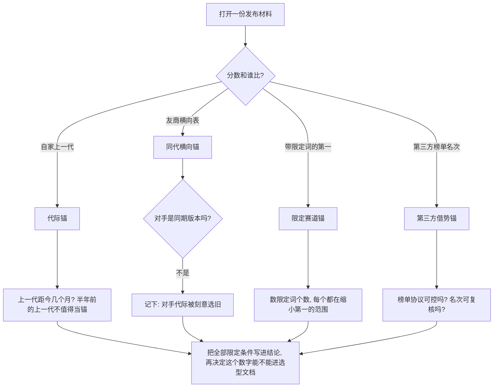
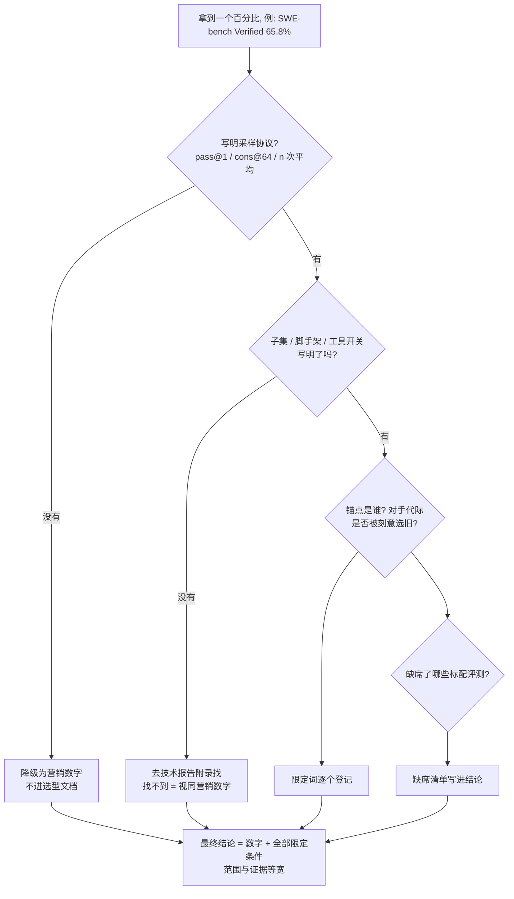
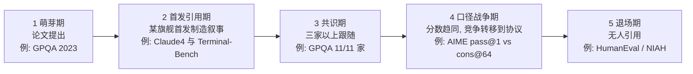

# 8. 解读厂商报告：看懂发布会上的每一个数字

> **如果只读一节**：厂商发布材料是一份"同时当营销文档和测量报告用"的文件。读它的核心技能不是记住分数，而是回答五个问题：**协议是什么？采样几次？测的是全集还是子集？锚点（对照组）是谁？它刻意没报什么？**——本章全部案例来自对 13 家头部厂商官方发布文的逐篇抓取（2026-08-28），所有分数均可回溯到来源链接。
>
> **前置知识**：读完第 2 章（评估的 5W1H）、第 5–7 章（知识/数学/代码基准）后可读。读过第 17 章（Chatbot Arena）会更容易理解 8.7 节的"偏好榜"角色。

## 8.1 本章目标与阅读姿势

每次旗舰模型发布，时间线会被同一批数字刷屏："SWE-bench 72.5%"、"AIME 93.3%"、"Arena 榜第一"。照单全收的结果，是选型文档里出现"因为它 AIME 更高所以选它"——而这两个数字可能根本不可比：一个是单次做对（pass@1），一个是采样 64 次投票（cons@64）；一个带工具测出，一个裸模型测出。

读完本章你能：

- 拆解发布材料的七个部分，知道每部分"厂商想让你看什么 vs 你应该看什么"
- 识别四种锚点策略，判断"第一"的含金量
- 建立 5 家代表性厂商的发布档案：谁爱报什么、谁刻意不报什么
- 掌握 30 分钟内完成的报告解读流程（五问法）

**前端类比**：厂商发布材料 ≈ 性能优化 PR 的描述。"首屏渲染提升 40%"本身没有信息量——信息量全在没写的部分：对照组是谁、测试机是什么、跑了几次还是挑了最好的一次。读模型报告和读性能 PR 是同一个技能。

本章分数的抓取约定：**【正文】** = 官方页面正文文字直接含该数字；**【图表】** = 官方确认使用了该评测，但分数渲染在图片里、正文抓不到值；**【转述】** = 来自搜索片段或第三方页面，未核对到官方原文。**一条分数的证据等级，比分数本身更重要。**

## 8.2 一份典型发布材料的解剖图

以 [Hello GPT-4o](https://openai.com/index/hello-gpt-4o/)（2024-05-13）、[Claude 3.5 Sonnet 发布文](https://www.anthropic.com/news/claude-3-5-sonnet)（2024-06-20）、[DeepSeek-R1 技术报告](https://arxiv.org/html/2501.12948v1)（2025-01-20）为样本，头部厂商的发布材料由七个部分组成（来源：三家原文，2026-08-28 抓取）：

```markdown
# [Model] 发布文 / 技术报告

## 1. 开场摘要          ← 英雄数字、"第一"头衔、一段愿景
## 2. 基准对比表 / 图表   ← 与竞品或前代的分数对照
## 3. 评测方法（常藏在脚注或附录）
## 4. 训练数据与训练方法  ← token 数、SFT/RLHF 流程
## 5. 安全评估           ← 红队、风险分级、记分卡
## 6. 局限性             ← 最短的一节
## 7. 客户证言与案例      ← "XX 公司已经在用"
```

每个部分都值得"双读"——先读它想传递的印象，再读它没说的事：

| 部分 | 厂商想让你看 | 你应该看 |
|---|---|---|
| 开场摘要 | 最惊艳的一两个数字 + "SOTA/第一" | 这个"第一"前面挂了几个限定词（见 14.3） |
| 基准对比表 | 上升趋势、自家列在最右 | 对手的**代际**（最新款还是上一代？）、数字是正文还是图片 |
| 评测方法 | 几乎不出现 | 脚注。协议细节全藏在这里（见 14.5 第一问） |
| 训练数据 | "XX 万亿 token" | 来源占比、截止日期、去重、是否声明不含测试集（见 14.9） |
| 安全评估 | "我们高度重视安全" | 具体记分卡：哪些风险被评为中/高（见 14.8） |
| 局限性 | 尽快翻页 | 厂商自己承认了什么——这一节是全文可信度的锚 |
| 客户证言 | 知名公司背书 | 证言无法复核、无量化口径，按营销材料处理 |

**手感训练**：把发布文里的数字句摘出来分两栏——"和别的东西比的数字"（份额、名次、倍数）与"测量出来的数字"（准确率、通过率）。左栏通常占多数，而选型真正需要的右栏信息集中在一张表里，且那张表的协议说明最少。

## 8.3 锚点策略：报告里没写的那根"基准线"

**前端类比**：性能 PR 里"快 40%"的价值完全取决于对照组。跟自家上季度版本比、跟竞品最新版比、跟行业均值比、跟自己搭的玩具基线比——四种比法都是"快 40%"，工程含义完全不同。模型报告里那个被拿来对照的对象，就叫**锚点**。

基于 13 家厂商抓取样本的归纳，锚点选择有四种原型：

| 原型 | 做法 | 真实案例 | 风险 |
|---|---|---|---|
| **代际锚**（自家上一代） | 只跟自家旧版本比 | GPT-4o 锚 GPT-4 Turbo（来源：[Hello GPT-4o](https://openai.com/index/hello-gpt-4o/)）；GLM-4.7 全部锚点为 GLM-4.6/4.5（来源：[GLM-4.5 仓库 README](https://github.com/zai-org/GLM-4.5)）；Claude 4 的"抄近路行为率比 Sonnet 3.7 低 65%"【正文】（来源：[Claude 4 发布文](https://www.anthropic.com/news/claude-4)） | "超越自己"不构成选型理由 |
| **同代横向锚**（竞品表） | 放出多模型横向表 | Grok 3 六模型完整表（来源：[Grok 3 发布文](https://x.ai/news/grok-3)）；MiniMax-M1 七模型表（来源：[arXiv:2506.13585](https://arxiv.org/html/2506.13585v1)）；DeepSeek-R1 五基线表锚定 o1-1217（来源：[arXiv:2501.12948](https://arxiv.org/html/2501.12948v1)） | 会策略性挑对手代际（Grok 3 比 Gemini 2.0 与 Claude 3.5 Sonnet，而非同期的 2.5 与 3.7） |
| **限定赛道锚** | 加限定词制造局部第一 | Kimi K2 的"非 thinking 模式 SOTA"（来源：[arXiv:2507.20534](https://arxiv.org/html/2507.20534v1)）；Gemini 2.5 Pro 的"不用 majority voting"（来源：[Gemini 2.5 发布文](https://blog.google/technology/google-deepmind/gemini-model-thinking-updates-march-2025/)）；o4-mini 的"无工具模型中最佳"（来源：[o3/o4-mini 发布文](https://openai.com/index/introducing-o3-and-o4-mini/)） | 限定词每加一个，"第一"含金量降一级 |
| **第三方借势锚** | 引用榜单名次 | 阶跃星辰 Step-2 引 LiveBench 全球第五（【转述】，媒体转载第三方榜单）；Grok 3 报 Arena Elo 1402【正文】；Kimi K2 报 Arena 开源第一、总榜第五（3000+ 票）【正文】 | 榜单协议不可控、无法展示细节 |

识别流程（拿到任何一份新发布材料时按此图走一遍）：



### 8.3.1 两种特殊的锚：人类基线与"回避锚"

**人类基线锚**是横向锚的变体——对照对象从别的模型换成人。它最有传播力，也最容易踩"条件不等价"的坑。三个抓取到的实例：

- **GPQA Diamond 的"博士基线"**：宣传常引用"人类专家约 65–70%"，但这是非领域博士在**限时 + 可搜索**条件下的成绩；模型是无限时 + 全推理。两类数字同框时并不满足同一测量条件（来源：厂商引用惯例核对，2026-08-28）。
- **GAIA 的 92% vs 15%**：人类 92% 对"当时带插件的 GPT-4 约 15%"是 agent 时代最著名的鸿沟数字（来源：[GAIA 论文](https://arxiv.org/abs/2311.12983)）。它成立是因为两者测的确实是同一组任务——这是人类基线锚被正当使用的范本。
- **Vending-Bench 的人类对照组**：Grok 4 报"净资产 $4694.15 vs Claude Opus 4 $2077.41 vs 人类 $844.05，5 次运行平均"【正文】（来源：[Grok 4 发布文](https://x.ai/news/grok-4)）。模型超过人类时，厂商很乐意放这个锚。

**回避锚**：干脆不报任何具名榜单。GPT-4o 发布是教科书案例——全文没有一个 MMLU/GPQA/HumanEval 分数，比较维度转向三件事：**自家代际对比**（"达到 GPT-4 Turbo 级别的文本、推理与编码表现"【正文】）、**分词效率**（中文 34→24 token，约 1.4 倍压缩；Gujarati 4.4 倍；泰米尔 3.3 倍【正文】）、**价格与延迟**（来源：[Hello GPT-4o](https://openai.com/index/hello-gpt-4o/)）。回避不是违规——GPT-4o 要证明的是"多模态融合没有损失文本智能"，锚定自家上一代在逻辑上自洽。你要调整的只是解读姿态：厂商回避具名榜，意味着你失去了第三方坐标系，此时唯一可信的判断来源是你自己业务场景上的 hold-out 评估（第 24 章）。

## 8.4 逐家深拆：五家代表性厂商的发布档案

下面给五家厂商各建一份"发布档案"：引用了哪些评测、分数证据等级、锚点是谁、刻意没报什么。五家分别代表四种打法：协议透明流（OpenAI/DeepSeek）、工程任务流（Anthropic）、让步披露流（Qwen）、限定赛道流（Kimi）。

### 8.4.1 OpenAI：从"回避具名榜"到"协议脚注最全"

| 发布 | 引用的评测与分数（证据分级） | 锚点 | 刻意没报 |
|---|---|---|---|
| Hello GPT-4o（2024-05-13） | 传统基准仅定性："GPT-4 Turbo 级"【正文】；分词压缩率（中文 1.4 倍）【正文】；Preparedness 记分卡【正文】；70+ 外部专家红队【正文】 | 自家 GPT-4 Turbo | 全部具名学术榜单分数 |
| o1（2024-09-12） | AIME 2024 74.4% pass@1 / 83.3% cons@64【图表】；Codeforces 89th percentile【图表】 | GPT-4o、o1-mini | —（首次把 pass@1 与 cons@64 双口径并报） |
| o3 与 o4-mini（2025-04-16） | SWE-bench Verified SOTA：n=477 子集、256k 上下文（o4-mini +3%）、排除 23 个不可运行样本【正文脚注】；AIME 2025 带 Python 解释器：o4-mini 99.5% pass@1 / 100% cons@8，并注明"不应与无工具模型比较"【正文】；τ-bench 5 次平均、用户模型用 GPT-4.1【正文脚注】；专家盲评 o3 比 o1 少 20% 重大错误【正文】 | 自家 o1、o3-mini | FrontierMath 分数未进正文（见下） |

来源：[Hello GPT-4o](https://openai.com/index/hello-gpt-4o/)、[Learning to Reason with LLMs](https://openai.com/index/learning-to-reason-with-llms/)、[Introducing o3 and o4-mini](https://openai.com/index/introducing-o3-and-o4-mini/)，2026-08-28 抓取。

OpenAI 的演化路径值得完整记住：GPT-4o 时代回避具名榜 → o1 时代发明"pass@1 + cons@64 双口径"报法（后来成为全行业推理模型的事实标准）→ o3 时代把 SWE-bench 子集裁剪、τ-bench 用户模型替换、浏览式评测的反作弊协议全部写进**脚注**。这份协议透明度是同类发布文里少见的正面样本——**读 OpenAI 发布文，正文看叙事，脚注才是正文**。

但同一家公司也贡献了本章最重要的反例：2024-12-20 的 o3 预告宣称 FrontierMath 超过 25%（对照：o1 约 2%【转述：IT之家/新浪聚合页】），随后 Epoch AI 独立复测公开版约 10%，再曝出 OpenAI 资助了该基准并拥有大部分题目访问权、参与命题的数学家事先不知情（来源：[Epoch AI 官方说明](https://epoch.ai/latest/openai-and-frontiermath)）。此后其余主流厂商发布文均不再引用 FrontierMath——**缺席名单集体变长，本身就是对那个基准的投票**。

### 8.4.2 Anthropic：真实工程任务优先

| 发布 | 引用的评测与分数（证据分级） | 锚点 | 刻意没报 |
|---|---|---|---|
| Claude 3.5 Sonnet（2024-06-20） | 内部 agentic coding 64% vs Claude 3 Opus 38%【正文】；GPQA/MMLU/HumanEval 全在图【图表】 | 竞品 + 自家 Opus | 正文无一个具名榜单数字 |
| Claude 3.7 Sonnet（2025-02-24） | SWE-bench Verified "SOTA"（双口径数值在图）【图表】；τ-bench SOTA【正文】；不必要拒绝率比前代低 45%【正文】 | 全部已发布模型 | AIME、GPQA 等全部竞赛/知识榜 |
| Claude 4（2025-05-22） | SWE-bench：Opus 4 72.5% / Sonnet 4 72.7%【正文】；Terminal-Bench 43.2%【正文】；抄近路行为率比 Sonnet 3.7 低 65%【正文】；Rakuten 客户 7 小时独立完成开源重构【正文】 | 全行业 + 自家前代 | 知识/数学榜全部缺席 |

来源：三篇 Anthropic 发布文，2026-08-28 抓取。

3.7 那次发布把策略写成了明文：原文直言"我们在数学与计算机竞赛题上做了相对更少的优化，转而聚焦真实世界任务"。所以它的评测组合是 SWE-bench Verified + τ-bench + 客户证言，AIME/GPQA 一个不报。这不是"藏拙"那么简单——**竞赛榜与工程榜衡量的是两种不同交付物**（第 11 章对比过）。作为读者，正确动作是给两家各打半分：Claude 3.7 的发布文告诉你它工程能力强，但你对它的竞赛数学一无所知；两周后 Grok 3 的发布文恰好相反。

Claude 4 还贡献了一个协议敏感度的活教材：Opus 4 的 72.5% 是单次口径，同一篇材料里并行多次尝试口径为 80.9%——**同一模型同一基准，分差 8.4 个点，两种报法都合法**（来源：[Claude 4 发布文](https://www.anthropic.com/news/claude-4)）。

### 8.4.3 DeepSeek：把协议写全的自建表

| 发布 | 关键数字（证据分级） | 锚点 | 特殊动作 |
|---|---|---|---|
| DeepSeek-V3（2024-12-26） | MMLU 88.5、GPQA Diamond 59.1、AIME 2024 39.2、SWE Verified 42.0、C-Eval 86.5（取自 R1 技术报告表 4 的 V3 列，与 Grok 3 官方表交叉验证）【正文】 | — | — |
| DeepSeek-R1（2025-01-20） | AIME 2024 79.8% pass@1 + cons@64；MMLU 90.8（o1-1217 为 91.8）；GPQA 71.5（o1 为 75.7）；SimpleQA 30.1（o1 为 47.0）；SWE Verified 49.2；C-Eval 91.8【正文】 | OpenAI o1-1217 | 主动披露落败项及原因 |

来源：[DeepSeek-R1 技术报告](https://arxiv.org/html/2501.12948v1)，2026-08-28 抓取。

R1 报告是本次抓取中**协议披露最完整**的一份：温度 0.6、top-p 0.95、k 取 4–64、pass@1 用无偏估计、输出上限 32768 token、SWE Verified 用 agentless 框架、Aider 用 diff 格式——全部写在正文。更罕见的是两处"让步披露"：明确标出知识/事实榜的落败（MMLU 90.8 vs o1 的 91.8；SimpleQA 30.1 vs 47.0）；主动解释 C-SimpleQA 只有 63.7 的原因——安全 RL 压低了正答率，若无安全 RL 可达 70% 以上【正文】。

**让步披露是全文可信度最高的信号**。一份愿意解释自己分数为什么低的报告，其他数字的可信度也水涨船高。R1 还在 AlpacaEval 2.0 LC 87.6 那一行同时披露了平均输出 token 数（689 vs 对照组的 2218），自证没有利用"裁判偏爱长回答"的偏置——这种"自证清白"动作，在 8.5 节会变成你的固定检查项。

### 8.4.4 阿里 Qwen：让步式表述与参数效率锚

| 发布 | 引用的评测与分数（证据分级） | 锚点 | 刻意没报 |
|---|---|---|---|
| Qwen2.5（2024-09-19） | MMLU "85+"、HumanEval "85+"、MATH "80+"【正文】；"显著超过 DeepSeek-V2.5，与 Llama-3.1-405B 有竞争力，部分方面仍逊于 GPT-4o 与 Claude-3.5-Sonnet"【正文】 | GPT-4o、Claude 3.5 Sonnet、Llama-3.1-405B、DeepSeek-V2.5 | 精确到小数的旗舰分数 |
| QwQ-32B（2025-03-06） | AIME 24/25、LiveCodeBench、IFEval、BFCL"与 DeepSeek-R1 相当"（数值在图）【图表】 | DeepSeek-R1（671B/37B 激活） | 精确分数 |

来源：[Qwen2.5 发布文](https://qwenlm.github.io/blog/qwen2.5/)、[QwQ-32B 发布文](https://qwenlm.github.io/blog/qwq-32b/)，2026-08-28 抓取。

两个值得学的点。第一，Qwen2.5 是国产厂商发布文中少见的让步式表述——白纸黑字写"部分方面仍逊于 GPT-4o 与 Claude-3.5-Sonnet"，用诚实换可信度，同时把比较单位从"旗舰 vs 旗舰"调整为"开源权重可用最优 vs 闭源"。第二，QwQ-32B 的核心锚点不是分数而是**参数规模**："32B 达到 671B R1 的可比性能"——"限定赛道锚"的参数版，把赛道从"谁分数高"换成"谁每参数能力强"。另外注意"85+"这种写法：它比 84.9 更容易被读者脑补成 87，**区间表述是厂商可控范围内最后的模糊地带**，见到就该去技术报告找精确值。

### 8.4.5 月之暗面 Kimi：long2short 与"非 thinking 赛道"

| 发布 | 引用的评测与分数（证据分级） | 锚点 | 刻意没报 |
|---|---|---|---|
| Kimi k1.5（2025-01） | AIME long-CoT 77.5 / long2short 60.8【正文】；MATH-500 96.2 / 94.6【正文】；Codeforces 94th percentile【正文】；LiveCodeBench short-CoT 47.3，"超 GPT-4o/Claude 3.5 幅度最高 +550%"【正文】 | OpenAI o1 | cons@64 等多次采样口径 |
| Kimi K2（2025-07-11） | Tau2-Bench 66.1、ACEBench 76.5、SWE-bench Verified 65.8、SWE Multilingual 47.3、LiveCodeBench v6 53.7、AIME 2025 49.5、GPQA-D 75.1【正文】；Arena 开源第一/总榜第五（3000+ 票）【正文】 | 全部"非 thinking 模型" | 与全力思考模式（R1/o3）的正面比较 |

来源：[k1.5 技术报告](https://arxiv.org/html/2501.12599v1)、[K2 技术报告](https://arxiv.org/html/2507.20534v1)，2026-08-28 抓取。

两份材料各贡献了一个需要警惕的表述模式。k1.5 的"+550%"是**相对值话术**——基数极小（约 7）时，涨到 47.3 在绝对值上只是 40 分，但相对值可以写成 550%。读到任何"+x%"式增长先找基数。K2 则是"限定赛道锚"的标准实现：所有对比限定在不开长思维链的设定下，用"非思考 SOTA"避开与 R1/o3 全力思考模式的正面碰撞。同时它脚注里有一句难得的诚实："Claude 4 Opus 成本过高，SWE-bench 多语言版只评了 Sonnet"——**成本约束导致锚点不全，且厂商把这件事说了出来**。合并的阅读结论：K2 的"开源第一"成立，但成立范围是"非思考 + 所评子集"，两个限定词都不能丢。

## 8.5 核心方法：读报告五问法

这是本章的核心交付物。拿到任何一个百分比，按顺序问五个问题：

> ### 🔍 读报告五问法
>
> **第一问：协议是什么？**
> 脚手架是 agentless 还是重型 agent？τ-bench 的用户模型是 GPT-4o 还是 GPT-4.1？允许带解释器/浏览器吗？
> *实例*：o3 发布文脚注写明 SWE-bench 用 n=477 固定子集、256k 上下文（对 o4-mini +3%）、排除 23 个内部环境不可运行样本；MiniMax-M1 协议节写明 τ-bench 用 GPT-4.1 作用户模型、40 步上限。**没有协议的 agent 分数是营销数字，不是测量结果**（来源：[o3/o4-mini 发布文](https://openai.com/index/introducing-o3-and-o4-mini/)、[arXiv:2506.13585](https://arxiv.org/html/2506.13585v1)）。
>
> **第二问：采样了几次？**
> pass@1、pass@k、cons@64 还是"32 次平均"？
> *实例*：Grok 3（Think）AIME 2025 的 93.3% 是 cons@64【正文】；DeepSeek-R1 的 79.8% 是 temp 0.6 的 pass@1【正文】。两者差 13.5 个点，但都叫"AIME 成绩"（详见 14.6）。
>
> **第三问：测的是全集还是子集？**
> SWE-bench 是全 500 还是 n=477？HLE 是 full set 还是 text-only？Aider 是 Polyglot 还是全量？
> *实例*：Grok 4 的 HLE 50.7% 是 Heavy 版 + 带工具 + text-only 子集【正文】——三个限定条件缺一不可（来源：[Grok 4 发布文](https://x.ai/news/grok-4)）。
>
> **第四问：锚点公平吗？**
> 对比的是上一代还是同代？限定词有几个？合成总分的权重公开吗？
> *实例*：Grok 3 的六模型表里对手是 Gemini 2.0 与 Claude 3.5 Sonnet——发布时点（2025-02-19）同代产品是 2.5 与 3.7（来源：[Grok 3 发布文](https://x.ai/news/grok-3)）。
>
> **第五问：它没报什么？**
> 缺席名单有时比在场名单信息量更大。
> *实例*：Grok 3 的表里没有任何工程类评测，而 2025 年 2 月 SWE-bench 已是发布标配；对照两周后 Claude 3.7 发布（只报 SWE-bench + τ-bench、不报 AIME）——两家各选了半个评测宇宙，各押各的强项。

### 8.5.1 实战演示：五问重读 Grok 3 六模型表

Grok 3 发布文是本次抓取中信息最完整的一张表（八项评测 × 六模型，全部【正文】），恰好是五问法的最佳教具（来源：[Grok 3 发布文](https://x.ai/news/grok-3)，2026-08-28）：

- **协议**：表内是"非思考模式"成绩，推理模式成绩另列正文（AIME 2025 cons@64 93.3% 等），两套数字不得混读；LCB 标注了时间窗（2024-10-01 至 2025-02-01）、LOFT 标注了 128k 档——披露充分。
- **采样**：表内 AIME'24 的 52.2% 未标采样口径；正文推理段的 93.3% 标了 cons@64。表内默认单次但未明说，属于可追问点。
- **子集**：GPQA 标注了 Diamond，LOFT 标注了 12 任务平均；SimpleQA 未标版本——SimpleQA 存在事实更新后的多版本，全行业通病。
- **锚点**：对手是 Gemini 2.0 与 Claude 3.5 Sonnet（上一代），而非同期的 2.5 与 3.7；表里 GPT-4o 的 AIME 9.3% 数字真实但戏剧效果强烈——它不是推理模型，放进同一张表主要用于制造分差。
- **缺席**：全表没有 SWE-bench、没有任何工程评测。

五问走完，这张表的正确读法是：**"Grok 3 在非思考模式的知识与竞赛类任务上超越上一代国际旗舰"**——而不是"Grok 3 全面领先"。五问没有推翻任何一个数字，它只是把结论的适用范围压缩到与证据等宽。

### 8.5.2 反例：GLM-4.5 的合成总分

"12 项行业标准基准综合 63.2、全部模型中第三"【正文】（来源：[GLM-4.5 模型卡](https://huggingface.co/zai-org/GLM-4.5)）——这是本次抓取中唯一只给合成总分、不给子表的旗舰发布。

**前端类比**：相当于只给你一个 Lighthouse 总分，不给 Performance/Accessibility/SEO 分项。总分传播效率极高（一个数字一个名次），但复核成本极高：12 项是哪 12 项、各自权重、思考还是非思考模式、锚点是同期还是上一代，正文均未披露。这不是说分数不可信，而是**它把验证成本转嫁给了读者**。有意思的是同一仓库里 GLM-4.7 的披露方式变成了逐项分数 + 逐项增幅（SWE-bench 73.8% +5.8、Terminal Bench 2.0 41% +16.5、HLE 42.8% +12.4）——同一厂商两代发布之间的透明度变化，往往比分数变化更能说明行业水位。

### 8.5.3 把五问法固化成代码

五问法本质是一张"分数进入对比表前的类型检查"。前端工程师最有优势的做法是把它写成编译期约束：

```typescript
// report-claim.ts — 协议不明的分数不允许进入对比表
// 运行: npx tsx report-claim.ts

type Sampling = "pass@1" | "cons@8" | "cons@64" | `avg@${number}`;

interface BenchmarkClaim {
  model: string;
  benchmark: string;               // 例: "AIME 2024"
  score: number;                   // 0-100
  evidence: "正文" | "图表" | "转述"; // 证据分级
  protocol: { sampling: Sampling; scaffold: string }; // 第一/二问
  subset?: string;                 // 第三问, 缺省 = 全量(需确认)
  anchor: string;                  // 第四问
}

// 图表分数抓不到数值、转述未核对原文, 都不能进对比表
const isComparable = (c: BenchmarkClaim) => c.evidence === "正文";

const r1: BenchmarkClaim = {
  model: "DeepSeek-R1", benchmark: "AIME 2024", score: 79.8,
  evidence: "正文",
  protocol: { sampling: "pass@1", scaffold: "temp=0.6, top-p=0.95" },
  subset: "2024 年 30 题", anchor: "OpenAI o1-1217",
};
const grok3: BenchmarkClaim = {
  model: "Grok 3 (Think)", benchmark: "AIME 2025", score: 93.3,
  evidence: "正文",
  protocol: { sampling: "cons@64", scaffold: "思考模式" },
  subset: "2025 年 30 题, 发布前 7 天开赛", anchor: "全行业",
};

for (const c of [r1, grok3])
  console.log(`${c.model}: ${isComparable(c) ? "可进对比表" : "降级为营销数字"} (${c.protocol.sampling})`);
// 关键点: 两条都"可进对比表", 但二者不可互比——采样口径不同,
// isComparable 只保证"信息完整", 不保证"可横向相减"。
```



## 8.6 协议差异有多贵：pass@1 与 cons@64 的分差

五问法里第二问值得单独一节，因为它是目前厂商发布文中**分差最大、又最常被省略**的协议旋钮。

- **pass@1**：单次采样，做对就算对。反映"真实一次调用"的体验，即你的产品用户实际感受到的成功率。
- **cons@64**（self-consistency）：采样 64 次取多数投票，超过半数正确才算通过。反映"模型 + 测试时计算"的系统上限，代价是约 64 倍推理成本。

抓取到的三个真实同源案例（均为官方正文/图表口径）：

| 案例 | pass@1 | 多次采样口径 | 差值 | 来源 |
|---|---|---|---|---|
| DeepSeek-R1-Zero, AIME 2024 | 71.0% | cons@64 = 86.7% | +15.7 | [arXiv:2501.12948](https://arxiv.org/html/2501.12948v1) |
| OpenAI o1, AIME 2024 | 74.4% | cons@64 = 83.3% | +8.9 | [Learning to Reason](https://openai.com/index/learning-to-reason-with-llms/)【图表】 |
| o4-mini（带 Python 解释器）, AIME 2025 | 99.5% | cons@8 = 100% | +0.5（已近天花板） | [o3/o4-mini 发布文](https://openai.com/index/introducing-o3-and-o4-mini/) |

### 8.6.1 动手模拟：分差从哪来

用 20 行 Node 脚本把这件事变成可触摸的（无需 API，纯本地运行）：

```typescript
// cons-sim.ts — 模拟单次正确率 71% 的"模型"在 pass@1 与 cons@64 下的分差
// 运行: npx tsx cons-sim.ts
// 期望输出: pass@1 约 71%, cons@64 明显更高(数值随随机种子浮动)

const singleShot = 0.71; // 对应 R1-Zero 在 AIME 2024 的实测 pass@1

const sampleOnce = (): boolean => Math.random() < singleShot;

// cons@k: 采样 k 次取多数投票, 超过半数正确才算这道题通过
const consAtK = (k: number): boolean => {
  let correct = 0;
  for (let i = 0; i < k; i++) if (sampleOnce()) correct++;
  return correct > k / 2;
};

const estimate = (judge: () => boolean, trials = 2000): number => {
  let pass = 0;
  for (let t = 0; t < trials; t++) if (judge()) pass++;
  return (pass / trials) * 100;
};

console.log(`pass@1  约 ${estimate(sampleOnce).toFixed(1)}%`);
console.log(`cons@64 约 ${estimate(() => consAtK(64)).toFixed(1)}%`);
```

你会看到 cons@64 比 pass@1 高出约 20 个点，而真实的 R1-Zero 只高了 15.7 个点——因为真实世界里每道题难度不同，有些题采样 64 次也做不对，而本模拟假设每题独立同分布。这个偏差本身就是下一课：**投票机制吃掉的是"随机波动"，吃不掉"确定性不会"**。

**前端类比**：cons@64 就是"flaky 测试重跑 64 次取多数"——它能让偶发抖动消失，但断言本身写错的测试重跑一万次也不会变绿。CI 里重跑 flaky 测试到通过为止是反模式，cons@64 却是合法测量——区别在于前者是"挑最好的结果"（等价于厂商只报 best-of-n），后者是"报告一个预先声明的聚合口径"。

### 8.6.2 其他三个协议旋钮

- **脚手架**：SWE-bench 上 agentless 与重型 agent 框架结果差可达数个点；MiniMax-M1 用 Agentless 并自行改进两阶段定位（来源：[arXiv:2506.13585](https://arxiv.org/html/2506.13585v1)）。
- **上下文上限**：o3 发布文量化了这一项——256k 上下文让 o4-mini 在 SWE-bench 上 +3%、o3 <1%。**有厂商开始把协议旋钮的影响本身量化公布，这是口径战争期的成熟标志**。
- **用户模拟器**：τ-bench 类评测里"用户"由 LLM 扮演。o3 脚注说明柱状图标注项改用 GPT-4.1 当用户模型，因为 GPT-4o 指令遵循差导致 rollout 失败率高。用户模型一换，分数系统性移动——这是所有 agent 榜单最大的隐藏旋钮。

## 8.7 评测 × 厂商覆盖矩阵：谁报什么，谁回避什么

把 13 家厂商发布材料里的评测引用做成矩阵，会浮现三类榜单。符号约定：**✓** = 发布正文（含技术报告正文表）出现；**○** = 仅图表或提及；空白 = 未出现。样本为 2026-08-28 抓取的 13 家官方材料：

| 评测 | OpenAI | Anthropic | Google | xAI | DeepSeek | Qwen | GLM | Kimi | MiniMax | 字节 | 小米 |
|---|---|---|---|---|---|---|---|---|---|---|---|
| MMLU / MMLU-Pro | ○ | ○ | ○ | ✓ | ✓ | ✓ | ○ | ○ | ✓ | ○ | ✓ |
| GPQA Diamond | ✓ | ✓ | ✓ | ✓ | ✓ | ○ | ○ | ✓ | ✓ | ✓ | ✓ |
| AIME 24/25 | ✓ | 空 | ✓ | ✓ | ✓ | ✓ | 空 | ✓ | ✓ | ✓ | ✓ |
| HLE | ✓ | 空 | ✓ | ✓ | 空 | 空 | ✓ | 空 | ✓ | 空 | 空 |
| HumanEval | 空(旧) | ✓(2024) | 空 | 空 | 空 | ✓(2024) | 空 | 空 | 空 | 空 | 空 |
| LiveCodeBench | 空 | 空 | 空 | ✓ | ✓ | ✓ | 空 | ✓ | ✓ | 空 | ✓ |
| SWE-bench Verified | ✓ | ✓ | ✓ | 空 | ✓ | 空 | ✓ | ✓ | ✓ | 空 | 空 |
| Terminal-Bench | 空 | ✓ | 空 | 空 | 空 | 空 | ✓ | 空 | 空 | 空 | 空 |
| τ-bench / τ² | ✓ | ✓ | 空 | 空 | 空 | 空 | ✓ | ✓ | ✓ | 空 | 空 |
| Arena / LMArena | ○ | 空 | ✓ | ✓ | 空 | 空 | 空 | ✓ | 空 | 空 | 空 |
| 长上下文任务(MRCR/LOFT/FRAMES) | ✓(研发) | 空 | ✓ | ✓ | ✓ | 空 | 空 | 空 | ✓ | 空 | 空 |
| 中文榜(C-Eval 等) | 空 | 空 | 空 | 空 | ✓ | ✓ | ○ | 空 | 空 | ✓ | ○ |

把这张矩阵读成三组结论：

- **共识榜**（推理模型时代的通用语言）：GPQA Diamond（11/11 家出现，其中 2 家仅在图表提及）、AIME、LiveCodeBench、MMLU-Pro。共识榜的作用不是排名，是**当"公共语言"**——大家都报，你才能横向比。但共识期的横向比必须带协议（14.6）。
- **分歧榜**（选择性报 = 差异化营销）：SWE-bench（国际厂商全报、国内部分不报）、Terminal-Bench（只有 Anthropic 与智谱）、HLE、ARC-AGI-2、Vending-Bench（xAI 独家）、τ-bench（agent 叙事厂商）、Arena（产品体验叙事厂商）、中文榜（国产厂商主场）。**厂商选择报哪个，暴露的是它想占领哪个叙事赛道**。
- **回避榜**（厂商不报、社区在跑）：WebArena、OSWorld、GAIA——抓取范围内没有任何一家旗舰发布正文引用；RULER 的思想被吸收但无点名引用（各家改用 MRCR/LOFT/FRAMES）；FrontierMath 在利益冲突事件后实际退场。

回避榜为什么集体缺席？抓取证据的解释很一致：这三类评测"环境不可控 + 分数不可复现"——网页会改版、用户模拟器有偏差、长任务方差大到必须多次平均。**厂商对"写不清楚协议的评测"保持距离，这本身是个理性信号**：它反过来提醒你，当一份发布文报了一个你找不到协议的分数时，警惕等级应该上调。

### 8.7.1 评测生命周期：判断一个新基准值不值得关注

矩阵是静态截图，背后是动态过程。综合抓取证据，一个评测从诞生到退场有五个阶段：



两个退场案例帮你建立时间感：

- **HumanEval**：2024-06 还是 Claude 3.5 Sonnet 发布文的三大门面之一【图表】，Qwen2.5（2024-09）报"85+"是它最后一次旗舰高光；2025 年后的旗舰发布（Claude 4、Grok 3/4、o3、K2、M1）正文均不再报。**从共识门面到集体退场，用时不到一年**——头部模型已普遍 90%+，深度饱和。
- **NIAH（大海捞针）**：Gemini 1.5 以"100 万 token 内 99% 检索"为门面（来源：[Gemini 1.5 发布文](https://blog.google/technology/ai/google-gemini-next-generation-model-february-2024/)），当所有厂商都能报 99%+ 时，它退化为上下文长度广告位，由 MRCR（多针共指）接棒——Gemini 2.5 Pro 在发布文更新里补 MRCR，正是对这条教训的官方回应。

判断规则：**萌芽期看设计是否可复现；共识期看协议披露；口径战争期忽略单点分数、只看多口径对照；退场期的分数直接跳过。**

## 8.8 安全记分卡：从附录变成发布标配

评估发布材料时不只看能力榜。安全部分的呈现方式，是判断厂商工程成熟度的低成本探针。

**现象**：GPT-4o 发布首次把 [Preparedness Framework](https://openai.com/index/hello-gpt-4o/) 风险记分卡做成发布标配——Cyber、CBRN、Autonomy 三类被评为低风险，Persuasion（说服）被评为中风险且"缓解前后均为 Medium"，并披露 70+ 外部专家红队参与预部署测试。此后 o 系列与 o3/o4-mini 发布文延续了这个动作。Anthropic 侧的对应物是 ASL 等级（Claude 3.5 Sonnet 报 ASL-2）与 UK AISI 预部署测试（来源：[Claude 3.5 Sonnet 发布文](https://www.anthropic.com/news/claude-3-5-sonnet)）。

| 报告写法 | 判断 |
|---|---|
| "全部风险类别均为低风险" | 查有没有具体分项与缓解措施；全绿记分卡的区分度为零（同 MMLU 饱和逻辑） |
| "Persuasion 为中风险，缓解前后均 Medium" | 有信息量——承认某维度缓解措施没有把风险降级，说明分级是真实测量 |
| 只有一句"我们高度重视安全" | 等价于没有安全章节 |

**前端类比**：安全记分卡 ≈ 渗透测试报告。只有"未发现高危漏洞"一句话的报告，和列了每个中危项、复测时间与缓解方案的报告，工程价值完全不同。**敢给自己打中分的记分卡，才值得信它的低分**。

## 8.9 训练数据章节的六个问题

**厂商常说的**："我们用了 13 万亿 token 的高质量数据，包括网页、书籍、代码……"

六层追问：

1. **多少 token？** token 数是投入量纲，不是能力量纲；13T 与 15T 的差异是否足以解释能力差异，报告通常不回答。
2. **什么来源？** 网页、书籍、代码各占多少？代码占比低的模型，代码能力大概率受限。
3. **数据截止日期？** 截止 2024-09 与 2025-03 的模型，对"上个月发布的框架新版本"的回答能力完全不同——这也直接决定它会不会在 LiveCodeBench 新窗口上掉分。
4. **去重了吗？** 没去重 = 同一段话出现 N 次 = 表面 token 多、有效样本少。
5. **过滤强度？** 过滤了低质量 = 实际有效数据少于标称值。两个方向都会让"13T"失真。
6. **是否声明不含测试集？** 最要紧的一条。负责任的报告会明确写"训练数据不包含 MMLU/GSM8K/HumanEval 等测试集"；没有这句声明，就存在数据污染风险。

污染不是理论担忧。Scale AI 的 GSM1k 实验用人力**重写**了一套与 GSM8k 风格严格对齐的新题，测得部分模型家族在原卷与新卷的分差最高达 8 个百分点（摘要口径），Mistral/Phi 家族接近 10%（正文口径）——分数里有相当一部分是"背题分"（来源：[GSM1k, arXiv:2405.00332](https://arxiv.org/abs/2405.00332)）。这也是 2025 年厂商开始主动用"抗污染"话术的原因：Grok 3 强调 AIME 2025"发布前 7 天才开赛"；MiMo-7B 同表报 LiveCodeBench v5（57.8）与 v6（49.3）双窗口，自证"不是只在旧题上强"；Seed-Thinking-v1.5 更进一步，直接指出"两次运行分差可达 10 分、AIME 每年 30 题高方差、不再有区分度"，并自建 BeyondAIME（100 道专家新造改编题，故意让答案不是题面出现的数字以防猜中）（来源：[Grok 3](https://x.ai/news/grok-3)、[arXiv:2505.07608](https://arxiv.org/html/2505.07608v2)、[arXiv:2504.13914](https://arxiv.org/html/2504.13914v2)）。

还有一个国产厂商材料里最常见的灰区。Doubao-1.5-pro 官方页的披露口径是："其它模型的评测指标来自官方评测结果，官方评测结果中不含的部分来自内部评测平台结果"（来源：[字节 Seed 官方页](https://seed.bytedance.com/en/special/doubao_1_5_pro)）。翻译一下：**对比表里部分竞品分数是它自己测的，不是竞品官方报的**。这不违规——竞品没测过的组合总得有人测——但你必须知道表里每个数字"是谁测的"，两个来源可信度不同。

## 8.10 训练方法章节的四个问题

**厂商常说的**："我们用 SFT + RLHF + DPO 训练。"

四层追问：

1. **SFT 数据多少条？** 10 万条与 1000 万条是两个量级的工程。
2. **人类反馈多少？** RLHF 偏好数据规模直接决定对齐质量，但几乎从不披露。
3. **红队规模？** GPT-4o 发布披露了"70+ 外部专家红队"【正文】，已属这一类目的高披露水平；多数报告只有定性描述。
4. **算力投入？** FLOPs 几乎从不公开，能侧面推断的只有 DeepSeek-V3 公开的训练成本量级口径（来源：[DeepSeek-V3 仓库](https://github.com/deepseek-ai/DeepSeek-V3)）。

训练方法章节的通用规律：**它解释"分母"（投入），评估章节解释"分子"（产出），而报告永远希望你只看分子**。

## 8.11 缺席名单：报告没说什么

以下维度在抓取的 13 家厂商发布材料中几乎系统性缺席：

| 维度 | 为什么厂商不报 | 谁在测 |
|---|---|---|
| 真实延迟 / 吞吐 | 影响选型但各家架构差异大 | API 文档、社区实测 |
| 能源消耗 | 不利于营销 | 极少数学术研究 |
| 失败模式 | 容易招黑 | 社区复测、红队报告 |
| 用户投诉率 / 真实 ROI | 商业敏感 | 你自己的 A/B（第 26 章） |
| 长上下文真实表现 | NIAH 已营销化，RULER 系无人点名引用 | 社区评测（第 14 章） |
| 多 agent 协作 | 尚无共识协议 | 社区与研究界 |

两张有用的"对照读法"：

- **双报者可信度更高**：把"真实工程任务"与"竞赛题"双报的厂商（Claude 4 报 SWE-bench + Terminal-Bench；MiniMax-M1 报七模型全景表并如实呈现 HLE 8.4 vs o3 的 20.3、SimpleQA 18.5 vs o3 的 49.4），其单一维度分数的可信度也更高——敢报输的表，赢的行才更可信。
- **如实呈现落败是稀缺信号**：Grok 3 的表里 SimpleQA 一栏 Gemini 2.0（44.3%）高于自家（43.6%），仍照登【正文】。这份"照登"的边际成本是叙事受损，收益是你对整张表的信任。

**金句**：*Every model report is a marketing document with measurement appendices.* — 它首先是营销文档，测量部分是附录。选型流程因此永远是：看 3–5 份报告提取口径 → 在自己的业务场景上做 hold-out 评估 → 用自己的数字做决定（第 24 章给完整方法）。

## 8.12 实战：30 分钟报告解读流程

**第 1 步（5 分钟）：证据分级扫描** — 把全文数字句摘出，标【正文】/【图表】/【转述】；图表分数抓不到值的，先降级处理。

**第 2 步（5 分钟）：锚点识别** — 用 14.3 流程图判断四种原型，记下对手代际与全部限定词。

**第 3 步（10 分钟）：五问法过主表** — 重点跑第一问（协议）与第五问（缺席清单）；找不到协议就去技术报告附录找，找不到就降级。

**第 4 步（10 分钟）：填写解读模板**

```markdown
# 报告解读：[模型 X]（发布日期：____）

## 1. 证据分级
- 正文数字 ____ 条 / 图表数字（抓不到值）____ 条 / 需第三方核验的声明 ____

## 2. 锚点
- 原型：代际 / 横向 / 限定赛道 / 借势 / 回避
- 对手代际：____（是否刻意选旧：____）
- 限定词清单：____

## 3. 五问结果
- 协议（脚手架/工具/用户模型）：____
- 采样口径：pass@1 / cons@k / n 次平均 = ____
- 子集：全集 / n=____
- 缺席的标配评测：____

## 4. 数据声明
- token 数与截止日期：____ / 是否声明不含测试集：____
- 竞品分数是谁测的：官方口径 / 厂商内部平台

## 5. 安全
- 记分卡有无具体分项：____ / 是否承认任何中/高风险：____

## 6. 结论（范围与证据等宽）
- 该模型在 ____ 协议 + ____ 子集 + ____ 锚点下，____ 任务上 ______
- 对我们业务的适用性：待 hold-out 评估验证
```

**Try It**（可立即执行）：

1. 用五问法重读 [Kimi K2 技术报告](https://arxiv.org/html/2507.20534v1)，找出"非 thinking"这个限定词出现在哪些行的锚点里。
2. 把 [DeepSeek-R1](https://arxiv.org/html/2501.12948v1) 与 [Grok 3](https://x.ai/news/grok-3) 两份材料中重复出现的评测列出来，标注每家采样口径是否一致。
3. 找一份只报合成总分的发布材料（参考 GLM-4.5 模型卡），尝试从公开渠道复核它的子项分数——记录你花了几分钟、卡在哪一步。

## 8.13 验收自测

1. **选择**：Grok 3 发布文的六模型表里，AIME'24 一栏 52.2%（非思考）与正文另一处 AIME'25 93.3% 的最大区别是？
   - A. 年份不同，题目更难
   - B. 采样协议不同：前者为单次口径（未明说），后者为 cons@64
   - C. 93.3% 是带工具成绩
   - D. 52.2% 是图表分数，不可信

2. **选择**：一家厂商发布文只给"12 项基准合成总分 63.2、全模型第三"，不给子表。正确的处理是？
   - A. 排名权威，直接采信
   - B. 合成总分无法复核子项与权重，验证成本被转嫁给读者，降级处理
   - C. 说明该厂商分数造假
   - D. 等价于 Lighthouse 总分，可以直接引用

3. **选择**：以下哪个信号最能提升一份报告的可信度？
   - A. 全部评测都是第一
   - B. 图表更精美
   - C. 主动披露落败项并解释原因（如 C-SimpleQA 因安全 RL 压低）
   - D. 对比模型数量多

4. **简答**：为什么 pass@1 与 cons@64 两种口径都合法，但混用会造成误导？用你的产品用户的真实体验解释。

5. **简答**：WebArena、OSWorld、GAIA 在 13 家厂商旗舰发布正文中零引用。给出至少两个解释，并说明这对"读到无协议分数怎么办"的启发。

6. **实操**：任选一份 2025 年后的旗舰发布文，完成 14.12 的解读模板，重点产出"限定词清单"与"缺席评测清单"两栏。

## 8.14 📋 本章 Cheat Sheet

| 概念 | 一句话 | 详见 |
|---|---|---|
| 证据分级 | 【正文】>【图表】>【转述】，图表分数抓不到值先降级 | §8.2 |
| 锚点四原型 | 代际 / 横向 / 限定赛道 / 第三方借势 | §8.3 |
| 回避锚 | 不报具名榜，转向分词/延迟/价格叙事 | §8.3.1 |
| 五问法 | 协议、采样、子集、锚点、缺席 | §8.5 |
| pass@1 vs cons@64 | 单次体验 vs 64 次投票上限，分差可达 15+ 点 | §8.6 |
| 共识榜 | GPQA（11/11 家）、AIME、LiveCodeBench、MMLU-Pro | §8.7 |
| 评测生命周期 | 萌芽→首发→共识→口径战争→退场 | §8.7.1 |
| 让步披露 | 敢解释自己为什么输的报告最可信 | §8.4.3 |
| 相对值话术 | "+550%"先找基数 | §8.4.5 |
| 内部评测平台 | 竞品分数可能是厂商自测，非官方口径 | §8.9 |

## 8.15 ⚠️ 5 个常见错误

1. **把不同采样口径的分数放进同一列比较** — 79.8%（pass@1）与 93.3%（cons@64）都叫"AIME 成绩"，混排即得出错误结论。先核对口径再进表。
2. **把图表分数当正文分数引用** — 页面确认用了该评测但数值渲染在图片里，引用时写"官方图表显示"并注明未能核到数值，不要凭记忆补写数字。
3. **只看对手是谁，不看对手是哪一代** — Grok 3 比 Gemini 2.0 而非同期的 2.5；横向表的第一个检查项永远是代际。
4. **忽略限定词** — "非 thinking SOTA""不用 majority voting""无工具最佳""text-only 子集"——每个限定词都在缩小"第一"的适用范围，引用时必须连限定词一起带。
5. **只读在场名单** — SWE-bench 已是发布标配却缺席的代码表、AIME 饱和后仍只报 AIME 的发布文，缺席清单暴露的叙事选择比在场数字更多。

## 8.16 延伸阅读

⭐⭐⭐（一手发布材料，本章主要证据来源）
- [Introducing o3 and o4-mini](https://openai.com/index/introducing-o3-and-o4-mini/) — 协议脚注的正面范本（n=477、τ-bench 用户模型、反作弊协议）
- [DeepSeek-R1 技术报告](https://arxiv.org/html/2501.12948v1) — 自建表协议披露最完整 + 让步披露样本
- [Grok 3 发布文](https://x.ai/news/grok-3) — 六模型横向表的完整样本，五问法最佳教具
- [Claude 4 发布文](https://www.anthropic.com/news/claude-4) — 工程任务优先叙事 + 双口径 SWE-bench

⭐⭐
- [Hello GPT-4o](https://openai.com/index/hello-gpt-4o/) — 回避锚案例 + Preparedness 记分卡起点
- [Gemini 2.5 发布文](https://blog.google/technology/google-deepmind/gemini-model-thinking-updates-march-2025/) — 双榜逻辑与"不用 majority voting"限定词
- [MiniMax-M1 技术报告](https://arxiv.org/html/2506.13585v1) — 国产厂商中最全景的七模型表 + 完整协议节
- [Seed-Thinking-v1.5](https://arxiv.org/html/2504.13914v2) — 对评测方法论自我批判的转折样本
- [Epoch AI 关于 FrontierMath 的说明](https://epoch.ai/latest/openai-and-frontiermath) — 评估机构利益冲突案例的一手回应

⭐
- [GSM1k（Scale AI）](https://arxiv.org/abs/2405.00332) — 用同源新题量化"背题分"
- [Terminal-Bench 官网](https://www.tbench.ai/) — 工程任务型评测的新一代样本
- [Qwen2.5 发布文](https://qwenlm.github.io/blog/qwen2.5/) — 让步式表述的国产样本
- [字节 Seed Doubao-1.5-pro 页](https://seed.bytedance.com/en/special/doubao_1_5_pro) — "内部评测平台"披露口径案例
