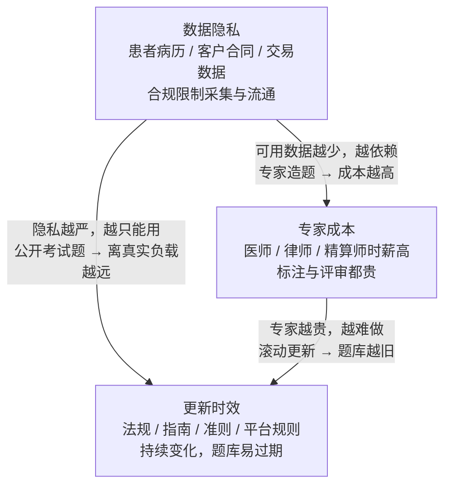

# 15. 行业垂直评测：医疗、法律、金融、电商

> **如果只读一节**：读 11.8 的决策表与 11.3.3 的合规边界。垂直评测的全部结论可以压缩成一句话：**公开考试类基准能证明"模型懂这个行业"，永远不能证明"模型能在这个行业上岗"**——从前者到后者隔着真实任务分布、专家评审与法律责任三道门，而这三道门里没有一道是基准分数能替你关上的。

## 15.1 本章目标与读者

**前置知识**：读完第 9 章（拆解模板）与第 12 章 8.9（按场景选基准）。本章延续同一个模板，但每个评测多回答一个问题：**它离"上岗可用"还差几步**。

读完后你能：

- 说清 MedQA / PubMedQA 测什么、不测什么，以及为什么"通过 USMLE 水平考试"不等于"能行医"
- 解释 LegalBench 用 162 个小任务而不是一张大考卷的原因，以及这对你的行业评测设计意味着什么
- 区分金融评测里"知识题"与"数值任务"两类考点（FinBen / FinEval 各占哪一半）
- 说出垂直评测的共同困境（数据隐私、专家标注、更新速度），并用"三难三角"定位你自己的评测项目
- 用决策表判断：你的行业里，哪些环节可以给 AI，哪些必须留给人类
- 为自己的业务搭一个最小垂直评测，并知道从公开基准借不到什么

## 15.2 概念引入：考试分数与岗位胜任力是两个构念

第 9 章 MMLU 的分数能推出"知识面广"，因为四选题本身就是知识面的操作化定义。但把同样的逻辑搬到垂直行业，推断链就断了：

```
MMLU 90% → 知识面广                （推断成立）
MedQA 90% → 医学知识面广           （推断基本成立）
MedQA 90% → 能辅助临床决策         （推断不成立——差着三道门）
```

**前端类比**：LeetCode 高分候选人不等于能独立负责一个五年历史的电商前端系统。算法题考"能不能解题"，岗位考"能不能在约束下交付"——面试官不会只让你刷题，因为两者是不同的构念。

三道门分别是什么：

1. **任务分布门**：考试题是"结构化好的问题 + 唯一正确答案"，真实工作是"含糊的主诉 + 多种可能 + 需要追问"；
2. **专家评审门**：考试成绩是客观对错，工作产出质量需要专家按 rubric 评——Med-PaLM 2 论文专门做了这一步（见 11.3.3）；
3. **责任门**：错一道选择题扣分，错一个临床建议、一份合同条款、一笔投资建议是事故。责任主体决定了 AI 能站到流程的哪一段。

一个垂直评测项目的数据结构，比通用基准多出三个必填字段——没有它们，分数无法转化为业务决策：

```typescript
// vertical-eval.ts —— 垂直评测的必需字段（对比第 12 章 8.2 的通用结构）
interface VerticalSample {
  id: string;
  question: string;
  answer: string;
  domain: "medical" | "legal" | "finance" | "ecommerce";
  sourceType: "exam" | "real_case" | "expert_authored"; // 关键 1：题目来源层级
  reviewedBy?: string;                                  // 关键 2：专家审核人
  asOfDate: string;                                     // 关键 3：知识与法规的时间戳
  riskTier: "low" | "medium" | "high";                  // 错误的业务后果分级
}
// 没有这三个字段，你只能得到一个"看起来像能力"的数字。
```

## 15.3 医疗：MedQA 与 PubMedQA

### 15.3.1 MedQA 深拆

- **测什么**：美国执业医师考试（USMLE）风格的长题干多选题，测医学知识掌握与临床推理的第一层。
- **数据构建**：从真实医师执业考试收集，全集约 6.1 万题，覆盖美国、中国大陆与台湾地区三个来源；社区最常用的 USMLE 英文子集测试集约 1,273 题（来源：论文 Jin et al., arXiv:2009.13081 与官方仓库）。题干长、选项多、常含"哪项检查最合适"这类排除式推理，是它比 MedMCQA 类基准难的原因。
- **评分协议**：四选（或五选）一精确匹配。
- **分数含义**：模型掌握医学教材级知识的程度。里程碑式的数字：GPT-4 技术报告报 MedQA 约 86.2%（来源：arXiv:2303.08774）；Google 医疗专用模型 Med-PaLM 2 报 86.5%（来源：论文 arXiv:2305.09617）——均已超过多数考生水平。
- **局限与游戏空间**：选择题格式让它测不出"向病人解释"与"承认不确定"；长题干可以被关键词检索部分解决（不读全文也能排除选项）；题库公开多年，污染无法排除——**这也是为什么后面 11.3.3 的专家评审比分数更关键**。
- **厂商采用记录**：抓取的 13 家旗舰发布正文均未引用 MedQA（来源：vendor-blog-evals.md 覆盖矩阵）——医疗评测只出现在医疗专项模型（Med-PaLM 系）的论文与产品页，通用旗舰不碰这个赛道：没有对口的叙事，还容易引来监管关注。

### 15.3.2 PubMedQA：文献理解

- **测什么**：给定一篇医学文献摘要与一个结论性问题，回答 yes / no / maybe 三分类——"该研究是否支持某假设"。
- **数据构建**：来自 PubMed 摘要，其中专家标注子集约 1,000 题（pqa_labeled），另有大规模半自动样本（来源：论文 Jin et al., arXiv:1909.06146）。评测界共识是用 1,000 题的专家子集，因为半自动部分的标签来自标题，噪声明显。
- **评分协议**：三分类精确匹配；"maybe"是关键设计——文献理解里"证据不足"是合法答案，强迫二分类会奖励过度自信。
- **分数含义**：读文献、抓结论的能力，是循证类产品（文献综述、药物问答）的前置能力。
- **局限**：摘要的结论往往就在文末，模型可以靠"找最后一句"作弊；与真实临床决策（病人主诉 + 检查 + 指南）仍是两种任务。
- **厂商采用记录**：Med-PaLM 2 报 PubMedQA 79.0%（来源：arXiv:2305.09617）；通用旗舰发布未引用。

### 15.3.3 合规边界：考试通过为什么不能行医

Med-PaLM 2 论文补上了本书反复强调的那一步——**让医师按临床标准给长文本回答打分**，而不是只看选择题分数：在长文本健康问答的医师评估中，Med-PaLM 2 的回答好评率约 92.6%，已接近临床医师的 92.9%（来源：arXiv:2305.09617）。

即便如此，它仍不能上岗，原因都在评测框架之外：

1. **责任主体**：临床决策的法律责任由执业医师承担；AI 的输出没有署名担责的资格。美国按医疗器械（SaMD）路径监管临床决策软件，中国对应药品监管部门对辅助诊断软件的分类管理——具体类别取决于厂商宣称的用途；
2. **数据合规**：训练与评测用真实病历受 HIPAA（美）与个保法/医疗数据管理规定（中）约束，公开评测集因此只能是"考试题"，与真实工作负载脱节——这是医疗评测永远到不了"上岗级"的结构性原因；
3. **风险不对称**：诊断建议错误的代价不是"回答错误"而是"医疗事故"。同一个准确率水平，在闲聊产品里可接受，在这里不可接受。

**给工程师的落点**：如果你的产品涉及健康信息，评测清单里除了分数，必须有：免责与边界提示是否触发（用户问"我是不是得了癌"时）、高危问题是否转人工、以及一层医师抽检 rubric。工具与方法见第 22 章（安全评估）与第 24 章（自建评测集）。

## 15.4 法律：LegalBench 的 162 个小任务

- **测什么**：法律推理的分项能力——从合同条款中识别问题（issue spotting）、判断引用是否支持主张、规则适用、条文含义等。
- **数据构建**：这是它最有参考价值的设计。LegalBench 不是一张大考卷，而是 **162 个独立小任务，由约 40 位法律学者与从业者各自贡献**（来源：论文 Guha et al., arXiv:2308.11462）。每个任务来自真实法律工作的一个片段，规模小到几十题、大到上千题不等。
- **评分协议**：逐任务计算准确率后取平均；论文对约 20 个模型做了统一基线，总体最强者（GPT-4）的平均分也有限，且任务间分差极大（来源：arXiv:2308.11462）。
- **分数含义**：平均分几乎没用，**分任务画像才有用**——模型可能在"合同条款分类"上很强、在"判断引证是否成立"上很弱。做法律产品选型时看的是任务级切片，不是总分。
- **局限**：任务以英美的判例与合同语言为主，直接迁移到中文法律语境要自建；任务小意味着单任务分数噪声大。
- **厂商采用记录**：旗舰发布正文未引用。法律赛道与医疗同理：公开基准不构成发布叙事，实际采购决策靠律所与厂商的联合实测。

**为什么"162 个小任务"值得抄**：它是"岗位胜任力"的操作化——把"AI 会不会做法律"这个无法回答的问题，拆成 162 个能回答的问题。你为自己的业务设计评测时，用同样的方法拆（第 23 章 22.x 的任务分解方法）。

**合规边界**：执业法律服务的主体资格受各国律师制度约束（美国为 Unauthorized Practice of Law 规则，中国为律师法框架）；面向公众的法律 AI 产品必须明示"不构成法律意见"。评测层面，这意味着"免责与转介触发"是必测项，与 11.3.3 同构。

## 15.5 金融：FinBen 与 FinEval

金融是垂直评测里结构最分裂的：一半是"考试知识"，一半是"表格与数值"。两个基准正好各占一半。

**FinBen**（英文，学术向）：

- **测什么**：覆盖金融文本理解与预测的任务谱——信息抽取（从财报抽实体）、文本分类（新闻情感）、问答、以及带数值的预测任务（来源：论文 arXiv:2402.12659；数据集与任务计数以论文版本为准）。
- **数据构建**：整合多个既有金融 NLP 数据集，统一成可复现的评估套件。
- **分数含义**：模型处理金融文本与半结构化数据的综合能力，适合研究对照；对业务选型要挑与你的场景对口的子任务看。
- **局限**：预测类任务（股价走势）的标签本身受市场有效性限制，分数解释要谨慎；财报数据有强时效性。
- **厂商采用记录**：旗舰发布正文未引用；Bloomberg GPT 等金融专项模型论文是主要引用方。

**FinEval**（中文，考试向）：

- **测什么**：中文金融学科考试——会计、证券从业、银行从业、经济金融等，约 4,600 道四选题、34 个学科（来源：论文 arXiv:2308.09975）。
- **评分协议**：四选一精确匹配，支持 few-shot 口径。
- **分数含义**：中文金融知识面；国产模型报告里偶见引用，国际厂商不用。
- **局限**：与 C-Eval 的金融子集能力重叠；考试题更新慢。

**金融评测的特有陷阱**：

1. **数值容差**：金融计算对舍入规则极敏感，评测协议必须写死精度（小数位、货币单位、百分比 vs 小数）；
2. **时效与版本**：会计准则、监管口径（如披露规则）会变，评测集必须带 11.2 的 `asOfDate`；
3. **合规红线**：投资建议的输出责任受证券监管约束（适当性管理、投顾牌照）。**任何评测分数都不能支撑"AI 独立做投资决策"**——这一条的优先级高于一切分数。

## 15.6 电商：EcomInstruct 与领域事实更新

- **测什么**：电商场景的指令任务——商品描述生成、客服问答、评论分析、推荐解释等（来源：论文 arXiv:2403.02062；样本量为万级指令，计数以论文为准）。
- **数据构建**：来自真实电商平台的商品与交互数据（脱敏后），题目贴近一线运营与客服工作。
- **评分协议**：开放题依赖 LLM 裁判或人工评分——注意这引入了第 17 章的四类裁判偏差，电商评测的分数波动往往来自裁判而不是模型。
- **分数含义**：垂直评测里最接近"可以直接上岗"的一类——因为它的错误代价是客诉与转化率，不是生命或财产。这也是为什么电商是垂直领域里自动化程度最高的。
- **特有陷阱**：**领域事实更新速度**。SKU、价格、促销规则、活动机制每周都在变——任何静态评测集里的"商品知识"三个月后就过期。评测集必须做成滚动更新（方法见第 16 章的三步法），否则分数反映的是三个月前的商品库。
- **厂商采用记录**：电商垂直基准在旗舰发布中缺席，由平台厂商（阿里、京东等）内部评测主导——这是垂直评测的共同形态：**谁拥有真实数据，谁就拥有评测**。

## 15.7 垂直评测的共同困境：三难三角

四个行业看下来，困境是同构的。三个约束互相挤压，构成一个不可兼得的三角：



三个推论，直接决定你的评测策略：

1. **公开垂直基准的天花板是"考试级"**——隐私约束决定了它们拿不到真实工作负载数据，因此分数到顶也只是"懂行"的证据；
2. **专家预算应该花在"评审"而不是"出题"上**——出题可以半自动（从真实案例脱敏改造），评审必须真人专家（Med-PaLM 2 的医师评审、LegalBench 的从业者贡献都是这个模式）；
3. **时效问题用滚动更新解决，不用更大的静态集解决**——把题库做成带 `asOfDate` 的流水线（第 16 章三步法），比一次性扩题量有用得多。

## 15.8 决策表：高风险行业 = AI 辅助 + 人类把关

| 行业 | 关键约束 | 对应公开评测 | AI 能承接 | 必须留给人 | 额外必测项 |
|---|---|---|---|---|---|
| 医疗 | 患者安全、SaMD/HIPAA 类监管、数据合规 | MedQA、PubMedQA | 文献检索与摘要、病历结构化、患者教育文案 | 诊断、处方、病情告知、风险沟通 | 高危问题识别与转介触发、医师抽检 rubric |
| 法律 | 执业资格（UPL 类规则）、责任承担 | LegalBench（分任务看） | 条款分类、文书初稿、案例检索 | 法律意见出具、签字、策略决策 | 免责提示触发、引证真实性核验（防编造判例） |
| 金融 | 适当性管理、投顾牌照、审计留痕 | FinBen（子任务）、FinEval | 信息抽取、研报摘要、报表核对 | 投资建议、授信决定、合规签字 | 数值精度协议、知识时间戳、拒答策略 |
| 电商 | 客户体验、品牌、平台规则 | EcomInstruct 类 | 商品文案、客服首轮应答、评论聚类 | 价格与库存承诺、纠纷终审、公关响应 | 领域事实滚动更新、裁判偏差监控 |
| 教育 | 未成年人保护、教学效果 | 学科类基准 + 自建 | 讲解、出题、批改辅助 | 升学建议、心理相关话题 | 分层讲解质量评审、内容安全 |

**金科玉律**：高风险行业 = AI 辅助 + 人类把关。评测的作用是把"辅助"与"把关"的边界从直觉变成可测量的清单——最后一列（额外必测项）比分数列更重要。

## 15.9 实战与陷阱：为你的行业搭一个最小垂直评测

五步法（总预算控制在两周内）：

```
1. 选 30-50 个真实任务样本（从工单/咨询记录脱敏，覆盖高中低风险各一档）
2. 请一位领域专家把每个样本改写成"有标准答案或评分 rubric 的题"
3. 每题打 riskTier 标签 + asOfDate（用 11.2 的数据结构）
4. 跑 3 个候选模型，高风险题失败直接一票否决
5. 每月滚动补 5-10 道新题，旧题按时间分层对比（防知识过期假象）
```

最小判分器（高风险题一票否决逻辑）：

```typescript
// vertical-grader.ts —— 垂直评测的最小判分：分层 + 一票否决
// 运行命令：npx tsx vertical-grader.ts（无外部依赖，需联网调用模型的版本见注释）

interface GradeResult { overall: number; highRiskPass: boolean; blocked: string[] }

function gradeVertical(samples: VerticalSample[], answers: Map<string, string>): GradeResult {
  const correct = samples.filter(s => answers.get(s.id) === s.answer);
  const overall = correct.length / samples.length;

  const blocked: string[] = [];
  for (const s of samples.filter(s => s.riskTier === "high")) {
    if (answers.get(s.id) !== s.answer) blocked.push(s.id); // 高风险题答错 → 记入否决名单
  }
  return { overall, highRiskPass: blocked.length === 0, blocked };
}

// 期望输出：overall 是给管理层的数字；blocked 是给评审会的一票否决名单。
// 两者必须分开呈现——平均分好看、高危题答错，结论只能是"不可上线"。
```

三个陷阱：

1. **只看总分，不看风险分层**——overall 88% 但高危题错了 2 道，产品结论应该是"不能上"，这个信息会被平均分吞掉；
2. **用真实患者/客户数据直接建评测集**——评测数据同样受数据合规约束，脱敏与授权流程要在建集之前走完；
3. **跳过专家评审直接用公开基准分数汇报**——"MedQA 90%"在医疗产品立项会上没有证据力，医师评审记录才有。

## 15.10 章节汇总

| 行业 | 基准 | 任务形态 | 判分 | 离上岗的距离 |
|---|---|---|---|---|
| 医疗 | MedQA | USMLE 风格多选，约 6.1 万题 | 精确匹配 | 考试级；隔着任务分布/专家评审/责任三道门 |
| 医疗 | PubMedQA | 文献摘要三分类 | 精确匹配（含 maybe） | 文献级；可用作弊路径多 |
| 法律 | LegalBench | 162 个小任务 | 逐任务准确率 | 岗位分项级；看切片不看总分 |
| 金融 | FinBen | 文本+数值任务谱 | 混合 | 子任务级；预测类解释要谨慎 |
| 金融 | FinEval | 34 学科考试，约 4,600 题 | 四选一 | 考试级 |
| 电商 | EcomInstruct 类 | 真实平台指令任务 | LLM 裁判/人工 | 最接近上岗；时效是主要风险 |

（厂商采用记录：四个行业的公开垂直基准在抓取的 13 家旗舰发布正文中均未出现，来源：vendor-blog-evals.md 覆盖矩阵。垂直评测由垂直厂商与行业采购方主导，而非通用模型厂商。）

## 15.11 验收自测

1. **选择**：LegalBench 用 162 个小任务而不是一张大考卷，最主要的好处是？
   - A. 评分更快
   - B. 能得到分任务的能力画像，贴合真实法律工作的分工
   - C. 题目更难
   - D. 避免数据污染

2. **选择**：MedQA 分数很高但医疗产品仍不能让 AI 直接给诊断，评测框架之外的原因是？
   - A. 题目太简单
   - B. 责任主体、数据合规与风险不对称——这三道门在基准分数之外
   - C. 模型不会说中文
   - D. MedQA 不是英文考试

3. **选择**：金融垂直评测最容易被忽视的协议细节是？
   - A. 模型温度
   - B. 数值精度与舍入规则、知识时间戳
   - C. few-shot 数量
   - D. 提示词长度

4. **简答**：为什么公开垂直基准（MedQA/LegalBench）都停留在"考试级"，到不了"真实工作负载级"？用三难三角解释。

5. **简答**：电商是四个行业里最接近"AI 直接上岗"的，从错误代价的角度解释为什么，并指出它自己的主要风险。

6. **实操**：按 11.9 的五步法为你的业务域建一个 30 题的最小评测，用 11.2 的数据结构落盘，跑三个模型后输出"overall + 高风险否决名单"两张表。

## 15.12 📋 本章 Cheat Sheet

| 概念 | 一句话 | 详见 |
|---|---|---|
| 三道门 | 任务分布 → 专家评审 → 责任承担，分数到不了最后一级 | §15.2 |
| MedQA | USMLE 风格多选，GPT-4/Med-PaLM 2 均约 86% | §15.3.1 |
| PubMedQA | 文献三分类，maybe 是合法答案 | §15.3.2 |
| 医师评审 | Med-PaLM 2 好评率 92.6% vs 医师 92.9%，仍不能上岗 | §15.3.3 |
| LegalBench | 162 个小任务，看切片不看总分 | §15.4 |
| FinBen / FinEval | 任务谱 vs 学科考试，金融的两半 | §15.5 |
| EcomInstruct | 最接近上岗，但领域事实每周过期 | §15.6 |
| 三难三角 | 隐私 / 专家成本 / 时效，互相挤压不可兼得 | §15.7 |
| 一票否决 | 高风险题答错，总分再高也不能上线 | §15.9 |

## 15.13 ⚠️ 5 个常见错误

1. **拿 MMLU 或 MedQA 分数向业务方证明"AI 能胜任"** — 考试分数只覆盖三道门中的第一道；立项汇报需要的是分风险层级的实测与专家评审记录。
2. **只看垂直评测总分** — LegalBench 的价值在任务级切片，金融的价值在子任务；总分掩盖的恰恰是你要知道的短板分布。
3. **用未脱敏的真实行业数据直接建评测集** — 医疗与金融数据的采集、存储、使用都有合规流程，评测集不是法外之地。
4. **静态垂直评测集用过半年** — 法规、指南、商品知识过期后，分数的下降会被误判为"模型退化"；给每道题加 `asOfDate` 并滚动更新。
5. **高风险题和普通题混在一个平均分里** — 一票否决逻辑必须独立于总分呈现，否则"88% 但高危题错了"会被读成"可以上线"。

## 15.14 延伸阅读

⭐⭐⭐
- [MedQA 论文](https://arxiv.org/abs/2009.13081) — 多地区执业考题的构建与规模口径
- [Med-PaLM 2 论文](https://arxiv.org/abs/2305.09617) — 医师评审协议：从选择题分数到长文本质量
- [LegalBench 论文](https://arxiv.org/abs/2308.11462) — 162 个任务与约 40 位贡献者的协作构建模式

⭐⭐
- [PubMedQA 论文](https://arxiv.org/abs/1909.06146) — 三分类与 maybe 的设计依据
- [FinBen 论文](https://arxiv.org/abs/2402.12659) — 金融任务谱的统一套件
- [FinEval 论文](https://arxiv.org/abs/2308.09975) — 中文金融学科考试的构建

⭐
- [EcomInstruct 论文](https://arxiv.org/abs/2403.02062) — 电商指令任务的构建（计数以论文为准）
- [GPT-4 技术报告](https://arxiv.org/abs/2303.08774) — MedQA 86.2% 的原始出处
- [Vendor 评测覆盖矩阵调研](research/vendor-blog-evals.md) — 13 家旗舰发布正文中的垂直基准缺席记录
