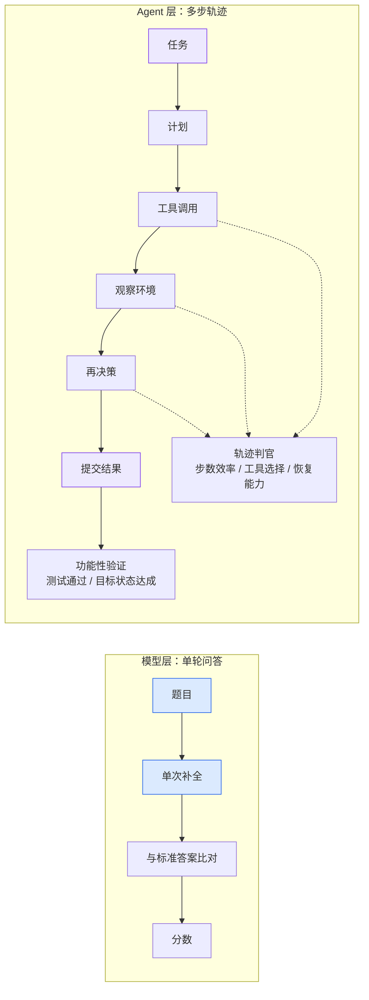
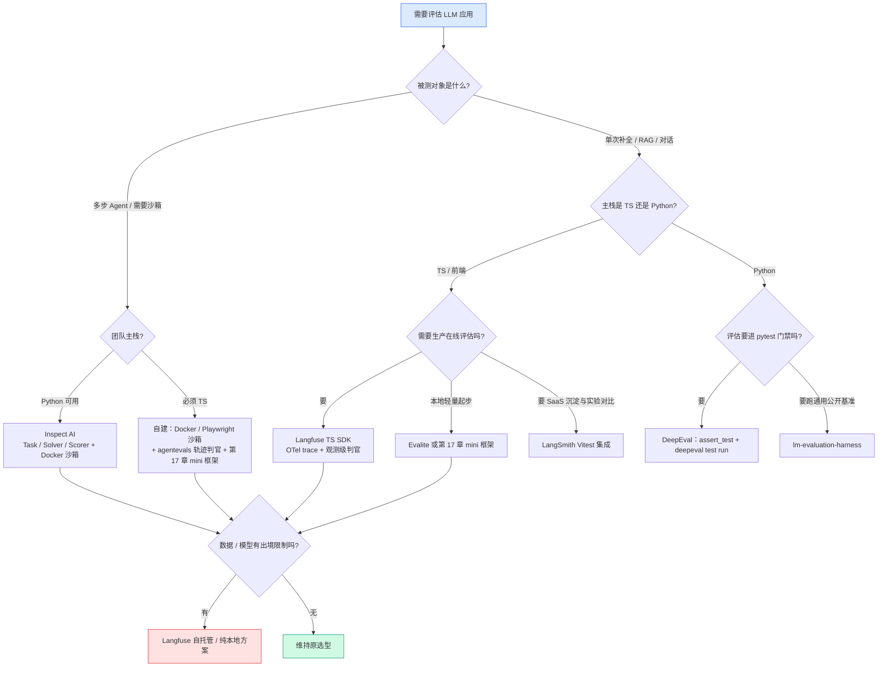

# 16. 评估框架全景图：用设计哲学选对你的工具

> **如果只读一节**：读 16.4.5 的四框架横向对比与"选型三问"。选框架前先回答三个问题——被测物是"函数"还是"轨迹"？评估要陪开发还是陪生产？数据能不能出境？功能清单会过时，抽象不会。

> **前置知识**：建议先读第 3 章（标准评估流水线）与第 13 章（LLM-as-Judge）。本章代码默认 Node.js 20+ 与一个 OpenAI 兼容 API Key；涉及 Python 的部分会明确标注。文中各框架的官方描述抓取于 2026-08-28。

## 16.1 本章目标与读者

上一章读完厂商报告，你已经能看懂"分数"。这一章解决下一个问题：**当你自己要评估一个 LLM 应用时，用什么工具来跑**。

市面上评估框架有二十个以上，逐个学功能表是学不完的，而且功能表每个季度都在变。更稳的办法是学**设计哲学**：每个框架对"评估这件事，最小的不可再分的单元是什么"给出了不同答案。理解了这个，功能变化只是抽象的投影，你看一眼 changelog 就能跟上。

读完后你能：

- 说出四大框架（LangSmith / Langfuse / Inspect AI / DeepEval）各自的核心抽象、数据流、TS 支持度与锁风险
- 区分**模型层评估**与 **Agent 层评估**，理解为什么"用 MMLU 分数预测 Agent 能力"基本无效
- 用一张决策树在 5 分钟内选出你团队该用的框架
- 跑通至少一个框架的最小示例

## 16.2 概念引入：评估框架是给 AI 应用造的测试基建

**前端类比**：评估框架之于 LLM 应用，约等于 Jest/Vitest 之于前端应用——都是"给定输入，断言输出，汇总结果，接入 CI"。区别在于：前端函数的输出是确定的，`expect(sum(1,2)).toBe(3)` 写一次永远成立；LLM 应用的输出是概率性的，同一个 prompt 两次调用可能给出措辞不同的答案，所以评估框架必须多解决两件事：**评分方式**（什么叫"对"）和**结果可比**（这次跑和上次跑怎么对比）。

把这两个差异记住，四大框架的所有设计决策都能看懂：它们都在回答"概率性输出怎么断言"和"结果怎么沉淀成可比数据"。

一个最小的三段式长这样（完整可运行版在第 17 章展开，这里只看形状）：

```typescript
// 概念示意：评估 = 数据集 × 被测物 × 判官 × 汇总（无需运行）
type Example = { id: string; input: string; expected?: string };
type Judge = (ex: Example, output: string) => Promise<number>;

const exactContains: Judge = async (ex, output) =>
  ex.expected && output.toLowerCase().includes(ex.expected.toLowerCase()) ? 1 : 0;

async function runEval(dataset: Example[], solve: (input: string) => Promise<string>, judge: Judge) {
  const scores = await Promise.all(
    dataset.map(async (ex) => judge(ex, await solve(ex.input)))
  );
  return scores.reduce((a, b) => a + b, 0) / dataset.length; // 粗略平均分
}
```

四行核心：数据集是题目列表，被测物是一个 `solve` 函数，判官是一个打分函数，汇总是一个平均数。**所有评估框架都是这四行的工程化包装**——包装的方向不同，就是它们的设计哲学差异。

## 16.3 行业共同抽象：Dataset × 被测物 × Evaluator

在拆解各家之前，先看它们**共同收敛**到的东西。四大框架的核心抽象可以放进同一张表：

| 框架 | 数据集叫什么 | 被测物怎么接入 | 判官叫什么 | 结果沉淀叫什么 |
|---|---|---|---|---|
| LangSmith | Dataset（example 集合） | `evaluate()` 的 target 函数 / Vitest 集成 | Evaluator | Experiment（可并排对比） |
| Langfuse | Dataset / 本地数组 | experiment runner 的 `task` 函数 | Evaluator + Evaluation Rule | dataset run + score |
| Inspect AI | Task 的 dataset 字段 | Python solver（可组合） | Scorer | 结构化 eval log |
| DeepEval | EvaluationDataset（Golden 集合） | 直接构造 `LLMTestCase` | Metric | test result + 断言 |

（来源：各框架官方文档，抓取于 2026-08-28）

三家不同公司、两种语言栈，收敛到同一个三段式：**数据集、执行、打分**，外加同一个承诺——评估结果是可查询、可回流的一等数据。这说明行业已经找到问题的正确形状，**具体 API 用哪家都行，抽象学会了就是可迁移资产**。

### 16.3.1 一个反例教学：OpenAI Evals 平台的弃用

为什么强调"学抽象而不是背 API"？因为评估平台的生命周期可能比你想象短。OpenAI 在 2025-04 推出 Evals 平台（API 形态的托管评估），2026-06-03 官方宣布弃用：2026-10-31 起存量 evals 变为只读，2026-11-30 控制台与 API 计划关停，官方迁移指引指向 Promptfoo（来源：OpenAI Deprecations 页 https://developers.openai.com/api/docs/deprecations ，抓取于 2026-08-28）。

从发布到关停约一年半。它留下的资产里最值得继承的是 **Grader 五类型分类法**——这份分类法在平台关停后依然成立，因为它描述的是判官的本体而非某个 API：

| 类型 | 形态 | 适用场景 |
|---|---|---|
| `string_check` | 等值/包含等字符串规则，输出 0/1 | 确定性 pass/fail |
| `text_similarity` | fuzzy/bleu/rouge/cosine + 阈值 | 开放文本与参考答案的相似度 |
| `score_model` | 模型打分 + 分数区间 + 结构化理由 | LLM 判官 |
| `python` | 沙箱内执行任意确定性评分函数 | 任意自定义确定性逻辑 |
| `multi` | 组合多个判官 + 加权公式 | 多维度综合 |

（来源：OpenAI Graders 指南 https://developers.openai.com/api/docs/guides/graders ）

记住这张表，16.4 到 16.7 的所有框架判官你都能对号入座。

## 16.4 四大框架设计哲学深度拆解

### 16.4.1 LangSmith：把评估挂在 trace 上的 SaaS 全家桶

**一句话定位**：LangChain 官方的评估 + 调试平台，商业 SaaS。**核心主张：评估不是一个独立动作，而是长在执行轨迹（trace）上的一层反馈。**

**核心抽象**（官方概念页 https://docs.langchain.com/langsmith/evaluation-concepts ）：

| 抽象 | 定义 | 关键细节 |
|---|---|---|
| Dataset | 一组 example 的集合 | 每个 example = `inputs` + 可选 `reference outputs` + 可选 `metadata`；**参考答案不会传给被测应用**，只给判官用——这个隔离避免"作弊" |
| Experiment | 对一个数据集跑一次某版本应用的完整结果 | 每个 example 对应 outputs + 判官分数 + 完整执行 trace；同一数据集的多个 experiment 可并排对比 |
| Evaluator | 打分函数，workspace 级资源 | 返回 feedback：`{ key: 指标名, score: 数值, comment: 解释 }`；一个判官可同时挂多个 project 和 dataset |

**数据流**：应用代码经 SDK 埋点产生 run（trace）→ offline 判官收到 `example + run`（能看见中间步骤）→ 判官结果以 feedback 回流到 trace 上 → 线上任意一条流量点开就能看到当时打了几分。

三个体现设计取向的能力：

1. **在线评估是一等公民**。判官挂载时可按 project 配置采样率、过滤条件和花费上限——官方明确把评估分为 offline（跑在 dataset 上）与 online（跑在生产 runs/threads 上），并指出没有参考答案时判官依靠质量启发式与 reference-free 技术（来源：LangSmith 评估概念文档，抓取于 2026-08-28）。这是把评估当**生产可观测系统**设计的信号。
2. **人工标注也纳入抽象**。annotation queue 支持把人工审过的验收标准沉淀为判官可执行的规则（assertions），成对队列支持 A/B 对比。
3. **官方提供 Vitest/Jest 原生集成**（16.6.1 有真实代码），TS 侧体验完整。

**TS 支持度**：完整 SDK（Python/TS 双实现）+ Vitest/Jest 集成 + OpenAI 客户端 wrapper。

**适合什么团队**：已重度使用 LangChain 生态、需要"开发→测试→生产监控"一条龙、愿意为托管平台付费的团队。

**锁风险**：中。数据与 experiment 历史沉淀在 SaaS，判官是 workspace 级资源，跨工作区复用依赖导出；未查证到官方自托管方案（截至 2026-08-28）。

### 16.4.2 Langfuse：开源可自托管、TS 一等公民

**一句话定位**：开源（核心 MIT）+ 云双形态的 LLM 可观测与评估平台。**核心主张：评分（score）可以挂在观测树的任意一层。**

它和 LangSmith 最本质的差异在**数据模型**而不是功能清单。Langfuse 的核心实体是 `trace → observation（span/generation）→ score`，score 可挂 trace、observation、session、experiment run 任意一层。两个架构后果：

1. **评估粒度可下钻到单次操作**。2026-02 起，LLM-as-Judge 评估目标从 trace 级迁移到 observation 级——LLM 调用、检索、工具执行各自可独立评估（来源：Langfuse changelog https://langfuse.com/changelog/2026-02-13-observation-level-evals ）；官方 agent 评估指南明确"trace-level 判官是 legacy"，推荐目标是 root observation。对照 LangSmith"一个判官吃整条 run"，Langfuse 选择"判官瞄准树上的具体节点"——这在 RAG 场景里意味着**可以只评检索、不评生成**（第 20 章会展开分步归因）。
2. **评分类型系统显式化**。score 有四种 data type：`NUMERIC`（连续量）、`CATEGORICAL`（标签集合）、`BOOLEAN`、`TEXT`（自由笔记）（来源：Langfuse Scores 文档 https://langfuse.com/docs/evaluation/scores/overview ）。设计自定义指标时可直接借用这套四分类——先决定"这个指标是哪类"，能避免一半的指标设计争论。

**数据流**：应用经 v4 SDK 上报——v4 基于 OpenTelemetry 重构，trace 上报即 OTel span 上报（来源：Langfuse Experiments via SDK https://langfuse.com/docs/evaluation/experiments/experiments-via-sdk ）→ 判官按 Evaluation Rule（过滤条件 + 采样率 + 挂载的判官）执行 → score 落到对应节点 → experiment runner 产出可对比的 dataset run。

**TS 支持度**：一等公民。JS/TS SDK 完全异步、类型化，支持 Node/Edge/Deno；提供 `LangfuseWeb` 浏览器端上报；OTel 原生意味着可与前端团队现有 APM 共用一套管线。

**为什么前端团队更该关注它**：(a) TS SDK 无妥协；(b) OTel 基建可复用；(c) 开源可自托管，云版只有 EU/US 两区，数据敏感或境内业务可以自建；(d) experiment runner 的 TS API 抽象层级干净（17.9 有真实代码）。

**锁风险**：低。自托管需维护 OTel/存储栈；evaluator 配置的版本管理要自己接 API 做（官方提供稳定版 Evaluators / Evaluation Rules API 支持把配置纳入版本控制）。

### 16.4.3 Inspect AI：Task / Solver / Scorer 与沙箱

**一句话定位**：英国 AI Security Institute（政府研究机构）出品的 Python 评估框架，Apache-2.0 开源。**核心主张：被测对象不是"一个函数"，而是可组合的 solver 流水线。**

官方教程第一句话就是设计宣言："An Inspect evaluation is a Task that brings together three things: a dataset of samples, a solver that produces an answer for each sample, and a scorer that grades the answers."（来源：Inspect 官方教程 https://inspect.aisi.org.uk/tutorial.html ）

**核心抽象与数据流**：

```text
Task = dataset + solver 链 + scorer
        │            │             │
      题目集     被测物（可组合）   打分（可再调模型）
                   │
        最简: [system_message(), generate()]
        最复杂: 完整 agent 循环（内置 react()）
```

三个标志性设计决策：

1. **Solver 是流水线**。同一个 scorer 可以对比"单次生成 vs CoT vs 完整 agent"——安全研究关心的正是能力边界的系统测量，可组合性让这种对比变成换一个数组元素的事。
2. **Scorer 是异步函数并自带 metrics 声明**：`@scorer(metrics=[accuracy(), stderr()])`，scorer 内部可以再调模型（官方示例里判官用模型判断两个数学表达式是否等价）。**判官调用被显式建模进框架**，而不是藏在业务代码里。
3. **Sandbox 是 Task 的一等参数**：`Task(..., sandbox="docker")`，bash/python 工具在容器内执行；支持消息数、token、时间、成本上限（如 `message_limit=30`）给失控 agent 系安全绳。这是 agent 评估框架区别于普通测试框架的标志（16.5.2 展开）。

另一个值得知道的玩法：**评估 coding agent 本身也是 solver**。`inspect-swe` 包提供 `claude_code()` / `codex_cli()` / `gemini_cli()`，直接塞进 `solver=` 槽位，在沙箱内运行真实 CLI agent。官方还提供 `eval_set` 支持断点续跑（同一 log_dir 重跑即续传）与 `inspect view` 浏览器日志查看器。

**TS 支持度**：无。Python only，被测应用必须能以 Python 函数（solver）形式表达——对纯前端团队，接入成本主要在语言栈。

**适合什么团队**：安全研究、前沿模型能力测量、需要跑大规模多模型 × 多任务矩阵的团队。

**锁风险**：几乎无。Apache-2.0 开源（https://github.com/UKGovernmentBEIS/inspect_ai ），本地库形态，无厂商锁定。

### 16.4.4 DeepEval：把 LLM 评估做成 pytest

**一句话定位**：Confident AI 出品的开源（Apache-2.0）Python 评估库。**核心主张：评估就是单元测试，分数应该能变成 assert。**

**核心抽象**：`LLMTestCase`（输入 / 实际输出 / 可选检索上下文）+ `Golden`（数据集裸条目）+ `EvaluationDataset` + 50+ 内置 Metric。两条执行路径：脚本里 `evaluate(dataset, metrics)`，或 pytest 风格：

```python
# pytest 风格评估（Python 侧，DeepEval 官方范式）
# 运行: deepeval test run test_chatbot.py
import pytest
from deepeval import assert_test
from deepeval.test_case import LLMTestCase
from deepeval.metrics import AnswerRelevancyMetric

@pytest.mark.parametrize("test_case", dataset.test_cases)
def test_customer_chatbot(test_case: LLMTestCase):
    assert_test(test_case, [AnswerRelevancyMetric(threshold=0.7)])
```

（来源：DeepEval 官方文档 https://deepeval.com/docs/evaluation-introduction ；注意官方要求用 `deepeval test run` 而非裸 `pytest`，因为其报告插件依赖自家 CLI）

**它对本书最有教学价值的是 pass/fail 语义的严格定义**——这套词汇表回答了"评估分数如何映射为 CI 红灯"，比大多数框架含糊的"分数越低越糟"严谨得多：

| 语义 | 效果 | 前端类比 |
|---|---|---|
| 默认 metric | 每个用例只有在**每一个带判决的 metric 都成功**时才通过 | `it()` 里所有 `expect` 都过才算过 |
| `threshold=None` 的 metric | 只产分数，不产判决，不影响用例状态 | 只打 log 不 assert |
| `flaky=True` 的 metric/用例 | 失败只告警不阻塞 | Vitest 的 `it.fails` 之外再加一层"允许抖动" |

另有 `@observe(metrics=[...])` 装饰器把指标绑定到 trace 的具体 span 上（组件级评估），v4 起所有 metric 分数统一为"越高越好"。

**TS 支持度**：无官方 SDK（社区有 Vercel AI SDK 的 OTel 埋点集成指南）。

**适合什么团队**：以 Python 为主、想直接把评估塞进现有 pytest CI 门禁的团队。

**锁风险**：低。本地优先开源，云平台 Confident AI 纯可选。

### 16.4.5 横向对比表与选型三问

把四家放进一张表（来源：各框架官方文档，抓取于 2026-08-28）：

| 维度 | LangSmith | Langfuse | Inspect AI | DeepEval |
|---|---|---|---|---|
| 出品方 | LangChain（商业） | Langfuse GmbH（开源+云） | UK AISI（政府机构） | Confident AI |
| 最小评估单元 | Experiment（dataset × app version） | trace/observation + score | Task（dataset+solver+scorer） | test case × metrics |
| 被测对象怎么接入 | target 函数 / Vitest | experiment runner 的 task | Python solver（可塞 agent） | 直接构造 test case |
| trace 关联 | 评估挂在 run/thread 上 | score 挂任意层（推荐 root observation） | 结构化 eval log + viewer | 靠 `@observe` 打点 |
| sandbox/环境 | 无内置 | 无内置 | Docker 沙箱 + 多维限额 | 无内置 |
| 在线评估 | 一等公民（采样/过滤/限额） | observation 级判官 + 规则 + 采样 | 无（离线为主） | 无（走可选云平台） |
| TS/Node 支持 | 完整 SDK + Vitest/Jest | 一等公民（OTel 原生） | 无 | 无官方 SDK |
| 部署形态 | 仅 SaaS | 自托管 / 云 | 本地库 | 本地库 + 可选云 |
| 适合团队 | LangChain 生态、要生产监控 | 前端/全栈团队、数据敏感团队 | 安全研究、agent 能力测量 | Python 后端、CI 门禁优先 |
| 锁风险 | 中（SaaS 沉淀） | 低（开源可自托管） | 无（Apache-2.0） | 低（Apache-2.0） |

**选型三问**（比功能表更耐用的判断依据）：

1. **被测物是"函数"还是"轨迹"？** 函数——LangSmith/Langfuse/DeepEval 都行；轨迹（多步 agent）——Inspect AI 或自建沙箱方案。
2. **评估要陪生产还是只陪开发？** 陪生产——选带在线评估的 LangSmith/Langfuse；只陪开发——本地库足够。
3. **能接受的数据与模型边界是什么？** 不能出境——自托管 Langfuse 或纯本地库（Inspect/DeepEval/Evalite）。

前端团队快速结论：**Langfuse TS SDK（要 trace + 评估一体）或 Evalite / 自建 mini 框架（第 17 章，要轻量本地起步）**，除非你的团队已深度绑定 LangChain，才优先看 LangSmith。

## 16.5 模型层评估 vs Agent 层评估：两套工程，别混着买

前面四家框架都能评"应用"，但评估对象还有一个更根本的分叉：你评的是**一次补全**还是**一条多步轨迹**。这两个物种的工程形态差异，比任何两家框架之间的差异都大。

### 16.5.1 八维对比表

| 维度 | 模型层评估（lm-eval 风格） | Agent 层评估（Inspect / SWE-bench / WebArena 风格） |
|---|---|---|
| 被测对象 | 单次补全（prompt → completion） | 多步轨迹：计划 → 工具 → 观察 → 再决策 → 提交 |
| 评分单位 | 答案对错（exact match / 选项匹配） | 任务完成度 + 过程质量（轨迹效率、工具选择、错误恢复、多轮表现） |
| 环境依赖 | 无状态，一问一答 | 需要沙箱：Docker 容器 / 三层镜像栈 / 自托管真实网站 |
| 单次成本模型 | 每题 1 次调用 | 每任务几十次调用 + 环境开销 |
| 失败模式 | 幻觉、知识错误 | 卡死、死循环、工具误用、环境破坏、空响应作弊 |
| 可复现性 | 高（prompt + 温度可控） | 低：环境漂移、外部依赖变化、镜像版本、网络抖动 |
| 结果验证 | 与标注答案比对 | 功能性验证（测试通过、目标状态达成）+ 判官评分 |
| 代表框架 | lm-evaluation-harness、DeepEval 端到端模式 | Inspect AI、SWE-bench harness、WebArena |

（来源：综合 Inspect AI / SWE-bench / WebArena 官方文档与 Langfuse agent 评估指南，抓取于 2026-08-28）

两种评估的数据流形状也完全不同：



"过程质量"这个维度值得展开。Langfuse 官方 agent 评估指南的四维分解（trajectory / tool use / task completion / multi-turn）论证非常精炼，值得原文引用：

> "The dimensions fail independently. An agent can complete the task with a wasteful trajectory (twelve tool calls where two suffice), and an agent can execute a clean trajectory and still miss the goal. Tool-use errors are often invisible in the final answer: the agent recovers, but the retry burned tokens and time you are paying for."

翻译：这几个维度是**独立失败**的——agent 可以用浪费的轨迹（两次调用够用却调了十二次）完成任务；也可以轨迹干净却没达成目标。工具调用错误在最终答案里经常不可见：agent 恢复了，但重试烧掉的 token 和时间是你付钱的。**只看最终答案，这三个失败模式全部隐身**——这就是 agent 评估必须看轨迹的原因。

### 16.5.2 Sandbox：Agent 评估的工程骨架

Agent 层评估的"环境依赖"不是可选项，而是工程骨架。三个代表实现：

- **Inspect AI**：`Task(..., sandbox="docker")` + bash/python 工具；消息数 / token / 时间 / 成本限额防失控；`eval_set` 提供断点续跑。
- **SWE-bench harness**：三层 Docker 镜像（Base 管语言与工具链 → Environment 管仓库依赖 → Instance 管具体任务配置）；SWE-bench Lite 全量约 120GB 磁盘、16 核 12 workers 约 30 分钟（来源：SWE-bench harness 官方文档 https://www.swebench.com/SWE-bench/reference/harness/ ，抓取于 2026-08-28）。它还有一个所有自建 agent 评估都该学的动作：**用 golden patch 验证 harness 本身**——把已知正确答案喂进完整流水线，必须得满分。
- **WebArena**：自托管的四个真实网站集群（电商 / GitLab / 内容站 / 地图），812 个任务，奖励基于功能正确性（目标状态达成）而非文本比对（来源：WebArena 论文 arXiv:2307.13854）。

### 16.5.3 为什么"用 MMLU 分数预测 Agent 能力"基本无效

这是本章最重要的结论之一，直接决定你看厂商报告的方式（第 14 章）与选基准的方式。

**机制层面**：MMLU 测量的是无状态单轮知识问答；前沿模型在该基准已普遍进入高分饱和区，分数差异被压入统计噪声（来源：Algolia agent 评估综述 https://www.algolia.com/blog/ai/ai-agent-evaluation-frameworks-metrics-testing-strategies ，抓取于 2026-08-28）。而 agent 能力由轨迹规划、工具使用、错误恢复、环境交互**复合**决定——两者测量的是不同构念。第三方对比数据显示，MMLU 同档（86–88 分区间）的模型在 SWE-Bench 上可相差约 30 个百分点（来源：ResearchGate 对比图，第三方数据，抓取于 2026-08-28）——同档通用分对 agent 表现几乎没有区分度。

**证据层面**：2025 年的 ABC 论文（Agentic Benchmark Checklist，arXiv:2507.02825，Zhu et al.，含 Percy Liang、Matei Zaharia、Daniel Kang 等 25 位作者）指出："Many agentic benchmarks have issues in task setup or reward design. For example, SWE-bench Verified uses insufficient test cases, while TAU-bench counts empty responses as successful."——此类问题可导致 agent 性能被低估或高估达 **100%（相对值）**；该文提出的检查清单应用于 CVE-Bench 后，把性能高估削减了 33%（来源：arXiv:2507.02825，抓取于 2026-08-28）。

**措辞要严谨**：以上证据支撑的结论是"通用 benchmark 分数与 agent 任务表现在头部模型区间呈弱相关 / 不敏感，应视为能力下限参考而非表现预测器"。需要说明的是，尚未查证到一篇以"MMLU 分数预测 agent 任务完成率"为直接命题、给出定量相关系数的同行评审研究（未能查证，截至 2026-08-28）——已证实的是 benchmark 奖励设计缺陷导致的系统性偏差，相关性缺失部分是机制推断。这个区分本身也是评估素养的一部分：**把"已证实的偏差"与"机制推断"分开表述**。

**前端类比**：MMLU 分之于 agent 能力，约等于 LeetCode 刷题量之于真实项目交付能力——它保证一个下限（这人确实会写代码），但预测不了他能不能在遗留系统里安全地重构一个模块。

### 16.5.4 轨迹判官的即用词汇表：agentevals

评 agent 轨迹不必从零发明词汇。LangChain 官方 `agentevals` 包（https://github.com/langchain-ai/agentevals ）给出四种轨迹对比模式，可直接借用为你的判官分层设计：

| 模式 | 语义 | 适用 |
|---|---|---|
| `strict` | 消息结构与工具调用同序匹配（内容可不同） | 顺序是硬约束的场景（必须先查策略再授权） |
| `unordered` | 同结构，工具调用可乱序 | 检索类任务不关心顺序 |
| `subset` | 只允许调用参考集合内的工具 | 防越权 / 超范围 |
| `superset` | 至少调用参考集合的工具 | 验证最低必要动作 |

另有 `createTrajectoryLLMAsJudge`（可带参考轨迹）做语义级轨迹评分。"确定性匹配先行、判官兜底"的分层正是低成本轨迹评估的标准模板。

## 16.6 LLM-as-Judge 的框架级实现

第 13 章讲了判官的方法论与偏差，本节看**框架怎么把判官工程化**——判官代码长什么样、结果落到哪、配置怎么版本化。（判官自身的偏差与校准方法，第 18 章会完整展开。）

### 16.6.1 LangSmith：TS 判官长什么样

LangSmith 把评估技术分四类：Human / Code / LLM-as-judge / Pairwise（来源：LangSmith 评估概念文档）。TS 侧的自定义判官就是**一个普通异步函数，返回 `{ key, score }`**。以下是官方 Vitest 集成文档的代码骨架（依赖：`npm i openai langsmith vitest`；环境变量 `OPENAI_API_KEY`、`LANGSMITH_API_KEY`、`LANGSMITH_TRACING=true`）：

```typescript
// eval/sql.test.ts —— LangSmith Vitest 集成（官方示例骨架，整理注释）
// 运行: npx vitest run eval/sql.test.ts（需联网与 API Key，产生少量费用）
import * as ls from "langsmith/vitest";
import { expect } from "vitest";
import OpenAI from "openai";
import { traceable } from "langsmith/traceable";
import { wrapOpenAI } from "langsmith/wrappers/openai";

const tracedClient = wrapOpenAI(new OpenAI());

// 被测函数：traceable 让它成为一条可追踪的 run
const generateSql = traceable(async (userQuery: string) => {
  const result = await tracedClient.chat.completions.create({
    model: "gpt-4o-mini", // 占位模型名，替换为你账号可用的模型
    messages: [
      { role: "system", content: "Convert the user query to a SQL query." },
      { role: "user", content: userQuery },
    ],
  });
  return result.choices[0].message.content;
}, { name: "generate_sql" });

// 自定义 LLM 判官：签名固定，返回 { key, score }
const myEvaluator = async (params: {
  outputs: { sql: string };
  referenceOutputs: { sql: string };
}) => {
  const { outputs, referenceOutputs } = params;
  const instructions = [
    "Return 1 if the ACTUAL and EXPECTED answers are semantically equivalent, ",
    "otherwise return 0. Return only 0 or 1 and nothing else.",
  ].join("\n");
  const grade = await tracedClient.chat.completions.create({
    model: "gpt-4o-mini",
    messages: [
      { role: "system", content: instructions },
      { role: "user", content: `ACTUAL: ${outputs.sql}\nEXPECTED: ${referenceOutputs?.sql}` },
    ],
  });
  const score = parseInt(grade.choices[0].message.content ?? "");
  return { key: "correctness", score };
};

ls.describe("generate sql demo", () => {
  ls.test("generates select all", {
    inputs: { userQuery: "Get all users from the customers table" },
    referenceOutputs: { sql: "SELECT * FROM customers;" },
  }, async ({ inputs, referenceOutputs }) => {
    const sql = await generateSql(inputs.userQuery);
    ls.logOutputs({ sql });
    const wrappedEvaluator = ls.wrapEvaluator(myEvaluator); // 判官单独成 trace
    await wrappedEvaluator({ outputs: { sql }, referenceOutputs });
  });
});
```

（改编自 LangSmith 官方文档 https://docs.langchain.com/langsmith/vitest-jest ）

三个值得学的工程细节，都来自官方文档：

1. `ls.wrapEvaluator()` 让判官的 LLM 调用**独立成 trace**，避免污染被测 run 的调用树；返回值匹配 `{ key, score }` 形状时自动落成 feedback。
2. offline 判官的固定输入是 `{ example, run }`；online 判官只有 `{ run }`（没有参考答案）。**同一个判官想同时用于离线和在线，必须写成 reference-free 版本**——官方明确推荐这一点，换来离线/在线行为一致。
3. 判官 prompt 里放 few-shot 示例（输入 / 输出 / 期望等级）通常能提升判官表现。

### 16.6.2 Langfuse：Evaluator 与 Evaluation Rule 两层配置

Langfuse 把 model-based eval 拆成两层配置实体（来源：https://langfuse.com/docs/evaluation/evaluation-methods/llm-as-a-judge ）：

- **Evaluator（定义"怎么打"）**：judge prompt（`{{input}}`/`{{output}}`/`{{ground_truth}}` 变量）、judge 模型、输出结构（numeric / boolean / categorical + 类别集合）。更新定义会产生新版本，激活的规则自动用最新版——**判官 prompt 是版本化资产**。
- **Evaluation Rule（定义"打谁"）**：过滤条件（含 `isRootObservation` 布尔过滤）、采样率、挂载的判官。

人工分数与判官分数走同一个 score 通道，浏览器端也能收用户反馈：

```typescript
// 人工/用户反馈打分（Langfuse JS/TS SDK）
await langfuse.score({
  traceId: message.traceId,
  observationId: message.generationId, // 可选：细到某次生成
  name: "quality",
  value: 1,
  comment: "Factually correct",
});
```

每次判官执行本身也生成完整 trace（environment 标记 `langfuse-llm-as-a-judge`），可查 token 用量与执行状态。官方 FAQ 给出两组量级数字：强判官（GPT-5 级）与人工在多数质量维度上达成 80–90% 一致；单次评估成本约 0.01–0.10 美元（来源：Langfuse 文档自述，非独立研究复现值，抓取于 2026-08-28）。

### 16.6.3 判官 prompt 设计五要素

写一个"能用"的判官 prompt 很容易，写一个"能被信任"的很难。综合各框架官方文档反复出现的要素，可归纳为五条：

| 要素 | 做法 | 反例 |
|---|---|---|
| 1. 可操作的 rubric | 每一档都有可观察的证据条件 | "请评估回答质量"（无区分依据） |
| 2. 档位锚点 + few-shot | 给出优秀/一般/差的完整示例 | 只给分数区间不给样例 |
| 3. 结构化输出 + 理由 | 分数必须伴随 `reason` 字段 | 只回一个数字 |
| 4. 长度与格式中立声明 | rubric 显式声明"评分与长度、格式无关" | 默认不写（冗长偏差乘虚而入） |
| 5. 判据自足（reference-free） | 没有参考答案也能按 rubric 打分 | 判官强依赖参考答案，无法上线上 |

第 1 条的正面示例（Langfuse 官方风格）："Score 1 if the answer is factually incorrect, 5 if fully accurate and well-sourced"——每一档都可核验。第 5 条是 16.6.1 提到的离线/在线复用前提。四类已知偏差（位置、冗长、自我偏好等）的缓解手段，见第 18 章。

## 16.7 传统评估器速查：全景图的另一半

四大框架之外，还有一批面向**公开基准**与**专项**的评估器。它们不是你的应用评估平台，而是"测模型本身"的工具——读厂商报告、横向选型时会反复遇到。一表收拢（来源：各项目官方文档，抓取于 2026-08-28）：

| 评估器 | 定位 | 安装 | 关键命令 |
|---|---|---|---|
| lm-eval-harness | 学术基准事实标准，200+ 任务 | `pip install lm-eval` | `lm_eval --model hf --tasks mmlu` |
| OpenCompass | 中文基准最强，100+ 数据集 | `pip install opencompass` | `opencompass --datasets cmmlu ceval` |
| HELM | Stanford 多指标综合（准确/稳健/公平/效率） | 官方仓库 | `helm-run --run-spec ...` |
| LightEval | HF 出品轻量框架，多 GPU 友好 | `pip install lighteval` | `lighteval --tasks mmlu` |
| VLMEvalKit | 多模态基准事实标准，80+ 基准 | git clone + `pip install -e .` | `python run.py --model ... --data MMMU_DEV_VAL` |
| RAGAS | RAG 评估四指标（faithfulness 等） | `pip install ragas` | `ragas.evaluate(dataset, metrics)` |
| TruLens | 追踪 + 反馈函数 | `pip install trulens` | Python API |
| Phoenix | 开源 LLM 可观测 + 生产监控 | `pip install arize-phoenix` | `phoenix serve` |
| Garak | NVIDIA 红队扫描（越狱/注入/泄露） | `pip install garak` | `garak --model_type openai --model_name ...` |
| PyRIT | Microsoft 红队框架，策略驱动 | `pip install pyrit` | Python 脚本 |
| Promptfoo | YAML 驱动的 prompt 对比 + 红队 | `npm i -g promptfoo` | `npx promptfoo eval` |
| SWE-bench harness | 代码 agent 官方评估 | `pip install swebench` | `python -m swebench.harness.run_evaluation` |

选型直觉：**测模型本身**（做选型对比、读报告复现）→ 上半部分；**测你的应用**（RAG 质量红队、prompt 对比）→ 下半部分 + 16.4 的四大框架。两者不互相替代。

## 16.8 框架选型决策树

把 16.4 与 16.5 的判断依据收拢成一张可执行的决策图：



读法：先按被测对象分流（函数还是轨迹），再按语言栈，再按"陪不陪生产"，最后过一遍数据边界。任何一条路径的终点都对应本章某节的可运行方案。

## 16.9 实战与陷阱：三个最小可运行示例

### 16.9.1 Promptfoo：前端工程师的最快路径

Promptfoo 是 YAML 驱动的声明式评估 CLI（开源，本地运行，支持 50+ provider），零代码即可对比多个模型的输出质量（来源：https://www.promptfoo.dev/docs/intro/ ）：

```yaml
# promptfooconfig.yaml —— 中文情感分类 A/B 对比
prompts:
  - "判断以下评论的情感倾向，只回答 positive/negative：{{text}}"

providers:
  - openai:gpt-4o-mini
  - openai:gpt-4o

tests:
  - vars:
      text: "这个组件库的文档写得真清楚，五分钟就接上了"
    assert:
      - type: contains
        value: "positive"
  - vars:
      text: "升级之后构建速度慢了一倍，失望"
    assert:
      - type: contains
        value: "negative"
```

```bash
# 运行（无需 API Key 也可先用本地 mock 体验 UI）
npx promptfoo eval
npx promptfoo view   # 打开浏览器看对比结果
```

### 16.9.2 lm-eval-harness：复现公开基准分数

读厂商报告时想验证某个分数，最短路径（Python 环境）：

```bash
# 安装并跑 100 道 MMLU 5-shot（需 OPENAI_API_KEY，产生少量费用）
pip install lm-eval
lm_eval --model openai-completions --model_args model=gpt-4o-mini \
    --tasks mmlu --num_fewshot 5 --limit 100 --output_path ./results
```

注意 `--limit 100` 是抽样跑，结果与全量不可直接比——它的用途是**验证管线通不通**，不是复现榜单。

### 16.9.3 陷阱清单

- **用应用评估框架跑公开基准**：lm-eval-harness 的价值在 200+ 任务的标准化实现（few-shot 模板、答案抽取规则），用 LangSmith 手搓一个 MMLU 会引入你自己的实现偏差。
- **把判官分数当唯一真相**：判官是另一个模型，有自己的偏差；上 CI 前先做人机一致率校准（第 18 章、第 26 章）。
- **选型只看功能表**：两家框架功能表重合度 80% 时，差异全在数据模型与部署形态——回到 16.4.5 的三问。

## 16.10 验收自测

1. **选择**：你的团队是纯前端 + Node.js 栈，要评估一个客服 RAG 应用，需要生产环境的持续质量监控，且业务数据不能出境。最合适的组合是？
   - A. LangSmith SaaS
   - B. Langfuse 自托管
   - C. Inspect AI
   - D. DeepEval + pytest

2. **选择**：以下哪个说法对"模型层评估 vs Agent 层评估"的描述是准确的？
   - A. Agent 层评估每题只需 1 次调用，更便宜
   - B. Agent 层评估可复现性天然更高，因为环境是容器化的
   - C. Agent 层评估需要沙箱环境，且过程质量维度（步数/工具选择/恢复）与最终结果独立失败
   - D. MMLU 高分模型在 agent 任务上一定同样领先

3. **选择**：LangSmith 中一个 evaluator 收到 offline 评估的输入是？
   - A. 只有 `outputs`
   - B. `{ example, run }`——数据集条目 + 完整执行 trace
   - C. 只有数据集名字
   - D. 人工标注队列

4. **简答**：为什么"同一个判官函数要同时服务离线测试与在线采样"时，必须写成 reference-free 版本？

5. **简答**：厂商报告说"我们模型 MMLU 88 分，所以 agent 能力领先"，你会用本章哪两个证据质疑这个推理？

6. **实操**：用 `npx promptfoo eval` 跑通 16.9.1 的 YAML（把 provider 换成你有 Key 的模型），再打开 `promptfoo view` 找到两个测试用例的对比结果页。

## 16.11 本章 Cheat Sheet

| 概念 | 一句话 | 详见 |
|---|---|---|
| Dataset × 被测物 × Evaluator | 四大框架收敛的共同抽象 | §16.3 |
| LangSmith | trace 挂评估的 SaaS，在线采样一等公民 | §16.4.1 |
| Langfuse | score 挂任意观测层，开源可自托管，TS 一等公民 | §16.4.2 |
| Inspect AI | Task/Solver/Scorer + Docker 沙箱，Python only | §16.4.3 |
| DeepEval | pytest 哲学，pass/fail 语义严格 | §16.4.4 |
| 选型三问 | 函数还是轨迹？陪不陪生产？数据能不能出境？ | §16.4.5 |
| 模型层 vs Agent 层 | 单轮比对 vs 沙箱轨迹，失败模式完全不同 | §16.5 |
| MMLU ≠ agent 能力 | 通用分是下限参考，不是表现预测器 | §16.5.3 |
| agentevals 四模式 | strict / unordered / subset / superset | §16.5.4 |
| 判官五要素 | rubric / few-shot / 结构化理由 / 长度中立 / reference-free | §16.6.3 |

## 16.12 5 个常见错误

1. **一上手就买 SaaS**——先确认数据能不能出境、团队能不能维护自托管；数据边界是第一约束，功能是第二约束。
2. **用模型层框架评 agent**——单轮比对框架评不了轨迹，步数浪费与工具误用在最终答案里全部隐身；评 agent 至少要沙箱 + 轨迹判官。
3. **把 MMLU 分数当 agent 能力预测器**——同档通用分在 SWE-Bench 上可差约 30 个百分点（来源：ResearchGate 第三方对比图，抓取于 2026-08-28）；通用分只当下限参考。
4. **判官 prompt 没有 rubric 只有形容词**——"评估回答质量"这类判官产出的是噪声；每一档都要有可核验的证据条件。
5. **把评估体系绑死在单一厂商平台 API 上**——OpenAI Evals 平台从发布到宣布关停约一年半（来源：OpenAI Deprecations 页，抓取于 2026-08-28）；学抽象、用开源形态或自建（第 17 章），把迁移成本留在自己手里。

## 16.13 延伸阅读

⭐⭐⭐（官方一手）
- [LangSmith Evaluation concepts](https://docs.langchain.com/langsmith/evaluation-concepts) / [Vitest 集成](https://docs.langchain.com/langsmith/vitest-jest)
- [Langfuse LLM-as-a-Judge](https://langfuse.com/docs/evaluation/evaluation-methods/llm-as-a-judge) / [Experiments via SDK](https://langfuse.com/docs/evaluation/experiments/experiments-via-sdk)
- [Inspect AI 教程](https://inspect.aisi.org.uk/tutorial.html) / [GitHub](https://github.com/UKGovernmentBEIS/inspect_ai)
- [DeepEval 文档](https://deepeval.com/docs/evaluation-introduction)
- [SWE-bench Evaluation Harness](https://www.swebench.com/SWE-bench/reference/harness/)

⭐⭐（论文与研究）
- [MT-Bench（Zheng et al.）](https://arxiv.org/abs/2306.05685)——判官与人类一致率的原始出处
- [ABC：Agentic Benchmark Checklist（arXiv:2507.02825）](https://arxiv.org/abs/2507.02825)——agent 基准缺陷的系统性审计
- [WebArena（arXiv:2307.13854）](https://arxiv.org/html/2307.13854v4)——功能性验证式 agent 评估

⭐（生态工具）
- [agentevals](https://github.com/langchain-ai/agentevals) / [Promptfoo](https://www.promptfoo.dev/docs/intro/) / [Evalite](https://www.evalite.dev/) / [lm-eval-harness](https://github.com/eleutherai/lm-evaluation-harness) / [OpenCompass](https://github.com/open-compass/opencompass)
