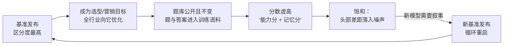
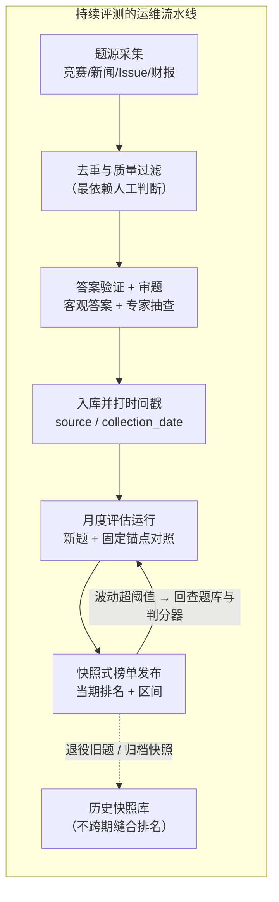

# 16. 持续更新评测：当题库本身成为流水线

> **如果只读一节**：读 12.2 的 Goodhart 闭环与 12.6 的"持续评测的代价"。持续评测不是"更高级的基准"，而是一种运营模式：**它把防污染从"出题时的自觉"变成"运维时的机制"，代价是要永久养一条题源流水线、接受分数波动，并放弃跨期可比性**。看清这三个代价，再决定要不要自建。

## 16.1 本章目标与读者

**前置知识**：读完第 10 章（AIME 与 FrontierMath）、第 11 章 7.4（LiveCodeBench 三窗口设计）。本章对 LiveCodeBench 只讲"运维面"——窗口协议与选窗战争见 7.4.3，本章不再重复。

读完后你能：

- 用 Goodhart 闭环解释"静态基准必然饱和"不是意外而是机制，并说出 GSM1k 实测的"背题分"有多大
- 拆解 LiveBench 的月度换题机制：题源从哪来、判分为什么不依赖 LLM 裁判、榜单怎么运维
- 区分三条持续评测路线的取舍：换题（LiveBench）、时间窗（LiveCodeBench / SWE-bench Live）、保密出题（FrontierMath）
- 说清持续评测的三个代价：出题成本、分数波动、跨期不可比
- 用三步法给自己的业务搭一条可持续运营的评测流水线，并用代码实现分层报告与波动监控
- 掌握四类"刷榜检测"手段，判断一个模型的分数跃升是能力还是记忆

## 16.2 概念引入：静态基准为什么必然饱和

先给出机制，再给证据。

**Goodhart 定律**：当一项测量成为优化目标，它就不再是好的测量。静态基准从发布那天起就在走向失效，原因是一条闭环：



**前端类比**：把"单元测试覆盖率 90%"写进 KPI，三个月后团队产出了一堆没有断言的测试——覆盖率数字维持 90%，测试的保护力归零。指标本身没错，错在它被当成了无监督的目标函数。

这条闭环不是理论推测，是被实测量化过的。Scale AI 的 GSM1k 实验（2024-05）按 GSM8k 的风格与复杂度**重写**了一套同考纲新题，让同一批模型做原卷和新卷（来源：论文 arXiv:2405.00332）：

- 领先模型在两套题上的分数差**最高 8 个百分点**（摘要口径）；Mistral 与 Phi 家族掉分接近 10%（正文口径）；
- 模型生成 GSM8k 题目的概率与掉分幅度正相关（Spearman r² = 0.36）——指向"部分记住了原题"而非能力差异；
- 对照组里，Gemini、GPT、Claude 等前沿闭源模型掉分很小——说明这道题不是无解的，只是被针对性优化过的模型族踩了坑。

**分数的工程分解**：任何静态基准分数 = 能力分 + 记忆分，且记忆分随时间只增不减。第 10 章 HumanEval 从门面到退场、MMLU 的协议分裂（5.2.4），都是这条闭环的不同阶段。

持续评测的思路因此不是"把题出得更难"，而是**把题库变成流水线的一部分**：让"新题注入"成为运维动作，让"题目发布时间"成为协议字段。

## 16.3 LiveBench 深拆：月度换题机制

> LiveBench（2024-06）= 每月从近期公开来源抽取新题、全部采用客观判分的综合基准，自称 contamination-limited（污染受限）（来源：论文 White et al., arXiv:2406.19314 与官网 livebench.ai）。

### 16.3.1 机制三件套

**一、题源全部是"近期发布"的真实材料**。题目不是模型生成或人工凭空写的，而是从有时间戳的来源抽取（来源：论文口径）：

| 题源 | 产出题型 | 更新节奏 |
|---|---|---|
| 数学竞赛（IMO / AIME / AMC / HMMT 等） | 数学推理 | 随赛事（年度/双年） |
| Codeforces / LeetCode 新赛题 | 代码 | 每周 |
| 近期 arXiv 论文 | 摘要改写的推理/分析题 | 持续 |
| 近期新闻、颁奖结果 | 时效性知识与语言任务 | 持续 |
| LSAT 等近期考试 | 逻辑推理 | 随考试周期 |

**前端类比**：与其防学生背题，不如每月用上周刚发生的时事出一套卷——背无可背。

**二、全部客观判分，不用 LLM 裁判**。这是 LiveBench 论文最值得抄的设计决策：每道题都有可机器验证的答案（数值、程序输出、选项），因此榜单不受裁判模型能力与偏差影响。动机正是第 17 章的四偏差实验结论——裁判自身能力是天花板，在难题上裁判先崩。代价是任务类型受限：开放写作类任务被排除在外，因为它们没有客观答案。

**三、按月发布新题、官网滚动快照**。每次发布是一个"当期榜单"，旧题退役、新题入库，题目数量与类别随更新变化（官网当前口径为 7 个任务类别、约 23 个客观任务，以 site 当前状态为准）。

### 16.3.2 厂商采用记录与它的定位

- **阶跃星辰（Step）是国内唯一把第三方防污染榜单当官方营销主战场的厂商**：Step-2 曾位居 LiveBench 综合全球第五、国产第一，指令跟随（IF）分项 86.57 居全榜第一（来源：第三方榜单经媒体转载，转述口径——本仓未抓取到厂商自建表）。它的打法是"借榜发声"：用 LiveBench 的机制背书替代自建协议，代价是无法展示自己的协议细节（与 DeepSeek 的"自建协议"路线形成对照，锚点原型分析见第 8 章 14.3）。
- 其余抓取样本厂商的旗舰发布正文均未以 LiveBench 为门面——它更多是中立第三方与媒体的比较基准。

**局限**：题源分布 = 竞赛题 + 新闻 + 论文摘要，与真实工作负载（写需求文档、改线上 bug）相关性弱；月度换题让"当期榜单"与"三个月前的榜单"不可比（见 12.6.3）。

## 16.4 SWE-bench Live 与 LiveCodeBench：运维面

第 11 章已讲过两者的协议设计（7.4 的三窗口、7.5 的 SWE-bench harness），本节只讲把它们"养起来"要做什么。

### 16.4.1 SWE-bench Live：一条 issue 采集流水线

> SWE-bench Live = 持续从 GitHub 抓取新 Issue 构建评测任务，题目晚于被测模型的训练截止（来源：swebench.com/live 与调研记录；截至 2025-06 约 2,500 题）。

与静态的 Verified 相比，运维面多了三件持续工作：

1. **采集**：按仓库与标签持续抓取新 Issue 及其修复 PR，保持题库领先于主流模型的训练截止；
2. **过滤**：真实 Issue 里大量是"环境问题 / 重复提交 / 无法复现"，要按"有对应 PR、有可运行测试"的门槛筛——这一步的质量决定题库质量，是整条流水线最依赖人工判断的环节；
3. **环境维护**：每道题要能重建当时的仓库环境（第 11 章 7.5.3 的三层镜像），上游仓库持续演进，镜像与依赖要跟着维护。

**分数落差是它的诚实之处**：同类模型在 Live 上通常比 Verified 低约 20 个百分点（来源：调研记录，Claude 3.7 口径 Live 约 45% vs Verified 62.3%，详见 7.5.5）。这个落差里同时包含"训练污染"与"新 Issue 更难/更杂"两个因素——不要把它全部读成污染，也不要全部读成难度。

### 16.4.2 LiveCodeBench：滚动采集的工程纪律

运维要点三条（窗口协议见 7.4，此处不重复）：

1. **采集节律**：每周从 LeetCode / Codeforces / AtCoder 收录新赛题，每月新增约 50-100 题，v6 累计已超 1,500 题（来源：官方仓库 livecodebench.github.io 与调研记录）；
2. **时间戳即协议**：每题带发布日期（contest_date），任何评测报告必须声明使用的窗口——漏写窗口的分数等于没写温度参数的分数；
3. **版本化快照**：官方按 v5 / v6 等版本切分题库，让"跨期比较"至少有明确锚点——小米 MiMo 在同一张表里并报 v5 与 v6（来源：arXiv:2505.07608），就是在自证"不是只在旧题上强"。

两条路线对照：SWE-bench Live 押注"真实工程负载"（代价是环境维护重），LiveCodeBench 押注"客观判分 + 稳定节律"（代价是竞赛题分布窄，不代表工程代码能力）。

## 16.5 FrontierMath：保密出题路线的代价

> FrontierMath（Epoch AI，2024-11）= 由 60 余位专业数学家命制的研究级数学题，题目私有、按 Tier 分层、持续新增，防污染设计推到极端（来源：epochai.org/frontiermath；第 10 章 6.8 已详述争议，本节讲机制与代价）。

三条路线里它是唯一选了"保密"的：

| 路线 | 代表 | 防污染手段 | 代价 |
|---|---|---|---|
| 换题 | LiveBench | 题目晚于训练 + 月度注入 | 题源窄、跨期不可比 |
| 时间窗 | LiveCodeBench / SWE-bench Live | 题目全公开 + 发布时间晚于训练截止 | 需持续采集与版本化 |
| 保密出题 | FrontierMath | 题目私有 + 保留集验证 | 信任押在运营方独立性上 |

保密路线把"题不会泄"做到了机制上限，同时把全部信任成本转移给了评测机构的治理结构。2025 年 1 月爆发的争议正好踩中这一点：OpenAI 曾委托制作 300 道题并拥有访问权，而这一资助关系在公布 o3 结果（宣称 FrontierMath 得分超 25%）时未及时披露；Epoch 独立复测公开版 o3 约 10%，与宣称存在数倍差距（来源：Epoch AI 官方澄清与多家媒体报道，转述口径；完整时间线见第 10 章 6.8）。此后主流厂商旗舰发布均不再引用该基准。

**给评测设计者的三条教训**：

1. 防污染的三条路线没有免费午餐：换题牺牲题源宽度，时间窗牺牲隐私性，保密牺牲公信力结构；
2. **资助关系必须与分数同时披露**——这是评估机构治理的最低线，和学术论文的利益声明同级；
3. 保密出题的边际成本极高（专业数学家命制 + 审核答案），意味着它的规模永远上不去，只能当"天花板探针"而不是"常规标尺"。

## 16.6 持续评测的代价

持续评测解决了污染，但引入三笔新的账。做自建评测之前，先把这三笔账算清楚。

### 16.6.1 出题成本：题库是消耗品

静态基准一次投入、长期使用；持续评测的题库是**消耗品**，每月要补新题，每道新题的成本结构是：

| 环节 | 静态基准 | 持续评测 |
|---|---|---|
| 出题 | 一次性 | 每月持续投入（人工/半自动抽取） |
| 答案审核 | 一次性 | 每月持续（新题答案要验证） |
| 判分器维护 | 稳定 | 随题型增加而扩展 |
| 跨期基线 | 不需要 | 需要固定锚点模型做对照 |
| 总趋势 | 成本递减 | 成本恒定，停更即退化 |

最后一行是关键：**持续评测停止运营的那一刻，它就退化回普通静态基准**——而且比从未声明过"防污染"的基准更糟，因为它带来的信任溢价瞬间作废。这也是第 11 章 7.4.4 说的"持续注入新题 = 榜单生命线"的镜像。

### 16.6.2 分数波动：小题库 + 高方差 = 排名噪声

持续评测的题库天然偏小（月度新题量有限），而小题库叠加模型输出的随机性，波动会大到淹没名次。最直接的证据来自厂商自我批判：Seed-Thinking-v1.5 技术报告明确写"同一模型两次运行的分数差可达 10 分"，并因此指出 AIME 每年 30 题的高方差"不足以区分顶级模型"，进而自建了 100 道题的 BeyondAIME（来源：arXiv:2504.13914 正文）。

工程对策三条（都来自抓取到的厂商实践）：

1. **多次采样平均**：MiniMax-M1 对 AIME 与 GPQA 采用 32 次采样平均（来源：arXiv:2506.13585 协议节）；
2. **报区间而不是单点**：小题库评测的结论应以"N 次运行、区间 [a, b]"呈现；
3. **固定锚点**：每期榜单保留一组固定对照题（或对照模型），用于把"模型变强"和"这期题变难"区分开。

### 16.6.3 跨期不可比性：换题之后，历史曲线断裂

月度换题的直接后果是：**3 月榜单的第一名和 6 月榜单的第一名，比的不是同一套题**。LiveBench 的每期榜单是一个快照，官方不做跨期排名缝合；LiveCodeBench 用版本化（v5/v6）承认这一点。



读数与使用上的三条纪律：

1. **只比当期快照内的排名**，不把两个月榜单的名次连成"上升/下降"曲线；
2. **要跨期就自己锁子集**：固定一组题目（或固定一个对照模型）横跨各期，用它来归一化；
3. **警惕"分数突然跳升"**：新模型在某期榜单上意外大幅领先时，第一反应不是惊叹，而是回查题库是否被提前接触（见 12.6.4）。

### 16.6.4 刷榜检测的四类手段

工程上可用的四类检测（实践归纳，无单一出处）：

1. **时间戳核对**：模型训练截止日期是否晚于题目发布日期——最基本的合格线；
2. **题目检索**：监控新题是否在发布前出现在公开渠道（竞品数据集、爬虫站、训练语料集合）；
3. **隐式对照**：保留一批"难度等价但未公开"的题目，比较模型在公开题与隐藏题上的分差——分差显著即提示记忆；
4. **分布对比**：新题与旧题的分数应平滑过渡；如果模型在旧题上远高于同源新题，且差距集中在特定题型，是记忆而非能力的典型形态。

这四条其实是 GSM1k 实验的日常化版本：GSM1k 用一次性的大对照量化了"背题分"，你可以用持续运营的隐藏题集把同样的检测做成月度巡检。

## 16.7 自建持续评测：三步法

公开榜单解决不了你业务上的问题——你的"新题"来自业务日志、用户反馈和真实工单。三步法把第 15 章 11.2 的数据结构延伸成一条能长期跑的流水线。

**第一步：持续抓数据源**。从业务日志（脱敏）、用户反馈、真实工单里抽取有明确预期答案的任务；按月固定节律，不做"想起来才补题"。

**第二步：时间戳标注**。每道题必须带 `collection_date`（抓取时间）、`source`（来源）与 `riskTier`（风险分层，沿用第 15 章）；评估时按时间过滤，保证"模型训练截止之后抓的题"才是可信评估段。

**第三步：月度评估 + 分层报告**。每月跑一次"新题 + 固定锚点旧题"，输出当期快照与波动监控，波动超阈值触发回查。

```typescript
// live-evaluator.ts —— 自建持续评测的最小实现
// 运行命令：OPENAI_API_KEY=... npx tsx live-evaluator.ts（需联网、付费）

interface LiveTask {
  id: string;
  input: string;
  expected: string;
  collectionDate: string;   // 关键字段：抓取时间（ISO 日期）
  riskTier: "low" | "medium" | "high";
}

interface MonthlyReport {
  newTaskScore: number;        // 本月新题分数：反映"当前真实能力"
  anchorScore: number;         // 固定锚点题分数：反映"相对上月的变化"
  drift: number;               // 两者差值：异常漂移预警信号
  highRiskBlocked: string[];   // 高风险失败题（沿用第 15 章一票否决）
}

async function runMonthly(tasks: LiveTask[], cutoff: string): Promise<MonthlyReport> {
  // 只用 cutoff 之前抓的题做锚点（训练截止），之后抓的题当新题
  const anchor = tasks.filter(t => t.collectionDate <= cutoff).slice(0, 100);
  const fresh  = tasks.filter(t => t.collectionDate > cutoff);
  const score  = (ts: LiveTask[]) =>
    ts.length ? (await evaluateBatch(ts)).filter(r => r.pass).length / ts.length : 0;

  const anchorScore = await score(anchor);
  const newTaskScore = await score(fresh);
  return {
    newTaskScore,
    anchorScore,
    drift: newTaskScore - anchorScore,
    highRiskBlocked: fresh.filter(t => t.riskTier === "high")
      .filter(t => !evaluateOne(t).pass).map(t => t.id),
  };
}
// 读数规则：
// 1. 对外汇报用 newTaskScore（新题）——它不受历史污染影响；
// 2. drift 绝对值超过预设阈值（如 5 个点）时，先回查题库与判分器，再归因模型；
// 3. highRiskBlocked 非空直接阻止上线，与总分无关。
```

这套实现刻意做小的三件事，就是 12.6 三笔代价的对冲：锚点题对冲跨期不可比、新题分数对冲污染、drift 预警对冲波动被误读。

## 16.8 验收自测

1. **选择**：GSM1k 实验证明了什么？
   - A. GSM8K 的题目出错了
   - B. 同考纲新题上的分差最高约 8 个百分点，指向对原题的部分记忆
   - C. 闭源模型比开源模型数学差
   - D. 小学数学题太简单没有评测价值

2. **选择**：LiveBench 刻意不用 LLM 裁判的原因是？
   - A. 成本太高
   - B. 裁判自身能力是天花板，在难题上会先崩，且带四类偏差
   - C. LLM 裁判速度慢
   - D. 为了支持更多题型

3. **选择**：FrontierMath 争议的核心教训是？
   - A. 数学题不该由数学家出
   - B. 保密路线把信任押在运营方独立性上，资助关系必须与分数同时披露
   - C. 25% 的分数太低
   - D. 私有题库没有价值

4. **简答**：Seed-Thinking 报告写"两次运行分差可达 10 分"，这条自我批判对持续评测的运营提出了什么要求？给出至少两条工程对策。

5. **简答**：为什么"持续评测停止更新的那一刻，它比普通静态基准更糟"？用信任溢价解释。

6. **实操**：按 12.7 三步法搭一条月度评测流水线：从你的业务日志抽 100 道题打时间戳，跑一次并输出 `newTaskScore / anchorScore / drift / highRiskBlocked` 四个数；然后人为把锚点题难度调高，观察 drift 的变化并解释它揭示了什么。

## 16.9 📋 本章 Cheat Sheet

| 概念 | 一句话 | 详见 |
|---|---|---|
| Goodhart 闭环 | 成为目标的测量必然失效，基准生命周期由此驱动 | §16.2 |
| 记忆分 | 静态基准分数 = 能力分 + 记忆分，后者只增不减 | §16.2 |
| LiveBench | 月度换题 + 全客观判分，不用 LLM 裁判 | §16.3 |
| 换题 / 时间窗 / 保密 | 三条防污染路线，各有代价 | §16.5 |
| SWE-bench Live | 真实 Issue 流水线，比 Verified 低约 20 点 | §16.4.1 |
| LiveCodeBench | 每月 50-100 题，时间戳即协议 | §16.4.2 |
| 出题成本 | 题库是消耗品，停更即退化 | §16.6.1 |
| 分数波动 | 小题库 + 高方差，报区间不报单点 | §16.6.2 |
| 跨期不可比 | 每期榜单是快照，跨期要自锁子集 | §16.6.3 |
| 刷榜检测 | 时间戳 / 检索 / 隐式对照 / 分布对比 | §16.6.4 |
| 三步法 | 抓数据源 → 时间戳标注 → 月度评估 | §16.7 |

## 16.10 ⚠️ 5 个常见错误

1. **把静态基准分数当能力上限** — GSM1k 证明其中含最高约 8 个点的记忆分；跨模型比较要看同源新题上的表现。
2. **只看 LiveBench 当期名次编趋势** — 每期题库不同，跨期排名不可比；要趋势就自己锁一组固定子集。
3. **忽视采样方差** — 小题库评测单次运行的波动可达数点甚至 10 分；结论必须基于多次采样的区间。
4. **自建持续评测只建不养** — 停止注入新题的"防污染评测"立即退化回静态基准，且带走了原本的信任溢价。
5. **把 Live 分数全部读成污染差距** — SWE-bench Live 与 Verified 的约 20 点落差同时包含"污染"与"新题更杂"两个因素，先看新题失败样本再归因。

## 16.11 延伸阅读

⭐⭐⭐
- [LiveBench 论文](https://arxiv.org/abs/2406.19314) — contamination-limited 与客观判分设计
- [LiveCodeBench 论文](https://arxiv.org/abs/2403.07974) — 时间窗切分防污染的原始实现
- [GSM1k 论文](https://arxiv.org/abs/2405.00332) — 同考纲新题对照实验与"背题分"量化

⭐⭐
- [LiveBench 官网](https://livebench.ai/) — 每月快照榜单与任务类别（计数随更新变化）
- [LiveCodeBench 官网](https://livecodebench.github.io/) — 版本化窗口（v5/v6）与题目时间戳
- [SWE-bench Live](https://www.swebench.com/) — 真实 Issue 持续采集
- [Seed-Thinking-v1.5 技术报告](https://arxiv.org/abs/2504.13914) — 对评测方差与 AIME 区分度的自我批判

⭐
- [FrontierMath（Epoch AI）](https://epochai.org/frontiermath) — 保密出题路线与 Tier 分层
- [Epoch AI 关于 OpenAI 与 FrontierMath 的澄清](https://epoch.ai/latest/openai-and-frontiermath) — 资助关系披露事件的官方说明
- [污染检测综述](https://arxiv.org/abs/2406.04244) — 检测方法与"没有方法在所有条件下可靠"的结论
