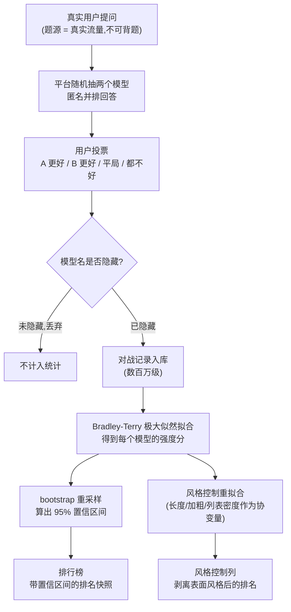
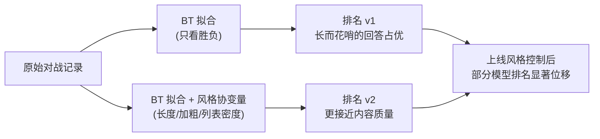

# 17. 人类偏好评估:MT-Bench、LLM-as-Judge 与 Chatbot Arena

> **如果只读一节**:第 9-16 章的基准测的是"答对没有",本章的基准测的是"哪个回答让人更舒服"。三个核心构件:MT-Bench(GPT-4 当裁判的 80 题多轮考卷)、LLM-as-Judge 四大偏差(位置/冗长/自增强/能力天花板,全部有实验数据)、Chatbot Arena(真实人类盲评 + Bradley-Terry 排名,本章机制深拆的重点)。
>
> **前置知识**:读完第 4 章(标准评估流水线)与第 16 章(动态基准)后可读。本章与第 18/19 章的分工:本章讲"偏好类基准是什么、裁判为什么会判错";第 5 章讲"怎么把 LLM 裁判写进你的流水线并做偏差控制";第 6 章讲"怎么组织一场人类评估"。

## 17.1 本章目标与读者

读完后你能:

- 说清"偏好评估"与"正确性评估"的边界,知道哪些任务只能用前者
- 拆解 MT-Bench 的题目构成与 GPT-4 裁判机制,知道它为什么诞生、又为什么退场
- 用实验数据描述 LLM-as-Judge 的四大偏差,并在自己的评估流水线里针对性设防
- 从投票数据一路讲到排名:Arena 的盲评流程、Bradley-Terry 模型、bootstrap 置信区间、风格控制与刷票防御
- 读懂榜单上"Grok 3 Elo 1402""Gemini 2.5 Pro 空降第一"这类数字背后的统计结构(来源:各厂商发布文,2026-08-28 抓取,详见 13.5)

## 17.2 为什么需要偏好评估

### 17.2.1 学术基准的结构性盲区

MMLU 是四选一,GSM8K 答案是一个数字,HumanEval 靠单元测试判分——它们的共同前提是:**存在唯一正确的答案**。但 2022 年 11 月 ChatGPT 上线后,评估对象突然变成了对话模型,三个问题随之暴露(来源:research/academic-history.md §9.1):

1. **模型会背题**:开放模型在互联网文本上训练,而 GLUE/MMLU 的题目就在互联网上;
2. **对话质量没有标准答案**:用户问"帮我写封道歉邮件",不存在一个 n-gram 参考答案,BLEU/ROUGE 这类字符串重叠指标完全失效;
3. **训练目标就是偏好**:RLHF(用人类评分当老师,让模型按评分高低调整自己)训出来的模型,优化目标就是"人更喜欢哪个回答",评估却还在测"答对没有"——测量目标与训练目标脱节。

2023 年上半年的现实是:各家都在发对话模型,却没有一家能拿出"谁的对话更好"的可信证据。这就是 Vicuna/Alpaca 时代的**评估真空**,本章所有基准都是这个真空期的产物。

**前端类比**:Lighthouse 100 分不能证明产品好用——它测的是实验室条件下的代理指标;真实体验要看 RUM 数据和用户满意度。MMLU 之于对话模型,就像 Lighthouse 之于你的站点:必要,但远远不够。

### 17.2.2 偏好评估要回答的问题

偏好评估测的是成对比较下的"人更想要哪个":

| 问题类型 | 正确性评估能否覆盖 | 偏好评估能否覆盖 |
|---|---|---|
| "2023 年法国总统是谁" | 能(唯一答案) | 能,但绕远 |
| "帮我写一封得体的道歉邮件" | 不能(无标准答案) | 能(A/B 二选一) |
| "扮演苏格拉底与我对话" | 不能 | 能 |
| "这段数学证明对吗" | 能(规则判分) | 不该用它(见 13.4.4) |

判断口诀:**有唯一答案的任务交给规则判分;没有唯一答案、但可以两两比较的任务,才是偏好评估的主场。**

## 17.3 MT-Bench 深拆:80 道题与 GPT-4 裁判

**一句话**:80 道多轮开放问题,8 个类别各 10 题,用 GPT-4 当裁判打分——LLM-as-Judge 范式的奠基作,也是偏差研究最多的实验床。

- 时间:2023 年 6 月 9 日提交论文(arXiv:2306.05685,NeurIPS 2023);
- 当事人:Lianmin Zheng、Wei-Lin Chiang、Ying Sheng 等(UC Berkeley、CMU、Stanford、UCSD,LMSYS Org);
- 出处:*Judging LLM-as-a-Judge with MT-Bench and Chatbot Arena*。

### 17.3.1 80 道题怎么构成

8 个类别 × 各 10 题,全部是**多轮**对话(用户会在第一轮回答后追问),类别覆盖:

| 类别 | 测什么 | 代表题型 |
|---|---|---|
| Writing | 写作 | 写邮件、写博客 |
| Roleplay | 角色扮演 | 扮演特定人物对话 |
| Extraction | 信息抽取 | 从文本提取结构化信息 |
| Reasoning | 推理 | 逻辑题 |
| Math | 数学 | 计算与推理 |
| Coding | 编程 | 写函数、改 bug |
| STEM | 科学 | 解释概念 |
| Humanities | 人文 | 分析文本 |

每一类都不存在唯一正确答案——这正是它必须依赖裁判的原因。第 81 题原题如下(来源:arXiv:2306.05685 图 1 与 FastChat 仓库 question.jsonl,未改写):

> Compose an engaging travel blog post about a recent trip to Hawaii, highlighting cultural experiences and must-see attractions.

注意它的两个特征:开放式(没有参考答案)、多轮友好(追问可以是"把预算改成 1000 美元再写一版")。

论文同时发布了配套数据:**3K 条专家投票**与 **30K 条 Arena 偏好对话**——下一节的四大偏差实验,全部建立在这份数据上(来源:arXiv:2306.05685)。

### 17.3.2 裁判怎么打分

论文给出两种裁判协议:

1. **单回答打分(single-answer grading)**:裁判给一个回答打 1-10 分。FastChat 官方实现采用这种,因为它从根上避开了"两个回答谁放前面"的顺序效应(来源:FastChat llm_judge 文档;arXiv:2306.05685);
2. **两两比较(pairwise)**:裁判看问题 + 两个回答,输出 A 胜/B 胜/平。更贴近人类判断习惯,但会撞上位置偏差(见 13.4.1)。

两种协议都要求裁判具备**判别能力**——OpenAI 官方评估指南也持同一立场:LLM 更擅长判别而非生成,评估设计应偏向 pairwise 比较或按明确标准打分(来源:developers.openai.com/api/docs/guides/evaluation-best-practices)。

### 17.3.3 历史地位:从标配到退场

MT-Bench 是 Vicuna 时代的发布标配:2023 年开源对话模型几乎人手一个 MT-Bench 分数,就像今天人人报 GPQA(来源:research/vendor-blog-evals.md §4.0 生命周期框架)。但它的有效寿命很短:

- 80 题样本量小,单题分数方差大;
- 题目公开后进入训练语料的风险与日俱增;
- 位置被 **AlpacaEval 2.0 LC**(805 题长度控制,见 13.6)与 **ArenaHard**(500 道真实难题,见 13.7)接管。

证据:2026-08-28 抓取的 13 家头部厂商旗舰发布材料中,没有任何一家在评测表里引用 MT-Bench;DeepSeek-R1(2025-01)的偏好类评测用的是 AlpacaEval 2.0 LC 与 ArenaHard(来源:research/vendor-blog-evals.md §4.2 覆盖矩阵与 arXiv:2501.12948 主表)。

它真正的遗产不在榜单,而在方法:四大偏差实验让整个行业第一次量化地知道"用 LLM 当裁判会错在哪"。

## 17.4 LLM-as-Judge 四大偏差:实验数据

以下数字全部来自 Zheng et al. 2023 论文正文(来源:arXiv:2306.05685 v4),这是后来所有 LLM 裁判工程的风险清单。

### 17.4.1 位置偏差:交换顺序,判决翻转

**实验设计**:把 A、B 两个回答的顺序对调再问一次,统计裁判的判决是否翻转。

**数据**:所有被测裁判都表现出强位置偏差,多数偏爱第一个位置;**只有 GPT-4 能在 60% 以上的对调中给出一致判决**,其余裁判的翻转率都远超 40%。另一个细节:Claude-v1 还表现出"名字偏差"——把助手改名为 Assistant A/B 会影响判决。

**前端类比**:code review 时第一个 PR 总是更容易被 approve——审查顺序本身污染了结论。

**缓解**:同一对回答按两种顺序各判一次,只有两种顺序下结论一致才采纳(交换协议):

```typescript
// swap-judge.ts — 交换协议:两种顺序各判一次,只采纳一致结论
// 运行:npx tsx swap-judge.ts(需 OPENAI_API_KEY,付费)
async function judgeDebiased(
  q: string,
  a: string,
  b: string,
): Promise<"A" | "B" | "tie"> {
  const [r1, r2] = await Promise.all([
    callJudge(q, a, b), // 顺序 1:A 在前
    callJudge(q, b, a), // 顺序 2:B 在前
  ]);
  if (r1 === "A" && r2 === "B") return "A"; // 两种顺序都判 A → 采纳
  if (r1 === "B" && r2 === "A") return "B"; // 两种顺序都判 B → 采纳
  return "tie";                             // 翻转或双平 → 不下结论
}

async function callJudge(q: string, first: string, second: string): Promise<"A" | "B" | "tie"> {
  const res = await openai.chat.completions.create({
    model: "gpt-4o-2024-08-06", // pin 快照版本,不要用漂浮别名(见第 4 章 3.7.1)
    temperature: 0,             // 评分要求稳定,禁用随机采样
    response_format: { type: "json_object" },
    messages: [{
      role: "user",
      content: `Question: ${q}\n\n[回复一]:${first}\n\n[回复二]:${second}\n\n哪个更好?输出 JSON:{"winner":"A"|"B"|"tie"}`,
    }],
  });
  return JSON.parse(res.choices[0].message.content ?? "{}").winner ?? "tie";
}
```

代价是裁判调用量翻倍。更彻底的替代方案是放弃 pairwise、改用单回答打分——FastChat 的 MT-Bench 实现正是这么做的。

### 17.4.2 冗长偏差:把答案写长就赢

**实验设计**:把一段回答扩写得更长更啰嗦(内容实质不变,即"重复列表攻击"),看裁判是否认为变好了。

**数据**:GPT-3.5 与 Claude-v1 都会偏好更长的重复性回答——攻击成功;只有 GPT-4 识别了该攻击。裁判对完全相同的两个回答能正确判平,但挡不住更高级的扩写(来源:arXiv:2306.05685)。

**前端类比**:PR 里把 3 行实现展开成 300 行模板代码,reviewer 一眼觉得"工作量很足"——长度不是质量的代理指标。

这个偏差的产业级后果是 AlpacaEval 2.0 专门做了长度控制(见 13.6),以及 Arena 后来上线风格控制(见 13.5.4)。

### 17.4.3 自增强偏差:裁判偏爱"自己人"

**数据**:GPT-4 当裁判时,给自家回答的胜率高出约 **10%**;Claude-v1 给自家的高出约 **25%**。但论文同时诚实地指出:由于数据量小、模型间差距小,**无法判定该偏差是否显著成立**,留作未来工作(来源:arXiv:2306.05685)。

这条要按"已知风险 + 证据强度有限"来读:方向上符合直觉(利益相关方的评价性结论必须降级处理),幅度上不要当作精确数字引用。

**工程结论**:裁判模型与被评模型不同源;做不到时,用多裁判投票 + 人工抽样校准兜底(第 5 章给出完整实现)。

### 17.4.4 能力边界:数学判分 91.3% 失败率

这是四条里最容易被低估的一条:**裁判自身的能力是评估的天花板**。

**数据**:10 道数学题上,当裁判需要判断"这个错误答案是否正确"时,Claude-v1 与 GPT-3.5 的失败率均为 **91.3%**,GPT-4 为 **8.7%**。换不同提示(默认 / 思维链 / 提供参考答案)后,GPT-4 的失败从 14/20 降到 6/20 再到 3/20(来源:arXiv:2306.05685)。

**推论**:用弱模型当裁判去评强模型,评出来的不是信号而是噪声;数学与推理类任务应该交给规则判分(精确匹配,或用 SymPy 这类符号计算库做数学等价性校验),而不是任何 LLM 裁判。第 5 章的"金科玉律"——能用规则评的,不用 LLM——就是从这里来的。

### 17.4.5 正面结果:为什么行业仍然敢用

偏差清单很长,但同一篇论文也给出了使用 LLM 裁判的正当性依据:

| 指标 | 数值 | 含义 |
|---|---|---|
| GPT-4 裁判 vs 人类专家一致率(去平局) | 约 85% | 高于人类彼此之间 |
| 人类彼此一致率 | 约 81% | 人类自己也不完全一致 |
| 人类认为 GPT-4 判断"合理"的比例 | 75% | 大多数场景可接受 |
| 人类因此改变自己原选择的比例 | 34% | 裁判确实在影响人 |

(来源:arXiv:2306.05685 v4 正文)

**前端类比**:LLM-as-Judge 相当于把人工 code review 外包给一个自动 review bot——省 10 倍成本,但你要像审查 review 工具一样审查它的偏差谱系(顺序、长度、亲缘、能力),并定期用人工抽样校准。

## 17.5 Chatbot Arena 机制深拆

**一句话**:真实人类匿名盲评 + 统计模型排名。它测的是"真实用户在真实提问分布下的偏好",这是唯一一个厂商无法自控评测集的活榜单(来源:research/vendor-blog-evals.md §G)。

先看数据流全景,再逐层拆:



(流程依据:LMSYS 创始博客 2023-05-03 与 2023-12-07 排名方法更新博客;风格控制细节见 lmsys.org 博客系列与 arXiv:2507.08983 对该流程的描述。)

### 17.5.1 真实人类盲评流程

- **2023-05-03 上线**,创始博客基于约 4.7K 投票;此后投票量增长到数百万级(来源:lmsys.org/blog/2023-05-03-arena/)。
- **盲评是方法论底线**:只统计模型名隐藏时的投票。用户看到的是两个匿名回答,投完票才揭晓身份——这消除了"因为它是 GPT-4 所以投它"的品牌效应(来源:LMSYS 创始博客)。
- **票型四种**:A 更好 / B 更好 / 平局 / 都不好。平局与"都不好"对区分强弱模型贡献有限,排名计算主要依赖非平局对战。
- **优势与代价**:题目来自真实用户,结构性免疫背题;但大众用户的问题分布偏简单,专业知识题覆盖不足——Arena 高分不等于专业任务强。

**前端类比**:这不是考卷,而是**隐盲 A/B 测试 + 天梯**。用户是真实流量,每张票是一次 A/B 实验的转化事件;后面的排名算法,和你在实验平台里对各版本做 pairwise 胜率归一化完全同构。

### 17.5.2 从 Elo 到 Bradley-Terry

Arena 最初用国际象棋的 Elo 在线更新;**2023-12-07 起改为对全量对战历史拟合 Bradley-Terry 模型**(来源:lmsys.org/blog/2023-12-07-leaderboard/)。要理解这次切换,先看清两者的关系:

**先翻译数学**。Bradley-Terry 假设每个模型有一个潜在强度值,模型 i 击败模型 j 的概率是强度差的单调函数:

```text
P(i 胜 j) = e^si / (e^si + e^sj) = 1 / (1 + e^(sj - si))
```

再看你已经见过的 Elo 预期胜率公式(第 6 章 19.4):`E_A = 1 / (1 + 10^((R_B - R_A) / 400))`。把 `R_i = 400 · si / ln(10)` 代入,两个公式**完全相同**。也就是说:Elo 和 BT 共用同一个概率模型,差别全在**估计过程**上:

| 维度 | 在线 Elo | Bradley-Terry(批处理) |
|---|---|---|
| 更新方式 | 每场对战增量更新 | 对全量历史一次性求解 |
| 顺序敏感性 | 有:同样的对战按不同顺序输入,终分不同 | 无:与输入顺序无关 |
| 超参数 | K 系数需人工设定 | 无,由数据决定 |
| 置信区间 | 难以给出 | 可用 bootstrap 直接得到(见 13.5.3) |
| 扩展性 | 难加协变量 | 可加入风格特征作协变量(见 13.5.4) |

切换的直接动机:投票量涨到几十万后,在线 Elo 对投票顺序敏感、排名不稳定;BT 拟合后排名与原 Elo 高度相关,但统计性质好得多(来源:LMSYS 2023-12-07 博客)。

BT 拟合的工程本质是**极大似然估计**:调整每个模型的强度,使"观察到的所有对战结果"出现的概率最大。下面是 30 行可运行的最小实现:

```typescript
// bt-fit.ts — 最小可运行的 Bradley-Terry 拟合(梯度上升版)
// 运行:npx tsx bt-fit.ts(无需联网/付费)

type Battle = { winner: string; loser: string };

const battles: Battle[] = [
  { winner: "A", loser: "B" }, { winner: "A", loser: "B" }, { winner: "A", loser: "C" },
  { winner: "B", loser: "C" }, { winner: "C", loser: "B" }, { winner: "A", loser: "B" },
];

function fitBT(battles: Battle[], steps = 5000, lr = 0.1): Record<string, number> {
  const models = [...new Set(battles.flatMap((b) => [b.winner, b.loser]))];
  const s: Record<string, number> = {};
  for (const m of models) s[m] = 0; // 初始强度全 0

  for (let t = 0; t < steps; t++) {
    const grad: Record<string, number> = {};
    for (const m of models) grad[m] = 0;
    for (const { winner, loser } of battles) {
      const pWin = 1 / (1 + Math.exp(s[loser] - s[winner])); // P(胜)
      grad[winner] += 1 - pWin; // 该赢的场没赢够概率 → 上调强度
      grad[loser]  -= 1 - pWin; // 该输的场概率偏高 → 下调强度
    }
    for (const m of models) s[m] += lr * grad[m];
  }
  return s;
}

// 映射到 Elo 尺度便于阅读:R = 400*s/ln(10) + 1000(基线平移)
const toElo = (s: number) => Math.round((400 * s) / Math.log(10) + 1000);

const s = fitBT(battles);
console.log(
  Object.entries(s)
    .map(([m, v]) => ({ model: m, strength: v.toFixed(3), elo: toElo(v) }))
    .sort((a, b) => b.elo - a.elo),
);
// 期望输出:A 明显最强,B 与 C 接近(B 只赢过 C 一次)
```

相比"按总胜率直接排名",BT 有一个关键优势:**能处理对手池不均衡**。新模型只打了 200 场、且对手恰好都是弱模型,裸胜率会被高估;BT 会把"它赢的是谁"折进强度估计。这正是 Arena 上新模型入场时排名仍相对公平的原因。

### 17.5.3 bootstrap 置信区间:为什么排名旁边有正负号

打开 Arena 排行榜,每个模型的分数旁边都跟着一个 ± 数字;厂商引用时只报主值——例如 Grok 3 上榜时的自报 Elo 1402(代号 chocolate,来源:x.ai/news/grok-3 正文)——而平台上这条记录真实的样子是"1402 ± 某个误差"。这个正负号来自 **bootstrap 重采样**:

1. 你只有一份对战记录,不知道"真实"排名;
2. 把这份记录**有放回地重抽**一份同大小样本,重新拟合一次 BT,得到一个排名;
3. 重复 1000 次,取排名分布的 2.5% 与 97.5% 分位,就是 95% 置信区间。

**前端类比**:这相当于"如果你重新收集一遍投票数据,排名可能漂多少"的经验估计——CI 宽 = 数据不足,区间重叠 = 两个模型不可区分。

```typescript
// bt-bootstrap.ts — 用 bootstrap 估计胜率的 95% 置信区间
// 运行:npx tsx bt-bootstrap.ts(无需联网/付费)

type Battle = 1 | 0; // 1 = 目标模型胜(此处简化为非平局对战)

function bootstrapWinRate(battles: Battle[], iterations = 10000, seed = 42) {
  let state = seed;
  const rand = () => (state = (state * 1103515245 + 12345) % 2147483648) / 2147483648;

  const rates: number[] = [];
  for (let i = 0; i < iterations; i++) {
    let wins = 0;
    for (let j = 0; j < battles.length; j++) {
      wins += battles[Math.floor(rand() * battles.length)]; // 有放回重抽
    }
    rates.push(wins / battles.length);
  }
  rates.sort((a, b) => a - b);
  const q = (p: number) => rates[Math.floor(p * rates.length)];
  return { lower: q(0.025), upper: q(0.975) };
}

// 例:100 场非平局对战里赢了 58 场
const battles: Battle[] = [...Array<Battle>(58).fill(1), ...Array<Battle>(42).fill(0)];
console.log(bootstrapWinRate(battles));
// 期望输出(种子固定):{ lower: 0.5, upper: 0.69 }
// 区间下界贴着 0.5 → "它比对手强"这个结论不成立,不要据此换模型
// 对照:把战绩改成 70 胜 30 负,区间变为约 [0.62, 0.80],才能说"更强"
```

官方提供了复现整个"BT + bootstrap"计算的 Colab notebook(来源:LMSYS 2023-12-07 博客附 Colab;统计框架见 arXiv:2412.18407)。

这个正负号还解释了厂商引用的一个细节:字节 Seed 团队在 Seed-Thinking 技术报告里明确写"Elo 是估计值,不可直接比较",并把"AIME 每年 30 题高方差、两次运行分差可达 10 分"列为自建新基准的动机(来源:arXiv:2504.13914 正文)。**凡是引用榜单名次的厂商,都在引用一个带误差棒的单次快照**——这句话反过来读就是:看到"Elo 第一"的营销口径,先找置信区间。

### 17.5.4 风格控制:一次排名洗牌事件

Arena 最大的方法论升级是**风格控制(style control)**。

**机制**:在 BT 模型中加入**风格协变量**——回答长度、加粗密度、列表数量等表面特征——重新拟合强度。本质是问一个反事实问题:"如果两个模型输出同样的长度、同样的排版,谁会赢?"(来源:lmsys.org 博客系列;arXiv:2507.08983 对该流程的描述;research/vendor-blog-evals.md §G)



**事件与意义**:风格控制上线后出现排名洗牌——靠长回答、重排版讨好投票者的模型名次下降,推理与知识类模型的 Arena 分与能力榜(GPQA/AIME 等)的相关性上升。它证实了一件事:此前的 Arena 分数里混有可观的"格式分"。

**厂商的双读法**:Google 在 Gemini 2.5 Pro 发布文里写"以显著优势登顶 LMArena,表明这是一个能力很强、风格质量也很高的模型"("debuts at #1 by a significant margin, indicating a highly capable model equipped with high-quality style",来源:blog.google,Gemini 2.5 发布文正文,2025-03)——同时主张"能力强"与"风格好"两个叙事,这是对双榜读法最自觉的利用。

**代价要说清**:任何统计控制都依赖建模假设,控制前后排名的位移本身也成为争议源。工程结论:**引用 Arena 时必须注明是原始榜还是风格控制榜**,两者是两个不同的测量。

### 17.5.5 刷票与防御

**已知风险**:2025 年 1 月论文《Vote Rigging on Chatbot Arena》证明,在 BT 排名机制下,攻击者用少量账号**定向刷特定对战**,即可推高目标模型的排名(来源:arXiv:2501.17858)。

**平台侧防御**(依据 LMSYS 公开方法):

1. 只统计模型名隐藏时的投票(盲评底线);
2. 对协同行为、异常集中的投票模式做检测与清洗;
3. 大样本稀释:数百万级投票总量使单点操纵的边际影响变小。

**读者侧防御**:把 Arena 名次当作"带误差棒、可能被操纵的快照",而不是真理。第 18 章的对账方法论给出系统性做法。

## 17.6 AlpacaEval 2.0:长度控制胜率

**一句话**:自动化版的 Arena——805 条固定指令,GPT-4 当裁判,输出长度控制(LC)后的胜率。

- 时间:AlpacaEval 2023-03(Stanford,805 条指令集,默认与 text-davinci-003 比较);2.0 长度控制版 2024-04(arXiv:2404.04475)(来源:research/academic-history.md §9.1);
- 与 Arena 的区别:题目固定可复现,但裁判是模型,继承 13.4 的全部偏差。

**LC 胜率的原理**:把"回答长度"等特征作为回归协变量,估计"**如果两个模型的输出一样长,谁会赢**"。前端类比:把"代码行数"放进回归,回答"如果两个 PR 行数相同,哪个更容易被 approve"——先剥离工作量差异,再看真实质量。

**为什么要专门做长度控制**:13.4.2 的重复列表攻击证明了裁判偏爱长回答;不控制长度,厂商只需要"把答案写长"就能刷分。

**真实数据**(来源:DeepSeek-R1 技术报告主表,arXiv:2501.12948,表 4):

| 模型 | AlpacaEval 2.0 LC 胜率 | ArenaHard(见 13.7) |
|---|---|---|
| DeepSeek-R1 | 87.6 | 92.3 |
| DeepSeek-V3 | 70.0 | 85.5 |
| o1-mini | 57.8 | 92.0 |
| Claude-3.5-Sonnet-1022 | 52.0 | 85.2 |
| GPT-4o-0513 | 51.1 | 80.4 |

这张表有两个值得停下来想的地方:

1. **LC 胜率上 R1(87.6)几乎是 GPT-4o(51.1)的 1.7 倍,但知识榜上两者接近**(R1 MMLU 90.8 vs o1-1217 91.8,同一张表)。差距主要来自偏好与风格层,不是知识层;
2. **DeepSeek 主动披露了两个模型的平均输出长度(约 689 / 2218 token)**,以自证没有利用长度偏置刷分(来源:arXiv:2501.12948)。厂商主动披露"我知道你们会质疑这个指标"——这种披露本身是读报告时的重要信用信号(第 8 章的"让步式披露"同理)。

另一个采用侧注脚:MiniMax-M1 的发布表**不用** AlpacaEval/ArenaHard,改用 MultiChallenge(44.7)作为对话能力指标(来源:arXiv:2506.13585)——LLM 裁判类评测的固有风险,是厂商绕开它们的常见理由。

## 17.7 ArenaHard 与 WildBench:离线复现 Arena

Arena 的痛点是**不可复现**:每次投票分布都不同,你无法在 CI 里重跑一个 Arena。于是有了把 Arena"离线化"的尝试。

### 17.7.1 ArenaHard

- **构成**:500 个从真实用户问题中筛出的困难问题 + GPT-4-1106 当裁判(来源:research/vendor-blog-evals.md §G);
- **动机**:固定题集 + 固定裁判 = 可复现的 Arena 代理;题目难度对齐"真实难题"分布,避免 MT-Bench 那种人人 9 分的饱和;
- **厂商采用记录**:DeepSeek-V3/R1 主表(85.5 / 92.3)、o1-mini 92.0、Claude-3.5-Sonnet-1022 85.2、GPT-4o-0513 80.4(来源:arXiv:2501.12948 表 4)。R1 与 o1-mini 在 ArenaHard 上基本打平,但在 AlpacaEval LC 上相差近 30 分——同是 LLM 裁判榜单,题目分布(困难真实问题 vs 开放指令)与裁判版本不同,结论就能差这么多。

### 17.7.2 WildBench

AllenAI 出品,从真实用户与 AI 的公开对话中收集开放式任务,用多个裁判模型做两两评分。本书未对其协议做一手核查,此处只给出入口(见 13.13 延伸阅读),不引用具体分数。

**选型提示**:三者(Arena / ArenaHard / AlpacaEval)的分工——Arena 提供真实人群偏好(在线、不可复现),ArenaHard 提供困难真实问题的可复现代理,AlpacaEval LC 提供长度受控的开放指令胜率。三个数字都高才说明"偏好面广",只有一个高时要回查题目分布与裁判版本。

## 17.8 人类评估设计速览

本章的基准都由人类或 LLM 裁判产生偏好信号,所以把人类评估的设计要点压缩在此,执行细节(评估员招募、培训、一致性检验、Label Studio 实操)见第 6 章。

| 范式 | 形式 | 适用 | 风险 |
|---|---|---|---|
| Likert 量表 | 单回答打 1-5 分 | 快速、便宜 | 每个人的"5 分"标准不同 |
| Pairwise | A/B 二选一 | 人类最擅长相对判断,最可靠 | 对比次数多 |
| 对战 + 排名算法 | 积累 pairwise 用 BT/Elo 聚合 | 大规模、持续更新 | 可被刷票(见 13.5.5) |

三条设计门槛(细节与代码见第 6 章):

1. **盲评**:评估者不知道模型身份,随机化呈现顺序——Arena 的"只统计盲投票"就是这条纪律的工业化版本;
2. **多评估员**:每题至少 3 人,并计算评估者间一致性;
3. **裁判校准**:用 LLM 裁判时,先在人工标注的金标准集上测一致率,再上线——13.4 的 85% vs 81% 就是这类校准的参考锚点。

MT-Bench 论文本身贡献了 3K 条专家投票数据,是学术界公开的少有人类偏好金标准之一(来源:arXiv:2306.05685)。

## 17.9 实战与陷阱:四个真实场景

**陷阱 1:用被评对象当裁判**。GPT-4 评 GPT-4 家族,自增强偏差方向上 +10%(13.4.3);更隐蔽的结构性矛盾是:13.4.4 要求"最强模型才能当裁判",而最强模型往往就在被评名单里。缓解:裁判与被评模型不同源;做不到就多裁判投票 + 人工抽样校准,并在报告里写明裁判与被评对象的关系。

**陷阱 2:数学题交给 LLM 裁判**。裁判判"错误答案是否正确"的失败率可达 91.3%(13.4.4)。数学、代码、任何有客观真值的任务,规则判分优先;LLM 裁判只留给开放生成任务。

**陷阱 3:不看置信区间就宣布第一**。厂商引用的 Arena 名次都是单次快照——Grok 3 于 2025-02 自报 Elo 1402,Gemini 2.5 Pro 于 2025-03 宣布空降第一,Kimi K2 于 2025-07 报开源第一/总榜第五(3000+ 票)(来源:各厂商发布文,2026-08-28 抓取)。三个时点的第一名都真实,但互相之间不是同一份测量。引用榜单时必须带:抓取日期、置信区间、是否风格控制列。

**陷阱 4:把"LC 胜率高"读成"全面更强"**。R1 在 AlpacaEval LC 87.6 大幅领先 GPT-4o 51.1,但 ArenaHard 上与 o1-mini 打平(13.6 表格)。LC 控制了长度,控制不了裁判模型自身的偏差谱系。读偏好榜的正确姿势:先问裁判是谁、题源是什么分布,再比较数字。

## 17.10 验收自测

1. **选择**:哪个基准的题目来自真实用户、结构性免疫背题?
   - A. MT-Bench
   - B. AlpacaEval 2.0
   - C. Chatbot Arena
   - D. ArenaHard

2. **选择**:Arena 在 2023 年 12 月从在线 Elo 切换到 Bradley-Terry,主要原因是?
   - A. BT 计算更快
   - B. BT 不需要投票数据
   - C. 在线 Elo 对投票顺序敏感,BT 批处理拟合可给出置信区间
   - D. BT 能测出正确性

3. **选择**:裁判判断"错误答案是否正确"时,论文测得的失败率数字是?
   - A. 所有裁判都低于 10%
   - B. Claude-v1 与 GPT-3.5 约 91.3%,GPT-4 约 8.7%
   - C. GPT-4 最高
   - D. 人类也差不多

4. **简答**:风格控制在统计上做了什么?为什么说"引用 Arena 时必须注明是否风格控制列"?

5. **实操**:用 13.5.2 的 bt-fit.ts,把对战记录换成你自己设计的 10 场对战(包含一个"只跟弱模型打过"的模型),观察它的强度是否被合理压低;再把同样的记录按不同顺序输入,验证 BT 的结果与顺序无关。

## 17.11 本章 Cheat Sheet

| 概念 | 一句话 | 详见 |
|---|---|---|
| 偏好评估 | 无标准答案、可两两比较的任务用 A/B 测 | §17.2 |
| MT-Bench | 8 类 × 10 题多轮对话,GPT-4 裁判,Vicuna 时代标配 | §17.3 |
| 位置偏差 | 交换 A/B 顺序判决翻转,只有 GPT-4 在 60% 以上对调中一致 | §17.4.1 |
| 冗长偏差 | 写长就赢,催生 LC 与风格控制 | §17.4.2 |
| 自增强偏差 | GPT-4 偏自家约 +10%、Claude-v1 约 +25%(证据有限) | §17.4.3 |
| 能力天花板 | 数学判分失败率 91.3% vs 8.7%,裁判必须够强 | §17.4.4 |
| Bradley-Terry | 对全量对战做极大似然拟合,顺序无关、可加协变量 | §17.5.2 |
| bootstrap CI | 重采样 1000 次估计排名误差,榜单的正负号来自这里 | §17.5.3 |
| 风格控制 | 把长度/加粗/列表密度作为协变量重拟合,排名会洗牌 | §17.5.4 |
| AlpacaEval 2.0 LC | 控制"若等长谁赢"的胜率,805 题固定可复现 | §17.6 |
| ArenaHard | 500 道真实难题 + 固定裁判,离线复现 Arena | §17.7 |

## 17.12 五个常见错误

1. **拿偏好榜当能力榜** — Arena 测"用户更喜欢谁",不是"谁更正确";专业任务要看能力榜与自建评估。
2. **裁判与被评模型同源** — 自增强偏差方向明确,报告里必须写明裁判身份与校准结果。
3. **数学/代码用 LLM 裁判** — 判分失败率可达 91.3%,有真值的任务一律规则判分。
4. **引用名次不带时点与区间** — 榜单是流动快照,不写抓取日期和置信区间的"Elo 第一"不可比。
5. **pairwise 不交换顺序** — 位置偏差会让结论系统性偏向第一个位置;交换两判取一致,或改用单回答打分。

## 17.13 延伸阅读

⭐⭐⭐
- [Judging LLM-as-a-Judge(Zheng et al. 2023)](https://arxiv.org/abs/2306.05685) — 四大偏差实验的原始出处,本章数据源
- [LMSYS:Arena 排名方法更新(2023-12-07)](https://www.lmsys.org/blog/2023-12-07-leaderboard/) — Elo 切换 BT + bootstrap CI 的官方说明
- [AlpacaEval 2.0 长度控制(arXiv:2404.04475)](https://arxiv.org/abs/2404.04475) — LC 胜率原理

⭐⭐
- [Chatbot Arena 创始博客(2023-05-03)](https://lmsys.org/blog/2023-05-03-arena/) — 盲评机制与 4.7K 投票起点
- [Arena Hard](https://github.com/lm-sys/arena-hard) — 500 道真实难题 + 固定裁判
- [WildBench](https://github.com/allenai/WildBench) — 真实对话题源的多裁判评测
- [LMSYS BT/bootstrap 官方 Colab](https://colab.research.google.com/drive/1KdwokPjirkTmpO_P1WByFNFiqxWQquwH) — 排名计算完整复现
- [统计框架论文(arXiv:2412.18407)](https://arxiv.org/abs/2412.18407) — Arena 排名的统计学

⭐
- [FastChat llm_judge](https://github.com/lm-sys/FastChat/tree/main/fastchat/llm_judge) — MT-Bench 官方实现(单回答 1-10 打分)
- [ChatBench:Arena 投票规模追踪](https://chatbench.org/lmsys-chatbot-arena-elo-ratings/) — 榜单数据规模参考
- [DeepSeek-R1 技术报告(arXiv:2501.12948)](https://arxiv.org/abs/2501.12948) — AlpacaEval/ArenaHard 采用与 token 长度披露
