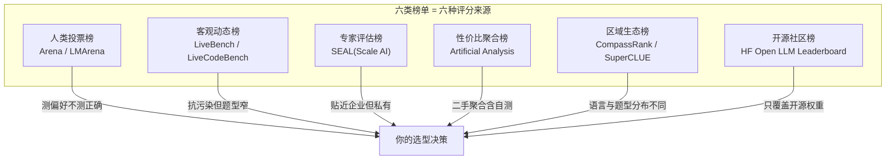
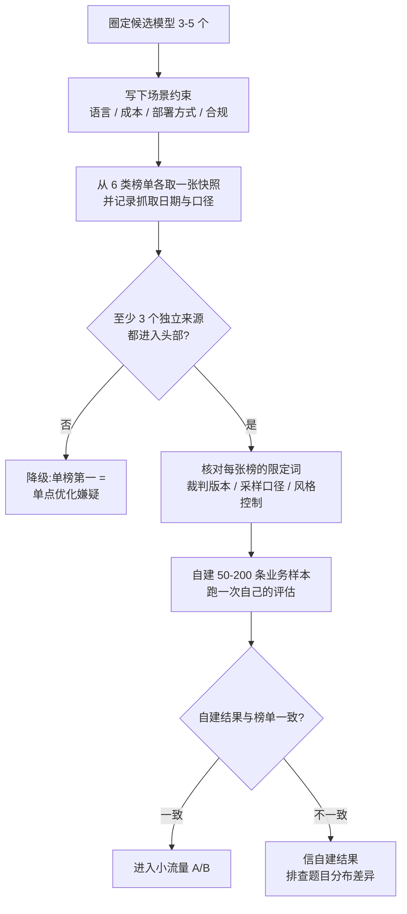

# 18. 第三方排行榜:生态地图与交叉验证

> **如果只读一节**:每张榜单的分数来源决定它的立场。六类榜单——人类投票(Arena)、客观动态(LiveBench)、专家评估(SEAL)、性价比聚合(Artificial Analysis)、中文生态(CompassRank / SuperCLUE)、开源社区(HF Open LLM)——各测一个切面。**全榜都进头部 = 真强;单榜第一 = 先查单点优化**。本章给你一张生态地图、一套对账流程和一份可直接照抄的选型报告模板。
>
> **前置知识**:读完第 17 章(偏好与 Arena 机制)、第 16 章(动态基准)与第 8 章(厂商报告解读)后可读。本章不重复讲基准本身的机制,只讲"榜单作为信息源怎么读、怎么对账"。
>
> **时效声明**:榜单数据随时间流动。本章引用的每个分数都标注了来源与抓取时点(2026-08-28);你读到这里的时刻,数字大概率已经变了——**会过期的是数字,不会过期的是读榜方法**。

## 18.1 本章目标与读者

读完后你能:

- 对任何一张新榜单,在 10 分钟内回答五个问题:评分来源是什么、谁运营、如何上榜、被谁引用、局限在哪
- 看懂厂商发布文里"借榜发声""自建协议""合成总分"三种引用姿势的差异
- 执行一套多榜对账流程,把"单榜第一"筛成"可入选候选"
- 用 3 个信号识别刷榜,每个信号都对应一个真实案例
- 按自己的业务场景选择该看的榜单组合,产出一份选型对账报告

## 18.2 榜单生态地图:评分来源决定立场



总览表(评分来源与利益立场是理解一切榜单的钥匙):

| 榜单 | 运营方 | 评分来源 | 利益立场与独立性 |
|---|---|---|---|
| Chatbot Arena / LMArena | LMSYS(UC Berkeley 系) | 真实人类匿名盲评 | 厂商无法自控评测集;平台自身学术中立 |
| LiveBench | 学术团队 | 客观真值自动判分 | 月度换题,题目公开可复核 |
| SEAL | Scale AI(商业公司) | 领域专家私有题评估 | 商业评测,题目私有不可自测 |
| Artificial Analysis | 独立第三方 | 聚合公开榜 + 自测速度价格 | 二手聚合,含自测成分 |
| CompassRank | OpenCompass(上海AI Lab 系) | 开源框架统一复现公开基准 | 框架开源,分数可复核 |
| SuperCLUE | 国内第三方 | 自建中文评测 | 媒体引用广泛,厂商发布不自引 |
| HF Open LLM Leaderboard | Hugging Face | 6 基准自动评测 | 开放提交,协议公开 |

下面逐个拆解。每个榜单按同一模板:**机制 / 更新频率 / 如何上榜 / 被谁引用 / 局限**。

### 18.2.1 人类投票:Chatbot Arena / LMArena

- **机制**:匿名双盲对战 + Bradley-Terry 拟合 + bootstrap 置信区间,完整数据流见第 17 章 17.5;
- **更新频率**:投票持续累积,排名定期刷新——它不是一个"发布周期"产品,而是流动的快照;
- **如何上榜**:模型接入平台匿名收集投票;进入正式排名需要足够票量,可参照的量级是 Kimi K2 上榜引用时已有 3000+ 票(2025-07-17,开源第 1、总榜第 5,来源:arXiv:2507.20534 正文);
- **被谁引用**:2026-08-28 抓取的 13 家厂商发布材料中,Arena/LMArena 的引用分布是——Google ✓(Gemini 2.5 Pro 宣布空降第一)、xAI ✓(Grok 3 自报 Elo 1402)、Kimi ✓(K2 开源第一)、OpenAI ○(仅提及)、Anthropic / DeepSeek / Qwen / GLM / MiniMax / 字节 / 小米 均未在旗舰发布正文引用(来源:research/vendor-blog-evals.md §4.2 覆盖矩阵)。它是唯一一个厂商无法自控评测集的活榜单,因此引用它常与自建表并列出现,互为信用背书;
- **局限**:测偏好不测正确;题目分布偏简单大众;投票人群偏英文;可被定向刷票(arXiv:2501.17858);同一份榜单存在"原始榜"与"风格控制榜"两个口径(第 17 章 17.5.4)。

### 18.2.2 客观动态榜:LiveBench

- **机制**:题目**按月更新**,全部有客观可验证的标准答案,**不依赖 LLM 裁判**——同时规避了背题与"难题上裁判崩坏"两个问题(来源:arXiv:2406.19314;官网 livebench.ai;机制细节见第 16 章);
- **更新频率**:月度换题;
- **如何上榜**:主办方统一接入评测,厂商不能自己报分;
- **被谁引用**:典型样本是阶跃星辰——其 Step-2 旗舰**没有自建评测表**,成绩全部来自 LiveBench 转载:综合全球第五、国产第一、当时前十唯一中国模型;指令跟随(IF)子榜 86.57 全榜第一,对比 gemini-1.5-flash-002 的 84.55 与 o1-preview 的 77.72(来源:research/vendor-blog-evals.md §16,标注:分数经第三方榜单与媒体转载,未抓取到厂商官方原文);
- **局限**:竞赛/考试型题型占比高,工程与 agent 能力覆盖有限;官网任务计数随更新变动(抓取时为 7 类 23 任务,来源:research/academic-history.md §10.3)。

**路线对照**:阶跃代表"借榜发声"(用第三方防污染榜单做官方营销主战场,自己不发分数表),DeepSeek 代表"自建协议"(自建表 + 完整采样协议披露)。两条路线的可信度形态不同:前者无法被指责自导自演但展示不了协议细节,后者协议透明但无法排除自选有利基准的嫌疑。

### 18.2.3 专家评估榜:SEAL

- **机制**:Scale AI 用**领域专家出题与评估**的私有题库测模型,定位企业级真实任务;
- **更新频率**:周期性发布评测,无固定月历(以官网为准);
- **如何上榜**:厂商不可自测——题目私有,由 Scale 组织评测;
- **被谁引用**:商业语境(采购、企业选型)引用多,厂商旗舰发布正文引用少。一个有信息量的背景事实:Scale AI 同时是 GSM1k 的作者团队——他们用 1250 道量级的同源新题证明多个模型家族在 GSM8k 上存在最高 8 个百分点的背题落差(来源:arXiv:2405.00332,详见 10.4)。一家对"静态基准被背题"有第一手研究的公司,选择做私有专家题库,这个路线选择本身说明了行业对公开题库的信任水位;
- **局限**:私有题库无法独立复核;商业公司运营,评测组合不可控;分数与公开榜不可横比。

### 18.2.4 性价比聚合:Artificial Analysis

- **机制**:独立第三方把**公开榜单质量分**与**自测的速度(tokens/秒)、首 token 延迟、单价($/1M tokens)**聚合成综合分与性价比视图;
- **更新频率**:持续更新(以官网为准);
- **如何上榜**:模型/API 上线即被收录,无需报名;
- **被谁引用**:工程选型与成本评审场景引用最多;它不生产"能力证据",只做"质量 × 成本 × 速度"的横向换算;
- **局限**:质量分是二手聚合(继承被聚合榜单的全部偏差);自测的速度与延迟受当时网络与负载影响。把它当**折算器**,不要当**证据源**。

### 18.2.5 中文榜:CompassRank 与 SuperCLUE

中文生态需要区分两种身份:

| | CompassRank(OpenCompass) | SuperCLUE |
|---|---|---|
| 运营方 | 上海AI Lab 系,开源评测体系 | 国内第三方 |
| 机制 | 开源评测框架 + 官方榜单,统一框架复现公开基准 | 自建中文评测 |
| 可复核性 | 框架开源,分数可复核 | 依赖主办方披露 |
| 被谁引用 | 国产厂商长期使用其框架与基准体系 | 媒体引用广泛,厂商发布正文不自引 |

(来源:research/vendor-blog-evals.md §F 与 §15;opencompass.org.cn)

配套的现实是:**中文基准的主场在国产厂商自建表里**。DeepSeek-R1 报 C-Eval 91.8(vs DeepSeek-V3 86.5、Claude-3.5-Sonnet-1022 76.7、GPT-4o-0513 76.0)、CLUEWSC 92.8、C-SimpleQA 63.7;字节 Doubao-1.5-pro 同时引用 CMMLU 与 C-Eval;而 OpenAI / Anthropic / Google / xAI 的旗舰发布正文都不采用中文榜(来源:arXiv:2501.12948 表 4;research/vendor-blog-evals.md §F 与 §4.2)。中文选型的正确组合是:CompassRank/OpenCompass 看横评 + 国产厂商自建中文表看口径 + 自建中文业务样本做终审。

### 18.2.6 开源榜:Hugging Face Open LLM Leaderboard v1 → v2

- **机制**:开放提交,任何人把模型挂上 Space 即自动评测;v1 用 MMLU、ARC、HellaSwag、TruthfulQA、Winogrande、GSM8K 六基准;v1 归档停更后由 v2 接替,六基准换为 IFEval、BBH、MATH、GPQA、MUSR、MMLU-Pro(来源:HF Open LLM Leaderboard 官方 Space 说明);
- **更新频率**:持续接受提交,自动评测;
- **被谁引用**:开源模型社区的首选参考;闭源模型不参与,所以它天然不回答"闭源谁强";
- **局限**:它贡献了本章最重要的一课——**协议不统一时,同一个基准的两个分数可以差出几十个点**。HF 官方博客承认:harness 标准协议跑出的 MMLU 分数与模型发布者自报分数显著不一致,原因是厂商用了未公开的自定义 prompt,差距可达约 30 个百分点;MMLU-Pro 团队实测同一模型在 24 种 prompt 风格下平均波动 4-5 个点、最大 11 个点(来源:huggingface.co/blog/open-llm-leaderboard-mmlu;arXiv:2406.01574)。**跨榜单只能比名次,不能比分数**——这条纪律的直接出处就在这里。

## 18.3 厂商引用证据:谁在引用哪个榜

把 2026-08-28 抓取的 11 家厂商旗舰发布材料做成覆盖矩阵(✓ = 发布正文或技术报告表格引用;○ = 仅图表/提及;空 = 未出现。来源:research/vendor-blog-evals.md §4.2,抓取自各厂商官方页面与 arXiv 技术报告):

| 评测 | OpenAI | Anthropic | Google | xAI | DeepSeek | Qwen | GLM | Kimi | MiniMax | 字节 | 小米 |
|---|---|---|---|---|---|---|---|---|---|---|---|
| GPQA Diamond | ✓ | ✓ | ✓ | ✓ | ✓ | ○ | ○ | ✓ | ✓ | ✓ | ✓ |
| MMLU/MMLU-Pro | ○ | ○ | ○ | ✓ | ✓ | ✓ | ○ | ○ | ✓ | ○ | ✓ |
| LiveCodeBench | 空 | 空 | 空 | ✓ | ✓ | ✓ | 空 | ✓ | ✓ | 空 | ✓ |
| SWE-bench Verified | ✓ | ✓ | ✓ | 空 | ✓ | 空 | ✓ | ✓ | ✓ | 空 | 空 |
| Arena/LMArena | ○ | 空 | ✓ | ✓ | 空 | 空 | 空 | ✓ | 空 | 空 | 空 |
| C-Eval/CMMLU 中文榜 | 空 | 空 | 空 | 空 | ✓ | ✓ | ○ | 空 | 空 | ✓ | ○ |

读这张表的三个结论:

1. **共识榜**:GPQA Diamond 在 11/11 家出现,是本次抓取中覆盖率第一的单一评测;LiveCodeBench、MMLU-Pro 构成推理模型时代的通用语言。共识榜的好处是可比性最强,坏处是刷分动机也最强;
2. **差异化营销榜**:Arena 是"产品体验叙事"厂商的选择(Google/xAI/Kimi),中文榜是国产主场,LiveCodeBench 是推理模型标配——厂商挑自己赢面大的战场,这是理解任何一张发布评测表的第一原则(第 8 章的锚点策略四原型是同一件事的另一种表述);
3. **回避榜**:本次抓取范围内,WebArena、OSWorld、GAIA 等环境化评测没有出现在任何一家旗舰发布正文(来源:research/vendor-blog-evals.md §D)——"不可控环境 + 不可复现分数"的评测,厂商发布引用仍然谨慎。**缺席名单有时比在场名单信息量更大**。

还有一类值得单独点名的引用姿势:**合成总分**。GLM-4.5 发布时给的是"12 项行业标准基准综合 63.2、全模型第三"——一个数字一个名次,但 12 项是哪 12 项、各自权重、思考模式口径均未披露(来源:huggingface.co/zai-org/GLM-4.5 与 github.com/zai-org/GLM-4.5,research/vendor-blog-evals.md §11)。合成总分的传播效率极高,复核成本也极高——它把验证成本转嫁给了读者。同仓库的 GLM-4.7 改为逐项分数 + 逐项增幅,说明披露标准本身在随行业水位上移。

## 18.4 交叉验证:从单榜偏差到多榜对账

### 18.4.1 每类榜单的固有偏差

| 榜单类型 | 固有偏差 | 会高估谁 | 会低估谁 |
|---|---|---|---|
| Arena(人类投票) | 偏好≠正确;长/花哨回答曾占优(风格控制前) | 风格好的模型 | 朴素但准确的模型;专业任务强项 |
| LiveBench(客观动态) | 题型偏考试/竞赛 | 考试型模型 | 工程与 agent 能力 |
| SEAL(专家) | 私有题不可复核 | 参与评测流程的模型 | 未参与的模型 |
| Artificial Analysis | 二手聚合 + 自测成分 | 上游榜单的偏差全部继承 | 不在上游榜单的模型 |
| CompassRank/SuperCLUE | 区域语言分布 | 中文强的模型 | 英文为主模型 |
| HF Open LLM | 只覆盖开源;协议敏感 | 提交活跃的模型 | 闭源模型 |

没有一张榜单是中立的测量仪——**每张榜单测的都是"某个人群 × 某种题型 × 某个判分器"下的表现**。对账的目标不是找到一张完美的榜,而是用多张有不同偏差的榜互相钳制。

### 18.4.2 对账流程



其中"至少 3 个独立来源进入头部"是经验法则,不是统计定理——它的作用是强制你打开至少三个不同评分来源的视角,避免被单一叙事说服。

"独立来源"要打引号:Artificial Analysis 聚合了上游榜单,它对上游榜单里的模型不是独立证据。真正的独立性来自**评分来源不同**(人类 / 客观真值 / 专家 / 你自己的用户)。

### 18.4.3 对账实例:DeepSeek-R1 的五维画像

用一张表对账 DeepSeek-R1(2025-01 发布)。所有数字来自 R1 技术报告主表(arXiv:2501.12948 表 4),对比锚点是 o1 系:

| 维度 | 榜单/评测 | R1 | 对比 | 读法 |
|---|---|---|---|---|
| 知识 | MMLU | 90.8 | o1-1217 91.8 | 基本持平 |
| 数学 | AIME 2024(pass@1,temp 0.6) | 79.8 | o1-1217 79.2 | 持平 |
| 工程 | SWE-bench Verified(agentless) | 49.2 | o1-1217 48.9 | 持平 |
| 偏好(难题) | ArenaHard | 92.3 | o1-mini 92.0 | 持平(第一梯队) |
| 偏好(开放指令) | AlpacaEval 2.0 LC | 87.6 | GPT-4o-0513 51.1 / o1-mini 57.8 | 大幅领先 |

对账读法:

- **客观榜上 R1 与 o1 持平,偏好榜上 R1 大幅领先**——这个不一致本身就是信息。差距不在知识或工程层,而在"长思维链回答在 LLM 裁判眼中的形态优势"层;
- DeepSeek 为此主动披露了平均输出长度(约 689 / 2218 token)自证没有利用长度偏置(来源:arXiv:2501.12948)——厂商自己都在提醒你这个数字要谨慎读;
- 结论不是"R1 被高估"或"R1 真无敌",而是:**87.6 这个数字混合了能力与裁判风格两个成分**,而 MMLU/AIME/SWE 上的持平说明能力成分是真实的。

这就是"单榜第一 = 单点优化嫌疑"的正确用法:不是否定第一名,而是追问"这个第一在别的测量条件下还在吗"。

### 18.4.4 对账实例:Arena 是流动的快照

把三个真实引用按时间排开(来源均为各厂商发布文,2026-08-28 抓取):

| 时点 | 事件 | 引用口径 |
|---|---|---|
| 2025-02 | Grok 3 上榜,自报 Elo 1402(代号 chocolate) | 原始榜口径 |
| 2025-03 | Gemini 2.5 Pro 发布,宣布"以显著优势空降第一" | 强调"能力强且风格好" |
| 2025-07 | Kimi K2 引用:开源第 1、总榜第 5(3000+ 票) | 总榜 + 开源阵营双口径 |

三个名次都真实,但它们是三份不同的测量(不同日期、不同对手池、可能不同的口径)。**任何"XX 是当前第一"的陈述,必须绑定抓取日期才成立**;跨厂商引用 Arena 时,还要核对各自用的是原始榜还是风格控制榜。

另一个生态注脚:腾讯混元团队在 2025 年 12 月重组后公开表示"从过度关注外部榜单转向以产品用户体验为核心指标"(来源:research/vendor-blog-evals.md §15,标注:转述自公开资料,未抓取官方原文)。厂商自己都在给"榜单依赖"降温——这与本章的立场一致:**榜单是初筛工具,不是终审**。

## 18.5 从分数到决策:场景矩阵与名次聚合

### 18.5.1 你的场景该看哪张榜

| 你的场景 | 首选榜单 | 为什么 | 配套动作 |
|---|---|---|---|
| 英文 C 端对话/创作产品 | Arena(看风格控制列) | 最接近真实用户偏好分布 | 自建 100 条业务样本复核 |
| 中文产品 | CompassRank + 国产自建中文表 | 中文题型与语料分布不同 | 找中文用户做盲测 |
| 成本敏感的 API 选型 | Artificial Analysis | 质量 × 价格 × 速度同框折算 | 拿自家流量实测延迟 |
| 企业/专家级任务 | SEAL + 自建 hold-out | 专家评估贴近企业任务 | 自建评估为终审 |
| 开源自部署 | HF Open LLM v2 | 只覆盖开源、协议公开 | 用第 20 章 mini evaluator 复跑 |
| 长期追踪/防背题 | LiveBench(第 16 章) | 月度换题 + 客观判分 | 看趋势,不看单点 |

### 18.5.2 名次聚合:把多张榜合成一个入围名单

跨榜对账时只聚合**名次**、不聚合**分数**(分数跨榜不可比,见 18.2.6)。最稳的聚合方式是取中位数名次——它对"某一榜的异常高名次"不敏感:

```typescript
// rank-aggregate.ts — 多榜名次中位数聚合
// 运行:npx tsx rank-aggregate.ts(无需联网/付费)

type Board = { name: string; ranking: string[] };

const boards: Board[] = [
  { name: "boardA", ranking: ["m1", "m2", "m3", "m4", "m5"] },
  { name: "boardB", ranking: ["m1", "m3", "m2", "m5", "m4"] },
  { name: "boardC", ranking: ["m1", "m4", "m3", "m2", "m5"] },
];

function medianRank(boards: Board[], model: string): number {
  const ranks = boards
    .map((b) => b.ranking.indexOf(model) + 1) // 1-based 名次;未上榜记为 NaN 并剔除
    .filter((r) => r > 0)
    .sort((a, b) => a - b);
  const mid = Math.floor(ranks.length / 2);
  return ranks.length % 2 ? ranks[mid] : (ranks[mid - 1] + ranks[mid]) / 2;
}

const models = [...new Set(boards.flatMap((b) => b.ranking))];
console.log(
  models
    .map((m) => ({ model: m, medianRank: medianRank(boards, m) }))
    .sort((a, b) => a.medianRank - b.medianRank),
);
// 期望输出:m1 稳居第一(三榜都是第 1);
// m2 虽在某榜第 2,中位数仍是第 3 —— 单榜高分被钳制
```

工程含义:`m1` 三榜全第一 → 真强;某模型在榜 B 第 2 但另两榜第 4 → 中位数把它压回第 3,**单榜的尖峰被统计钳制**。这正是"全榜都强 = 真强"的算法化表达。

## 18.6 刷榜识别:三个信号与真实案例

**信号 1:静态榜分数与同源新题的落差**

- 案例:GSM1k(2024-05)由 Scale AI 请人力重写一套与 GSM8k 风格严格对齐的新题,领先开源与闭源模型的 `GSM8k − GSM1k` 分差**最高达 8 个百分点**,Mistral 与 Phi 家族接近 10%;且模型生成 GSM8k 题目的概率与掉分幅度正相关(Spearman r² = 0.36),指向部分记忆了原题(来源:arXiv:2405.00332 摘要与正文);
- 识别动作:看到静态基准的异常高分,找有没有同源新题对照实验;没有就默认分数里含记忆分。

**信号 2:评测机构与受益厂商的利益关系未披露**

- 案例:FrontierMath(数学家出题、题目私有的极端防污染基准)。OpenAI 在 2024-12 预告 o3 得分超过 25%("其他产品不足 2%");Epoch AI 随后独立复测公开版 o3 约 10%;2025-01 曝出 OpenAI 曾资助该基准并拥有大部分题目访问权、参与命题的数学家事先不知情(来源:research/vendor-blog-evals.md §B FrontierMath 节与 research/academic-history.md §10.4,含双方当事人公开表态;部分细节为二手转述);
- 识别动作:看到"独家电台式"的高分(唯一厂商引用、其他厂商集体回避),先查评测方的资金与题目访问关系是否披露。此后主流厂商发布文均不再引用 FrontierMath——共同回避本身就是行业给出的评级。

**信号 3:单榜第一但跨榜不一致,或只有合成总分不给子项与协议**

- 案例 A(跨榜不一致):15.4.3 的 AlpacaEval LC 87.6 vs ArenaHard 92.0(与 o1-mini 打平)——同一个模型、同为 LLM 裁判榜单、结论差距巨大,逼你回查题目分布与裁判版本;
- 案例 B(合成总分):GLM-4.5 的"12 项基准综合 63.2、全模型第三"不给子表与权重(15.3),验证成本被转嫁给读者;
- 案例 C(榜单本身可被操纵):论文证明 BT 排名下少量账号定向刷特定对战即可推高目标模型(来源:arXiv:2501.17858)——即使评测方完全中立,**评分机制本身也有攻击面**;
- 识别动作:名次只在单一测量条件下领先时,降级为"待验证";只有合成总分时,按"未验证"处理。

三个信号共同的底层逻辑是 Goodhart 定律:**当测量成为目标,它就不再是好的测量**。评测方靠换题(动态榜)、私有题(专家榜)、统计控制(风格控制)提高攻击成本,读者靠对账提高识别能力——攻防会一直持续,没有一劳永逸的干净榜单。

## 18.7 实战:做一份你自己的对账报告

模板(可直接复制,示例行用 15.4.3 的已验证数据填充):

```markdown
# 选型对账报告:<场景名>
> 快照日期:YYYY-MM-DD(每张榜单独记录)

## 1. 场景约束
- 语言/地区:____   成本上限:____   部署方式:____   合规要求:____

## 2. 候选模型(3-5 个)
- [模型 A] [模型 B] [模型 C]

## 3. 各榜快照(记名次,不记跨榜分数)
| 榜单 | 口径备注 | A | B | C |
|---|---|---|---|---|
| Arena(风格控制列) | 快照日期 + 是否盲评 |  |  |  |
| LiveBench | 当月题集版本 |  |  |  |
| CompassRank | 框架版本 |  |  |  |
| Artificial Analysis | 聚合口径(二手) |  |  |  |
| SEAL | 参与情况 |  |  |  |

## 4. 名次中位数(用 rank-aggregate.ts 计算)
| 模型 | 中位数名次 | 入围? |
|---|---|---|

## 5. 对账解读(不一致处必须写明原因假设)
示例:R1 的 AlpacaEval LC 87.6 远高于 GPT-4o-0513 的 51.1,
但 MMLU 90.8 vs 91.8(o1-1217)持平 → 差距在偏好/风格层,
须在自建样本上验证(来源:arXiv:2501.12948 表 4)。

## 6. 终审:自建评估
- 样本量与来源:50-200 条真实业务样本
- 结果:____   与榜单是否一致:____

## 7. 决策
- 主用:____   备选:____   降本/兜底:____
- 决策依据一句话:____
```

执行要点:第 6 步是唯一不可省略的一步。榜单决定你**邀请谁进面试**,自建评估决定**谁拿到 offer**——第 4 部分(第 19、20、5、6、21、22 章)讲的全部工程实践,都是为了让这一步可信且可复现。

## 18.8 验收自测

1. **选择**:跨榜单比较模型时,正确的做法是?
   - A. 把各榜分数加权平均
   - B. 只看分数最高的那张榜
   - C. 只比较名次并记录每张榜的口径与快照日期
   - D. 信任厂商自报的 Arena 名次

2. **选择**:Artificial Analysis 的分数为什么不能当独立证据?
   - A. 它更新太慢
   - B. 它是二手聚合(继承上游榜单偏差)且含自测成分
   - C. 它只覆盖开源模型
   - D. 它只测中文

3. **选择**:GSM1k 实验直接证明的是?
   - A. GSM8k 题目太难
   - B. 部分模型在静态基准上存在最高约 8 个百分点的背题落差
   - C. 人类解不出 GSM8k
   - D. 数学题必须用 LLM 裁判

4. **简答**:为什么"单榜第一 = 单点优化嫌疑"?用 18.4 的 R1 数据说明你会在哪一步放下或坐实这个嫌疑。

5. **实操**:按 18.7 模板,为你的实际场景(或"中文客服机器人")完成一份对账报告,其中至少包含一张带快照日期的榜单表格与一次自建 50 样本评估。

## 18.9 本章 Cheat Sheet

| 概念 | 一句话 | 详见 |
|---|---|---|
| 生态地图 | 六类榜单 = 六种评分来源,来源决定立场 | §18.2 |
| Arena 引用分布 | Google/xAI/Kimi 引用,多数厂商只自建表 | §18.2.1 |
| 借榜发声 vs 自建协议 | 阶跃用 LiveBench,DeepSeek 自建 + 协议披露 | §18.2.2 |
| 中文榜分工 | CompassRank 横评 + 厂商自建中文表 + 自建样本 | §18.2.5 |
| 协议敏感 | 同基准两套 prompt 可差约 30 分,跨榜只比名次 | §18.2.6 |
| 覆盖矩阵 | 共识榜/差异化榜/回避榜,缺席名单也有信息量 | §18.3 |
| 对账流程 | 6 类快照 → 头部重合 → 自建复核 → A/B | §18.4.2 |
| 名次中位数 | 钳制单榜尖峰的聚合方式 | §18.5.2 |
| 刷榜三信号 | 同源新题落差 / 利益未披露 / 跨榜不一致或合成总分 | §18.6 |

## 18.10 五个常见错误

1. **只看一张榜单** — 每张榜测"某人群 × 某题型 × 某判分器",至少三个独立评分来源重合才入围。
2. **跨榜直接比分数** — 协议不统一时同基准可差约 30 分;只比名次,且记录口径与快照日期。
3. **把聚合器当证据源** — Artificial Analysis 继承上游全部偏差,它是折算器,不是独立测量。
4. **把厂商引用的 Arena 名次当真理** — 那是带误差棒的单次快照,还要分清原始榜与风格控制榜。
5. **跳过自建评估直接选型** — 榜单只能筛出面试名单;没有自建样本复核的选型,等于按简历发 offer。

## 18.11 延伸阅读

⭐⭐⭐
- [LMArena](https://lmarena.ai/) — 人类投票总榜(注意原始榜与风格控制列两个口径)
- [LMSYS 排名方法博客(2023-12-07)](https://www.lmsys.org/blog/2023-12-07-leaderboard/) — BT + bootstrap 的官方说明
- [LiveBench](https://livebench.ai/) — 月度换题的客观动态榜
- [DeepSeek-R1 技术报告(arXiv:2501.12948)](https://arxiv.org/abs/2501.12948) — 本章对账实例的全部数据来源

⭐⭐
- [Hugging Face Open LLM Leaderboard](https://huggingface.co/spaces/open-llm-leaderboard/open_llm_leaderboard) — 开源榜 v2
- [HF 博客:Open LLM Leaderboard 的 MMLU 分歧](https://huggingface.co/blog/open-llm-leaderboard-mmlu) — 协议敏感性的官方自曝
- [Artificial Analysis](https://artificialanalysis.ai/) — 质量 × 成本 × 速度聚合
- [SEAL by Scale AI](https://scale.com/leaderboard) — 专家评估榜
- [Vote Rigging on Chatbot Arena(arXiv:2501.17858)](https://arxiv.org/abs/2501.17858) — 榜单攻击面研究

⭐
- [GSM1k(arXiv:2405.00332)](https://arxiv.org/abs/2405.00332) — 同源新题对照实验(刷榜信号 1 的出处)
- [OpenCompass](https://opencompass.org.cn/) — 中文评测体系与 CompassRank
- [SWE-bench Leaderboard](https://www.swebench.com/) — 代码 Agent 榜(成本已作为一等指标)
- [Berkeley Function Calling Leaderboard](https://gorilla.cs.berkeley.edu/leaderboard.html) — 函数调用专项
