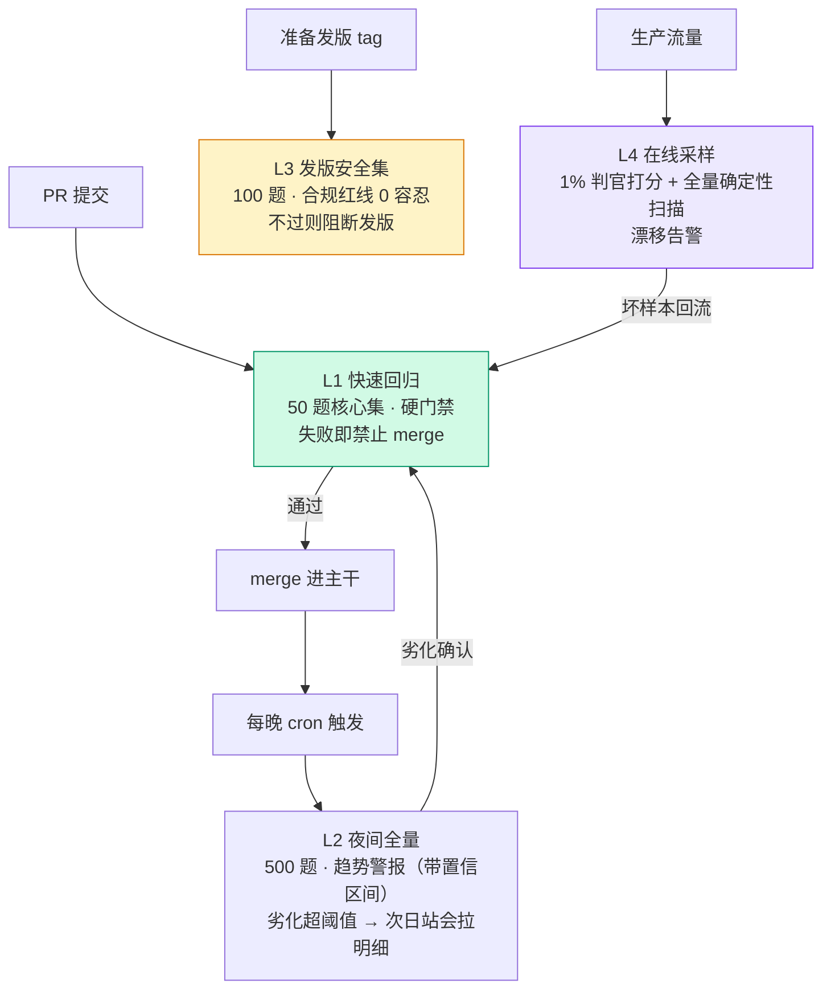

# 20. 用 Node.js 自建 Mini Evaluator：从 30 行到四层评估流水线

> **如果只读一节**：读 20.4-20.5 的 150 行完整框架——判官协议、有界并发、Wilson 置信区间、CI 退出码，六要素一个不少。前面 30 行 / 100 行版本是它的渐进拆解，后面四层流水线是它长成生产系统的路线图。

> **前置知识**：读完第 4 章（标准评估流水线）与第 19 章（框架全景图）后阅读效果最佳。代码环境：Node.js 20+、TypeScript、一个 OpenAI 兼容 API Key；依赖只装 `openai` 一个包（后面章节按需加注）。

## 20.1 本章目标与读者

第 19 章你学会了选框架；这一章回答另一个问题：**评估器的内部到底长什么样**。理由有三：一是业务数据私密或评估逻辑特殊时你需要自建；二是读懂内部结构后，任何框架的黑盒对你都是透明的；三是自建一遍，你才知道框架帮你省掉的复杂度值多少钱。

读完后你能：

- 从 30 行脚本渐进写出 150 行的完整 mini 评估框架（可跑、可复现、可进 CI）
- 把单次评估脚本组织成**四层评估流水线**（PR 快集 / 夜间全量 / 发版安全集 / 在线采样）
- 用置信区间而非点估计做回归判断，并用"金标准集"定期回归判官本身
- 掌握三招成本工程：缓存、模型分级、批处理

## 20.2 概念引入：评估器的最小闭环

**前端类比**：一个评估器约等于 `jest --runInBand` 的极简版——遍历测试用例、调用被测函数、断言、汇总报告。区别在于"断言"经常是概率性的（判官打分），而且每次"跑测试"都要花钱，所以工程重点从"写断言"变成了**控制成本与统计噪声**。

最小闭环四个部件，对应 16.3 的行业共同抽象：

```text
数据集(JSONL) → 被测物(solve 函数) → 判官(规则/LLM) → 汇总(指标+报告)
      ↑                                                    │
      └────────────── 回归：改了 prompt/模型后重跑同一数据集 ←┘
```

本章的推进路线就是让这四个部件逐级工程化：30 行跑通闭环 → 100 行解决工程问题（并发/缓存/重试）→ 150 行解决治理问题（判官协议/统计护栏/CI 门禁）→ 四层流水线解决组织问题（谁在什么时机以多大成本跑什么）。

## 20.3 30 行版本：最小可行评估器

依赖：`npm i openai`；数据文件 `data.jsonl` 每行一条 `{"input":"...","expected":"..."}`。

```typescript
// mini-eval-30.ts —— 运行: OPENAI_API_KEY=sk-xxx npx tsx mini-eval-30.ts
// 需联网与 API Key；50 题约产生几美分费用（以 gpt-4o-mini 计价）
import { readFileSync } from "node:fs";
import OpenAI from "openai";

const openai = new OpenAI();

type Task = { input: string; expected: string };
const tasks: Task[] = readFileSync("data.jsonl", "utf-8")
  .trim().split("\n").map((l) => JSON.parse(l));

let correct = 0;
for (const t of tasks) {
  const r = await openai.chat.completions.create({
    model: "gpt-4o-mini", // 占位模型名，替换为你账号可用的模型
    messages: [{ role: "user", content: t.input }],
  });
  if (r.choices[0].message.content?.trim() === t.expected) correct++;
}
console.log(`Accuracy: ${((correct / tasks.length) * 100).toFixed(1)}%`);
```

**这就是完整评估的最小可行版本**——数据集、被测物（直接调模型的 chat 接口）、判官（严格相等）、汇总（平均数）四件俱全。它的问题也很典型：串行执行（50 题要等 50 次往返）、无缓存（重跑全价）、无重试（一次 429 就崩）、没有留存（跑完只剩一个百分数）。这四个问题就是 100 行版本的全部内容。

## 20.4 100 行版本：并发、缓存、重试、报告

依赖：`npm i openai p-limit lru-cache`。四个工程问题各用一段代码解决：

```typescript
// mini-eval-100.ts —— 支持：有界并发 / 缓存 / 指数退避重试 / 分类报告 / 结果落盘
// 运行: OPENAI_API_KEY=sk-xxx npx tsx mini-eval-100.ts
import { readFileSync, writeFileSync, mkdirSync } from "node:fs";
import OpenAI from "openai";
import pLimit from "p-limit";
import { LRUCache } from "lru-cache";

const openai = new OpenAI();
const MODEL = "gpt-4o-mini";

// 1) 缓存：prompt 全文作 key，命中即零成本（重复跑评估最省钱的手段）
const cache = new LRUCache<string, string>({ max: 10000, ttl: 24 * 3600 * 1000 });

// 2) 重试：指数退避 1s/2s/4s，上限 3 次——429 与 5xx 都靠它扛
async function callWithRetry(prompt: string, retries = 3): Promise<string> {
  const hit = cache.get(prompt);
  if (hit !== undefined) return hit;
  for (let i = 0; i < retries; i++) {
    try {
      const r = await openai.chat.completions.create({
        model: MODEL,
        messages: [{ role: "user", content: prompt }],
        temperature: 0, // 温度 0：同一 prompt 复跑结果稳定，缓存才有意义
      });
      const out = r.choices[0].message.content ?? "";
      cache.set(prompt, out);
      return out;
    } catch (e) {
      if (i === retries - 1) throw e;
      await new Promise((r) => setTimeout(r, 1000 * (i + 1)));
    }
  }
  throw new Error("unreachable");
}

// 3) 判官：严格相等（业务上可换成 contains / 数值抽取 / LLM 判官）
interface Task { id: string; input: string; expected: string; category?: string; }
function exactMatch(output: string, expected: string): boolean {
  return output.trim() === expected.trim();
}

const tasks: Task[] = readFileSync("data.jsonl", "utf-8")
  .trim().split("\n").map((l, i) => ({ id: `ex-${i}`, ...JSON.parse(l) }));

// 4) 有界并发：pLimit(10) —— 同时最多 10 个在途请求，不触发限流
const limit = pLimit(10);
const results = await Promise.all(
  tasks.map((t) =>
    limit(async () => {
      const output = await callWithRetry(t.input);
      return { ...t, output, correct: exactMatch(output, t.expected) };
    })
  )
);

// 5) 报告：总体 + 分桶（分桶才能看见"高频场景还行、长尾全崩"这种回归）
mkdirSync("reports", { recursive: true });
const total = results.length;
const correct = results.filter((r) => r.correct).length;
const byCategory: Record<string, { total: number; correct: number }> = {};
for (const r of results) {
  const cat = r.category ?? "default";
  byCategory[cat] ??= { total: 0, correct: 0 };
  byCategory[cat].total++;
  if (r.correct) byCategory[cat].correct++;
}
console.log(`Model: ${MODEL}, Total: ${total}, Acc: ${((correct / total) * 100).toFixed(1)}%`);
for (const [cat, s] of Object.entries(byCategory)) {
  console.log(`  ${cat}: ${((s.correct / s.total) * 100).toFixed(1)}% (${s.correct}/${s.total})`);
}
// 6) 落盘：原始结果留存，debug 与跨 run 对比的前提
writeFileSync("reports/last-run.jsonl", results.map((r) => JSON.stringify(r)).join("\n"));
```

到这里它已经是一个"能用"的评估脚本：缓存省钱、重试容错、并发提速、分桶报告、原始结果留存。剩下的问题都是**治理**层面的：判官能不能插拔？分数能不能直接当 CI 门禁？门禁能不能不被统计噪声天天误触发？这是 150 行版本的领土。

## 20.5 150 行版本：判官协议、统计护栏与 CI 门禁

### 20.5.1 完整源码

依赖回到最小集：`npm i openai`。保存为 `mini-eval.ts`：

```typescript
// mini-eval.ts —— 依赖: npm i openai；Node >= 20
// 运行: OPENAI_API_KEY=sk-xxx npx tsx mini-eval.ts dataset.jsonl --threshold 0.8 --concurrency 4
// dataset.jsonl 每行: {"input":"...","expected":"..."}
import { readFileSync, writeFileSync, mkdirSync } from "node:fs";
import OpenAI from "openai";

// ---------- 类型：一次评估 run 的完整快照 ----------
type Example = { id: string; input: string; expected?: string };
type Score = { key: string; value: number; comment?: string };
type RowResult = { id: string; output: string; scores: Score[]; latencyMs: number };
type EvalRun = {
  runId: string; startedAt: string; dataset: string; itemCount: number;
  threshold: number; results: RowResult[];
  aggregates: Record<string, { value: number; ci95: [number, number] }>;
  passed: boolean;
};

// ---------- 判官协议：规则判官与 LLM 判官同一个签名，可插拔 ----------
type Judge = (ex: Example, output: string) => Promise<Score>;

const exactContains: Judge = async (ex, output) => ({
  key: "contains_expected",
  value: ex.expected && output.toLowerCase().includes(ex.expected.toLowerCase()) ? 1 : 0,
});

const llmJudge =
  (client: OpenAI, model = "gpt-4o-mini"): Judge =>
  async (ex, output) => {
    const r = await client.chat.completions.create({
      model,
      temperature: 0,
      response_format: { type: "json_object" }, // 结构化输出：分数 + 理由
      messages: [
        {
          role: "system",
          content:
            "你是评估判官。按 0~1 打分评估 ANSWER 是否正确回答 QUESTION。只输出 JSON: " +
            '{"score": number, "reason": string}',
        },
        { role: "user", content: `QUESTION: ${ex.input}\nANSWER: ${output}\nEXPECTED: ${ex.expected ?? "(无参考)"}` },
      ],
    });
    const parsed = JSON.parse(r.choices[0].message.content ?? "{}") as { score: number; reason?: string };
    return { key: "llm_judge", value: Math.min(1, Math.max(0, Number(parsed.score))), comment: parsed.reason };
  };

// ---------- 统计护栏：Wilson 95% 置信区间 ----------
function wilson(p: number, n: number, z = 1.96): [number, number] {
  if (n === 0) return [0, 0];
  const d = 1 + (z * z) / n;
  const c = (p + (z * z) / (2 * n)) / d;
  const h = (z * Math.sqrt((p * (1 - p)) / n + (z * z) / (4 * n * n))) / d;
  return [c - h, c + h];
}

// ---------- 有界并发 map：固定 worker 池，不产生无限 Promise ----------
async function mapPool<T, R>(items: T[], limit: number, fn: (t: T) => Promise<R>): Promise<R[]> {
  const out: R[] = new Array(items.length);
  let i = 0;
  const workers = Array.from({ length: Math.min(limit, items.length) }, async () => {
    while (i < items.length) {
      const idx = i++; // 抢占式取号：每个 worker 从共享游标拿下一个任务
      out[idx] = await fn(items[idx]);
    }
  });
  await Promise.all(workers);
  return out;
}

// ---------- 参数解析：命名参数，避免位置索引陷阱 ----------
function parseArgs(argv: string[]) {
  const flag = (name: string) => {
    const i = argv.indexOf(name);
    return i >= 0 ? argv[i + 1] : undefined;
  };
  return {
    file: argv[0],
    threshold: Number(flag("--threshold") ?? 0.8),
    concurrency: Number(flag("--concurrency") ?? 4),
  };
}

// ---------- 主流程 ----------
async function main() {
  const { file, threshold, concurrency } = parseArgs(process.argv.slice(2));

  const examples: Example[] = readFileSync(file, "utf8")
    .split("\n").filter(Boolean)
    .map((line, i) => ({ id: `ex-${i}`, ...JSON.parse(line) }));

  const client = new OpenAI();
  // 被测物：换成你应用的真实入口即可（一个 (input) => Promise<string> 的函数）
  const solve = async (ex: Example) =>
    (await client.chat.completions.create({
      model: "gpt-4o-mini",
      messages: [{ role: "user", content: ex.input }],
    })).choices[0].message.content ?? "";

  const startedAt = new Date().toISOString();
  const results = await mapPool(examples, concurrency, async (ex) => {
    const t0 = Date.now();
    try {
      const output = await solve(ex);
      const scores = await Promise.all([exactContains(ex, output), llmJudge(client)(ex, output)]);
      return { id: ex.id, output, scores, latencyMs: Date.now() - t0 };
    } catch (e) {
      // 失败隔离：单条报错记为 0 分并留痕，不拖垮整个 run
      return {
        id: ex.id, output: "",
        scores: [{ key: "error", value: 0, comment: String(e).slice(0, 200) }],
        latencyMs: Date.now() - t0,
      };
    }
  });

  // 聚合：一条样本通过 = 所有判官都达到阈值（对应 DeepEval 的严格 pass 语义）
  const passRows = results.filter((r) => r.scores.every((s) => s.value >= threshold));
  const passRate = passRows.length / results.length;
  const [lo, hi] = wilson(passRate, results.length);

  const run: EvalRun = {
    runId: crypto.randomUUID(),
    startedAt,
    dataset: file,
    itemCount: examples.length,
    threshold,
    results,
    aggregates: {
      pass_rate: { value: passRate, ci95: [lo, hi] },
      avg_latency_ms: {
        value: results.reduce((s, r) => s + r.latencyMs, 0) / results.length,
        ci95: [0, 0],
      },
    },
    passed: passRate >= threshold,
  };

  // 报告 + 落盘（可复现：runId 对应一份完整快照）
  mkdirSync("reports", { recursive: true });
  writeFileSync(`reports/${run.runId}.json`, JSON.stringify(run, null, 2));
  console.log(`pass_rate=${passRate.toFixed(3)} ci95=[${lo.toFixed(3)},${hi.toFixed(3)}]`);
  console.log(`report=reports/${run.runId}.json`);

  // CI 门禁语义：失败让进程以非零码退出，CI 自动变红
  process.exitCode = run.passed ? 0 : 1;
}

main().catch((e) => { console.error(e); process.exitCode = 1; });
```

### 20.5.2 七个设计决策逐块讲解

**决策 1：判官是一个统一签名的函数类型。** `type Judge = (ex, output) => Promise<Score>` 让规则判官与 LLM 判官可插拔、可组合——`Promise.all([exactContains, llmJudge])` 就是"规则先筛、判官兜底"的分层维形。这正是 16.3 那张共同抽象表里"Evaluator"一列的自建版：**判官是数据，不是硬编码**。

**决策 2：LLM 判官强制结构化输出 + 分数截断。** `response_format: json_object` 保证能解析；`Math.min(1, Math.max(0, ...))` 防判官模型输出 1.2 或 -0.3 这种越界分数污染统计；`comment` 存理由字段——它既是调试判官的入口，也是人工复核成本最低的材料（判官五要素之"结构化输出 + 理由"，见 19.6.3）。

**决策 3：mapPool 而不是无限 `Promise.all`。** `tasks.map(async ...)` 加 `Promise.all` 会把全部请求同时打出去，遇到限流就是成片的 429，夜间任务会**静默丢数据**。mapPool 只开 `limit` 个 worker，用共享游标 `i++` 领任务——相当于自己写了一个 20 行的 p-limit，顺便看清了它的原理。

**决策 4：失败隔离，单条报错不拖垮整个 run。** 夜间全量 500 题跑到最后一条遇到 5xx，你不能让前 499 条的结果一起蒸发。每条样本包一层 try，失败的记 `key: "error"` 0 分并留痕——它天然过不了 `every(s => s.value >= threshold)` 的通过判据，所以不会被漏计为"通过"。

**决策 5：Wilson 置信区间而不是裸百分数。** `pass_rate=0.8` 和 `pass_rate=0.8, ci95=[0.67, 0.89]` 是两个信息量完全不同的输出——后者告诉你"50 题样本上这个分数的真实区间很宽，别急着下结论"。实现只有 7 行（`wilson` 函数），却能拦住大部分"CI 天天误红"的事故（17.7 展开）。

**决策 6：EvalRun 整体落盘，一 run 一快照。** `results` 里冗余存了 `output` 与每条 `scores`，`runId` 是 `crypto.randomUUID()`——三个月后复盘"上次为什么过这次为什么挂"，你有原始材料。可复现四要素（被测物版本 / 数据集版本 / 判官版本 / 环境）在这里先打了地基，ch22 会把 schema 补全。

**决策 7：`process.exitCode` 是门禁的全部接口。** 评估脚本接入 CI 不需要任何框架特性——过则 0、挂则 1，GitHub Actions / Jenkins / GitLab CI 全都认这个语义。16.4 里 DeepEval 的 `deepeval test run`、Langfuse 的 GitHub Action（分数越界抛 `RegressionError` 使 workflow 失败），本质都是这一个接口。

一个真实的坑：初版实现用 `process.argv` 的**固定位置索引**取参数（`argv[3]` 当 threshold），一旦有人把参数顺序写反或加了新参数，阈值会静默变成 `NaN`，所有样本全部判挂——CI 天天红还查不出原因。改成 `parseArgs` 的命名参数查找后，参数顺序无关、缺省有默认值。**评估工具自身的健壮性和被测物一样重要**。

## 20.6 从脚本到流水线：四层评估架构

单次评估脚本只回答"这次跑得怎么样"。生产系统的问题是"**什么时候、以多大成本、跑哪一层**"。业界收敛的答案是四层。

### 20.6.1 四层职责表

| 层 | 触发 | 数据量 | 成本预算 | 决策联动 |
|---|---|---|---|---|
| L1 PR 快速回归 | 每个 PR 的 CI | 50 题（核心安全集） | 小于 0.5 美元/次，小于 3 分钟 | 不过则禁止 merge |
| L2 夜间全量 | cron 每晚 | 500 题（全量 + 新增簇） | 数美元/晚 | 劣化超阈值则次日站会拉明细 |
| L3 发版前安全集 | release tag | 100 题（合规红线 + 高频场景）+ 全量对比 | 数美元/次 | 不过则阻断发版 |
| L4 在线采样 | 生产流量持续 | 1% 采样判官打分 + 100% 确定性检查 | 按流量恒定（采样率 + 花费上限） | 劣化告警 → 样本回流 L1 |

（来源：综合 LangSmith / Langfuse 在线评估采样设计与社区实践，抓取于 2026-08-28；在线判官单次成本量级参考 Langfuse 文档自述的 0.01–0.10 美元）



### 20.6.2 决策联动与分层阈值

四层的核心设计不是数据量，而是**阈值语义不同**：

- **L1 是硬门禁**——失败即红、阻断 merge。正因为它是硬的，阈值必须校准到"真实回归才红"：50 题上 3 个百分点的波动纯属噪声，拿它当门禁条件等于让 CI 天天误报，团队学会的第一件事就是"重跑一次"或"调低阈值"——**门禁的信用是稀缺资源**。
- **L2 / L3 是趋势警报**——带置信区间比较（17.7.1），越界才人工介入。
- **L4 是漂移探测**——比历史窗口而不是比绝对值；它是唯一不能"关掉重来"的层，线上判官跑出的脏数据一旦回流测试集就是永久污染，所以首月采样率宁可 0.5% 也不要 5%（接入时机见 17.11 的施工顺序）。

L4 还有一条分层原则：**合规红线类指标走全量确定性扫描（正则/分类器，零 LLM 成本），判官只跑 1% 采样**——0 容忍的事不能交给采样。

## 20.7 统计护栏

### 20.7.1 回归阈值用置信区间而非点估计

**前端类比**：只报"通过率 80%"约等于测试报告只给一个数字不给 flaky 信息——你无法区分"稳定的好"和"运气好"。

问题实例：50 题数据集上，pass 率从 0.86 掉到 0.80，看起来是回归，但 n=50 时 95% Wilson 区间半宽约 ±9~10 个百分点——这个差值完全可能纯属抽样噪声。正确的判定姿势：

1. 对两次 run 的 pass 率各算 Wilson 区间（17.5 的 `wilson` 函数）；
2. 只有当**新版本区间下界低于基线区间上界**，且差值超过业务最小可感知差值（比如 3 个百分点）时才判回归；
3. 区间重叠时，扩大样本量或改用夜间全量的 500 题再判，而不是重跑一次碰运气。

**样本量决定结论粒度**：想检测 5 个百分点的回归，20 题的测试集在统计上就是摆设。经验法则——数据集规模约等于"想检测的最小效应量倒数平方"的量级：5% 效应需数百条，10% 效应约 100 条，判官一致率校准需至少 50 条人工标注（经验法则，用于量级估算而非精确计算）。

**告警去抖**三件套（L2/L4 适用）：连续 N 个周期越界才报警（防单晚抖动）；报警携带证据链接（experiment diff、失败样本明细），让响应者 30 秒内判断真伪；同一指标 24 小时内不重复报警。

### 20.7.2 判官健康检查：金标准集定期回归判官本身

评估系统自己也是系统，也会坏。判官是最会悄悄坏的那个：provider 静默更换模型 snapshot、有人改了判官 prompt 没留版本、judge 模型被上游弃用（16.3 的 OpenAI Evals 弃用就是同类事故的镜像）。防线是**金标准集**：人工定标 50 条（每条带人工给的 0/1 真值），定期用固定判官配置跑一遍，一致率掉出区间即告警。

```typescript
// judge-health.ts —— 判官一致率计算（自写，无框架依赖）
// gold: 人工定标集 [{ id, human: 0|1 }]；judgeScores: 判官对同批样本的打分 Map<id, 0|1>
function judgeAgreement(
  gold: { id: string; human: number }[],
  judge: Map<string, number>
) {
  const rows = gold.filter((g) => judge.has(g.id));
  const agree = rows.filter((g) => judge.get(g.id) === g.human).length;
  const n = rows.length;
  const p = agree / n;
  // Wilson 95% 置信区间：一致率也要报区间，不只报点估计
  const z = 1.96;
  const denom = 1 + (z * z) / n;
  const center = (p + (z * z) / (2 * n)) / denom;
  const half = (z * Math.sqrt((p * (1 - p)) / n + (z * z) / (4 * n * n))) / denom;
  return { n, agree, p, ci95: [center - half, center + half] as [number, number] };
}
```

配套纪律：每周跑一次金标准集（用第 17.5 框架本身跑，判官换成"被回归的判官"）；一致率的 ci95 下界低于 0.8 即告警；**判官配置变更后必须重跑金标准集**——这条写进团队规范，而不是靠记忆。校准目标参考：MT-Bench 论文（arXiv:2306.05685）测得强判官与人类偏好一致率超过 80%（成对偏好任务上的数字；你的业务 rubric 必须自己校准，不能外推）。

同族的自检还有两个：**harness 自检**（把已知正确答案喂进完整流水线必须得满分、已知错误答案必须得零分——SWE-bench 用 golden patch 验证 harness 的同款动作，断言写进 CI）；**静默失败检测**（统计每个 run 的判官调用错误率，超过 5% 整 run 作废重跑，而不是把失败当 0 分混进统计）。

## 20.8 成本工程：缓存、模型分级与批处理

评估是长期烧钱的行为，四招把账单压下来：

**第一招：缓存，按复合键。** 确定性指标（exact match、结构校验）零 LLM 成本；判官结果按 `(itemId, outputHash, rubricVersion, judgeModel)` 缓存——同一 prompt + 同一输出 + 同一版 rubric 在温度 0 下重复判是纯浪费。注意键里必须带 `rubricVersion`：判官 prompt 改版后旧缓存必须失效，否则你在评"旧判官的意见"。

**第二招：模型分级（两段式判官）。** 便宜模型全量先筛，只有"分数贴着阈值"的样本升级贵模型复核：

```typescript
// 两段式判官：贴线样本才花贵模型的钱
const PASS_LINE = 0.8;
const MARGIN = 0.15;
async function tieredJudge(ex: Example, output: string) {
  const cheap = await llmJudge(cheapClient, "gpt-4o-mini")(ex, output);
  if (Math.abs(cheap.value - PASS_LINE) > MARGIN) return cheap; // 离线远：便宜判官说了算
  return llmJudge(strongClient, "gpt-4o")(ex, output);          // 贴线：升级复核
}
```

按 17.6.1 的量级（判官单次 0.01–0.10 美元，来源：Langfuse 文档自述），L4 采样 1% 乘以日均十万会话再乘两次调用，日成本在 20–200 美元区间，分级可压掉一半以上（量级估算）。

**第三招：批处理与并发上限。** 夜间全量用 OpenAI Batch API（价格减半，接受小时级延迟）；并发必须有界（17.5 的 `mapPool`），并设判官调用错误率上限（17.7.2 的静默失败检测）——**rate limit 之下，无限 `Promise.all` 的结果不是报错而是静默丢数据**，这比报错危险得多。

**第四招：量纲前置。** 把 token 与成本作为评估 run 的一等公民字段（17.5 的 `EvalRun` 里加 `costUsd` 即可起步），报表同时展示分数、成本、延迟三维——防止"分数涨了、账单爆了"这种单维优化的胜利。

## 20.9 接入 Langfuse：从本地脚本到可观测系统

mini 框架跑到 150 行后，下一步升级不是继续加功能，而是把结果**接进可查询的评估平台**。Langfuse 的 TS SDK 是前端团队最顺的路径（16.4.2）。依赖：`npm i @langfuse/client @langfuse/otel @langfuse/openai openai @opentelemetry/sdk-node`（v4 OTel 原生架构）。

```typescript
// langfuse-experiment.ts —— 官方 experiment runner 用法（整理注释）
// 运行: 需设置 LANGFUSE_PUBLIC_KEY / LANGFUSE_SECRET_KEY / LANGFUSE_HOST 与 OPENAI_API_KEY
import { OpenAI } from "openai";
import { NodeSDK } from "@opentelemetry/sdk-node";
import { LangfuseClient, ExperimentTask, ExperimentItem } from "@langfuse/client";
import { observeOpenAI } from "@langfuse/openai";
import { LangfuseSpanProcessor } from "@langfuse/otel";

const otelSdk = new NodeSDK({ spanProcessors: [new LangfuseSpanProcessor()] });
otelSdk.start();

const langfuse = new LangfuseClient();

// 数据集：本地数组或远端 Langfuse dataset
const localData: ExperimentItem[] = [
  { input: "What is the capital of France?", expectedOutput: "Paris" },
  { input: "What is the capital of Germany?", expectedOutput: "Berlin" },
];

// 被测任务：observeOpenAI 让每次调用自动成为 OTel span 上报
const myTask: ExperimentTask = async (item) => {
  const response = await observeOpenAI(new OpenAI()).chat.completions.create({
    model: "gpt-4o-mini",
    messages: [{ role: "user", content: item.input }],
  });
  return response;
};

// item 级判官：签名固定 { input, output, expectedOutput, metadata }
const accuracyEvaluator = async ({ output, expectedOutput }) => ({
  name: "accuracy",
  value: expectedOutput && output.toLowerCase().includes(expectedOutput.toLowerCase()) ? 1.0 : 0.0,
  comment: "substring match",
});

// run 级聚合判官：对整次 experiment 汇总
const averageAccuracy = async ({ itemResults }) => {
  const acc = itemResults.flatMap((r) => r.evaluations).filter((e) => e.name === "accuracy");
  if (!acc.length) return { name: "avg_accuracy", value: null };
  return { name: "avg_accuracy", value: acc.reduce((s, e) => s + e.value, 0) / acc.length };
};

const result = await langfuse.experiment.run({
  name: "Geography Quiz",
  data: localData,
  task: myTask,
  evaluators: [accuracyEvaluator],
  runEvaluators: [averageAccuracy],
  maxConcurrency: 5, // 有界并发，与 17.5 的 mapPool 同一思想
  metadata: { model: "gpt-4o-mini", version: "v1.2.0" },
});

console.log(await result.format());
await otelSdk.shutdown(); // serverless 环境必须显式关闭，否则丢 trace
```

（改编自 Langfuse 官方文档 https://langfuse.com/docs/evaluation/experiments/experiments-via-sdk ，抓取于 2026-08-28）

对照 17.5 的 mini 框架看，结构完全同构：`data` ≈ 数据集、`task` ≈ solve、`evaluators` ≈ Judge 数组、`maxConcurrency` ≈ mapPool 的 limit。升级换来的增量是：experiment 历史沉淀在平台可并排对比、trace 级下钻（哪次 LLM 调用慢了贵了）、以及 CI 集成件（官方 `langfuse/experiment-action`，分数越界抛 `RegressionError` 使 workflow 失败）。**先写 mini 框架再接平台，你会确切知道自己付费买的是什么。**

## 20.10 接入 CI：GitHub Actions 与退出码语义

用 17.5 的退出码语义，两个 workflow 分层接入：

```yaml
# .github/workflows/pr-eval.yml —— L1：PR 快速回归（50 题硬门禁）
name: PR Eval
on:
  pull_request:

jobs:
  eval:
    runs-on: ubuntu-latest
    steps:
      - uses: actions/checkout@v4
      - uses: actions/setup-node@v4
        with:
          node-version: 22
      - run: npm ci --ignore-scripts
      # threshold 与 L1 数据集规模匹配：50 题上阈值定太紧会天天误红（17.6.2）
      - run: npx tsx mini-eval.ts datasets/pr-smoke.jsonl --threshold 0.8 --concurrency 8
        env:
          OPENAI_API_KEY: ${{ secrets.OPENAI_API_KEY }}
```

```yaml
# .github/workflows/nightly-eval.yml —— L2：夜间全量（500 题，趋势警报）
name: Nightly Eval
on:
  schedule:
    - cron: "0 0 * * *"
  workflow_dispatch:

jobs:
  eval:
    runs-on: ubuntu-latest
    steps:
      - uses: actions/checkout@v4
      - uses: actions/setup-node@v4
        with:
          node-version: 22
      - run: npm ci --ignore-scripts
      - run: npx tsx mini-eval.ts datasets/nightly.jsonl --threshold 0.75 --concurrency 8
        env:
          OPENAI_API_KEY: ${{ secrets.OPENAI_API_KEY }}
      - uses: actions/upload-artifact@v4
        with:
          name: eval-report
          path: reports/
```

关键差异：L1 无 artifact（快进快出，红绿即结论），L2 留存 `reports/` 供趋势对比；L1 阈值语义是"门禁"（`process.exitCode` 直接触发红），L2 阈值语义是"警报"（红了发通知拉明细，不阻断任何东西）。L3 发版安全集复用 L1 的 job 模板、换成 `on: push: tags` 与 0 容忍数据集；L4 在线采样不在 CI 里跑，而在服务端挂 Langfuse/LangSmith 的采样规则（16.4.1、16.4.2）。

## 20.11 自建还是框架：判断与施工顺序

| 场景 | 推荐 |
|---|---|
| 前端团队、本地快速起步 | Evalite（Vitest 基建复用）或本章 mini 框架 |
| 要生产 trace + 评估一体 | Langfuse TS SDK（OTel）+ experiment runner |
| 已有 Vitest/Jest 且要 SaaS 沉淀 | LangSmith Vitest 集成 |
| 提示词/模型对比矩阵、声明式 | Promptfoo YAML |
| 业务数据私密 / 评估逻辑特殊 / 深度嵌入 CI / 学习原理 | 自建（本章） |

自建的四条理由里最后一条值得强调：**造一遍轮子才能理解轮子**——17.9 那张同构对照表就是证据。

最后是施工顺序（依赖关系重排后的安全序列，能避免最常见的返工）：

1. **先定结果 schema（17.5 的 EvalRun），再写第一个判官**——存储结构决定你能复现什么；先写判官会让字段迁就代码，三个月后想加成本维度时历史数据全对不上。
2. **先跑通一条样本端到端**（被测应用 → 判官 → 落盘 → 报告），再谈并发与数据集规模。
3. **第二批样本用人工标注**，同时把判官校准（17.7.2）跑起来——判官没校准前，评估数字只是装饰。
4. **接入 CI 前先手动跑两周**——门禁阈值需要真实分布来定，第一天就阻断 merge 只会教会团队绕过门禁。
5. **在线采样最后做**——它是唯一不能关掉重来的层；前面所有层都稳了再开，首月采样率宁可 0.5% 也不要 5%。

## 20.12 验收自测

1. **选择**：mini 框架里"一条样本算通过"的判据是？
   - A. 任意一个判官达到阈值
   - B. 所有判官都达到阈值
   - C. 判官分数的平均值达到阈值
   - D. 规则判官通过即可

2. **选择**：为什么用 `mapPool` 而不是 `tasks.map(async ...)` + `Promise.all`？
   - A. mapPool 执行速度必然更快
   - B. 无限并发会触发限流，导致夜间任务静默丢数据
   - C. Promise.all 不支持 async 函数
   - D. mapPool 自带重试

3. **选择**：50 题数据集上 pass 率从 0.86 掉到 0.80，正确的第一步是？
   - A. 立即回滚发布
   - B. 算两次 run 的 Wilson 区间，区间重叠则先怀疑抽样噪声
   - C. 把阈值从 0.8 调到 0.75
   - D. 重跑一次取较高分

4. **简答**：判官缓存键为什么必须包含 `rubricVersion`？漏掉会发生什么？

5. **简答**：为什么在线采样层（L4）必须最后接入、且首月采样率宁可 0.5% 也不要 5%？

6. **实操**：把 17.5 的 `mini-eval.ts` 跑通：造一个 10 行的 `dataset.jsonl`（比如"给定 React 组件名，输出一行用途描述"），跑 `--threshold 0.6`，观察输出的 `pass_rate` 与 `ci95`；再手动改坏一条判官输出（把 expected 改成明显错的），验证 `process.exitCode` 变为 1。

## 20.13 本章 Cheat Sheet

| 概念 | 一句话 | 详见 |
|---|---|---|
| 最小闭环 | 数据集 → 被测物 → 判官 → 汇总 | §20.2 |
| 30 行版本 | 四件俱全但串行、无缓存、无留存 | §20.3 |
| 100 行版本 | p-limit 并发 / LRU 缓存 / 指数退避重试 / 分桶报告 | §20.4 |
| 判官协议 | `(ex, output) => Promise<Score>` 统一签名，可插拔 | §20.5.2 |
| mapPool | 固定 worker 池 + 共享游标，防限流静默丢数据 | §20.5.2 |
| Wilson 区间 | 报 `ci95` 不报裸百分数，拦截统计噪声误判 | §20.5.2 / §20.7.1 |
| 四层流水线 | PR 快集 / 夜间全量 / 发版安全集 / 在线采样，阈值语义分层 | §20.6 |
| 金标准集 | 人工定标 50 条定期回归判官，一致率 ci95 下界低于 0.8 即告警 | §20.7.2 |
| 两段式判官 | 便宜模型全量筛 + 贴线样本贵模型复核 | §20.8 |
| `process.exitCode` | 评估接 CI 的全部接口：过则 0、挂则 1 | §20.5.2 / §20.10 |

## 20.14 5 个常见错误

1. **30 行版本直接进 CI**——串行、无重试、无失败隔离，一次 429 让整个 job 红；先补 100 行版本的工程件再上门禁。
2. **缓存键只用 prompt 全文**——判官 prompt 改版后旧缓存不失效，你以为在评新 rubric，实际在评旧判官的意见；键必须带 `(itemId, outputHash, rubricVersion, judgeModel)`。
3. **回归判断只看点估计**——50 题上 ±9~10 个百分点的波动是噪声常量（n=50 的 Wilson 半宽，估算值），拿点估计当门禁等于让 CI 天天误红、最终被绕过。
4. **判官调用失败当 0 分混进统计**——provider 抖动 5% 会把整体分数拉低 5 个百分点且无人察觉；应统计判官错误率、超阈值整 run 作废重跑。
5. **先接平台后写 schema**——结果 schema 是可复现性的地基（被测物版本 / 数据集版本 / 判官版本 / 环境 + input 快照），先写判官再回头补 schema 的团队，历史 run 永远对不上。

## 20.15 延伸阅读

⭐⭐⭐（官方一手）
- [Langfuse Experiments via SDK](https://langfuse.com/docs/evaluation/experiments/experiments-via-sdk) / [Experiments CI/CD](https://langfuse.com/docs/evaluation/experiments/experiments-ci-cd)
- [LangSmith Vitest/Jest 集成](https://docs.langchain.com/langsmith/vitest-jest)
- [Vercel AI SDK: Testing](https://ai-sdk.dev/docs/ai-sdk-core/testing)——mock provider 与流式测试助手

⭐⭐（方法论）
- [MT-Bench（arXiv:2306.05685）](https://arxiv.org/abs/2306.05685)——判官一致率校准的原始锚点
- [An Introduction to Evals（Vercel KB）](https://vercel.com/kb/guide/an-introduction-to-evals)
- [Writing an LLM Eval with Vercel's AI SDK and Vitest（Xata）](https://xata.io/blog/llm-evals-with-vercel-ai-and-vitest)

⭐（生态工具）
- [Evalite](https://www.evalite.dev/)——TS 原生评估 runner（"`.eval.ts` is the new `.test.ts`"）
- [Promptfoo](https://www.promptfoo.dev/docs/intro/) / [agentevals](https://github.com/langchain-ai/agentevals)
