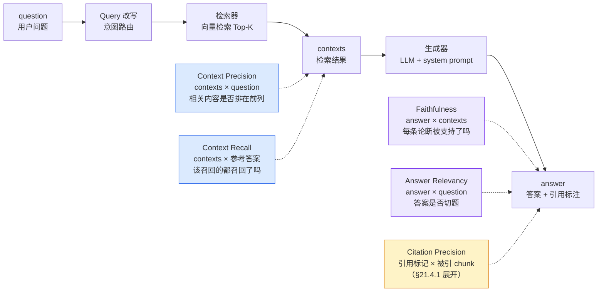
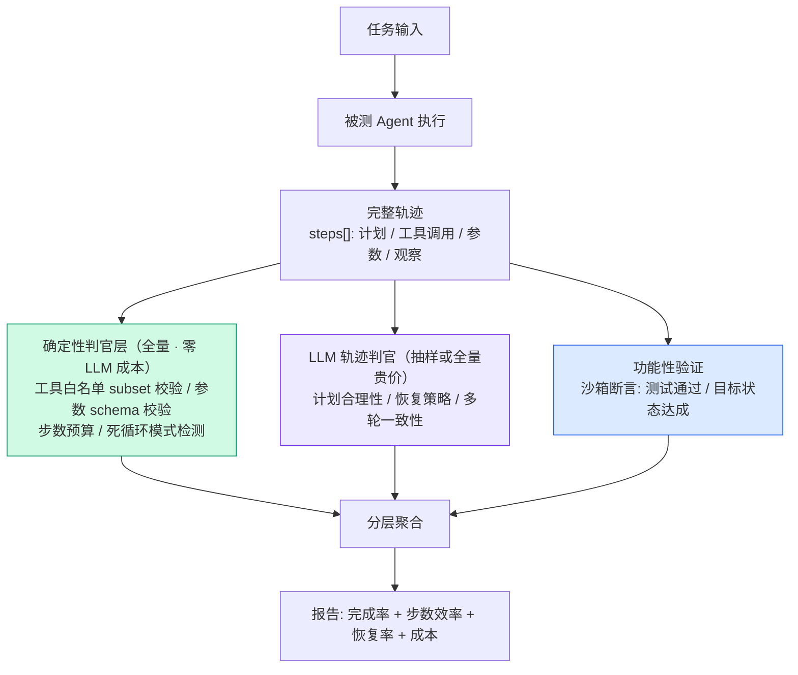
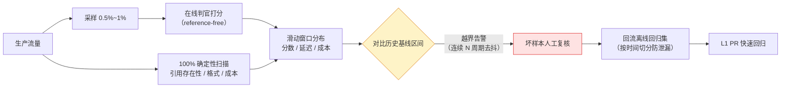

# 21. RAG / Agent / 应用层评估：评估你自己建的系统

> **概览**：应用层评估的关键在于分步归因，将端到端错误拆解至检索召回、忠实度生成与工具调用决策层。核心节次：§21.3 RAGAS 四指标与分步归因、§21.6 自建 Agent 系统评估体系。

> **前置知识**：第 19 章（模型层 vs Agent 层评估的八维差异表，19.5.1）、第 20 章（mini 评估框架与四层流水线）、第 5 章（LLM-as-Judge 校准）。本章代码：Node.js 20+、TypeScript、一个 OpenAI 兼容 API Key。

## 21.1 本章目标与读者

第 19 章回答"选什么工具"，第 20 章回答"评估器内部长什么样"；本章回答最后一块拼图：**怎么把两者组合起来，评估你自己建的 RAG 和 Agent 系统**。

分工先说清楚：第 13 章深拆了 SWE-bench、Terminal-Bench 这些**公开 Agent 基准的评测设计**；本章讲**自建视角**——当被测对象是"你公司的知识助手"和"你团队的运维 Agent"时，没有现成基准可跑，指标、测试集、生产接入都要自己定义。两件事共用一套概念，工程形态完全不同。

读完后你能：

- 逐项说清 RAGAS 四指标的计算原理（claim 分解、反向问题生成、rank 加权），分数异常时定位到具体修复动作
- 实现引用准确性与拒答率这两类"RAG 特有"评估
- 用"确定性判官先行、LLM 判官兜底"的分层方法评估自己的 Agent 轨迹
- 搭起在线采样判官与 drift 检测，让评估陪生产跑起来

## 21.2 概念引入：应用层评估是给你自己系统做的集成测试

> **前端类比**：公开基准评估 ≈ 标准化考试（考纲公开、题目固定）；应用层评估 ≈ 你给自家业务写的**集成测试 + 生产监控**——没有现成题库，要自己造 fixture、自己定义什么叫"对"、自己决定哪层门禁硬到能阻断发布。你绝不会拿高考全国卷去验收一个支付结算功能，同样绝不能拿 MMLU 做题分去验收客服业务机器人。

第 19 章 19.5.1 的八维差异表是本章的理论地基，这里只引用不重复。回忆表中最关键的一行：模型层评估的失败模式是幻觉与知识错误，**Agent 层的失败模式是卡死、死循环、工具误用、环境破坏**——这些失败在最终答案里全部隐身。RAG 介于两者之间："检索 + 生成"两步流水线，每一步都可能独立失败，且**失败的层不同，修复动作完全不同**。应用层评估的第一原则由此而来：**不要只评端到端结果，要给流水线的每一段挂上指标**。

## 21.3 RAG 评估深拆：RAGAS 四指标与分步归因

### 21.3.1 指标挂点：一张数据流图

RAGAS（Retrieval Augmented Generation Assessment）是 RAG 评估的事实标准指标集（来源：官方文档 https://docs.ragas.io ，抓取于 2026-08-28）。四个核心指标不是并列的"四把尺子"，而是分别挂在 RAG 流水线的不同位置：



读图方式：**五个指标两两组合，才能定位故障层**。检索类指标看"喂给模型的材料好不好"，生成类指标看"模型用这份材料答得好不好"——只有检索分高而 Faithfulness 低，才能断定问题在生成端。这就是分步归因，也是 RAG 评估的全部价值。

四个指标都依赖 LLM 判官（第 5 章的判官工程直接适用）。下面逐一拆计算原理——理解原理不是学术洁癖，而是**分数异常时唯一能依靠的调试入口**。

### 21.3.2 Faithfulness：claim 分解 + 逐条验证

Faithfulness（忠实度）测的是：**答案里的每条论断，是否都能从检索到的上下文推断出来**——它是幻觉率的代理指标。计算分两步（来源：RAGAS 官方 Faithfulness 文档 https://docs.ragas.io/en/stable/concepts/metrics/available_metrics/faithfulness/ ，抓取于 2026-08-28）：

1. **claim 分解**：判官 LLM 把答案拆成不可再分的独立论断。例："旗舰产品是 2024 年发布的 Pro 型号，续航 30 小时"可拆出"旗舰产品是 Pro""Pro 于 2024 年发布""续航 30 小时"三条。
2. **逐条验证**：对每条 claim，判官回答"能否从 contexts 推断"，得 0/1 判定。

```text
Faithfulness = 被检索上下文支持的 claim 数 / 答案中的 claim 总数
```

**前端类比**：把产品文案拆成逐条 bullet，逐条去 spec 文档核对——有一条找不到依据，整段文案的可信度就打折。注意粒度由判官决定：拆得太粗分数虚高，拆得太碎成本上升，rubric 必须写死拆分粒度并版本化（第 5 章判官五要素直接生效）。

### 21.3.3 Answer Relevancy：反向问题生成

Answer Relevancy（答案相关度）测**答案是否切题**。"切题"没法直接测量，RAGAS 用了一个聪明设计：**从答案反向生成问题，再比相似度**（来源：RAGAS 官方文档，同上）：

1. 判官 LLM 从答案生成 N 个"这个答案可能在回答的问题"（默认 3 个）；
2. N 个生成问题与用户原始问题分别做 embedding，算余弦相似度；
3. 取平均得分数。

原理一句话：**如果答案真的在回答问题，"从答案反推出来的问题"应该长得像原始问题**。答案跑题、答非所问、车轱辘话绕圈时，反推问题会明显偏离原问题，相似度掉下来。

**前端类比**：code review 里"只给 PR 的 diff，让 reviewer 猜它想修哪个 issue"——diff 对路则猜的标题与真实 issue 几乎一致，diff 跑题则对不上。

副产品价值：答案空泛、敷衍拒答时分数显著偏低，因此该指标天然把"答案太敷衍"也纳入了测量。

### 21.3.4 Context Precision / Recall：rank 加权与归因

两个指标都评检索，方向相反。

**Context Precision（检索精确度）**：Top-K 检索结果里，**相关的是不是排在前面**。判官逐条判断每个结果"对回答有没有用"，按排名加权：

```text
Context Precision@K = Σ( precision@k × v_k ) / Top-K 中相关条目总数
```

`v_k` 是第 k 位是否相关的判定。直观理解：同样是"3 条相关 2 条噪声"，相关 3 条排前三位比排后三位分数明显更高——**排在后面的内容要么被截断丢弃，要么稀释生成器的注意力**。这就是 rank 加权：位置即价值。

**Context Recall（检索召回率）**：**该召回的都召回了吗**。把参考答案拆成 claim，逐条检查"能否在检索结果中找到依据"，分数 = 有依据的 claim 数 / 总 claim 数。

关键工程差异：**Recall 需要参考答案，Precision 不需要**——Recall 只能离线跑（先人工准备 ground truth），Precision 可直接对无参考的生产流量跑。

### 21.3.5 分数低时的修复路径

理解计算原理后，"分数低"不再是笼统的"效果不好"，而是可映射到具体修复动作的信号：

| 异常模式 | 归因 | 修复路径 |
|---|---|---|
| Faithfulness 低 + 检索指标正常 | 生成端不守规矩，自由发挥 | system prompt 加"仅基于上下文回答，无依据时说不知道"；换更强模型 |
| Faithfulness 低 + Context Precision 低 | 噪声上下文诱发编造 | 先修检索（下行），再加引用要求 |
| Context Precision 低 | 相关内容混在噪声里、排位差 | 加重排（rerank）；调小 chunk 提升纯度 |
| Context Recall 低 | 该召回的没召回 | 调大 top-K；调 chunk 策略；补索引覆盖缺口 |
| Answer Relevancy 低 | 答非所问 | 检查 query 改写与意图路由；检查是否被无关检索内容带偏 |
| 检索根本没触发 | Agent 场景下的工具选择失败 | 检查工具描述与路由逻辑（§21.6 轨迹评估接手） |

（归因框架综合自 Langfuse agent 评估指南的 RAG 分步归因与 RAGAS 指标文档，抓取于 2026-08-28）

这张表是本章操作核心。**每个指标必须配一条"分数低时做什么"**——一个没有修复路径的指标，团队三个月后就会停止看它。

## 21.4 引用准确性与拒答评估

### 21.4.1 Citation Precision：引用标注是否真的支持该句

生产级 RAG 通常在答案里挂引用标记（如 `[1]`）。但引用存在 ≠ 引用正确——**标了 `[3]` 不代表第 3 个检索片段真的支持那句话**。Citation Precision（引用准确率）测：给出的引用中，真正支持对应论断的比例。计算与 Faithfulness 同构，验证对象从"整条答案"换成"带引用的单句 × 被引 chunk"：

1. 按引用标记切句：`"退货期限 30 天 [1]。会员可延长到 60 天 [2]。"` 切出两条；
2. 对每条句子，判官验证"是否被 `[n]` 指向的 chunk 支持"；
3. Citation Precision = 被支持的引用数 / 引用总数。

它与 Faithfulness 的分工：Faithfulness 管"答案整体没编造"，Citation Precision 管"逐句溯源指对了地方"。用户点开引用发现对不上时，破坏的是产品信任——这类故障 Faithfulness 分数完全看不见。§21.5 的 mini 评估器同时实现两个指标。

### 21.4.2 拒答率与边界问题：知识助手必须会"说不知道"

RAG 的能力不是"什么都能答"，而是**在知识库覆盖范围内答得准**。评估集必须有超纲子集，测两件事：

- **应拒尽拒**：超纲问题被正确拒答的比例（目标参考值 ≥ 0.9，来源：framework-practice.md 设计模式库模板目标值）；
- **不该拒的别拒**：正常问题被误拒的比例（隐性代价见第 22 章 22.7 的"不对称性"）。

更难也更有价值的是**边界问题**：知识库只有部分信息。例：知识库写"标准退货期 30 天"，用户问"越南仓的退货期"。坏行为是编数字（Faithfulness 会抓住）；好行为是"标准退货期为 30 天，越南仓政策不在当前资料范围内"——**回答已知部分 + 显式声明未知部分**。这类行为用单独的"边界子集"测，判官 rubric 三档打分：编造了不支持的内容 / 回答已知但未声明缺口 / 回答已知且声明缺口（每档给可核验的证据条件，第 5 章判官五要素）。

## 21.5 实现细节：一个可运行的 mini RAG 评估器

把原理落成代码。脚本实现两个核心指标——Faithfulness（claim 分解 + 逐条验证）与 Citation Precision（逐句验证引用），结束时输出修复路径提示；它就是 17.5 mini 框架的 RAG 特化版，复用同样的判官协议与落盘习惯。

```typescript
// mini-rag-eval.ts —— RAG 评估器：Faithfulness + Citation Precision
// 运行: OPENAI_API_KEY=sk-xxx npx tsx mini-rag-eval.ts rag-cases.json
// rag-cases.json 每条: { id, question, answer, contexts: string[] }（answer 内含 [1] 式引用标注）
// 期望输出: 每条 case 的指标分数 + 低分项修复提示 + reports/ 落盘
import { readFileSync, writeFileSync, mkdirSync } from "node:fs";
import OpenAI from "openai";

const client = new OpenAI();
const JUDGE = "gpt-4o-mini"; // 占位模型名，替换为你账号可用的模型

type Case = { id: string; question: string; answer: string; contexts: string[] };
type Score = { key: string; value: number; comment?: string };

// 判官协议：与 17.5 相同的统一签名思想——一次 LLM 调用返回结构化 JSON
async function jsonCall(system: string, user: string) {
  const r = await client.chat.completions.create({
    model: JUDGE, temperature: 0, response_format: { type: "json_object" },
    messages: [{ role: "system", content: system }, { role: "user", content: user }],
  });
  return JSON.parse(r.choices[0].message.content ?? "{}");
}

const SPLIT = `把 ANSWER 拆成不可再分、可单独验证真伪的论断（一个数字/日期/政策条款各算一条）。只输出 JSON {"claims": string[]}`;
const VERIFY = `判断 CLAIM 是否能从 CONTEXTS 推断出来，不支持即 false。只输出 JSON {"supported": boolean, "reason": string}`;

// ---- 指标 1：Faithfulness = 支持的 claim 数 / 总 claim 数（§21.3.2 两步法）----
async function faithfulness(c: Case): Promise<Score> {
  const { claims } = await jsonCall(SPLIT, `ANSWER: ${c.answer}`);
  if (!claims?.length) return { key: "faithfulness", value: 1, comment: "无可拆分论断" };
  const verdicts = await Promise.all(claims.map((claim: string) =>
    jsonCall(VERIFY, `CONTEXTS:\n${c.contexts.join("\n---\n")}\n\nCLAIM: ${claim}`)));
  const supported: boolean[] = verdicts.map((v) => Boolean(v.supported));
  const bad = claims.filter((_: string, i: number) => !supported[i]).join(" | ");
  return { key: "faithfulness", value: supported.filter(Boolean).length / claims.length, comment: "不支持: " + bad };
}

// ---- 指标 2：Citation Precision = 被支持的引用 / 引用总数（§21.4.1）----
async function citationPrecision(c: Case): Promise<Score> {
  const sentences = c.answer.split(/(?<=[。.!?！？])\s*/).filter((s) => /\[\d+\]/.test(s));
  if (!sentences.length) return { key: "citation_precision", value: 1, comment: "无引用标注" };
  const ok = await Promise.all(sentences.map(async (s) => {
    const idx = Number(s.match(/\[(\d+)\]/)?.[1]) - 1;
    const ctx = c.contexts[idx] ?? ""; // 引用越界 = 直接判不支持
    const v = await jsonCall(VERIFY, `CONTEXTS:\n${ctx}\n\nCLAIM: ${s}`);
    return Boolean(v.supported) && ctx !== "";
  }));
  return { key: "citation_precision", value: ok.filter(Boolean).length / sentences.length };
}

// ---- 修复路径：把 §21.3.5 的归因表编进代码，分数直接映射行动 ----
function repairHint(scores: Score[]): string[] {
  const get = (k: string) => scores.find((s) => s.key === k)?.value ?? 1;
  const hints: string[] = [];
  if (get("faithfulness") < 0.9) hints.push("生成端问题：system prompt 加『仅基于上下文回答，无依据时说不知道』");
  if (get("citation_precision") < 0.85) hints.push("引用问题：核对引用编号生成逻辑与 chunk 排序一致性");
  return hints;
}

const cases: Case[] = JSON.parse(readFileSync(process.argv[2] ?? "rag-cases.json", "utf8"));
const report = [];
for (const c of cases) { // 样例串行；批量跑请套用 17.5 的 mapPool 有界并发
  const scores = [await faithfulness(c), await citationPrecision(c)];
  const hints = repairHint(scores);
  report.push({ id: c.id, scores, hints });
  console.log(`${c.id}: ${scores.map((s) => `${s.key}=${s.value.toFixed(2)}`).join(" ")}`);
  for (const h of hints) console.log(`  → ${h}`);
}
mkdirSync("reports", { recursive: true });
writeFileSync("reports/rag-eval.json", JSON.stringify(report, null, 2));
```

三个设计决策：**判官全部结构化输出**（解析失败显式报错，不做静默兜底）；**引用越界直接判不支持**（`contexts[idx]` 取不到说明引用编号生成逻辑有 bug——评估器该抓的产品缺陷）；**修复提示编进评估器**——归因表不该活在文档里，应活在评估输出里。扩展方向：套 17.5 的 `mapPool` 与 Wilson 区间、加 Answer Relevancy（反向问题生成 + embedding 余弦）、判官加金标准集回归（第 5 章）。

## 21.6 Agent 系统评估（自建视角）

### 21.6.1 与公开基准的分工

第 13 章已深拆公开 Agent 基准的评测设计（Terminal-Bench 的容器 + 验证脚本、AppWorld 的状态断言）。它们测的是**模型的通用 agent 能力**；本章关心另一个物种：**你的运维 Agent、测试 Agent、客服 Agent**——工具集私有、任务业务特定、正确标准只有你的团队知道。公开基准分数对自建系统几乎没有迁移性（19.5.3 的"MMLU ≠ agent 能力"论证同样成立）。

能迁移的是**设计思想**，最重要一条来自 AppWorld（9.8.2）：**查最终状态而不是查回答**——agent 可以说得很漂亮但什么都没做成，状态不会撒谎。有可检查副作用（文件写了、工单建了、API 调了）就优先状态断言；没有副作用才用判官评对话。

### 21.6.2 轨迹评估：确定性判官先行，LLM 判官兜底

Langfuse 官方把 agent 评估分四个维度：trajectory（轨迹）、tool use（工具使用）、task completion（任务完成）、multi-turn（多轮），并强调它们**独立失败**（16.5.1 已引用原文）。落到自建工程，标准做法是把轨迹拆开喂给两层判官：



确定性层有现成词汇表：LangChain 官方 `agentevals` 的四种轨迹对比模式（16.5.4 已引入）——`strict`（同序）/ `unordered`（乱序）/ `subset`（只许用参考集合内工具）/ `superset`（至少完成参考工具调用）。自建实现就是几十行 TypeScript：抽出轨迹里的工具调用序列，与预期集合做集合运算：

```typescript
// trajectory-judges.ts —— 确定性轨迹判官：全量跑、零 LLM 成本
type ToolCall = { name: string; args: Record<string, unknown> };
type Step = { role: string; toolCalls?: ToolCall[] };
type Trajectory = { steps: Step[]; finalState?: Record<string, unknown> };

// 判官 A：工具白名单（agentevals "subset" 语义）——防越权与超范围调用
function withinWhitelist(traj: Trajectory, allowed: Set<string>): boolean {
  return traj.steps.flatMap((s) => s.toolCalls ?? []).every((c) => allowed.has(c.name));
}

// 判官 B：步数预算——步数不超过最优步数的 2 倍（模板目标值，见 §21.6.3）
function withinStepBudget(traj: Trajectory, optimal: number, budget = 2): boolean {
  const used = traj.steps.filter((s) => s.toolCalls?.length).length;
  return used > 0 && used <= optimal * budget;
}

// 判官 C：死循环检出——同一工具 + 同参数连续调用 3 次以上（目标值：恒为 0）
function hasDeadLoop(traj: Trajectory): boolean {
  const key = (c: ToolCall) => c.name + JSON.stringify(c.args);
  let run = 0, prev = "";
  for (const c of traj.steps.flatMap((s) => s.toolCalls ?? [])) {
    run = key(c) === prev ? run + 1 : 1;
    prev = key(c);
    if (run >= 3) return true;
  }
  return false;
}
```

这三个判官覆盖了 LLM 判官最容易看走眼的失败模式——死循环的 token 成本是确定性浪费，但每一步单看都"合理"，判官 LLM 读整条轨迹很可能放行，规则一查就现形。

### 21.6.3 三个过程指标的定义与目标值

| 指标 | 定义 | 评分方式 | 模板目标值 |
|---|---|---|---|
| 步数效率 | 实际工具调用步数 / 已知最优步数 | 确定性计数 + 预算断言 | ≤ 2× |
| 错误恢复率 | 工具调用失败后 N 步内达成子目标的比例 | 确定性：失败点之后扫描子目标达成 | ≥ 0.7 |
| 死循环检出 | 同参数重复调用 ≥ 3 次 | 确定性模式匹配 | 恒为 0 |

（定义与模板目标值来源：framework-practice.md 4.6.4 模式 D，综合 Langfuse agent 评估指南。）

任务完成率最难自动化。分层方法（便宜代码检查跑全量、判官只跑语义子集、分歧路由人工，标签回流校准判官——Langfuse 官方口径）：先 LLM 判官评"用户目标是否达成"，人工标 50 条校准（第 5 章流程，κ ≥ 0.7 才可上 CI），再全量放跑。无沙箱可断言时，判官 + 校准是唯一可行路径；有沙箱时永远优先状态断言。

## 21.7 生产监控：在线采样判官与 drift 检测

离线评估再完善，也覆盖不了真实流量的分布漂移——用户会问出测试集里没有的问题形态。生产监控层三个部件：

**第一件：在线采样判官。** 按采样率（首月建议 0.5%–1%，来源：第 20 章 §20.6.1 四层流水线）挂 reference-free 判官——离线/在线复用同一判官的前提是不依赖参考答案（§19.6.1）。LangSmith 与 Langfuse 均支持按 project 配采样率、过滤条件与花费上限（来源：两平台官方文档，抓取于 2026-08-28）。

**第二件：100% 确定性扫描。** 合规红线类检查（引用编号存在性、格式、命中拒答标记、成本超预算）零 LLM 成本，**全量跑**——0 容忍的事不能交给采样（第 20 章 §20.6.2）。

**第三件：drift 检测。** 判官分数按时间窗口聚合，与历史基线的**区间**比较（不是绝对值），越界即告警并回流样本：



**Phoenix 与 Langfuse 的落点分工**：Phoenix（Arize 出品，开源）tracing + evals 一体，`phoenix serve` 本地起服务，trace 与幻觉判官同界面看，适合开发期定位坏 case（来源：docs.arize.com/phoenix，抓取于 2026-08-28）；Langfuse 优势在观测级评估（score 可挂到检索、生成等具体 span，16.4.2）与 OTel 原生上报，适合生产期持续监控 + 自托管。两者是**可观测底座**而非评估引擎——判官逻辑、阈值、回流纪律仍是你自己的工程。

drift 检测最容易踩的坑是**只盯分数不盯输入分布**。判官分数稳定不代表系统健康——用户提问的主题结构变了（新功能上线带来新意图），分数可能数周后才显现劣化。对输入做轻量聚类（意图标签计数即可起步），观察"新意图占比"这个先行指标，通常比质量分数早一到两周发现漂移。

## 21.8 实战与陷阱

1. **只评端到端，指标糊在一起。** 只跑"问题进、答案出"的评估，Faithfulness 低时无法区分检索坏了还是生成坏了。最低限度：把检索结果单独落盘，让检索指标与生成指标分开计算。
2. **生产判官一上来就 5% 采样。** 在线层是唯一不能关掉重来的层——判官跑出的脏数据一旦回流测试集就是永久污染。首月 0.5% 起步（17.11 施工顺序第 5 条）。
3. **代理指标当精确值汇报。** 简化实现的相似度代理（如词元 Jaccard）只够发现"答非所问"的趋势，直接写进周报当 KPI 会被追问口径——代理指标必须标注口径，精确值上 embedding 余弦。

## 21.9 验收自测

1. **选择**：评估报告显示 Faithfulness = 0.62，而 Context Precision 与 Context Recall 都在 0.9 以上。最可能的故障层是？
   - A. 检索器没召回相关内容
   - B. 生成端未遵守"仅基于上下文回答"，自由发挥
   - C. embedding 模型版本不匹配
   - D. 判官模型太弱

2. **选择**：RAGAS 四指标中，**必须**准备参考答案（ground truth）才能计算的是？
   - A. Faithfulness
   - B. Answer Relevancy
   - C. Context Recall
   - D. Context Precision

3. **选择**：Agent 轨迹里出现"同一工具 + 同一参数连续调用 5 次"，正确的设计是？
   - A. 交给 LLM 轨迹判官人工酌情判断
   - B. 确定性判官直接判失败——死循环是零成本可检出的确定性浪费
   - C. 只统计成本，不作为失败
   - D. 提高采样率让判官多看几次

4. **简答**：Faithfulness 与 Citation Precision 都是"答案 × 上下文"的验证，为什么两个都要测？举一个只有 Citation Precision 能抓到的故障例子。

5. **简答**：为什么生产在线判官必须写成 reference-free 版本？如果它依赖参考答案会发生什么？

6. **实操**：跑通 21.5 的 `mini-rag-eval.ts`：造 5 条 case（至少 1 条让答案故意写一个 contexts 里不存在的数字），观察 `faithfulness` 是否明显低于其他 case 并确认修复提示输出；再给一条答案加指向错误 chunk 的 `[2]` 标注，验证 `citation_precision` 掉分。

## 21.10 本章 Cheat Sheet

| 概念 | 一句话 | 详见 |
|---|---|---|
| 指标挂点 | 每个指标绑定流水线的一段，两两组合定位故障层 | §21.3.1 |
| Faithfulness | claim 分解 + 逐条验证：被支持的论断数 / 总论断数 | §21.3.2 |
| Answer Relevancy | 反向问题生成比相似度：答案切题则反推问题像原问题 | §21.3.3 |
| Context Precision/Recall | rank 加权评排位；参考答案评召回（Recall 需 ground truth） | §21.3.4 |
| Citation Precision | 引用标记 × 被引 chunk 逐句验证，标错号 Faithfulness 看不见 | §21.4.1 |
| 拒答评估 | 应拒尽拒 + 不误伤 + 边界三档，缺一不可 | §21.4.2 |
| 轨迹评估分层 | 确定性判官全量先行，LLM 判官兜语义，沙箱断言优先 | §21.6.2 |
| 生产监控 | 采样判官 + 全量确定性扫描 + 区间比较的 drift 检测 | §21.7 |

## 21.11 5 个常见错误

1. **把 RAGAS 四个分数当四个独立 KPI 汇报**——它们是联合诊断工具，单独看任何一个都会误诊；修复路径表（§21.3.5）必须一起贴。
2. **判官 rubric 不写 claim 拆分粒度**——拆分粒度直接决定分数高低，不定版的判官产出的历史曲线没有可比性。
3. **Agent 评估只报任务完成率**——过程质量（步数/工具选择/恢复）独立失败且在最终答案里隐身；完成率 80% 可能是靠三倍 token 硬烧出来的。
4. **生产监控只盯质量分**——输入分布漂移比分数劣化早一两周出现；意图计数是最便宜的先行指标。
5. **拒答优化方向走反**——拒答率上升不等于质量上升；误拒率与边界处理质量必须同表监控（与第 22 章安全指标不对称性同一逻辑）。

## 21.12 延伸阅读

⭐⭐⭐（官方一手）
- [RAGAS 文档：指标与 Faithfulness 定义](https://docs.ragas.io/en/stable/concepts/metrics/available_metrics/faithfulness/) — claim 分解两步法的官方出处
- [Langfuse：AI agent evaluation 指南](https://langfuse.com/resources/engineering/ai-agent-evaluation) — 四维分解与分步归因框架

⭐⭐（方法论）
- [Phoenix 文档](https://docs.arize.com/phoenix) — tracing + evals 一体的本地可观测
- [MT-Bench（arXiv:2306.05685）](https://arxiv.org/abs/2306.05685) — 判官校准的原始锚点（本章判官全部依赖）

⭐（生态工具）
- [DeepEval RAG metrics](https://deepeval.com/docs/evaluation-introduction) — pytest 风格的 RAG 指标实现
