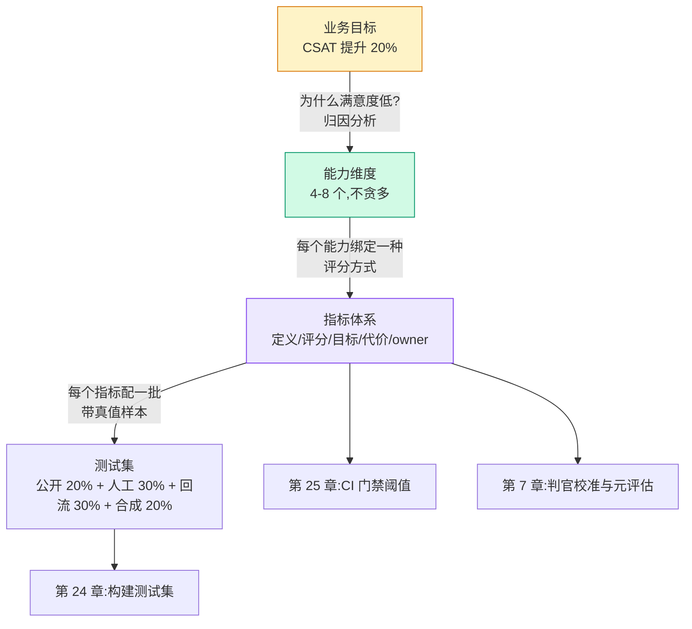
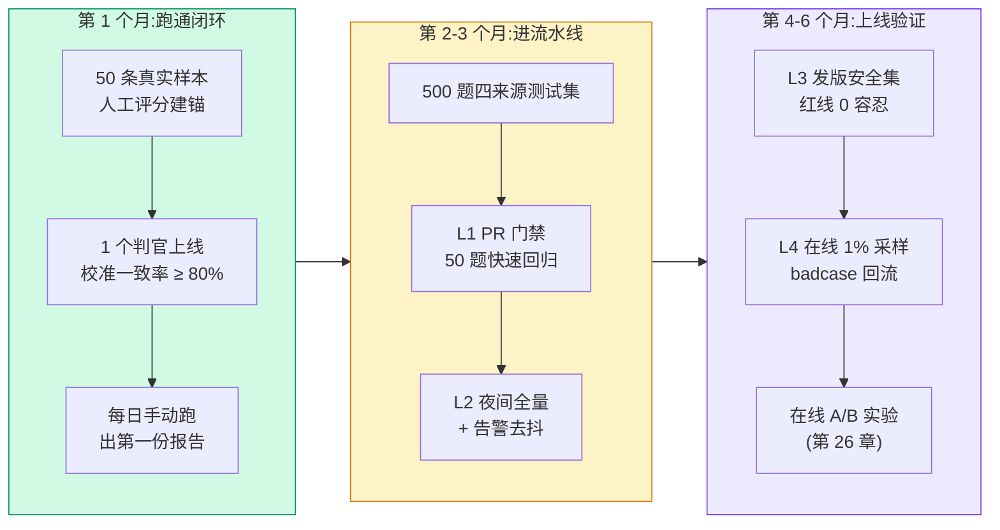

# 23. 我的应用需要评估什么：业务目标 → 能力 → 指标

> **概览**：构建评测体系需遵循业务目标到测试集的四步推导法，杜绝在缺乏能力拆解时盲目套用公开基准。核心节次：§23.3 业务目标到测试集四步法、§23.5 指标设计五原则。

## 23.1 本章目标与读者

从这一章开始进入第 5 部分：**把前 4 部分的认知变成你自己的评估系统**。第 4 章给了你标准流水线（数据集 → 推理 → 评分 → 报告），第 20 章给了你 mini 框架，第 5 章给了你判官工程——但它们都没回答最先出现的问题：**"我的应用到底该评什么？"**

这个问题答错，后面全部返工。最常见的死法是：拿到任务"给 AI 客服建评估"，第一反应是"找个基准跑个分"，于是测了个 MMLU 和 HumanEval——通用能力分数 90 分，上线后客服答错退款政策，客诉爆炸。通用基准测的是模型的"通识教育水平"，你的业务需要的是"这个模型在我的 300 个业务场景里答不答得对"，两者几乎无关。

读完后你能：

- 用四步法把一句业务目标拆成可评估的指标体系
- 用 4 种方法做能力拆解（用户旅程 / FMEA / KPI 反推 / 竞品对标），并知道每种方法适合什么场合
- 给每个指标写出"定义、评分方式、目标值、失败代价、owner"五要素
- 拿到一份 1-3-6 个月的"最小可行评估"落地路线

**前置知识**：第 2 章（评估五问）、第 4 章（标准四步法）、第 20 章（mini 评估框架）。本章不写模型训练内容，全部代码为 TypeScript。

## 23.2 概念引入：评估系统的"需求文档"

**前端类比**：业务目标 → 能力 → 指标 → 测试集的拆解过程，就是给评估系统写需求文档（PRD）。业务目标是"用户要什么"，能力维度是"功能模块怎么切"，指标是每个模块的验收标准（acceptance criteria），测试集是自动化测试用例。跳过拆解直接写测试用例的团队，和跳过设计直接写代码的团队，结局是一样的——返工。

一张图先建立全局心智模型：

```text
[业务目标]  "让客户满意度提升 20%"
     ↓ 拆解（本章 22.3）
[能力维度]  意图理解 / 事实正确 / 语气合规 / 响应速度
     ↓ 设计（本章 22.5）
[指标体系]  意图 F1 / faithfulness / 合规红线 0 容忍 / P95 延迟
     ↓ 落地（下一章 23）
[测试集]    每个指标一批带真值的题目
```

每一层都必须可追溯到上一层：**任何一个指标被质疑"为什么要测它"，答案应该能一路指回业务目标**。指不回去的指标就是第 4 部分反复出现的那类虚荣指标——好看、没人负责、没人使用。拆解的产物最好是一张机器可读的能力卡，它在后续所有章节里反复出现：

```typescript
// capability.ts —— 能力卡:整个评估系统的最小单元
// 运行: npx tsx capability.ts(无网络,纯类型与数据结构)
type Capability = {
  id: string;              // "intent-accuracy"
  name: string;            // "意图识别准确率"
  fromGoal: string;        // 追溯:服务于哪条业务目标
  method: string;          // 评分方式:规则 / 判官 / 人工
  target: number;          // 目标值,如 0.92
  blastRadius: "high" | "medium" | "low"; // 失败代价
  owner: string;           // 谁对该指标恶化负责
  dataset?: string;        // 关联测试集(下一章填充)
};

const intent: Capability = {
  id: "intent-accuracy",
  name: "意图识别准确率",
  fromGoal: "CSAT 提升 20% → 答非所问是差评首因",
  method: "top-1 与人工标注意图精确匹配",
  target: 0.92,
  blastRadius: "medium",
  owner: "对话算法组 @李工",
};
console.log(intent.id, "->", intent.target); // 期望输出: intent-accuracy -> 0.92
```

这张卡就是后续测试集（第 24 章）、CI 门禁（第 25 章）、元评估（第 7 章）的共同锚点：门禁按 `owner` 找人，回归按 `target` 判定，判官校准按 `method` 设计。

## 23.3 四步法：从一句业务目标到一套测试集

### 23.3.1 四步流转



**第 1 步：把业务目标写成可归因的句子。**"让客服更好用"不可归因；"CSAT 从 4.1 提到 4.4，其中差评样本里'答非所问'占比从 35% 降到 20%"可归因。差距来自哪一步的归因分析（工单聚类、差评关键词统计），决定你拆出哪些能力。

**第 2 步：拆能力维度，控制在 4-8 个。**少于 4 个说明归因没做完（把多个独立失败模式合并成了一个能力）；多于 8 个通常是把指标当能力抄了一遍（"faithfulness 高"是指标，"答案忠于检索到的知识库"才是能力）。

**第 3 步：每个能力绑定一种评分方式。**评分方式决定成本与可信度上限，三档：

| 评分方式 | 成本 | 可信度 | 适用 |
|---|---|---|---|
| 确定性规则（正则 / 精确匹配 / 单测执行） | 零 | 高（但表达力低） | 格式、红线、有唯一答案的题 |
| LLM-as-Judge（第 5 章） | 中 | 中（需校准） | 忠实度、切题度、语气 |
| 人工评估（第 6 章） | 高 | 高（人少时不稳定） | 抽检、判官校准、上线前终审 |

**第 4 步：每个指标配测试集。**这一步的工程在第 24 章展开，本章只需要记住配比约束：测试集里的题型分布必须匹配真实流量分布，而不是匹配"容易写题的场景"。

### 23.3.2 一个贯穿全书的例子：客服 RAG

第 5 部分和第 27 章共用同一个例子——"企业知识助手"（内部知识库 RAG 问答）。北极星是 CSAT，归因分析给出五条失败路径：

```text
CSAT 低
 ├─ 答案错了            → 事实正确性（faithfulness）
 ├─ 答案不对题          → 切题度（answer relevancy）
 ├─ 该答不答 / 编造     → 拒答正确率 + 幻觉率
 ├─ 没说清出处          → 引用准确性（citation precision）
 └─ 找错文档            → 检索质量（context precision/recall）
```

这个倒推链的价值在于**每条边都可检验**：说"CSAT 低是因为答案错了"，拿 30 条差评会话人工看一遍就能证实或证伪。归因没做实就拆能力，是四步法里最常见的"假拆解"。

## 23.4 能力拆解的 4 种方法（每种配真实案例）

四种方法不是四选一，而是**按顺序互补**：用户旅程给骨架，FMEA 找软肋，KPI 反推定优先级，竞品对标补盲区。

### 23.4.1 方法一：用户旅程——沿着用户走的每一步拆

把用户从进入到离开的完整路径画出来，每一步问"这一步失败会怎样"。适合冷启动：还没有任何数据时，旅程图是唯一不依赖历史数据的拆解法。

真实案例（开发者文档问答助手）：旅程是"打开页面 → 输入问题 → 等待回答 → 看到带引用的答案 → 点引用跳转 → 追问"。逐步拆出六个能力：

| 旅程步骤 | 失败模式 | 对应能力 |
|---|---|---|
| 输入问题 | 输入含截图/报错栈，纯文本丢失信息 | 多模态输入理解 |
| 等待回答 | 超过 15 秒用户流失 | P95 延迟 |
| 看到答案 | 答案与文档版本不匹配 | 时效性 |
| 看到引用 | 引用了不存在的章节号 | 引用准确性 |
| 点引用跳转 | 引用链接 404 | 引用可解析性 |
| 追问 | 忘记上文说过的版本号 | 多轮状态保持 |

注意"点引用跳转"这一步——它不是模型能力，是**系统行为**（链接拼接逻辑），但用户不区分模型和产品，跳转 404 一样算"这 AI 不靠谱"。用户旅程法的好处就是能抓到这类被"只评模型"的视角漏掉的能力。

### 23.4.2 方法二：FMEA——想"哪里会失败"

FMEA（Failure Mode and Effects Analysis，失效模式与影响分析，汽车与航空业的标准方法论）换了个方向：不从"用户做什么"出发，而从"系统哪里会坏"出发。每条失败模式按 **发生频率 × 检测难度 × 后果严重度** 打分，分数高的优先建评估。

真实案例（客服 bot 合规评审）：

| 失败模式 | 频率 | 后果 | 检测难度 | 优先级 | 评估对策 |
|---|---|---|---|---|---|
| 对退款政策做出超出规定的承诺 | 中 | 高（法务风险） | 高（话术多变） | P0 | 红线题集 0 容忍 + 线上全量扫描 |
| 泄露系统提示词 | 低 | 高 | 低 | P0 | 注入攻击题集（第 22 章 garak 式） |
| 答案编造不存在的优惠 | 中 | 高 | 高 | P0 | faithfulness + 抽检 |
| 回答冗长用户看不完 | 高 | 中 | 低 | P1 | 长度分布监控 |
| 情绪激动时语气机械 | 中 | 中 | 中 | P1 | 同理心评分子集 |

FMEA 输出的 P0 项有一个共同特征：**后果不可逆**（法务、资损、信任）。不可逆的失败不能靠"平均分 0.87"覆盖，必须单独建子集、单独设阈值、单独设 owner——这是第 25 章发版安全集（L3）0 容忍语义的来源。

### 23.4.3 方法三：KPI 反推——从业务数字倒着走

从北极星指标出发，问"什么因素影响它"，一层层往下，直到落到可评估的技术指标。适合向管理层要资源：每一层都有业务数字背书，评估方案容易获得立项。

真实案例（电商导购助手）：

```text
GMV（北极星）
 └─ 转化率 ← 推荐点击率
      └─ 推荐点击率 ← 推荐列表相关性 + 文案吸引力
           ├─ 相关性 ← 推荐理由与商品属性一致（faithfulness 变体）
           └─ 文案吸引力 ← 人工评分 / 线上 CTR
                ↓ 落到评估
           指标 1: 推荐理由忠实度 ≥ 0.9（判官）
           指标 2: 文案人工评分 ≥ 4.0/5（抽检 50 条/周）
           指标 3: 线上推荐 CTR 相对提升 ≥ 3pp（第 26 章 A/B）
```

KPI 反推最容易犯的错是**把北极星直接当评估指标**。GMV/CSAT 是结果指标：回收慢（要等真实用户）、稀疏（反馈少）、归因难（同时受价格、季节、运营影响）。评估系统要的是**驱动指标**（driver metric）——"答案忠实度"今天就能在 500 题上测出 0.83，而 CSAT 要等两周才积累出足够样本。两者都要，但评估流水线只挂驱动指标。

### 23.4.4 方法四：竞品对标——抄能力清单，不抄分数

把竞品的发布说明、帮助文档、用户评价翻一遍，列出"它宣传了什么能力、用户夸什么骂什么"，转成你的能力清单。适合成熟赛道：能力集已经被市场验证过，抄清单便宜。

真实案例（代码助手立项）：竞品 A 的发布说明主打"多文件重构"，用户评价里高频抱怨"改坏了没改的文件"；竞品 B 主打"解释友好"，用户抱怨"简单任务也要等 30 秒"。转成能力清单：

| 来源 | 能力 | 你要测什么 |
|---|---|---|
| 竞品 A 宣传 | 多文件重构 | 跨文件一致性（改动后全仓编译通过） |
| 竞品 A 差评 | 误伤无关代码 | 改动最小性（diff 行数中位数） |
| 竞品 B 宣传 | 解释友好 | 解释清晰度人工评分 |
| 竞品 B 差评 | 简单任务延迟 | 简单题 P95 延迟 |

竞品对标只抄**能力清单**，分数一律不抄："竞品用了 MMLU 90 分"对你的测试集设计毫无帮助——第 8 章讲过厂商报告里基准选择的叙事成分。

### 23.4.5 四方法组合拳

一次完整拆解的建议顺序与产出：

1. **用户旅程**先跑一遍 → 得到 8-12 个候选能力（骨架）
2. **FMEA**逐条打分 → 淘汰低风险的，标出 P0 红线（软肋）
3. **KPI 反推**给存留能力排优先级 → 每个 P0/P1 能力找到业务数字（优先级）
4. **竞品对标**最后过一遍 → 查漏补缺，特别是自己没想到的差异化项（盲区）

产出收敛到 4-8 个能力维度，每个维度进入 22.5 的指标设计。

## 23.5 指标设计五原则

能力是名词，指标是可判定的断言。从能力到指标要过五道门：

**原则一：可测。**"AI 应该更聪明"不可测；"200 道客服题上意图 F1 ≥ 0.85"可测。检验办法：两个不同的人按同一句话执行，能否得到同一个数。

**原则二：与业务相关。**"GSM8K 准确率 95%"与客服无关；"退款政策问答准确率 95%"相关。检验办法：这个指标变动 5 个百分点，业务方会不会有感觉。

**原则三：可复现。**同一个输入、同一版配置，跑三次结果应当一致（温度 0 + 缓存，见第 20 章工程件）。检验办法：连续跑两次，分数差是否超过噪声区间（第 4 章 4.6.1 的 Wilson 区间）。

**原则四：可对比。**"我觉得新 prompt 更好"不可对比；"同一测试集上新版 pass 率 0.86、基线 0.80，差值超出噪声区间"可对比。指标必须定义在可与基线相减的量纲上，否则第 25 章的回归检测无从下手。

**原则五：可监控。**"偶尔人工看看"不可监控；"夜间 cron 全量跑、劣化超阈值发 Slack"可监控（第 25 章的 L2 层）。检验办法：这个指标如果三个月没人看，会不会有人发现它坏了——答案是不会，就还没接入流水线。

五原则落地为 22.2 那张能力卡的五个必填字段。少填一个，三个月后必然出现这两种事故之一：指标恶化了没人认领（缺 owner），或者所有人都说"这个数字不靠谱"（缺可复现的评分方式定义）。Langfuse 官方文档对指标扩张有一条告诫，值得抄进团队规范：只有当某个指标真的拦下过一次真实回归时才增加它，没有消费方的指标就是噪音（来源：Langfuse 官方文档，抓取于 2026-08-28）。

## 23.6 能力维度模板：四种常见应用

以下四张表是第 6 部分实战案例章的骨架，也是大多数业务的起点。列定义沿用 22.2 的能力卡字段。

**模板一：AI 客服**

| 能力 | 指标 | 评分方式 | 目标 | 优先级 |
|---|---|---|---|---|
| 意图识别 | top-1 分类 F1 | 精确匹配 | ≥ 0.92 | P0 |
| 事实正确 | faithfulness | 判官逐论断核验 | ≥ 0.95 | P0 |
| 合规红线 | 违规话术数 | 规则 + 分类器三层 | = 0（0 容忍） | P0 |
| 多轮保持 | 关键槽位不丢失率 | 确定性断言 | ≥ 0.95 | P1 |
| 拒答 | 超纲题正确拒答率 | 标注集比对 | ≥ 0.9 | P1 |
| 响应速度 | P95 延迟 | 埋点 | < 3s | P1 |
| 成本 | 单对话成本 | token 计量 | 预算内 | P2 |

**模板二：RAG 知识助手**

| 能力 | 指标 | 评分方式 | 目标 | 优先级 |
|---|---|---|---|---|
| 检索召回 | context recall | 参考答案比对 | ≥ 0.9 | P0 |
| 答案忠实 | faithfulness | 判官逐论断核验 | ≥ 0.95 | P0 |
| 答案切题 | answer relevancy | 判官评分 | ≥ 0.9 | P0 |
| 引用准确 | citation precision | 判官逐引用核验 | ≥ 0.85 | P1 |
| 时效性 | 过期信息率 | 时间戳比对 | < 2% | P1 |

（RAGAS 四指标的定义与公式见第 21 章；这里只列目标值与优先级。）

**模板三：代码助手**——22.4.4 的竞品对标表就是它的骨架（跨文件一致性、改动最小性、接受率、延迟），完整版见第 28 章，此处不再重复。

**模板四：内容生成（营销文案）**

| 能力 | 指标 | 评分方式 | 目标 | 优先级 |
|---|---|---|---|---|
| 品牌一致 | 与品牌指南偏离项数 | 判官按 rubric 核对 | ≤ 1 | P0 |
| 事实无误 | 可验证论断错误率 | 抽检人工 | < 1% | P0 |
| 长度合规 | 字数区间命中率 | 规则 | ≥ 0.95 | P1 |
| 线上效果 | 素材采用率 / 转化 | 业务系统 | ≥ 基线 | P0 |

模板的用法是**起点不是终点**：先照抄目标列，两周内用真实数据校准目标值（第一步的 0.92 可能根本达不到，也可能毫无挑战），再删掉你业务里根本不存在的行。模板里每一行都按 22.5 的五原则过了门，读者可以直接把表抄进自己的能力卡仓库。

## 23.7 最小可行评估：1-3-6 月路线

评估系统的最大风险不是"设计错了"，而是"设计了三个月还没跑出第一个数字"。反着来：先跑通最小闭环，再逐月加治理。



**第 1 个月：跑通闭环（目标是"有数字"）。**可执行清单：

- [ ] 从真实工单/日志抽 50 条样本（不要自己编题——编出来的题代表你的想象，不代表流量分布）
- [ ] 人工给 50 条打分，同步写下每条的"为什么"（这份标注就是后续判官校准集）
- [ ] 用第 20 章的 mini 框架跑通：数据集 → 被测物 → 判官 → 报告
- [ ] 判官与人工标注比对，一致率 ≥ 80% 才继续（低于 80% 先修 rubric，见第 7 章）
- [ ] 每日跑一次，报告发到一个固定频道（有人看比全量重要）

**第 2-3 个月：进流水线（目标是"自动化"）。**可执行清单：

- [ ] 测试集扩到 500 题，按第 24 章四来源配比（公开 20% / 人工 30% / 回流 30% / 合成 20%）
- [ ] L1：PR 触发 50 题快速回归，`process.exitCode` 门禁（第 25 章 YAML）
- [ ] L2：夜间 cron 全量，回归判断用置信区间不用点估计
- [ ] 告警去抖：连续 2 个周期越界才报，24 小时内不重复报
- [ ] 门禁先观察两周再阻断 merge——头两周只红不拦，用真实分布校准阈值

**第 4-6 个月：上线验证（目标是"闭环到业务"）。**可执行清单：

- [ ] L3：发版安全集，合规红线 0 容忍，不过阻断发版
- [ ] L4：线上 1% 采样判官打分 + 100% 确定性红线扫描（首月采样率宁低勿高）
- [ ] badcase 回流通道：点踩/升级会话 → 聚类 → 入测试集（第 24 章数据飞轮）
- [ ] 首次在线 A/B：离线胜出的版本上线前先过流量实验（第 26 章）
- [ ] 元评估例行化：每月一次判官一致率回归（第 7 章）

这条路线里藏着一条施工顺序原则（第 20 章 20.11 的展开）：**每一层都在上一层被真实使用过之后再建**。L1 门禁还没有人响应过告警就直接上 L4 采样，等于在没打地基的房子上装屋顶——楼上塌了都查不出是谁的责任。

## 23.8 实战：法律咨询助手的完整拆解

把前面所有方法串成一次完整推演。**业务目标**："为中小企业提供低成本法律咨询，替代 50% 的初级律师电话咨询。"

**归因**（KPI 反推 + FMEA 交叉）：替代律师的前提是"用户敢照着做"，而法律建议是**后果不可逆**领域——一句编造的法条可能引导用户签错合同。所以这个业务的 P0 不是"回答流畅"，而是"不编造"。

**能力拆解**（用户旅程给出骨架，FMEA 标出红线）：

| # | 能力 | 来源方法 | 优先级 |
|---|---|---|---|
| 1 | 法规引用真实存在且现行有效 | FMEA（编造法条） | P0 |
| 2 | 案件类型识别（劳动/合同/知识产权…） | 用户旅程 | P0 |
| 3 | 建议保守度（不怂恿激进操作） | FMEA（不可逆后果） | P0 |
| 4 | 超出范围时引导转人工 | 用户旅程 | P0 |
| 5 | 多轮澄清（追问补全案情） | 用户旅程 | P1 |
| 6 | 同理心（用户焦虑时的语气） | 竞品差评 | P1 |
| 7 | 输出结构化摘要供律师复核 | KPI 反推（律师工时） | P2 |

**指标设计**（每行五要素齐全）：

| 能力 | 指标定义 | 评分方式 | 目标 | 失败代价 | owner |
|---|---|---|---|---|---|
| 法规引用 | 引用法条中真实且现行的比例 | 判官对照法规库逐条核验 | ≥ 0.99 | 法务/声誉：极高 | 法务产品组 |
| 案件类型 | top-1 分类 F1 | 精确匹配 | ≥ 0.90 | 路由错：中 | 对话组 |
| 建议保守 | 激进建议检出数 | 律师评审红线题集 | = 0 | 资损：极高 | 对话组 |
| 转人工 | 超纲题正确转介率 | 标注集比对 | ≥ 0.95 | 信任：高 | 对话组 |
| 多轮澄清 | 槽位补全后无需重述率 | 判官对照会话轨迹 | ≥ 0.85 | 体验：中 | 对话组 |

**测试集来源**（第 24 章展开工程细节）：

| 来源 | 数量 | 用途 |
|---|---|---|
| 公开法律题（Bar Exam 类） | 100 | 通用基线 |
| 律师手写边界题 | 200 | 红线与保守度 |
| 历史真实咨询脱敏 | 150 | 真实分布 |
| LLM 合成长尾 | 50 | 冷门罪名覆盖 |

这个例子里最值得注意的决策：**通用基线只占 20%**。法律咨询的效果由"法规引用真实性"决定，而这个能力任何公开基准都不测——公开分数只用来回答"我们比上周的自己好在哪"，不回答"我们的产品可用没"。

## 23.9 验收自测

1. **选择**：四步法的正确顺序是？
   - A. 测试集 → 指标 → 能力 → 业务目标
   - B. 业务目标 → 能力维度 → 指标 → 测试集
   - C. 业务目标 → 指标 → 能力维度 → 测试集
   - D. 能力维度 → 业务目标 → 指标 → 测试集

2. **选择**：客服 bot 的"对退款政策做出超范围承诺"应该用哪层防线？
   - A. 平均 faithfulness 分数覆盖
   - B. 红线题集 0 容忍 + 线上全量确定性扫描
   - C. 每月人工抽检 10 条
   - D. 提高 judge 模型档位

3. **选择**：北极星指标（如 CSAT）不适合直接挂进评估流水线的原因是？
   - A. 数值太大会溢出
   - B. 回收慢、样本稀疏、归因难，且不随代码变更快速变化
   - C. 管理层看不懂
   - D. 与模型无关

4. **简答**：用户旅程法能抓到、而"只评模型"视角会漏掉的能力，请举一例并说明为什么。

5. **简答**：为什么"每个指标必须有 owner"？没有 owner 的指标会发生什么？

6. **实操**：为你正在做（或熟悉）的 AI 应用跑一遍四方法组合拳：用户旅程列 8-12 个候选能力，FMEA 打分筛到 4-8 个，为每个 P0 能力写一张含五要素的能力卡（23.2 的 `Capability` 类型）。

## 23.10 📋 本章 Cheat Sheet

| 概念 | 一句话 | 详见 |
|---|---|---|
| 四步法 | 业务目标 → 能力 → 指标 → 测试集，逐层可追溯 | §23.3 |
| 能力卡 | id/定义/评分方式/目标/代价/owner 六字段的最小单元 | §23.2 |
| 用户旅程法 | 沿用户路径逐步拆，能抓到系统级失败 | §23.4.1 |
| FMEA | 失败模式 × 频率 × 后果打分，标出不可逆红线 | §23.4.2 |
| KPI 反推 | 从北极星倒推驱动指标，评估只挂驱动指标 | §23.4.3 |
| 竞品对标 | 抄能力清单不抄分数 | §23.4.4 |
| 指标五原则 | 可测/业务相关/可复现/可对比/可监控 | §23.5 |
| 1-3-6 月路线 | 跑通闭环 → 进流水线 → 上线验证，逐层递进 | §23.7 |

## 23.11 ⚠️ 5 个常见错误

1. **跳过拆解直接跑通用基准**——MMLU 90 分与你的客服答不答得对退款政策无关；先拆能力，再选基准（公开数据只占测试集的 20%）。
2. **把北极星指标挂进流水线**——CSAT/GMV 回收慢、归因难，挂上去的团队最终变成"每月人工看一次"；评估流水线只挂驱动指标。
3. **指标没有 owner**——恶化了没人认领，三个月后变成无人维护的噪音；每张能力卡必须有 owner 字段。
4. **能力维度贪多**——超过 8 个通常是把指标抄成了能力，或归因没做完；收不回来就说明第一步的归因分析是猜的。
5. **红线能力混在平均分里**——合规/资损类不可逆失败被"平均分 0.87"稀释；必须单独子集、单独 0 容忍阈值、单独 owner。

## 23.12 延伸阅读

⭐⭐⭐（方法论一手）
- [Designing ML Evaluation Systems（Chip Huyen）](https://huyenchip.com/2023/05/15/designing-ml-evaluation-systems.html)——从业务目标到指标体系的设计框架，本章四步法的同源思路
- [Langfuse: Evals 官方指南](https://langfuse.com/docs/scores/evals)——指标分层与"没有消费方的指标就是噪音"原则出处

⭐⭐（工程实践）
- [Anthropic: Building Effective Agents](https://docs.anthropic.com/en/docs/build-with-claude/building-effective-agents)——能力拆解与评估锚点的官方实践
- [OpenAI: Building evals](https://platform.openai.com/docs/guides/evals)——官方 evals 指南，数据源 × 判官的抽象
- [RAGAS 文档: Faithfulness metric](https://docs.ragas.io/en/stable/concepts/metrics/available_metrics/faithfulness/)——faithfulness 的逐论断核验定义，模板二 P0 指标的出处

⭐（延伸）
- [Vellum: LLM Evaluation Framework](https://www.vellum.ai/blog/llm-evaluation-framework)——商业平台视角的能力模板
- [DeepEval: Custom Metrics](https://docs.confident-ai.com/docs/metrics-introduction)——DeepEval 的指标分类视角
