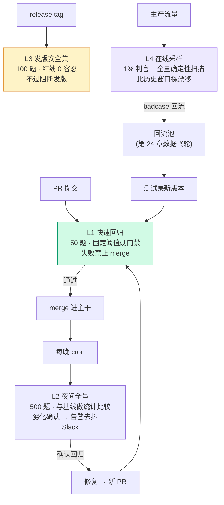

# 25. 评估流水线工程：四层接入 CI/CD

> **概览**：评估流水线通过分层阈值管理信用：L1 PR 硬门禁阻断合入、L2 夜间捕获趋势、L3 发版安全集阻断发布、L4 在线采样监控漂移。核心节次：§25.3 四层流水线职责总览、§25.4 L1 PR 快速回归硬门禁。

## 25.1 本章目标与读者

第 20 章给了你 mini 评估框架和四层流水线的正典定义；这一章把它展开成**可以直接抄进仓库的工程件**：每层的完整 YAML、回归阈值的统计算法、告警去抖状态机、Slack 通知、失败样本回流。

"没有 CI 的评估 = 不会被使用的评估"这句话的完整版是：评估脚本一旦需要人记得去跑，它就会在第三个 sprint 之后死去。前端工程师对这件事应该最有体感——单元测试从"本地手跑"进化到"PR 必跑"的那一天，才是测试真正开始保护代码的那一天。评估也一样，而且是**花钱的测试**：没人看管的定时全量，一个月烧掉的 API 费用买不回任何一次被拦下的回归。

读完后你能：

- 说出四层各自的触发、数据量、成本预算与决策联动，以及为什么阈值语义必须分层
- 抄走 L1 / L2 / L3 三份完整可用的 GitHub Actions YAML
- 实现一个"点估计 + 统计检验"双条件的回归检测器，理解为什么单看点估计会让 CI 天天误红
- 搭起告警去抖、Slack 通知与失败样本回流三个运行件

**前置知识**：第 20 章（mini 框架与 `process.exitCode` 语义）、第 4 章 4.6.1（Wilson 区间）。本章代码 TypeScript / Node.js，零依赖。

## 25.2 概念引入：评估流水线 = CI 里的另一个 job

> **前端类比**：四层评估流水线与前端经典工程门禁完全映射——L1 快集 ≈ `eslint + 关键核心单测`（每个 PR 触发，分钟级跑完，失败即阻断合入）；L2 夜间全量 ≈ `Playwright E2E 完整回归套件`（夜间 cron 定时跑，小时级，生成日报并沉淀趋势）；L3 发版安全集 ≈ `生产发版前冒烟 + 依赖安全审计`（打 release tag 触发，0 容忍阻断发版）；L4 在线采样 ≈ `生产环境 Sentry / Datadog APM 实时监控`（持续常驻，不在构建流水线里）。

接入方式上没有魔法。第 20 章讲过：**评估接 CI 的全部接口就是退出码**——过则 `process.exitCode = 0`，挂则 `1`，GitHub Actions / GitLab CI / Jenkins 全都认这个语义。本章所有 YAML 的最后一行都在消费这个约定。

## 25.3 四层流水线总览

先对齐第 20 章 §20.6 的正典口径，再看本章要补的工程件：

| 层 | 触发 | 数据量 | 成本预算 | 阈值语义 | 决策联动 |
|---|---|---|---|---|---|
| L1 PR 快速回归 | 每个 PR | 50 题（核心安全集） | < $0.5 / 次，< 3 分钟 | **硬门禁**：固定阈值，失败即红 | 不过禁止 merge |
| L2 夜间全量 | cron 每晚 | 500 题（全量 + 新增簇） | 数美元 / 晚 | **趋势警报**：与基线做统计比较 | 劣化确认 → 次日拉明细 |
| L3 发版安全集 | release tag | 100 题（红线 + 高频）+ 全量对比 | 数美元 / 次 | **硬门禁 + 0 容忍** | 不过阻断发版 |
| L4 在线采样 | 生产流量持续 | 1% 判官 + 100% 确定性扫描 | 按流量恒定（采样率上限） | **漂移探测**：比历史窗口 | 劣化告警 → 样本回流 L1 |



这张图与第 20 章唯一多画的东西是右下角的**回流闭环**——那是评估流水线区别于普通 CI 的地方：普通 CI 的失败案例修完就丢了，评估流水线的失败案例是最贵的数据（真实流量 + 真实失败），必须回到测试集里变成永久断言（第 24 章 §24.6）。

为什么阈值语义必须分层？因为四层的"误报代价"完全不同。L1 挡住的是全团队的 merge，误红一次的代价是几分钟的团队时间加一点对门禁的信任；L4 误报的代价是拉人排查线上问题。反过来，L1 漏放一个真实回归的代价是" regression 进了主干，要等 L2 第二天才发现"。**该硬的层要容忍少量误报换速度，该软的层要容忍延迟换准确**——把同一套阈值语义铺到四层，是这个工程最常见的结构错误。

## 25.4 L1：PR 快速回归（硬门禁）

```yaml
# .github/workflows/eval-pr.yml —— L1:PR 快速回归
name: PR Eval
on:
  pull_request:
    paths:
      - "prompts/**"     # prompt 改动必然影响分数,必须跑
      - "src/**"
      - "datasets/**"    # 数据集变更也要重跑,防"卷子变了"

jobs:
  eval:
    runs-on: ubuntu-latest
    timeout-minutes: 10
    steps:
      - uses: actions/checkout@v4
      - uses: actions/setup-node@v4
        with:
          node-version: 22
      - run: npm ci --ignore-scripts
      # 50 题 + 阈值 0.80:门禁粒度是 2%(一题一档),阈值必须校准后再启用阻断
      - name: Quick regression
        run: npx tsx mini-eval.ts datasets/pr-smoke.jsonl --threshold 0.80 --concurrency 8
        env:
          OPENAI_API_KEY: ${{ secrets.OPENAI_API_KEY }}
      - name: Comment result on PR
        if: always()
        run: node scripts/report-to-pr.js reports/last-run.json
```

四个工程细节，每个都对应一种真实事故：

**paths 过滤不能省。**没有 `paths` 过滤时，改一行 README 也会触发评估，白白烧钱还拉长 PR 排队。

**阈值粒度要写进注释。**50 题上每道题值 2 个百分点：`threshold 0.80` 意味着 40/50 过、39/50 挂。团队如果不知道这个粒度，就会有人提议"改成 0.78 吧，最近老红"——阈值校准（第 20 章 20.6.2）的结论必须留在 YAML 旁边，不能只在某个人的脑子里。

**门禁启用前先观察两周。**把 job 挂上但先配置成 `continue-on-error: true`，收集两周的真实波动分布后再去掉这行、启用阻断。第一天就阻断 merge 的门禁，最终都会被"重跑一次碰运气"的习惯架空。

**PR 上要留结果评论。**红绿之外给出 pass 率、与基线的 diff、失败样本列表，评审者才能判断"这个回归要不要紧"。只有红绿的门禁会训练出"红了就 rebase 重跑"的条件反射。

## 25.5 L2：夜间全量与回归阈值算法

```yaml
# .github/workflows/eval-nightly.yml —— L2:夜间全量(趋势警报)
name: Nightly Eval
on:
  schedule:
    - cron: "0 19 * * *"   # UTC 19:00 = 北京时间凌晨 3 点,避开业务高峰
  workflow_dispatch:         # 支持手动触发

jobs:
  eval:
    runs-on: ubuntu-latest
    timeout-minutes: 120
    steps:
      - uses: actions/checkout@v4
      - uses: actions/setup-node@v4
        with: { node-version: 22 }
      - run: npm ci --ignore-scripts
      - name: Full eval (500 items)
        run: npx tsx mini-eval.ts datasets/nightly.jsonl --threshold 0.75 --concurrency 8
        env:
          OPENAI_API_KEY: ${{ secrets.OPENAI_API_KEY }}
      - name: Regression check vs baseline
        run: node scripts/check-regression.mjs reports/last-run.json reports/baseline.json
      - name: Upload reports
        uses: actions/upload-artifact@v4
        with: { name: eval-reports, path: reports/ }
```

L2 与 L1 的 YAML 差异只有三处：触发器换成 cron、数据集换成 500 题全量、以及新增的 `check-regression` 步骤——**这一步才是 L2 的灵魂**，它决定"今晚的分数要不要拉响警报"。

### 25.5.1 为什么点估计不能当阈值

L1 可以用固定阈值，因为它是被校准过的硬门禁；L2 的职责是发现**漂移**，漂移的定义天然是"和基线比差了多少"。朴素实现是比点估计：

```text
if (当前 pass 率 < 基线 pass 率 - 0.02) alert();
```

这个实现的问题在第 4 章 4.6.1 已经埋了伏笔：**n=50 时 95% Wilson 区间半宽约 ±9~10 个百分点，n=500 时也有 ±3~4 个百分点**。分数的小幅波动是抽样的呼吸，不是系统的病变。拿点估计当阈值的结果是：每周两三次"狼来了"，团队学会忽略告警——**告警系统的死亡方式不是坏掉，是被无视**。

### 25.5.2 双条件回归检测器

L2 的判定规则拆成两个独立条件，同时满足才算回归：

1. **业务条件**：点估计差超过最小可感知差值（minDelta，默认 3 个百分点）——这个差值要业务方确认，"掉 1 个点你们在乎吗"是产品经理答得了而统计答不了的问题；
2. **统计条件**：双比例 z 检验 p < 0.05——排除"这点波动纯靠抽样就能解释"的情形。

```typescript
// scripts/check-regression.mjs —— L2 回归检测(零依赖)
// 运行: node scripts/check-regression.mjs
function wilson(correct, n, z = 1.96) {
  if (n <= 0) throw new Error("n must be > 0");
  const p = correct / n, z2 = z * z;
  const d = 1 + z2 / n;
  const ctr = (p + z2 / (2 * n)) / d;
  const h = (z * Math.sqrt((p * (1 - p)) / n + z2 / (4 * n * n))) / d;
  return [Math.max(0, ctr - h), Math.min(1, ctr + h)];
}
function erf(x) { const a1=0.254829592,a2=-0.284496736,a3=1.421413741,
  a4=-1.453152027,a5=1.061405429,p=0.3275911;const s=x<0?-1:1;x=Math.abs(x);
  const t=1/(1+p*x);const y=1-((((a5*t+a4)*t+a3)*t+a2)*t+a1)*t*Math.exp(-x*x);return s*y }
function normalCdf(z) { return 0.5 * (1 + erf(z / Math.SQRT2)); }

// 双比例 z 检验:合并比例算标准误
function twoProportionZ(cur, base) {
  const p1 = cur.pass / cur.total, p2 = base.pass / base.total;
  const pool = (cur.pass + base.pass) / (cur.total + base.total);
  const se = Math.sqrt(pool * (1 - pool) * (1 / cur.total + 1 / base.total));
  const z = (p1 - p2) / se;
  return { z: +z.toFixed(4), pValue: +(2 * (1 - normalCdf(Math.abs(z)))).toFixed(4) };
}

const MIN_DELTA = 0.03; // 业务最小可感知差值,与业务方约定后写入配置
export function detectRegression(current, baseline) {
  const curRate = current.pass / current.total, baseRate = baseline.pass / baseline.total;
  const [curLo, curHi] = wilson(current.pass, current.total);
  const [baseLo, baseHi] = wilson(baseline.pass, baseline.total);
  const { z, pValue } = twoProportionZ(current, baseline);
  const deltaBreached = curRate < baseRate - MIN_DELTA; // 业务上真的掉了
  const noiseExcluded = pValue < 0.05;                  // 统计上排除抽样噪声
  return {
    curRate: +curRate.toFixed(3), baseRate: +baseRate.toFixed(3),
    curCI: [curLo.toFixed(3), curHi.toFixed(3)], baseCI: [baseLo.toFixed(3), baseHi.toFixed(3)],
    deltaBreached, noiseExcluded, z, pValue,
    regressed: deltaBreached && noiseExcluded,
  };
}

// 案例 A: 50 题快集上 86% -> 80%——看起来吓人,统计上是噪声
const A = detectRegression({ pass: 40, total: 50 }, { pass: 43, total: 50 });
// 案例 B: 500 题全量上 86% -> 80%——同样的降幅,这次是真回归
const B = detectRegression({ pass: 400, total: 500 }, { pass: 430, total: 500 });
console.log("A(n=50):", JSON.stringify(A));
console.log("B(n=500):", JSON.stringify(B));
// 期望输出:
// A(n=50): {"curRate":0.8,"baseRate":0.86,"curCI":["0.670","0.888"],"baseCI":["0.738","0.930"],"deltaBreached":true,"noiseExcluded":false,"z":-0.7987,"pValue":0.4245,"regressed":false}
// B(n=500): {"curRate":0.8,"baseRate":0.86,"curCI":["0.763","0.833"],"baseCI":["0.827","0.888"],"deltaBreached":true,"noiseExcluded":true,"z":-2.5256,"pValue":0.0116,"regressed":true}
```

两个案例讲透这套算法的价值：**同样是 6 个百分点的降幅**，50 题样本上两个 Wilson 区间 [0.670, 0.888] 与 [0.738, 0.930] 大面积重叠，p=0.42，点估计吓人但纯属抽样呼吸；500 题样本上 p=0.0116，同样 6 个点成了确凿回归。检测器在 A 上保持沉默、在 B 上拉响警报——这正是 L2 想要的行为。

一个进阶细节：如果你想要**更保守**的告警（宁可漏报不可误报），可以把统计条件换成"区间完全分离"（`curHi < baseLo`）。代价是要到约 700 题的样本量，上述 6 个点的真回归才会触发区间分离——所以这条严格路径通常只用于发版对比这类高成本决策，日常 L2 用 z 检验即可。

### 25.5.3 基线怎么选

检测需要一个对照物。三种选法，各有一个坑：

| 基线 | 适合 | 坑 |
|---|---|---|
| 上一晚的结果 | 快速发现突发劣化 | 单晚噪声大，必须配去抖（§25.6） |
| 滚动 7 天中位数 | 平滑波动，适合稳定期 | 模型/ Prompt 刚升级时会持续误报 |
| 手动锚定的"黄金基线" run | 版本对比、发版评估 | 需要治理：谁有权换锚点、换锚点必须留记录 |

推荐组合：**日常告警比上一晚（配去抖），周报比 7 天中位数，发版比黄金基线**。基线 run 的选择记录在 `reports/baseline.json` 的 `anchoredAt` 字段里，让"我们和谁比"这件事可审计。

## 25.6 告警去抖与通知

### 25.6.1 去抖状态机

单晚越界就报警，等于把抽样噪声直接广播给全组。去抖三件套（第 20 章 20.7.1 的展开）：连续 N 个周期越界才报、冷却期内不重复报、恢复正常即清零。

```typescript
// scripts/alert-debouncer.mjs —— 告警去抖状态机(零依赖)
// 运行: node scripts/alert-debouncer.mjs
class AlertDebouncer {
  constructor(needConsecutive = 2, cooldownMs = 24 * 3600 * 1000) {
    this.need = needConsecutive; this.cooldown = cooldownMs;
    this.streak = 0; this.lastSentAt = 0;
  }
  shouldAlert(breached, now) {
    if (!breached) { this.streak = 0; return false; }        // 恢复正常,清零
    this.streak++;
    if (this.streak < this.need) return false;               // 未连续达标,不报
    if (now - this.lastSentAt < this.cooldown) return false; // 冷却期内,不重复报
    this.lastSentAt = now; this.streak = 0;
    return true;
  }
}

const HOUR = 3600 * 1000;
const d = new AlertDebouncer(2, 24 * HOUR);
let now = 0;
const breaches = [true, true, true, true, false, true, true];
breaches.forEach((b, i) => {
  now += 12 * HOUR; // 每 12 小时一个 L2 周期
  console.log(`周期${i + 1}(+12h) breached=${b} -> 告警=${d.shouldAlert(b, now)}`);
});
// 期望输出:
// 周期1(+12h) breached=true -> 告警=false   (连续 1 次,未达标)
// 周期2(+12h) breached=true -> 告警=true    (连续 2 次,触发)
// 周期3(+12h) breached=true -> 告警=false   (冷却期内)
// 周期4(+12h) breached=true -> 告警=true    (距上次 24h,再报一次提醒)
// 周期5(+12h) breached=false -> 告警=false  (恢复,清零)
// 周期6(+12h) breached=true -> 告警=false   (新一轮连续 1 次)
// 周期7(+12h) breached=true -> 告警=true    (连续 2 次,触发)
```

参数怎么定：`needConsecutive = 2` 配每日 L2 意味着"连续两晚劣化才响"，把单晚噪声全部滤掉，代价是发现延迟 24 小时——对多数业务这是正确的交换。冷却期设 24 小时而不是永久静默：持续劣化需要持续出现在人眼前，只是不刷屏。

### 25.6.2 Slack 通知：让告警在 30 秒内可判断

告警消息的结构决定响应速度。一条合格的告警必须自带证据，让被 @ 的人不打开任何链接就能判断"这事跟我有没有关系、严不严重"：

```typescript
// scripts/notify-slack.mjs —— 告警通知(需要 SLACK_WEBHOOK 环境变量)
export async function notifySlack(report: {
  regressed: boolean; curRate: number; baseRate: number; z: number; pValue: number;
  worstCategory: { name: string; drop: number };
  failingItems: Array<{ id: string; category: string; input: string }>;
  runUrl: string;
}) {
  const lines = [
    `${report.regressed ? ":rotating_light: *夜间评估回归*" : ":white_check_mark: 夜间评估正常"}`,
    `pass 率: ${(report.curRate * 100).toFixed(1)}% (基线 ${(report.baseRate * 100).toFixed(1)}%)`,
    `统计: z=${report.z}, p=${report.pValue} (双比例 z 检验)`,
    `最差类别: ${report.worstCategory.name} 下滑 ${(report.worstCategory.drop * 100).toFixed(1)}pp`,
    `失败样本 Top3: ${report.failingItems.map((f) => `[${f.category}] ${f.input.slice(0, 30)}`).join(" | ")}`,
    `完整报告: ${report.runUrl}`,
  ];
  await fetch(process.env.SLACK_WEBHOOK!, {
    method: "POST",
    headers: { "Content-Type": "application/json" },
    body: JSON.stringify({ text: lines.join("\n") }),
  });
}
```

四个字段的取舍逻辑：**分数对比**回答"掉了多少"，**z 与 p 值**回答"是不是噪声"（直接回应"重跑一次吧"的条件反射），**最差类别**回答"从哪查起"（分桶信息让排查从全量 500 题缩到 50 题内的一个类别），**失败样本 Top3**回答"长什么样"。缺了后两个字段的告警，收到的人第一件事是自己去找数据——两次之后就没人看了。

## 25.7 L3 发版安全集与 L4 在线采样

### 25.7.1 L3：发版阻断

```yaml
# .github/workflows/eval-release.yml —— L3:发版安全集
name: Release Eval
on:
  push:
    tags: ["v*"]            # 发版 tag 触发

jobs:
  eval:
    runs-on: ubuntu-latest
    timeout-minutes: 60
    steps:
      - uses: actions/checkout@v4
      - uses: actions/setup-node@v4
        with: { node-version: 22 }
      - run: npm ci --ignore-scripts
      # 合规红线 0 容忍:任何一条失败都不允许发版
      - name: Safety gate (zero tolerance)
        run: npx tsx mini-eval.ts datasets/release-safety.jsonl --threshold 1.0 --concurrency 8
        env:
          OPENAI_API_KEY: ${{ secrets.OPENAI_API_KEY }}
      # 高频场景集:阈值语义是门禁,但不是 0 容忍
      - name: Core scenarios
        run: npx tsx mini-eval.ts datasets/release-core.jsonl --threshold 0.85 --concurrency 8
        env:
          OPENAI_API_KEY: ${{ secrets.OPENAI_API_KEY }}
```

L3 复用 L1 的 job 骨架，差别在两个数据集与两套阈值：红线集 `threshold 1.0`（0 容忍——合规类失败不可逆，一条都不许过），高频场景集 `threshold 0.85`（校准过的门禁阈值）。0 容忍的前提是红线集本身稳定：如果某条红线题有 1% 的偶发误判（判官抽风），0 容忍会让发版随机被卡——所以红线题只用**确定性判据**（正则、分类器、精确匹配），不用 LLM 判官，这正是第 20 章"0 容忍的事不能交给采样与概率判官"的落地。

### 25.7.2 L4：在线采样（不在 CI 里）

L4 不在 CI 里跑——CI 是提交驱动的，而漂移是持续发生的。它在服务端以采样规则运行：判官打 1% 的采样流量，确定性红线扫描跑 100% 全量。工程上要么用平台能力（LangSmith / Langfuse 的采样规则与 Error 状态检测），要么自建一个消费消息队列的 worker。自建时的三个关键参数都要做成配置而非代码常量：采样率（首月 0.5% 起步）、每日判官花费上限（超限自动降采样率而不是报错）、判官错误率上限（超 5% 整批作废重跑，不能把失败当 0 分混进统计——第 20 章 20.7.2 的静默失败检测）。

## 25.8 失败样本回流与报告

### 25.8.1 回流：让每次回归变成永久断言

L2 确认回归、L4 发现漂移之后，失败样本的去向决定这条流水线有没有长期价值。回流的工程很小，价值在于坚持：

```typescript
// scripts/backflow.mjs —— 失败样本回流(追加写入回流池,零依赖)
// 运行: node scripts/backflow.mjs reports/last-run.json _pool/reflow.jsonl
import { appendFileSync, readFileSync } from "node:fs";

const [,, reportPath, poolPath] = process.argv;
const run = JSON.parse(readFileSync(reportPath, "utf8"));
const failing = run.results.filter((r: any) =>
  r.scores.some((s: any) => s.value < run.threshold)
);
for (const f of failing) {
  appendFileSync(poolPath, JSON.stringify({
    kind: "ci-backflow",            // 与线上点踩回流区分来源
    itemId: f.id,
    input: f.input,                  // 冗余快照,防数据集演化后对不上
    output: f.output,
    scores: f.scores,
    capturedAt: new Date().toISOString(),
    runId: run.runId,
  }) + "\n");
}
console.log(`backflow: ${failing.length} items -> ${poolPath}`);
// 期望输出(以一次 3 条失败的 run 为例):
// backflow: 3 items -> _pool/reflow.jsonl
```

回流样本进入第 24 章 §24.6 的飞轮：聚类 → 人工审簇 → 写下"违反的性质" → 变成测试集新题。**一次没有被回流成断言的回归，注定会在三个月后被重新发明。**

### 25.8.2 报告：给人看的三段式

第 20 章的 `EvalRun` 快照是给机器对账的；给人看的是它的投影。三段式结构在 Slack 消息、PR 评论、周报里保持一致：

1. **一句话结论**——"今日 pass 率 82.4%，较基线 -3.6pp，统计显著，最差类别为退款（-11.2pp）"；
2. **分桶表**——类别 × 样本数 × pass 率 × 与基线差值，让"高频还行、长尾全崩"无处遁形；
3. **失败样本 Top10**——输入截断 + 输出截断 + 判官理由，点开就能看。

三维并置（分数、成本、延迟）是第 20 章成本工程的延续：报告里永远要有 `costUsd` 一列，防止"分数涨了、账单爆了"的单维优化胜利。

## 25.9 施工顺序与自查清单

把本章工程件按依赖排序，得到安全施工序（与第 20 章 20.11 的五步衔接）：

1. **先手动跑两周**（第 20 章第 4 步），拿到真实波动分布；
2. **L1 挂 PR，先 `continue-on-error` 观察一周**，用真实分布校准阈值后启用阻断；
3. **L2 上 cron**，先把"回归检测"跑在只记录不告警的模式，观察两周误报率再接 Slack；
4. **去抖 + 通知**上线后，把告警消息模板给团队过目——告警格式是团队约定，不是实现细节；
5. **L3 随第一个发版周期上线**，红线集先人工复核一遍判据的确定性；
6. **L4 最后**，采样率从 0.5% 起步，稳定一个月后再考虑调高。

自查清单（每条都可判真伪）：

- [ ] 四层的触发、数据量、阈值语义各自说得出，且 L1/L3 是硬门禁、L2 是警报、L4 是漂移探测
- [ ] L1 的 YAML 有 paths 过滤、阈值粒度注释、两周观察期记录
- [ ] L2 回归判定是"业务差值 + 统计检验"双条件，不是裸点估计
- [ ] 告警有去抖（连续 N 次 + 冷却期），消息自带分数/统计量/最差类别/样本证据
- [ ] L3 红线集用确定性判据，0 容忍
- [ ] L4 采样率与花费上限是配置项，判官错误率超 5% 整批作废
- [ ] 失败样本有回流通道，且回流样本带来源标记与时间戳

## 25.10 验收自测

1. **选择**：L2 夜间全量的阈值语义是？
   - A. 固定阈值硬门禁，失败阻断 merge
   - B. 与基线做统计比较的趋势警报
   - C. 0 容忍红线检查
   - D. 与 L1 相同，只是题更多

2. **选择**：50 题上 pass 率从 86% 掉到 80%，L2 检测器的正确行为是？
   - A. 立即告警，6 个点很严重
   - B. 不告警——p=0.42，该降幅在抽样噪声范围内
   - C. 告警但降低级别
   - D. 自动回滚版本

3. **选择**：L3 红线集 `threshold 1.0`（0 容忍）的前提条件是？
   - A. 用最强的 LLM 判官
   - B. 红线题只用确定性判据（正则/分类器/精确匹配）
   - C. 题目越多越好
   - D. 每天跑三次

4. **简答**：为什么告警消息里要同时给"分数对比"和"z 与 p 值"两个字段？

5. **简答**：L4 为什么不在 CI 里跑？它的采样率、花费上限、判官错误率上限为什么要做成配置？

6. **实操**：把 25.5.2 的 `check-regression.mjs` 跑一遍，然后用 `--total 50` 与 `--total 500` 各构造一组 86%→80% 的数据，对比 `regressed` 的差异；再把自己的告警消息模板（25.6.2）发到一个测试频道，检查五字段是否齐全。

## 25.11 📋 本章 Cheat Sheet

| 概念 | 一句话 | 详见 |
|---|---|---|
| 四层流水线 | L1 硬门禁 / L2 趋势警报 / L3 发版阻断 / L4 漂移探测，阈值语义分层 | §25.3 |
| L1 粒度 | 50 题 threshold 0.80 = 一题 2pp，阈值须校准后启用阻断 | §25.4 |
| 双条件回归判定 | 点估计差 > minDelta 且双比例 z 检验 p < 0.05 | §25.5.2 |
| 同降幅不同结论 | 86%→80%：n=50 是噪声（p=0.42），n=500 是回归（p=0.012） | §25.5.2 |
| 基线三选 | 日常比上晚（配去抖）、周报比 7 天中位数、发版比黄金基线 | §25.5.3 |
| 去抖三件套 | 连续 N 周期越界、24h 冷却、恢复即清零 | §25.6.1 |
| 告警五字段 | 分数对比 / 统计量 / 最差类别 / 样本证据 / 报告链接 | §25.6.2 |
| 回流闭环 | CI 失败样本 → 回流池 → 聚类 → 新断言，回流池带来源与时间戳 | §25.8.1 |

## 25.12 ⚠️ 5 个常见错误

1. **PR 层跑全量评估**——500 题两小时的门禁会让所有 PR 排队，团队最终学会跳过它；L1 只放 50 题，全量留给 L2。
2. **回归判定只看点估计**——50 题上 ±10pp 的波动是噪声常量，点估计门禁等于让 CI 天天误红、最终被"重跑一次"架空；用双条件判定。
3. **告警无去抖**——单晚波动就 @ 全组的系统，两周后没人再点开它的消息；连续 2 次越界 + 24 小时冷却。
4. **红线题交给 LLM 判官**——1% 的判官偶发误判 × 0 容忍 = 发版随机被卡；红线判据必须是确定性的。
5. **失败样本修完就丢**——没有回流通道的流水线每次都在重新发现同一个问题；回归样本进回流池，聚类后变成永久断言。

## 25.13 延伸阅读

⭐⭐⭐（官方一手）
- [Langfuse: Experiments CI/CD](https://langfuse.com/docs/evaluation/experiments/experiments-ci-cd)——`experiment-action` 与分数越界抛 `RegressionError` 的官方集成
- [LangSmith: Vitest/Jest 集成](https://docs.langchain.com/langsmith/vitest-jest)——评估结果接测试运行器与退出码的另一种路径
- [GitHub Actions 文档: Workflow syntax](https://docs.github.com/en/actions/using-workflows/workflow-syntax-for-github-actions)——本章 YAML 涉及的全部语法

⭐⭐（方法论）
- [Continuous ML（CML）](https://cml.dev/)——持续机器学习的通用框架，CI/CD 思想的 ML 版
- [Google Cloud: MLOps Continuous Delivery](https://cloud.google.com/architecture/mlops-continuous-delivery-and-automation-pipelines-in-machine-learning)——分层流水线的成熟度模型

⭐（延伸）
- [Weights & Biases: LLM Evaluation](https://docs.wandb.ai/guides)——评估结果沉淀与对比的平台视角
- [Vercel AI SDK: Testing](https://ai-sdk.dev/docs/ai-sdk-core/testing)——mock provider 让评估在无网络下可测
