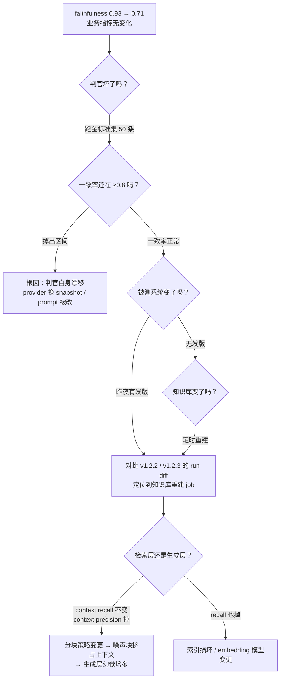

# 27. 案例研究（一）：客服 RAG 从 0 到上线的 90 天评估剧本

> **如果只读一节**：本章把前 26 章的方法论压缩成一份可以直接照抄的排期表——第 0 天盘点、第 1 周指标体系、第 2-3 周 500 题测试集、第 4 周 baseline 与判官校准、第 2 个月 CI 与在线采样、第 3 个月灰度上线，外加一次"Faithfulness 骤降"的翻车演练。指标定义在 [第 21 章](https://evals.zenheart.site/web/chapter-20.html)，本章只讲"什么时候做什么事"。

**前置知识**：第 4 章（四步法）、第 20 章（mini evaluator 与四层流水线）、第 5 章（判官工程化）、第 21 章（RAG 指标定义）、第 23-25 章（能力拆解 / 测试集 / CI）。本章代码全部为 TypeScript，可独立运行。

## 27.1 本章目标与读者

读完后你能：

- 拿到一份 90 天的评估排期表，知道每个时间点该产出什么、谁签字
- 把第 21 章的 4 个 RAG 指标翻译成自己团队的 TypeScript 评估器
- 设计灰度发布的判定条件，并准备好出事那天的应急手册

本章与第 21 章的分工：**第 21 章回答"Faithfulness 是什么、怎么算"，本章回答"第几周接入它、阈值谁定、骤降了怎么办"**。遇到不熟悉的指标名，先回第 21 章 20.2-21.3 节。

场景设定（合成案例，用于教学演示）：电商公司"星辰商城"，客服团队 20 人，每天约 5000 次咨询会话，60% 是重复问题（退款政策、物流、发票）。团队要上线 RAG 客服机器人，目标是一年内承接 50% 会话量。你是项目里的前端工程师，被指派"把评估建起来"。

## 27.2 概念引入：评估是一次"研发排期"，不是一次"跑分"

**前端类比**：为客服 RAG 建评估体系 ≈ 为核心组件建立"单测 + 视觉回归 + 性能预算 + 灰度发布"四件套。你不会在上线前一天才写单测，也不会靠"看了眼效果不错"决定发不发版——评估体系就是这套基础设施，只是被测对象换成了会调用大模型的检索管道。

第一个要写下的决定：**被测对象是一个带观测的函数，不是一段 prompt**。第 20 章 20.5 节的判官协议原样适用，先给它一个 RAG 特化的形状：

```typescript
// rag-eval/types.ts —— 被测物与测试集的类型契约（无需联网）
// 评估瞄准的是"观测点"而不是裸文本：检索这一步必须显式暴露出来

export interface RagTrace {
  answer: string;              // 最终回答
  refused: boolean;            // 是否拒答（超纲问题）
  retrieved: string[];         // 检索到的文本块，按相似度降序
  retrievedIds: string[];      // 对应的知识库文档 id
  latencyMs: number;
  costUsd: number;             // 本次会话的 token 成本
}

export interface RagCase {
  id: string;
  question: string;
  expected: string;            // 参考答案要点（人工标注）
  goldenContextIds: string[];  // 标注"这道题该检索到哪些文档"
  category: "退款" | "物流" | "发票" | "账户" | "超纲";
  source: "public" | "human" | "reflow" | "synthetic"; // 4 来源，见第 24 章
  difficulty: "easy" | "medium" | "hard";
}

// 被测物：你的 RAG 系统必须以这个签名暴露出来
export type RagApp = (question: string) => Promise<RagTrace>;
```

这段类型定义就是第 0 天唯一的代码产出。它的价值在第 23 章 23.5 节讲过：**每个指标绑定显式的评分类型，每个字段都有 owner**。后面 90 天的所有工作都围绕这个契约展开。

## 27.3 第 0 天：现状盘点与 90 天总览

上线 AI 之前先量化"没有 AI 的世界"，否则上线后你说不清"提升了多少"。第 0 天要盘出三组数字：

| 盘点项 | 示例值（合成案例） | 来源 | 用途 |
|---|---|---|---|
| 日均会话量 | 5000 次 | 客服系统日志 | 灰度期间的分母 |
| 重复问题占比 | 约 60% | 客服主管抽样 200 条 | 证明 RAG 有价值 |
| 人工客服 CSAT | 4.5 / 5 | 满意度问卷 | 上线后不许下降的基线 |
| 转人工率 | 12% | 工单系统 | AI 介入后要压到 10% 以下 |
| 单次人工会话成本 | 约 3 元 | 人力成本核算 | 与 AI 单次成本对比 |

这些数字目前是合成案例里的占位值，你必须换成自己业务的真实值——**没有基线的"提升 50%"是营销话术，不是工程结论**。

90 天排期总览：第 0 天盘点 → 第 1 周指标体系与锚点 → 第 2-3 周测试集 → 第 4 周 baseline 与判官校准 → 第 2 个月 CI 四层与在线采样 → 第 3 个月灰度上线（27.8）。每个里程碑的产出物与验收标准汇总在 27.11 的速览表，后续小节逐一展开。

## 27.4 第 1 周：指标体系与"好答案"的锚点

### 27.4.1 从业务目标倒推指标登记表

业务目标"承接 50% 会话且 CSAT 不降"必须拆成可测的能力（第 23 章方法论）。下表把第 21 章的指标定义和本案例的阈值、数据来源合成一张登记表，**每个指标一行、每行都有 owner 和失败代价**：

| 指标 | 定义（详见第 21 章） | 评分方式 | 目标值 | 数据来源 | 失败代价 |
|---|---|---|---|---|---|
| faithfulness | 回答论断被检索上下文支持的比例 | 判官逐论断核验（RAGAS 公式） | ≥ 0.95 | answer + retrieved | 编造政策 → 客诉 |
| answer relevancy | 回答对问题的针对度 | 判官评分 | ≥ 0.90 | question + answer | 答非所问 → 用户流失 |
| context precision | 相关文档排在检索结果靠前的程度 | RAGAS 公式（排名加权） | ≥ 0.85 | retrieved | 噪声挤占上下文 |
| context recall | 应检回的内容被检回的比例 | 金标文档命中率 | ≥ 0.90 | goldenContextIds | 检索不到 → 答错 |
| 拒答正确率 | 超纲问题被正确拒答的比例 | 精确匹配（确定性） | ≥ 0.90 | 超纲子集 | 编造不在知识库的政策 |
| 意图识别 top-1 | 意图分类与标注一致 | 精确匹配 | ≥ 0.92 | 标注测试集 | 路由错 → 全链路错 |
| 转人工率 | 未解决转人工比例 | 业务系统事件计数 | ≤ 基线 − 2pp | 工单系统 | 机器人没人用 |
| session 解决率 | 会话级 resolved/escalated/abandoned | 判官 + 人工抽检 | ≥ 0.75 | 会话轨迹 | 真实业务价值 |
| P95 延迟 | 端到端响应时间 | trace 采集 | ≤ 2s | 网关日志 | 用户放弃 |
| 合规红线 | 违规承诺 / 价格泄露 | 规则 + 分类器，0 容忍 | 100% | 全量扫描 | 监管风险 |

阈值不是抄来的，是**从失败代价倒推的**：faithfulness 之所以定 0.95 而不是 0.85，因为客服场景一条编造的退款政策就是一条工单加一次投诉（这个阈值是本合成案例的设定值，你的业务需要用第 7 章元评估方法自行校准）。

### 27.4.2 30 条"好答案"锚点

第 1 周最重要的产出不是代码，是 30 条人工写死的"标准问答对"。这是判官校准的原料（第 20 章 17.7.2 的金标准集），也是全团队对"什么算好答案"达成共识的最快方式：

```typescript
// rag-eval/anchors.ts —— 30 条锚点的前 3 条示例（结构完整，可直接扩展）
import type { RagCase } from "./types.ts";

export const anchors: RagCase[] = [
  {
    id: "cs-001",
    question: "我想退我上周买的耳机",
    expected: "先询问订单号与购买渠道，再告知 7 天无理由退换流程",
    goldenContextIds: ["doc-refund-1", "doc-refund-2"],
    category: "退款",
    source: "human",
    difficulty: "easy",
  },
  {
    id: "cs-002",
    question: "耳机用了 5 天发现有问题能退吗？",
    expected: "在 7 天无理由期内，可走质量问题退货，需提供订单号",
    goldenContextIds: ["doc-refund-1"],
    category: "退款",
    source: "human",
    difficulty: "medium",
  },
  {
    id: "cs-003",
    question: "我的耳机是赠品，能退吗？",
    expected: "赠品不支持单独退款，需随主商品一起退回",
    goldenContextIds: ["doc-refund-3"],
    category: "退款",
    source: "human",
    difficulty: "hard",
  },
  // …… 共 30 条，覆盖退款/物流/发票/账户四类 + 2 条超纲拒答
];
```

写锚点时给团队的口径：**宁可 30 条都简单，也不要 1 条模棱两可**。有争议的题目先吵架再入库，库里的每条题都必须"只有一个合理答案"。

## 27.5 第 2-3 周：500 题测试集与超纲子集

### 27.5.1 四来源配比

第 24 章 24.7 节的配比在这里直接落地——公开 20% + 人工 30% + 真实回流 30% + LLM 合成 20%：

| 来源 | 数量 | 作用 | 生产方式 |
|---|---|---|---|
| 公开数据 | 100 | 与外部模型分数对齐的锚 | 公开客服问答数据集改造（联网下载） |
| 人工编写 | 150 | 业务核心路径 | 客服团队按锚点模板扩写 |
| 真实回流 | 150 | 反映真实分布 | 近 30 天会话抽样 3% → 脱敏 → 标注 |
| LLM 合成 | 100 | 长尾覆盖 | 以锚点为种子生成 + 人工过滤 |
| 超纲子集 | 50 | 拒答能力（不计入 500） | 故意问知识库里没有的政策 |

两个工程纪律，直接抄第 24 章的结论：**真实回流样本必须脱敏**（订单号、手机号、地址在入库前用正则替换成占位符）；**按时间切分防泄漏**——修复当天采集的 badcase 不进当期验收集（第 24 章 24.8 节）。

### 27.5.2 入库前的去重脚本

真实回流最容易把测试集变成"重复 badcase 堆填场"（第 3 章 4.6.5 反模式之"测试集腐烂"）。入库前跑一次归一化去重：

```typescript
// rag-eval/dedupe.ts —— 测试集入库前的归一化去重（本地运行，无需联网）
// 运行：npx tsx rag-eval/dedupe.ts data/cases.jsonl

import { readFileSync, writeFileSync } from "node:fs";

function normalize(q: string): string {
  return q
    .toLowerCase()
    .replace(/\s+/g, "")            // 去空白
    .replace(/[？?！!。，,.]/g, ""); // 去标点
}

const raw = readFileSync(process.argv[2] ?? "data/cases.jsonl", "utf-8")
  .trim().split("\n").map((l) => JSON.parse(l));

const seen = new Map<string, string>();
const kept: unknown[] = [];
let dropped = 0;

for (const c of raw) {
  const key = normalize(c.question);
  if (seen.has(key)) { dropped++; continue; }  // 归一化后相同 → 视为重复
  seen.set(key, c.id);
  kept.push(c);
}

writeFileSync("data/cases.deduped.jsonl", kept.map((c) => JSON.stringify(c)).join("\n"));
console.log(`kept=${kept.length} dropped=${dropped}`);
// 期望输出示例：kept=487 dropped=13
```

## 27.6 第 4 周：baseline 与判官校准

### 27.6.1 跑通第一个 baseline

测试集冻结成 `v1.0` 后（第 24 章 24.9 节的版本管理），先跑一个 baseline run。评估器本体是第 20 章 20.5 节 mini 框架的 RAG 特化版，这里给出指标计算部分——**确定性指标零成本，判官只评语义两项**：

```typescript
// rag-eval/metrics.ts —— 确定性指标：检索层与拒答（本地运行，无需联网）
import type { RagCase, RagTrace } from "./types.ts";

// 检索召回：金标文档命中的比例（用 goldenContextIds，不需要判官）
export function contextRecall(c: RagCase, t: RagTrace): number {
  if (c.goldenContextIds.length === 0) return 1;
  const hit = c.goldenContextIds.filter((id) => t.refused || t.retrievedIds.includes(id)).length;
  return hit / c.goldenContextIds.length;
}

// 检索精准：相关文档排名越靠前分越高（1/(rank+1) 的调和权重）
export function contextPrecision(c: RagCase, t: RagTrace): number {
  const ranks = c.goldenContextIds
    .map((id) => t.retrievedIds.indexOf(id))
    .filter((r) => r >= 0);
  if (ranks.length === 0) return 0;
  return ranks.reduce((s, r) => s + 1 / (r + 1), 0) / Math.max(c.goldenContextIds.length, t.retrievedIds.length);
}

// 拒答正确率：超纲题应当拒答，纲内题不应当拒答（确定性，0 LLM 成本）
export function rejectionAccuracy(cases: RagCase[], traces: Map<string, RagTrace>): number {
  const rows = cases.map((c) => {
    const t = traces.get(c.id);
    if (!t) return null;
    const shouldRefuse = c.category === "超纲";
    return t.refused === shouldRefuse;
  }).filter((r): r is boolean => r !== null);
  return rows.filter(Boolean).length / rows.length;
}
```

```typescript
// rag-eval/judge.ts —— 语义指标：逐论断核验的 faithfulness（需联网 + API 费用）
// 运行前提：export OPENAI_API_KEY=sk-你的密钥；npx tsx rag-eval/judge.ts
import OpenAI from "openai";

if (!process.env.OPENAI_API_KEY) {
  throw new Error("请先设置环境变量 OPENAI_API_KEY");
}
const openai = new OpenAI(); // SDK 默认读取环境变量

// 判官 prompt 三要素（第 5 章）：rubric 显式、长度中立声明、结构化输出
const FAITHFUL_PROMPT = (answer: string, contexts: string[]) => `你是严格的审计员。判断下面的"回答"中每一条事实性论断是否被"检索内容"支持。
评分与回答长度、格式、语气无关，只看论断是否有出处。
只输出 JSON：{"supported": 数字, "total": 数字}

检索内容：
${contexts.join("\n---\n")}

回答：
${answer}`;

export async function faithfulness(answer: string, contexts: string[]): Promise<number> {
  const res = await openai.chat.completions.create({
    model: "gpt-4o-mini", // 便宜模型先筛；贴线样本升级强模型，见第 20 章 17.8
    temperature: 0,        // 评估必须可复现
    messages: [{ role: "user", content: FAITHFUL_PROMPT(answer, contexts) }],
  });
  try {
    const j = JSON.parse(res.choices[0].message.content ?? "{}");
    return j.total > 0 ? j.supported / j.total : 0;
  } catch {
    return 0; // 判官输出解析失败按 0 分计，并计入判官错误率（第 20 章 17.7.2）
  }
}
```

### 27.6.2 判官上岗前的一致率考试

判官是另一个模型，有自己的偏差（第 17 章 17.4 节的四偏差：位置 / 冗长 / 自增强 / 能力天花板）。上岗门槛沿用第 7 章的标准：**与人工标注的一致率 ≥ 80%，且报 Wilson 区间而不是裸百分比**：

```typescript
// rag-eval/calibrate.ts —— 判官一致率校准（需联网；50 条人工标注）
// 运行：npx tsx rag-eval/calibrate.ts data/anchor-50.jsonl
import { readFileSync } from "node:fs";

function wilson(p: number, n: number): [number, number] {
  const z = 1.96;
  const denom = 1 + (z * z) / n;
  const center = (p + (z * z) / (2 * n)) / denom;
  const half = (z * Math.sqrt((p * (1 - p)) / n + (z * z) / (4 * n * n))) / denom;
  return [center - half, center + half];
}

// gold: 人工 0/1 标注；judge: 判官对同批样本的 0/1 判定
const gold = readFileSync(process.argv[2], "utf-8").trim().split("\n").map(JSON.parse);
const judge = new Map(gold.map((g) => [g.id, g.judgeScore]));
const rows = gold.filter((g) => judge.has(g.id));
const agree = rows.filter((g) => judge.get(g.id) === g.human).length;
const [lo, hi] = wilson(agree / rows.length, rows.length);

console.log(`一致率=${(agree / rows.length).toFixed(3)} ci95=[${lo.toFixed(3)}, ${hi.toFixed(3)}] n=${rows.length}`);
console.log(lo >= 0.8 ? "→ 判官可上岗" : "→ 一致率区间下界低于 0.8，先修 rubric 再校准");
// 判官配置（模型/prompt 版本）变更后必须重跑本脚本——写进团队规范
```

第 4 周结束的验收标准：baseline run 报告落盘（JSON schema 对齐第 20 章 17.4），判官一致率达标，500 题全量在 30 分钟内跑完、单次成本在数美元量级。

## 27.7 第 2 个月：CI 门禁与在线采样

### 27.7.1 四层流水线的客服版

第 20 章 20.6 节的四层架构搬过来，只换数据量和阈值语义：

| 层 | 触发 | 数据 | 阈值语义 | 不过怎么办 |
|---|---|---|---|---|
| L1 PR 快速回归 | 每个 PR | 50 题核心集 | 硬门禁 | 禁止 merge |
| L2 夜间全量 | cron 每晚 | 500 题 | 趋势警报（带置信区间） | 次日站会拉明细 |
| L3 发版安全集 | release tag | 100 题含合规红线 | 0 容忍 | 阻断发版 |
| L4 在线采样 | 生产持续 | 1% 判官 + 100% 规则扫描 | 漂移探测 | 告警 → 样本回流 L1 |

合规红线必须走 L3 全量 + L4 确定性扫描（正则匹配"保证退款""最低价"这类词表 + 分类器复核），**0 容忍的事不能交给采样**（第 20 章 17.6.2）。L4 在线判官只跑 1% 采样，首月宁可 0.5% 也不要 5%——线上判官跑出的脏数据一旦回流测试集就是永久污染。

GitHub Actions 的接法与第 20 章 20.10 节完全一致，唯一的契约是退出码：`process.exitCode = passed ? 0 : 1`。

### 27.7.2 坏例回流通道

L4 每天产出的坏例（判官低分 + 用户点踩 + 合规扫描命中）必须走"聚类 → 人工确认 → 入测试集 vNext"的通道，而不是直接堆进现有测试集（第 24 章 24.9 节：永远新建 v2，不改锁定版本）：

```text
L4 坏例（日均 ~20 条）
  → 周会聚类归并（相似问题合并成 1 个簇，打 category + difficulty 标签）
  → 人工确认"答案唯一且正确"（30 分钟/周）
  → 入 vNext 测试集 + 记录来源与日期
```

## 27.8 第 3 个月：灰度上线剧本

### 27.8.1 四档流量的判定条件

灰度不是"每天调大一点流量"，而是**每档都有明确的进入条件和退出条件**。判定读数全部来自已经建好的评估体系，不需要新工具：

| 档位 | 时长 | 进入条件 | 观察指标 | 退出条件（升级） | 回滚条件 |
|---|---|---|---|---|---|
| 内部员工 | 1 周 | L3 安全集通过 | 同事主观反馈 | 无 P0 反馈 | 出现合规命中 |
| 1% 流量 | 3 天 | 内部档通过 | 差评率、转人工率 | 差评率 ≤ 人工基线 | 差评率 > 基线 1.5 倍 |
| 5% 流量 | 1 周 | 1% 档通过 | 在线 faithfulness 采样、CSAT | CSAT 不降 | CSAT 下降 > 0.2 |
| 25% 流量 | 2 周 | 5% 档通过 | 客服工作量、成本/会话 | 工作量下降 ≥ 20% | 延迟 P95 > 3s |
| 100% | 永久 | 25% 档通过 | 全量监控 | — | 任一回滚条件命中 |

判定逻辑代码化（第 25 章 25.6 节 canary 评估的复用版）：

```typescript
// rag-eval/canary.ts —— 灰度档位判定（需联网；跑 200 条固定灰度样本）
// 运行：npx tsx rag-eval/canary.ts
interface CanaryVerdict { promote: boolean; reasons: string[]; }

export function judgeCanary(
  treatment: { dislikeRate: number; p95Ms: number; faithfulness: number },
  control:   { dislikeRate: number; p95Ms: number },
): CanaryVerdict {
  const reasons: string[] = [];
  // 每个条件独立记录，报告里能看清"挂在哪一条"
  if (treatment.dislikeRate > control.dislikeRate * 1.5)
    reasons.push(`差评率 ${treatment.dislikeRate.toFixed(3)} 超过基线 1.5 倍`);
  if (treatment.p95Ms > control.p95Ms * 1.5 || treatment.p95Ms > 3000)
    reasons.push(`P95 延迟 ${treatment.p95Ms}ms 超预算`);
  if (treatment.faithfulness < 0.95)
    reasons.push(`在线 faithfulness ${treatment.faithfulness.toFixed(3)} 低于阈值 0.95`);
  return { promote: reasons.length === 0, reasons };
}
```

### 27.8.2 上线后的日常监控节奏

监控不新增指标，只是把四层读数搬进值班视野：L2 分数趋势（日报）、L4 漂移告警（实时）、转人工率与差评率（实时）、成本/会话（周报）。告警三件套照抄第 20 章 17.7.1：连续 N 次越界才报、报警带证据链接、同指标 24 小时不重复。

## 27.9 翻车演练：Faithfulness 骤降的根因树

上线第 6 周（合成剧本）的一个清晨：L2 夜间全量报 faithfulness 从 0.93 掉到 0.71，差评率没变、转人工率没变。**指标骤降但业务指标无感，第一反应应该是"评估系统自己坏了"，而不是"产品坏了"**——这正是第 7 章元评估的实战价值。

根因排查树（从上往下逐层证伪）：



这次演练（合成剧本）的真实根因：知识库定时重建任务在周二夜里把分块长度从 512 调到 1024（为了"减少块数省存储"），检索精准度下降，噪声块把真正相关的政策挤出上下文，生成层开始引用错误的块。动作与防线的对应关系：

| 时间线 | 动作 | 对应的长期防线 |
|---|---|---|
| 发现（9:00） | L2 告警带失败样本明细链接 | 告警必须附证据（第 20 章 17.7.1） |
| 止血（9:40） | 回滚分块配置到 512，手动触发重建 | 变更配置进 PR 审批，不许直改 |
| 确认（10:30） | 重跑 500 题，faithfulness 回到 0.92 | 全量回归脚本化，一键可跑 |
| 复盘（当周） | 补"分块策略"回归子集 20 题 | 配置类变更也要有回归集 |
| 防线（次周） | 金标准集进每日 cron；判官 snapshot 固定 | 第 20 章 17.7.2 的静默失败检测 |

三条可迁移结论：**质量指标与业务指标短期背离时先怀疑评估链路**；**变更清单里最容易漏的是数据管道变更**——没人把知识库重建 job 当成"发版"；回滚的依据是评估读数而不是直觉，这要求评估先于产品上线存在。

## 27.10 实战与陷阱

**陷阱 1：把 faithfulness 当唯一 KPI。** 答案完全忠于检索内容但答非所问——faithfulness 满分、用户体验崩坏。检索层、生成层、拒答层各配指标（27.4.1 登记表），单维优化是评估第一杀手（第 1 章 1.9 的 Goodhart 定律）。

**陷阱 2：真实回流不脱敏直接入库。** 订单号、手机号进测试集 = 用户隐私进仓库。入库脚本放脱敏正则，CI 加一道"测试集含 11 位手机号即失败"的检查。

**陷阱 3：门禁阈值设在统计噪声区间内。** 50 题核心集上 faithfulness 波动 ±0.09 属正常噪声（n=50 的 Wilson 半宽，第 20 章 17.7.1），阈值定 0.95 会让 CI 天天误红，团队学会的第一件事是"重跑一次"。正确做法：L1 用 50 题测断崖式回归（阈值 0.85），L2 用 500 题测精细回归（阈值 0.93）。

**陷阱 4：把判官失败当 0 分混进统计。** API 限流让 5% 判官调用失败，按 0 分计会把整体分数拉低 5 个百分点且无人察觉。统计判官错误率，超 5% 整 run 作废重跑（第 20 章 17.7.2）。

**陷阱 5：灰度只看评估分数不看真实差评。** 评估集覆盖不了真实用户的全部问法，灰度期 1% 流量的真实差评率是最贵的信号——评估分数决定"能不能上"，真实差评决定"要不要退"。

## 27.11 90 天时间线速览

| 时间 | 产出物 | 验收标准 |
|---|---|---|
| 第 0 天 | 基线数字 + 类型契约 | 基线值有出处，owner 签字 |
| 第 1 周 | 指标登记表 + 30 条锚点 | 每指标有阈值与失败代价 |
| 第 2-3 周 | 500 题 + 50 超纲子集（v1.0） | 去重、脱敏、按时间切分 |
| 第 4 周 | baseline + 判官一致率报告 | 一致率 ci95 下界 ≥ 0.8 |
| 第 2 月 | L1-L4 四层 + 回流通道 | PR 门禁生效，误报 < 每周 1 次 |
| 第 3 月 | 灰度四档 + 值班手册 | 每档有进入/回滚条件 |
| 上线后 | 月度元评估 + 测试集 vNext | 抽样 20 条人工复核（第 7 章） |

## 27.12 验收自测

1. **选择**：第 1 周最先要产出的东西是？
   - A. 500 题完整测试集
   - B. 指标登记表 + 30 条"好答案"锚点
   - C. GitHub Actions 配置
   - D. 灰度发布方案

2. **选择**：合规红线（违规承诺、价格泄露）应该走哪一层检查？
   - A. L1 的 50 题采样判官
   - B. L4 的 1% 判官采样
   - C. L3 发版全量 + L4 全量确定性扫描（规则/分类器）
   - D. 每月人工抽检

3. **选择**：faithfulness 从 0.93 骤降到 0.71 但差评率、转人工率都正常，第一步应该？
   - A. 立即回滚产品版本
   - B. 先跑判官金标准集，确认评估链路本身没坏
   - C. 把阈值从 0.95 调到 0.70
   - D. 换一个更强的判官模型重新跑

4. **简答**：为什么 L4 在线采样首月宁可 0.5% 也不要 5%？

5. **简答**：本案例中知识库重建任务为什么是"一次未登记的发版"？你的团队里还有哪些类似的隐性变更？

6. **实操**：把 27.5.2 的去重脚本跑在一个 20 行的 JSONL 上（可手工造：把同一问题改 3 种标点写法），确认归一化去重生效；再把 `contextRecall` 函数补上"refused 时不计分"的分支测试。

## 27.13 本章 Cheat Sheet

| 概念 | 一句话 | 详见 |
|---|---|---|
| 90 天排期 | 盘点→指标→测试集→校准→CI→灰度 | §27.3 |
| 指标登记表 | 每指标一行：定义/阈值/来源/失败代价/owner | §27.4 |
| 30 条锚点 | 全团队对"好答案"的共识最小集 | §27.4.2 |
| 四来源配比 | 公开 20% + 人工 30% + 回流 30% + 合成 20% | §27.5 |
| 判官上岗考试 | 50 条人工标注，一致率 ci95 下界 ≥ 0.8 | §27.6.2 |
| 灰度判定 | 每档有进入条件与回滚条件，读数来自评估体系 | §27.8 |
| 翻车演练 | 指标骤降 + 业务无感 → 先查评估链路 | §27.9 |

## 27.14 5 个常见错误

1. **先写 prompt 后建评估**——没有锚点和测试集，prompt 调优就是"感觉变好了"；第 0 天就该写类型契约。
2. **测试集一次造完永不更新**——三个月后分布漂移，分数好看但没人用；回流通道必须随 CI 一起上线（第 24 章 23.7）。
3. **阈值抄别人的**——0.95 的 faithfulness 对客服是对的，对闲聊机器人是浪费；阈值从失败代价倒推。
4. **灰度档位只进不退**——没有书面回滚条件的灰度会一路滑到全量；条件要提前评审并写进值班手册。
5. **评估系统无人值守**——判官被上游静默退役、知识库定时任务改配置，评估继续"正常出数"；金标准集每日 cron 是最后的哨兵（第 20 章 17.7.2）。

## 27.15 延伸阅读

⭐⭐⭐（官方一手）
- [RAGAS 指标文档](https://docs.ragas.io/en/stable/concepts/metrics/available_metrics/) — 四指标的形式化定义
- [Langfuse AI Agent Evaluation](https://langfuse.com/resources/engineering/ai-agent-evaluation) — RAG 分步归因的官方原文
- [τ-bench（arXiv:2406.12045）](https://arxiv.org/abs/2406.12045) — 客服场景多轮对话评估的公开参照

⭐⭐（方法论）
- [MT-Bench / LLM-as-a-Judge（arXiv:2306.05685）](https://arxiv.org/abs/2306.05685) — 判官一致率 80% 门槛的出处
- [DeepEval 文档](https://deepeval.com/docs/introduction) — pytest 风格的 RAG 指标替代实现

⭐
- [Anthropic: Building Effective Agents](https://www.anthropic.com/news/building-effective-agents) — 何时该用 RAG、何时该上 Agent
