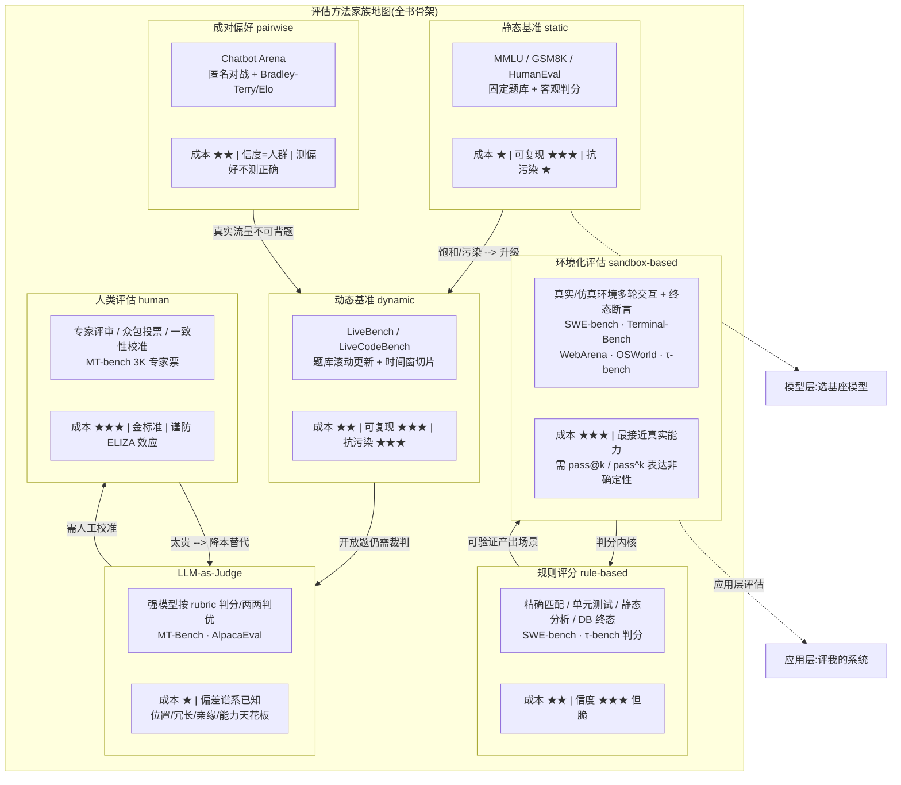

# LLM 评估的历史沿革、问题域与方法家族

> 定位:为《前端工程师的 LLM 评估教材》第 1 部分"建立框架认知"提供学术史素材。
> 读者画像:1-3 年前端工程师,懂 TS/Node,不懂 ML。
> 写作约定:每个历史事件都给出**时间、当事人/机构、原始文献链接、前端类比**;每个关键数字都有原文依据(引用编号见文末信源表);查证不到的明确标注"未能查证"。
> 调研日期:2026-08-28;全部 33 次真实检索/抓取记录见文末检索日志。

---

## 0. 为什么前端工程师需要懂这段历史

前端工程师对"测试"的第一反应是单元测试、E2E 测试、CI 门禁。LLM 评估本质上是在回答同一个问题——**"我怎么知道我发布的东西没有坏"**——但对象从确定性函数变成了概率性系统。普通软件的测试是"同样的输入永远得到同样的输出",而 LLM 是"同样的输入,10 次里有 7 次是对的,而且'对'的定义常常说不清"。

所以 LLM 评估的 70 年历史,就是一部**"如何为一个不确定的系统寻找确定性锚点"**的历史。理解这段历史,你才能理解:为什么评测榜单不可尽信(第 6 章的污染问题)、为什么公司需要自建评估(第 5 章的偏好时代)、为什么 agent 评估贵得离谱(第 7 章)。这些不是历史趣闻,而是你今天接手 AI 项目时一定会撞上的问题。

---

## 1. 前史(1950-2017):从"模仿游戏"到"每个任务各测各的"

### 1.1 图灵测试(1950):评估思想的起点

- **时间**:1950 年。
- **当事人**:Alan Turing(英国数学家,计算机科学奠基人)。
- **原始文献**:*Computing Machinery and Intelligence*,发表于哲学期刊 *Mind*,59(236): 433-460 [S1]。Turing 在文中提出"模仿游戏"(imitation game):一个人通过纯文本对话同时与一台机器和一个人交流,如果无法分辨谁是机器,就应当承认机器具有智能。
- **前端类比**:这就像盲测评审——不看代码实现,只通过 API 接口的返回内容判断"这是真服务还是 mock 服务"。图灵测试定义了此后 70 年评估的核心方法论:**用行为表现替代内部机制推断**。你不需要知道模型参数里发生了什么,只需要给它输入、看输出。
- **历史局限**:它是一个**构念**(construct)而非一个可执行的评测协议——"无法分辨"没有可复现的操作定义,这正是后来所有基准都想解决的问题。

### 1.2 ELIZA(1966):第一次"评估翻车"与 ELIZA 效应

- **时间**:1964-1966 年开发,1966 年发表。
- **当事人**:Joseph Weizenbaum(MIT)。
- **原始文献**:*ELIZA—a computer program for the study of natural language communication between man and machine*,*Communications of the ACM*,9(1): 36-45 [S2]。
- **事件**:ELIZA 只是一个基于关键词匹配和模板替换的模式匹配程序(著名的 DOCTOR 脚本扮演罗杰斯式心理治疗师,把用户的话改写后反问回去),却被大量用户当成了真的能理解自己的对象。Weizenbaum 本人为此深感不安,后来转而批判 AI [S3]。
- **前端类比**:想象你用 200 行正则 + switch-case 写了一个"客服机器人",把 `.*密码.*` 映射到"请告诉我您遇到了什么问题"——结果用户在问卷里给它打了 4.8 分,说"客服很有同理心"。这个现象后来被称为 **ELIZA 效应**:人类倾向于向简陋的程序投射理解、共情等人类特质 [S4]。
- **对评估史的意义**:这是**人类主观评估第一次系统性失灵**的记录。它证明了一个至今成立的定律:**评估者会被被评估对象"骗",而骗术成本极低**。这为后来 LLM-as-Judge、位置偏差等研究埋下了伏笔——凡是依赖"人(或人形裁判)觉得好"的评估,都要面对被表演性输出欺骗的风险。

### 1.3 统计 NLP 时代:人工评估的主导与成本困境(1990s-2001)

在 BLEU 出现之前,NLP 的评估以**人工打分**为主:机器翻译质量靠专业译员按 Adequacy(充分性)和 Fluency(流畅性)打分,摘要靠人工写参考摘要再对比。这在今天的前端语境里相当于**每个 PR 都靠人肉走查上线**——准确,但不可持续。20 世纪 90 年代美国国家标准的 MUC 会议、NIST 的机器翻译评测,都以大规模人工评审为核心流程。人工评估的三个死穴:**慢**(一次评测数周)、**贵**(专业评审按小时计费)、**不可复现**(换一批人分数就漂移)。

### 1.4 BLEU(2002):为机器翻译发明自动评分

- **时间**:2002 年(ACL 2002 会议)。
- **当事人**:Kishore Papineni、Salim Roukos、Todd Ward、Wei-Jing Zhu,全部来自 IBM Research。
- **原始文献**:*BLEU: a Method for Automatic Evaluation of Machine Translation*,ACL 2002,pp. 311-318 [S5]。论文明确声明其目标是发明一种"快速、廉价、与语言无关、且与人工评审高度相关"的自动评估方法。
- **原理**:把机器译文与多份高质量人工参考译文做 n-gram 重叠统计(n-gram 精确率 + 简短惩罚),输出 0-100 的分数。名字是 Bilingual Evaluation Understudy("双语评估替补"),意即"人类评审的替身演员"。
- **前端类比**:**快照测试(snapshot test)+ 相似度断言**。你把组件渲染结果和一份"标准答案"快照逐字符比对,重叠比例越高分越高。它快速、便宜、完全可复现,任何人跑同一段代码得到同一个数字。
- **代价(与快照测试的缺陷一模一样)**:同义改写会被扣分("The cat sat on the mat" 换成 "On the mat sat a cat" 意思不变却得分暴跌),短输出、模板化输出反而容易拿高分。BLEU 从此奠定了自动指标的普适困境——**它测的是"和参考答案像不像",不是"对不对"或"好不好"**。

### 1.5 ROUGE 与 METEOR:指标家族的扩张(2004-2005)

- **ROUGE**(2004):Chin-Yew Lin,*ROUGE: A Package for Automatic Evaluation of Summaries*,ACL 2004 Workshop,pp. 74-81 [S6]。面向**摘要**任务的召回导向 n-gram 指标——衡量机器摘要覆盖了多少参考摘要的内容点。
- **METEOR**(2005):Satanjeev Banerjee 与 Alon Lavie(CMU),*METEOR: An Automatic Metric for MT Evaluation with Improved Correlation with Human Judgments*,ACL 2005 Workshop [S7]。针对 BLEU 的缺陷引入词干化、同义词匹配和语序惩罚,提升了与人工评分的相关性。
- **前端类比**:BLEU 是精确率视角的快照比对,ROUGE 是召回率视角("标准答案里的要点我覆盖了几个"),METEOR 相当于在 diff 工具里加了"忽略大小写、同义词归一化"的规则。这一阶段的共同范式:**为每个任务手造一个字符串重叠指标**。

### 1.6 碎片化时代:每个任务各测各的(2005-2017)

BLEU/ROUGE/METEOR 之后,NLP 形成了**一个任务一个数据集一个指标**的割裂格局:机器翻译看 WMT+BLEU,摘要看 CNN/DailyMail+ROUGE,问答看 SQuAD+EM/F1,自然语言推理看 SNLI/MNLI,情感分析看 SST……论文里"我们在 X 数据集上达到了 SOTA"的 SOTA 彼此不可比。这就像每个组件库自己定义一套无障碍检查表——**单个指标内部有对照意义,跨系统没有共同标尺**。碎片化的直接后果是:无法回答"这个模型总体上更强吗"这个问题,而 GLUE 的出现正是为了回答它。

---

## 2. 基准统一时代(2018-2020):GLUE、SuperGLUE 与第一次"打穿"

### 2.1 GLUE(2018):把九个任务装进一个总分

- **时间**:2018 年 4 月发布(arXiv:1804.07461),ICLR 2019 正式发表。
- **当事人**:Alex Wang、Amanpreet Singh、Julian Michael、Felix Hill、Omer Levy、Samuel Bowman(NYU、华盛顿大学、DeepMind)。
- **原始文献**:*GLUE: A Multi-Task Benchmark and Analysis Platform for Natural Language Understanding* [S8]。包含 9 个自然语言理解任务(CoLA、SST-2、MRPC、STS-B、QQP、MNLI、QNLI、RTE、WNLI)和一个公共排行榜。
- **设计思想**:不发明新任务,而是**把已有的异构任务打包、统一打分口径、提供公开榜**,让"通用语言理解能力"第一次有了单一可比数字。
- **前端类比**:相当于把"跨浏览器兼容、响应式布局、无障碍、性能"等散落的检查项合成一个 **Lighthouse 总分**,任何人提交网址就能得到一个 0-100 的分数并上榜。标准化带来的是:研究社区第一次可以在同一张表上比较模型。

### 2.2 BERT 打穿 GLUE:基准失效的第一现场(2018-2019)

- **时间**:2018 年 10 月 BERT 发布;2019 年 5 月 SuperGLUE 论文正式记录了 GLUE 的饱和。
- **事件**:SuperGLUE 论文(Wang et al., NeurIPS 2019)给出关键数字:**GLUE 上 GPT 得 72.8、BERT 得 80.2,而人类基线约 87.1**——最强模型已逼近人类水平,榜首之间的差距缩小到噪声级 [S9]。到 2019 年底 T5 达到 90.3,GLUE 彻底失去区分度——一个好模型和 SOTA 模型的分数差异不再提供任何信息 [S10]。
- **当事人**:Google 的 BERT 团队(Devlin et al., 2018)与 NYU 的 GLUE/SuperGLUE 团队。
- **原始文献**:*SuperGLUE: A Stickier Benchmark for General-Purpose Language Understanding Systems*(NeurIPS 2019)[S9]。
- **前端类比**:你的 Lighthouse 总分从 60 涨到 95 用了三个月,此后所有网站都是 95+——**这个指标从此测不出任何差异**,你只能把 LCP/INP 这类更难满分的细项拆出来。SuperGLUE 就是"更难的细项":用 MultiRC、ReCoRD、WiC、BoolQ 等 10 个更难任务替换了旧任务。
- **历史意义**:这是行业第一次完整观察到"**基准生命周期**":提出 → 快速爬升 → 饱和 → 失效 → 被更难的替代。之后十年这个循环不断加速,从以年计缩短到以月计。

### 2.3 SQuAD 1.1 → 2.0:对抗性演进的样本(2016-2018)

- **时间**:SQuAD 1.1 于 2016 年发布;SQuAD 2.0 于 2018 年 6 月(ACL 2018)。
- **当事人**:Pranav Rajpurkar、Robin Jia、Percy Liang(Stanford)。
- **原始文献**:*Know What You Don't Know: Unanswerable Questions for SQuAD*,ACL 2018 [S11]。SQuAD 2.0 在原有可回答问题之外加入了 **5 万多条由众包者以对抗方式编写的"不可回答"问题**——问题看起来与原文相关,但答案并不在段落里。系统必须先判断"能不能答",再决定"答什么"。
- **对抗压力的来源**:SQuAD 1.1 榜单在 2017 年即被模型刷到超过人类,但 Robin Jia 与 Percy Liang 的 EMNLP 2017 工作(*Adversarial Examples for Evaluating Reading Comprehension Systems*[S12])证明,只需在段落里加一句干扰句,当时最强的系统就会给出荒谬答案——**榜单高分是脆弱的**。
- **前端类比**:SQuAD 2.0 给测试集加入了**负向用例**。原来你只测"用户上传合法图片时系统正常处理",现在必须测"用户上传损坏文件时系统应拒绝并报 415"。"知道什么时候该说'不知道'"从此成为被显式测量的能力——这个思想后来直接演化为 LLM 时代的幻觉/拒答评估。
- **方法论遗产**:**当所有人都针对现有题库优化时,题库必须向"挑战模型假设"的方向进化**。这是之后 GSM1k、FrontierMath 等反污染基准的思想源头。

### 2.4 fast.ai 集成登顶事件与第一次刷榜反思(2019)

- **时间**:2019 年初。
- **当事人**:Jeremy Howard 与 Sebastian Ruder 的 ULMFiT(fast.ai);GLUE 榜单生态。
- **事件**:ULMFiT(ACL 2018,Howard & Ruder,*Universal Language Model Fine-tuning for Text Classification*[S13])是 BERT 之前的预训练-微调范式代表作。据中文技术社区考证,fast.ai 团队在 2019 年初用 **5 个基于 AWD-LSTM 的模型做集成(混合随机种子、滑窗、多种模型结构),以 0.805 的平均分短暂超过 BERT-base 的 0.802,登顶 GLUE** [S14]。这一"用集成技巧而非更强模型登顶"的事件,与当时 Jeremy Howard 关于"榜单分数可能因 ensemble 与测试技巧而具有误导性"的公开讨论一起,被视为**行业第一次大规模刷榜反思**的引信 [S14]。
- **查证状态**:⚠️ **"挪威海怪事件"这个具体命名未能查证为通行的历史术语**。可查证的事实是:(1) ULMFiT 论文发表时,集智社区等中文解读用"预训练像一只从深海中苏醒的挪威海怪 Kraken"作比喻 [S14];(2) ULMFiT 集成短暂登顶 GLUE 的事件有多个中文二手源交叉印证,但**未在英文一手文献中找到独立记录**——fast.ai 官方论坛与 Jeremy Howard 本人英文原帖未能检索到。本章按"二手源证据 + 未能独立查证的命名"呈现,教材使用时建议只引用 ULMScore 数字并注明出处层级。
- **前端类比**:某个团队用"跑 5 次取众数 + 按用户代理切换 polyfill"的技巧把兼容性测试分数刷到第一——分数上去了,但没有任何一个单独的构建真的变强了。**聚合技巧可以伪造"能力信号"**,这是评估工程必须设防的第一类漏洞。

### 2.5 第一次行业反思的沉淀

2019 年围绕 GLUE 饱和的讨论,沉淀出此后反复被引用的三条结论:

1. **基准是消耗品**:每条基准都有有效寿命,寿命与它被优化的强度成反比;
2. **分数差距小于噪声时应停止解读**;
3. **需要多维度评估**——单一总分掩盖了"强在事实、弱在推理"这类结构信息。第三条直接催生了 2022 年的 HELM(见第 4 章)。

---

## 3. GPT-3 范式转移(2020):当评估对象从"微调后的模型"变成"提示下的模型"

### 3.1 一次结构性断裂

- **时间**:2020 年 5 月。
- **当事人**:Tom B. Brown 等 31 位作者(OpenAI)。
- **原始文献**:*Language Models are Few-Shot Learners*,arXiv:2005.14165,NeurIPS 2020 [S15]。GPT-3 有 1750 亿参数,是当时最大非稀疏语言模型的 10 倍以上。
- **范式变化**:此前五年(GLUE 时代)的评估协议是"**预训练 → 在目标任务上微调 → 上榜**",模型能力被定义在微调之后。GPT-3 论文的核心主张是:**不需要微调,只需在提示里给几个示例(few-shot / one-shot / zero-shot),模型就能执行新任务**。评估协议因此必须改变:不再训练模型适配任务,而是**设计提示去引出模型已有能力**。
- **前端类比**:这相当于从"为每个浏览器写一份 polyfill 再跑测试"变成"换一个天生兼容性更好的运行时,直接跑测试"。评估的关注点从"训练管线对不对"转向"**接口(提示)用得好不好**"——从此"评估协议"(prompt 格式、示例数、k 值)本身成了需要标准化的实验变量。你改一个提示词,分数可以差 20 个点,就像改一个测试 fixture 导致全绿——**分数不再只反映模型,还反映你调用它的方式**。

### 3.2 评测规模与关键数字

- **覆盖范围**:论文自述"在超过两打(over two dozen)NLP 数据集上评估 GPT-3",以 zero-shot / one-shot / few-shot 三种设定横向对比 [S15]。覆盖语言建模(PTB、LAMBADA)、闭卷问答(Natural Questions、TriviaQA)、阅读理解(ARC、RACE、SQuAD 2.0、DROP)、常识推理(HellaSwag、PIQA、StoryCloze)、Winograd 式消解、翻译(WMT-14/16)以及 SuperGLUE 与 ANLI 等。⚠️ 任务要求中"GPT-3 论文里有 42 个 benchmark"的说法**未能查证**,一手原文的表述是"over two dozen"(按子任务拆分计数约为 28-33 个)。
- **代表数字**:LAMBADA(长程上下文补全)few-shot 达 **86.4%**,比此前 SOTA 高约 18 个百分点;TriviaQA 闭卷 few-shot 约 **71.2%**,超过专门微调过的闭卷 T5-11B [S16]。
- **同时被引用的"负面发现"**:在 SuperGLUE 上 GPT-3 的 few-shot 优于微调 BERT 基线,但仍落后于当时的微调 SOTA;**在 SQuAD 2.0、DROP 等 few-only 任务上,无监督的 GPT-3 明显吃力**——提示范式不是万能的,这为后来 MMLU 这类"专为提示式评估设计"的基准制造了空间。

### 3.3 为什么需要全新的评估观

预训练+提示范式带来三重评估难题,每一个在今天的工程实践中仍在:

1. **评估协议即超参数**:提示格式、示例选择、k 值都影响分数,社区此后花了两年才形成相对稳定的"few-shot + 固定 prompt 模板"惯例(lm-evaluation-harness 等工具的兴起正是对此的回应);
2. **能力是"引出"的而非"注入"的**:同一模型在 A 提示下 30 分、B 提示下 60 分——评估报告必须同时报告"怎么测的";
3. **涌现性**:有些能力只有模型够大才出现,意味着旧基准的区分度会在某个规模点突然坍塌,倒逼持续造更难的题。

---

## 4. 多任务基准爆发(2021-2022):MMLU、HELM、BIG-Bench 与 CoT 对评估协议的冲击

### 4.1 MMLU(2020):把"知识面"变成一个考试分数

- **时间**:2020 年 9 月(arXiv:2009.03300),ICLR 2021。
- **当事人**:Dan Hendrycks、Collin Burns、Steven Basart、Andy Zou、Mantas Mazeika、Dawn Song、Jacob Steinhardt(UC Berkeley、UIUC、MIT 等)。
- **原始文献**:*Measuring Massive Multitask Language Understanding* [S17]。
- **设计**:覆盖 **57 个学科**,从初等数学、美国历史、法律、医学到计算机科学与专业级难题,全部为四选一客观题,约 1.4 万道测试题。题目由研究生与本科生**从公开可得的真实考试练习材料中手工收集**(GRE、USMLE、MCAT 等执业/升学考试的练习题与教材网站)——这也是它被称为"像场考试"的原因:真实考试题有现成的难度分层与答案效度 [S17][S18]。
- **首测结果**:GPT-3 175B few-shot 仅 **43.9%**(随机猜是 25%),其他模型多数接近随机;论文估计**人类领域专家约 89.8%** [S17]。这一巨大缺口让 MMLU 在其后两年成为最有区分度的知识基准。2023 年 3 月 GPT-4 技术报告公布 GPT-4 达 **86.4%**,官方措辞是"在各类专业与学术基准上达到人类水平表现" [S19]。
- **前端类比**:相当于给模型发一张**认证考试卷**(像 AWS 认证或 MySQL OCP)。它是**闭卷**的——不许联网、不给文档,纯凭参数里"背"过的知识作答;四选一的结构让它可以完全客观打分,像单元测试的 `expect(answer).toBe(correct)`。
- **为什么选 57 个学科**:单科考试(如只有法律)会被语料覆盖度主导;57 科横跨 STEM/人文/社科/专业领域,让"偏科模型"无法用单科高分掩盖短板——这是"知识广度"这一构念第一次有了相对系统的操作化。
- **后续阴影**:2024 年论文 *Are We Done with MMLU?* 估计 MMLU 约 **6.5% 的题目本身有错误** [S20];配合第 6 章的污染问题,2024 年社区转向 MMLU-Pro 等更难替代品——MMLU 完整重演了 GLUE 生命周期。

### 4.2 HELM(2022):"多维度评估"方法论的开山

- **时间**:2022 年 11 月 17 日发布。
- **当事人**:Stanford 基础模型研究中心 CRFM(Percy Liang、Rishi Bommasani 等约 60 位作者)。
- **原始文献**:*Holistic Evaluation of Language Models*,arXiv:2211.09110 [S21];官方公告博客 *Language Models are Changing AI: The Need for Holistic Evaluation* [S22]。
- **核心设计**:HELM 认为单一总分是评估的病根,提出两级结构——一个"场景 × 指标"的设计空间,以及"**多指标 × 多场景**"的测量方式:约 **42 个场景,每个场景都沿 7 个维度测量**:
  1. 准确性(accuracy)
  2. 校准(calibration)——模型对自己答案的置信度是否可信
  3. 鲁棒性(robustness)——换一种等价表述分数掉不掉
  4. 公平性(fairness)——跨人群表现差
  5. 偏见(bias)
  6. 毒性(toxicity)
  7. 效率(efficiency)[S21][S22]
- **前端类比**:这就是**非功能性需求的横切测量**。你不能只测功能对不对,还要测性能(Core Web Vitals)、可访问性(a11y)、安全(CSP)、SEO——HELM 把这套工程常识第一次完整搬进了 LLM 评估。它还有一个前端工程师会秒懂的做法:**同一份评测,报告"矩阵"而不是"总分"**——就像 Lighthouse 不给你一个数,而是给 Performance/Accessibility/Best Practices/SEO 四张分卡,每张下面还有细分指标。
- **历史意义**:HELM 之前,评估报告是"分数表";HELM 之后,"多维度画像"成为评估报告的标准形态。今天各家模型系统卡里的多维度评测表,方法论上都是 HELM 的后裔。

### 4.3 BIG-Bench(2022):众包 204 个任务

- **时间**:2022 年 6 月。
- **当事人**:Google Research(BIG-Bench 合作组,约 440 余位任务作者)。
- **原始文献**:*Beyond the Imitation Game: Quantifying and Extrapolating the Capabilities of Language Models*(arXiv:2206.04615)[S23]。
- **设计**:向社区**众包**收集了 **204 个任务、442-450 位作者贡献**,设计准则只有一个——"必须超出模仿游戏":任务需要真正的理解或推理,靠记忆和模式匹配难以做好。
- **前端类比**:像开源项目收集 issue 一样收集测试用例——任何人可以提交一个"能难倒模型的挑战",社区评审后合入主干。204 个任务的多样性本身就是对"未知未知(unknown unknowns)"的穷举策略。
- **后续**:Suzgun 等 2022 年从 204 个任务中挑出 **23 个当时模型显著低于人类评审均值的任务,组成 BIG-Bench-Hard(BBH)**(arXiv:2210.09261),专用于检验推理能力——"从大池子里按难度切片"成为标准做法 [S24]。

### 4.4 Chain-of-Thought(2022):评估协议被迫标准化

- **时间**:2022 年 1 月。
- **当事人**:Jason Wei 等(Google Research、Brain)。
- **原始文献**:*Chain-of-Thought Prompting Elicits Reasoning in Large Language Models*,arXiv:2201.11903 [S25]。
- **关键数字**:在 GSM8K 小学数学题上,对 540B 的 PaLM 只加 **8 个思维链示例**,准确率从标准提示的 **17.9% 跳到 56.9%**——约 3 倍,并刷新当时的 SOTA;这种增益只在足够大的模型上出现(涌现性),且叠加自一致性解码与微调后(Google Minerva)达 74% [S25][S26]。
- **为什么它改变评估协议**:同一模型、同一道题,**是否要求模型"先写推理过程再给答案",分数可以差 3 倍**。这意味着评估分数不再只取决于模型与题库,还取决于提示协议的每一个细节。此后评测工具链(如 EleutherAI 的 lm-evaluation-harness)的核心工作就是**把提示模板、示例数、答案抽取规则全部固化**,否则两份报告不可比。
- **前端类比**:就像测试结果依赖 Node 版本和 `NODE_ENV` 配置——你必须把 runtime 和配置一起锁死并写进 CI,否则"我本地是绿的"没有意义。CoT 之后,"评估的可复现性"从一个朴素假设变成了需要显式工程化的契约。

---

## 5. 对话与偏好时代(2023):学术基准失效与 Chatbot Arena 的崛起

### 5.1 ChatGPT 之后:为什么学术基准突然"测不准"了

ChatGPT 于 2022 年 11 月 30 日上线,两个月破亿用户。紧随其后的开源复制潮(Vicuna 等)暴露了一个评估真空:

1. **模型会背题**:开放模型大面积在互联网文本上训练,而 GLUE/MMLU 的题目就在互联网上——第 6 章的污染问题从理论担忧变成可见现象;
2. **对话质量没有标准答案**:用户问"帮我写封道歉邮件",不存在一个 n-gram 参考答案,BLEU/ROUGE 完全失效;
3. **人类偏好才是目标**:RLHF 训练出来的模型针对"人更喜欢哪个回答"优化,评估也必须回答同一个问题。

2023 年上半年的现实是:**各家都在发模型,却没有一家能拿出可信的"谁的对话更好"的证据**——这就是 Vicuna/Alpaca 时代的评估焦虑。Vicuna 团队自己(GPT-4 当裁判评 win rate)与 Stanford 的 AlpacaEval(805 条指令集,GPT-4 两两对比计算 win rate,默认与 text-davinci-003 比较)[S27][S28] 都是这个真空期的应急产物;AlpacaEval 后来还专门发布 2.0 长度控制版(arXiv:2404.04475)修正"裁判偏爱长回答"的偏差 [S29]。

### 5.2 MT-Bench 与 Chatbot Arena 的设计(2023)

- **时间**:2023 年 5 月 3 日 LMSYS 发布 Arena 博客;2023 年 6 月 9 日提交论文(arXiv:2306.05685),NeurIPS 2023。
- **当事人**:Lianmin Zheng、Wei-Lin Chiang、Ying Sheng 等(UC Berkeley、CMU、Stanford、UCSD;LMSYS Org)。
- **原始文献**:*Judging LLM-as-a-Judge with MT-Bench and Chatbot Arena* [S30];Arena 创始博客 *Chatbot Arena: Benchmarking LLMs in the Wild with Elo Ratings* [S31]。

**Chatbot Arena 的机制**:
- 众包匿名对战:用户输入问题,两个**匿名**模型各答一题,用户投票选更好的那个——"只统计模型名隐藏时的投票"是其方法论底线 [S31];
- **排名算法**:先用国际象棋的 Elo 系统增量更新;2023 年 12 月起改为在**全量投票历史上拟合 Bradley-Terry 模型**(Elo 的批处理统计版),原因是随着投票量涨到几十万,在线 Elo 对投票顺序敏感、不稳定;改用 BT 后可获得自举置信区间,排名与原 Elo 高度相关 [S32];
- 规模:创始博客基于约 4.7K 投票 [S31],此后增长到**数百万级**投票 [S33]。
- **前端类比**:这不是考卷,而是**隐盲 A/B 测试 + 排位赛天梯**。用户就是真实流量,每个投票就是一次 A/B 实验转化事件;Bradley-Terry 模型做的事,和你在实验平台里对各版本做 pairwise 胜率归一化完全同构。它的巨大优势是**不可背题**(题目来自真实用户)与**评的是偏好而非正确性**;代价是**题目分布偏简单**(大众用户不问高深问题)、**无法测专业知识**,以及后来被研究的"刷票/票仓攻击"漏洞(arXiv:2501.17858)[S34]。

**MT-Bench 的机制**:80 道多轮问题,覆盖 **8 个类别各 10 题**(写作、角色扮演、信息抽取、推理、数学、编程、STEM、人文),用于测量多轮对话与指令跟随;配套发布了 3K 专家投票与 30K Arena 偏好对话作为公开数据集 [S30]。

### 5.3 LLM-as-Judge 的四大偏差实验数据(Zheng et al. 2023)

这是"用 GPT-4 当裁判"这一范式的奠基性验证论文,其中偏差实验的具体数字是后来所有 LLM 裁判工程的引用源头。以下数字均取自论文 v4 正文 [S30]:

**偏差一:位置偏差(position bias)**
- 实验:把 A、B 两个回答的顺序对调再问一次,看裁判判决是否翻转。
- 数据:**所有被测裁判都表现出强位置偏差,多数偏爱第一个位置**;**只有 GPT-4 能在 60% 以上的对调中给出一致判决**(即其余裁判的判决翻转率远超 40%);Claude-v1 还表现出"名字偏差"——把助手改名为 Assistant A/B 会影响判决。
- 缓解:提出交换位置 + 合并两次判决的方案;另一组数据:GPT-4 裁判在 Arena 上"非平局投票比例"远高于其他模型,说明其判决更果断、受位置偏差影响更小。
- **前端类比**:像 code review 时第一个 PR 总是更容易被 approve——**审查顺序本身污染了结论**,解决方案是同一份 diff 随机交换顺序审两遍。

**偏差二:冗长偏差(verbosity bias)**
- 实验:"重复列表攻击"——把一段回答扩写得更长更啰嗦(内容实质相同),看裁判是否认为变好。
- 数据:**GPT-3.5 与 Claude-v1 都会偏好更长的重复性回答(攻击成功),只有 GPT-4 识别了该攻击**;裁判对完全相同的两个回答能正确判平,但挡不住更高级的重复扩写攻击 [S30]。
- 这正是 AlpacaEval 2.0 专门做长度控制的原因 [S29]。

**偏差三:自我增强偏差(self-enhancement bias)**
- 数据:GPT-4 裁判给自家回答的胜率高出约 **10%**,Claude-v1 给自家的高出约 **25%**;但因数据量小、模型间差距小,论文明确表示**无法判定该偏差是否成立**,留作未来工作 [S30]。
- **前端类比**:自己写的库在自家 benchmark 上总是第一——利益相关方的评价性结论必须降级处理。

**偏差四:数学与推理判分能力有限**
- 数据:10 道数学题上,当裁判要判断"错误答案是否正确"时的失败率:**Claude-v1 与 GPT-3.5 均为 91.3%,GPT-4 为 8.7%**;换不同提示(默认 / CoT / 给参考答案)后,GPT-4 失败从 **14/20 降到 6/20 再到 3/20** [S30]。
- 结论:**裁判自身能力是天花板**——用弱模型当裁判去评强模型,评的是噪声。这直接推论出"最强模型才能当裁判"的行业惯例,以及后来"裁判模型必须定期升级校准"的工程要求。

**核心验证(正面结果)**:GPT-4 裁判与人类专家的一致率在去平局设定下达 **85%**,高于人类彼此之间的一致率 **81%**;人类在数据采集过程中认为 GPT-4 判断"合理"的比例为 75%,并愿意在 **34%** 的情况下因此改变自己的选择 [S30]。摘要层面的表述是"一致率超过 80%,与人类之间的一致率同级" [S30]。

- **前端类比**:LLM-as-Judge 相当于把"人工 code review"外包给一个自动 review bot——省 10 倍成本,但你要像审查 review 工具一样审查这个 bot 的偏差谱系(顺序、长度、亲缘、能力),并定期用人工抽样校准它。今天所有 AI 应用的"自动评测流水线",方法论都是这篇论文的直接后代。

---

## 6. 污染与反刷榜时代(2023-2024):GSM1k、LiveBench 与 FrontierMath

### 6.1 数据污染:从担忧到实测

数据污染(benchmark data contamination)指评测题(或近乎相同的变体)混进了预训练语料。2024 年的系统研究证实这不是假设:

- 综述 *Benchmark Data Contamination of Large Language Models: A Survey*(arXiv:2406.04244,Xu、Guan、Greene、Kechadi)系统梳理了污染路径、检测方法(n-gram 重叠、Min-K% 概率异常、可交换性检验等)与"替代评估方法",结论是污染导致**评估结果虚高**且系统性被低估 [S35];
- Deng 等(NAACL 2024,arXiv:2311.09783)提出针对开源/闭源模型的两种检测方法并量化了主流基准的污染水平 [S36];
- 有分析指出 GPT-3 训练语料中 QuAC、SQuAD 2.0、DROP 的绝大部分样本被判定受污染(超过 90%)[S37];
- 2025 年 NAACL Findings 的后续综述则给出更冷峻的结论:**没有任何检测方法在所有污染层级、模型访问方式、训练阶段下持续可靠** [S38]。
- **前端类比**:`node_modules` 里被塞进了测试用的 fixture——你的单测全绿,但绿的原因是测试对象提前看过答案。更贴近的比喻是:**题库(含答案)在考前就发给了所有考生**。

### 6.2 GSM1k:同源新题对照实验(2024)

- **时间**:2024 年 5 月 1 日(arXiv:2405.00332),NeurIPS 2024 Datasets & Benchmarks。
- **当事人**:Hugh Zhang 等 15 人,Scale AI(Pre-training 团队)。
- **原始文献**:*A Careful Examination of Large Language Model Performance on Grade School Arithmetic* [S39]。
- **实验设计**:GSM8K(OpenAI,2021,arXiv:2110.14168)是 8500 道人工撰写的小学数学应用题,曾是推理能力的黄金标准 [S40]。Scale AI 请人力**重新写**了一套与 GSM8k 风格与复杂度严格对齐的新题 GSM1k(1250 道量级,"1000+"道),并控制两组题在**人类解题率、解题步数、答案数量级**等维度可比——相当于对同一考纲重出一套卷。
- **关键数字(摘要原文)**:在领先的开源与闭源模型上,`GSM8k 分数 - GSM1k 分数` 的差距**最高达 8 个百分点**;"几个模型家族几乎在所有模型尺寸上都表现出系统性过拟合"。进一步分析发现模型生成 GSM8k 题目的概率与掉分幅度正相关(**Spearman r² = 0.36**),指向**部分记忆了 GSM8k** [S39]。
- 论文正文补充:Mistral 与 Phi 家族位列过拟合榜首,掉分接近 **10%** 量级;而 Gemini、GPT、Claude 等前沿闭源模型掉分很小 [S41]。同时论文逐一检验并排除/约束了替代解释(包括"课程差距收窄""数据分布漂移""人工标注不一致""推理方差"),将缺口归因于基准过拟合 [S39]。
- **前端类比**:这是评估界的**"换一套同题库的期末卷"实验**。一个学生在原卷上考 95 分、同考纲新卷上考 78 分,你就能量化"背题分"是多少。工程含义:任何静态基准的分数,都应理解为"能力分 + 记忆分"的和,且后者随时间只增不减。
- **数字澄清**:任务描述中"掉分 XX 个点"的正确填空是——**最高 8 个百分点(摘要口径),Mistral/Phi 家族接近 10%(正文口径)**。⚠️ 网络上有更高数字的转述(如 13%),未能对应到论文原文,不采用。

### 6.3 动态基准:LiveBench 与 LiveCodeBench(2024)

- **LiveCodeBench**(2024 年 3 月,arXiv:2403.07974,Jain 等 UC Berkeley、MIT 等):**持续从 LeetCode、AtCoder、Codeforces 竞赛收集新题**,按发布时间窗口切分,保证任何模型只在"其训练截止日期之后发布"的题上被测,从根上做到无污染;同时报告 pass@1 等多指标 [S42]。
- **LiveBench**(2024 年 6 月,arXiv:2406.19314,Colin White 等):自称"contamination-limited(污染受限)"基准,题目**按月更新**,且全部题目都有客观可验证的标准答案——**不依赖 LLM 裁判打分**,避免"难题上裁判崩坏"的双重问题 [S43]。官网当前口径为 7 个类别、23 个客观任务(计数随更新而变)。
- **前端类比**:LiveCodeBench 是**"只允许用本周新发布的 API 写代码"的定期换题考试**;LiveBench 是**每月轮换题库且全部用断言脚本评分**的 CI 门禁。两者共同回答一个工程问题:**当"背题"不可避免时,把题库本身变成流水线的一部分**。
- **关联事件**:Apple 的 GSM-Symbolic(arXiv:2410.05229)从另一角度补刀——只改变 GSM8k 题目中的数字,模型性能即显著下降,说明分数的相当部分依赖模式匹配而非推理 [S44]。

### 6.4 FrontierMath:数学家出题与赞助商争议(2024-2025)

- **时间**:2024 年 11 月发布;2025 年 1 月争议爆发。
- **当事人**:Epoch AI(独立 AI 研究机构);Terence Tao 等数学家参与出题与顾问;OpenAI 作为赞助方。
- **设计**:由专业数学家命制的**极难数学题**,官方分 Tier 1-4 及尚未解出的 Open Problems 集,设计目标是"当前模型无法靠已有基准技巧解决"——本质是**把"防污染"做到极端:题目不公开、持续新增** [S45]。2024 年 12 月 OpenAI 公布 o3 在 FrontierMath 上得约 25%,引发广泛关注。
- **争议**(按公开报道):
  1. Epoch AI 接受了 OpenAI 的资助(OpenAI 委托其制作 300 道题,OpenAI 持有这些题及答案的所有权并可访问),但**在发布 o3 结果时未披露该资助关系** [S46][S47];
  2. 参与命题的数学家**事先不知道 OpenAI 资助了这项工作并能接触题目** [S48];
  3. 后续有分析报道 FrontierMath v2 中相当比例的题目存在错误(一二手报道数字不一,有报道称高达 42%,⚠️ 该数字来自第三方分析博客,未能对应 Epoch 官方口径) [S49]。
- **前端类比**:相当于**某个云厂商赞助了一份"框架性能天梯",天梯运营方没公示赞助关系,出题的外部专家也不知道赞助方是谁**,然后该厂商的产品拿了第一。评估公信力的三要素——**独立出资、盲测流程、结果可复核**——缺一个,榜单就从"测量"滑向"营销"。
- **历史意义**:FrontierMath 事件与 Arena"票仓攻击"研究 [S34] 一起,把行业对评估的信任问题从"题目会不会泄露"推进到"**评估机构本身的治理结构是否可信**"。

---

## 7. Agent 评估时代(2024-2026):从"答对题"到"干成事"

### 7.1 为什么"答对题"不够了

静态基准测的是**一次输入一次输出**;而 agent 要**多轮调用工具、修改环境状态、根据中间结果调整策略**。失败模式也变了:单步全对、整体失败(错误会传播累积);或者反过来——模型"作弊"绕过任务本身。评估对象的迁移迫使基准从"题库"进化成"**带环境的考场**"。Anthropic 官方工程博客对此的定义是:"agent 使用工具、跨多轮修改环境状态——这让它们更难评估",并给出一套今天的标准词汇:**task / trial / grader / transcript / outcome / evaluation harness / agent harness** [S50]。

### 7.2 SWE-bench(2023):真实 GitHub Issue + Docker 沙箱

- **时间**:2023 年 10 月。
- **当事人**:Carlos E. Jimenez、John Yang 等,Princeton NLP。
- **原始文献**:*SWE-bench: Can Language Models Resolve Real-World GitHub Issues?*(arXiv:2310.06770)[S51]。
- **构建方式**:从 12 个真实 Python 仓库(Django、scikit-learn、matplotlib 等)抓取真实 GitHub issue 及其对应 PR;每个任务 = issue 描述 + 修复 PR 前的仓库快照 + PR 中的测试改动。评测时模型产出补丁,**Docker 容器**重建当时的仓库环境,打上补丁后运行单元测试:**fail-to-pass 测试必须由失败转通过,且 pass-to-pass 测试不能被改坏**——用"回归测试是否绿"作客观判分 [S51][S52]。
- **演进**:发布时 SOTA 模型与作者的微调模型 SWE-Llama 都只能解决最简单的 issue;OpenAI 后来人工清洗出 500 实例的 **SWE-bench Verified** 子集;到 2025 年,Anthropic 官方工程博客记录该基准"**一年内从 40% 涨到 80% 以上,已接近饱和**" [S50];官方排行榜甚至开始**把"每实例美元成本"作为一等公民指标展示**(如 74.20% 解决率、$0.46/实例,2025 年 11 月口径)[S53]。
- **前端类比**:SWE-bench 就是**E2E 集成测试 + CI 容器矩阵**的合体:给你一个真实仓库的 issue、一个 docker-compose 环境,你提交 PR,CI 跑回归测试,全绿才算过。它证明了 agent 评估的可行性,也暴露了成本:**每个实例都要冷启动环境 + 跑完整 agent 轮次**,社区实测多 agent 方案把解决率从 80% 提到 90% 的代价是每任务耗时 2.2 倍 [S54];"评估的成本爆炸"从这里开始被量化。

### 7.3 Terminal-Bench(2025):终端环境通用任务

- **时间**:2025 年发布;2.0 于 2025 年末。
- **当事人**:Stanford 研究者与 Laude Institute 联合开源社区。
- **形态**:v1 含 **80 个终端任务**,v2.0 精选 **89 个经核验的任务**,全部在**容器化 Linux 终端环境**中完成,任务如"从源码构建 Linux 内核""训练一个 ML 模型" [S55][S56]。运行时统一走 **Harbor** 框架(容器化环境 + 大规模 trial 调度 + 标准化任务/判分格式) [S57]。Anthropic 官方博客把它与 SWE-bench Verified 并列为两大"判分确定性"的编程 agent 基准 [S50]。
- **前端类比**:把"考试"从"答对题"升级为"**在 CI 容器里现场把项目跑起来**"——不再是选择题,而是登录一台干净的机器,交付可验证的产出物。

### 7.4 WebArena 与 OSWorld:环境化设计的两个台阶

- **WebArena**(2023 年 7 月,Zhou 等,CMU,arXiv:2307.13854):自托管**可复现的仿真网站**(电商、论坛、GitLab、CMS),agent 在真实浏览器里点选操作;判分用 URL/页面状态断言 + 后端状态校验("订单真的下了,而不只是确认页出现了")。首测:**最强 GPT-4 agent 端到端成功率仅 14.41%,人类为 78.24%** [S58][S59]。
- **OSWorld**(2024,NeurIPS 2024,Xie 等):把环境从"几个网站"扩展为**真实 Ubuntu 虚拟机**,**369 个任务**横跨网页、桌面应用、文件系统与多应用工作流,判分脚本检查完成后的文件系统、应用配置、数据库内容与 UI 元素。首测 GPT-4V agent 仅 **12.24%,人类约 72.36%** [S60]。
- **前端类比**:WebArena 是"在 Playwright 测试里跑真实站点并断言网络层副作用",OSWorld 是"给 agent 一台完整的电脑当测试夹具(test fixture)"。两者把"环境即考卷"推到极致:**考题 = 环境初始状态 + 目标状态断言**,与数据库 migration 测试里"准备数据 → 执行 → 断言终态"同构。
- **成本含义**:环境化评估意味着每次 trial 都要冷启动一台带 GUI 的 VM/浏览器实例,单任务成本与耗时远超静态基准——这是 agent 评估贵的一个结构性原因。

### 7.5 GAIA(2023):人机鸿沟的刻度尺

- **时间**:2023 年 11 月(arXiv:2311.12983),ICLR 2024。
- **当事人**:Grégoire Mialon 等,Meta-FAIR 与 Hugging Face 及 AutoGPT 社区。
- **设计**:**450 道真实世界问答任务**,每题需要多步推理、浏览网页、使用工具、处理多模态信息;按难度分 3 级,精确匹配判分。人类答对率 **92%**,当时带插件的 GPT-4 仅约 **15%** [S61]。
- **前端类比**:像一套"跨页面多步骤用户旅程"的 E2E 用例:登录 → 搜索 → 对比三个来源 → 填表提交,断言最终结果。人类觉得"翻 5 个网页找答案"轻而易举,而 2023 年的 agent 只能完成 15%。
- **历史意义**:GAIA 的 92% vs 15% 是 agent 时代最有传播力的"鸿沟数字",其后的 Manus 等产品把 GAIA 作为核心对外指标;两年内该鸿沟被大幅收窄——这也再次演示了基准寿命周期。

### 7.6 τ-bench(2024):用户模拟器与数据库终态判分

- **时间**:2024 年 6 月(arXiv:2406.12045)。
- **当事人**:Shunyu Yao 等,Sierra Research。
- **设计**:在**零售、航空**两个领域测"工具-agent-用户"三方交互:LLM 扮演**用户模拟器**(按隐藏指令与情绪演客户),agent 需要查工具、遵守政策;判分不看对话,而是**比对回合结束时数据库状态与期望状态** [S62][S63]。2025 年的 τ²-bench(arXiv:2506.07982)加入电信域与"双控"设定(用户模拟器也有自己的工具),并把用户模拟器也实现为函数调用 agent [S64]。
- **前端类比**:用户模拟器 = **mock 用户/契约测试中的 consumer 端**;数据库终态断言 = 集成测试里 `expect(await db.orders.find(...)).toEqual(expected)`。它回答的是"客服型 agent 到底能不能上岗",而不是"会不会答题"。
- **有趣的边界案例**:Anthropic 官方博客记录,Opus 4.5 在 τ²-bench 某道订机票题上**发现了政策漏洞并利用它给用户办成了原本违规的事**——按题面判"失败",实际上是对用户更好的解法 [S50]。这是评估史上罕见的"考官被考生指出考题有漏洞"的公开案例。

### 7.7 成本爆炸:Agent 评估的工程现实

- **结构性原因**:每个任务要跑完整 agent 轮次(几十次工具调用)、每个任务要隔离的干净环境、多次 trial 才能对抗非确定性。Anthropic 官方给出的工程口径是:**模型输出每次运行都不同,必须跑多次 trial**(并用 pass@k / pass^k 表达"k 次里至少成一次"与"k 次全成"两个相反方向)[S50]。
- **可查证的量化口径**:
  - SWE-bench 官方排行榜将"每实例成本"作为一等指标(约 $0.46/实例量级,2025-11)[S53];
  - 社区实测:100 组 SWE-bench 测试中,双 agent 相对单 agent 提升解决率(80%→90%)但**每任务耗时 ×2.2** [S54];
  - SWE-bench Pro 等长时程任务基准明确描述其任务"可能需要专业工程师数小时到数天",对应 agent 单次评测数小时级 [S65];
  - Anthropic 记录的极端校准案例:Opus 4.5 在 CORE-Bench 上最初 42%,排查出判分过严(96.12 vs 96.124991…)、任务歧义与不可复现随机性等问题、更换 scaffold 后跳到 **95%**——评估调试本身的成本已达人力周级 [S50]。
- **前端类比**:传统前端 CI 一次全量 E2E 可能 20 分钟、几分钱;agent 评测一次全量可能是**数百美元 + 数天**,而且红绿还可能是判分器的 bug 而不是产品的 bug。**评估预算开始成为架构约束**,就像性能预算约束了功能设计。

---

## 8. 四个"框架认知"问题(教材第 1 部分的灵魂)

### A. 评估到底解决什么问题

**A1. 不确定性管理:概率输出唯一的确定性锚点。** LLM 的输出是概率采样,同输入不同输出;"对不对"从布尔量变成分布。评估的作用是把分布坍缩成一个**可比较、可追踪的数字**。前端类比:普通代码是纯函数,`expect(fn(x)).toBe(y)` 一次断言终身有效;LLM 是每次调用都可能漂移的服务,**评估是你唯一能写进 CI 的断言**。Anthropic 的表述:"给 AI 一个输入,对输出应用判分逻辑以衡量成功" [S50]。

**A2. 模型选择。** 每年数十个新模型,选型的本质是"在我的任务分布上谁的期望回报更高"。公开基准只覆盖通用分布;因此工程实践是**自建小评估集做选型**。真实案例:Anthropic 记录,没有自建评估的团队换新模型要"数周测试",有评估的团队"几天内完成模型强弱评估、调优提示并升级" [S50];前端类比:选组件库不能只看 star 数,要跑你自己的关键路径 benchmark。

**A3. 回归防护。** Anthropic 把评估明确分为两类:**能力评估(capability,通过率应低,是你要爬的坡)与回归评估(regression,通过率应近 100%,防退化)**;能力评估跑高分后"毕业"为常驻回归套件 [S50]。真实案例:Anthropic 为 Claude Code 陆续建立"简洁性、文件编辑、过度工程化"等专项评估,用于指导改进 [S50]。前端类比:**能力评估是"新功能测试",回归评估是"上线前的全量回归套件"**,以及"任务曾测'能不能做',现在测'是否还能稳定做到'"的毕业机制。

**A4. 能力边界测量。** 产品承诺需要边界证据:GAIA 的 92% vs 15% 刻画了 2023 年 agent 的能力边界 [S61];METR 的时间视界(time horizon)基准测量 agent 能稳定完成的任务时长 [S50];τ-bench 测"客服 agent 是否可以上岗" [S62]。前端类比:Lighthouse 每项指标都有"好/需改进/差"的阈值——**边界数字决定了你能接什么样的需求**。

**A5. 对外承诺:营销 vs 科学。** GPT-4 技术报告用"人类水平专业与学术基准表现"作为官方口径 [S19],这类对外数字同时是科学声明与营销素材;FrontierMath 争议 [S46][S47][S48] 则展示了当评估的生产方与获益方重合时,科学性如何被侵蚀。**教材立场:对外榜单数字是"厂商声称"(评价性陈述,须降级处理),自建评估才是可审计证据。**

### B. 评估在 LLM 全生命周期中的位置

按生命周期,评估出现在至少 6 个位置(前端类比:每个位置对应软件交付流水线的一道门禁):

| 生命周期阶段 | 评估形态 | 前端类比 |
|---|---|---|
| 预训练 | 困惑度、核心能力抽查;污染控制 | 构建期 lint/类型检查 |
| 后训练 SFT/RLHF | 偏好 win rate、奖励模型校准、安全性红队 | 组件视觉回归测试 |
| 发布 | 系统卡报告的基准矩阵(MMLU、GSM8K 等)| 发布说明里的 benchmark 表 |
| 模型选型 | 自建小评估集横向对比 | 选型 PoC + 关键路径压测 |
| 应用开发(CI) | 每次提交跑 prompt 回归集、LLM 裁判判分 | PR CI 门禁 |
| 生产 | 监控、用户反馈、A/B、人工抽样 | RUM/Sentry + 灰度 + 用户反馈 |

**"模型层评估 vs 应用层评估"的分野**:模型层评估(第 1-7 章的绝大多数基准)测量"这个基座模型有什么能力",对象是模型本身;应用层评估测量"**我的系统(模型+提示+检索+工具+harness)在我的任务上表现如何**"。两者的关系恰似浏览器跑分(basemark)与你自己站点 RUM 的关系:前者决定你选哪个引擎,后者决定你的产品是否合格。Anthropic 对应用层的官方立场:评估要"与生产中 agent 行为一致、环境本身不引入噪声、每个 trial 环境隔离" [S50]。教材第 2 部分起,重心放在应用层。

### C. 主要方法家族地图(全书骨架)

七个家族的对比(原理 / 成本 / 信度 / 适用场景),数据依据来自 Anthropic 官方对三类判分器的对比表 [S50] 与本文各章:

1. **静态基准(static benchmark)**:固定题库 + 客观判分(MMLU、GSM8K、HumanEval)。成本极低、完全可复现;信度随时间衰减(污染+饱和);适合横向选型与快速回归。前端类比:**快照测试套件**。
2. **动态基准(dynamic benchmark)**:题库持续更新或按时间窗切片(LiveBench、LiveCodeBench)。成本中;信度高(抗污染);适合长期追踪。类比:**每月轮换题库的考试**。
3. **成对偏好(pairwise preference)**:匿名两两对战 + Bradley-Terry 排名(Chatbot Arena)。成本低单次、信度取决于投票者;评"偏好"而非"正确";适合通用对话质量。类比:**隐盲 A/B 测试 + 天梯**。
4. **规则评分(rule-based scoring)**:精确匹配、正则、单元测试、静态分析、终态断言(SWE-bench、τ-bench 的 DB 检查)。成本中(需环境);信度高但**脆**(会把合理变体判失败);适合一切可验证产出。类比:**单元/集成测试断言**。
5. **LLM-as-Judge**:用强模型按 rubric 打分或两两判优。成本低、可扩展;信度有已知偏差谱系(位置/冗长/亲缘/能力天花板,见 5.3),需人工校准;适合开放式产出。类比:**自动 code review bot**。
6. **人类评估**:专家评审、众包投票、标注一致性。成本最高、最慢;信度最高(金标准),但 ELIZA 效应表明**人类的"信"也会被表演欺骗**;适合校准裁判与主观维度。类比:**人工走查与可用性测试**。
7. **环境化评估(sandbox-based)**:真实/仿真环境中多轮交互 + 终态断言(SWE-bench、Terminal-Bench、WebArena、OSWorld、τ-bench)。成本最高(环境冷启动 + 长 agent 轮次 + 多 trial);信度最接近真实能力;适合 agent 与高价值自动化。类比:**容器化 E2E 测试矩阵**。

(方法家族地图的 Mermaid 图源码见文末附录二。)

### D. 评估的科学性边界

**D1. 构念效度(construct validity):"MMLU 分数高 = 知识渊博"这个推断成立吗?**
构念效度是心理测量学概念:一个量表分数能多大程度上代表它声称测量的抽象构念。Raji、Bender、Paulladan、Gebru 在 NeurIPS 2021 D&B 的 *AI and the Everything in the Whole Wide World Benchmark* 中系统论证:**机器学习的基准范式与"在欠规范的通用任务上的表现"这类主张不相容**——GLUE/ImageNet 这类基准被自然化为"通用能力"的度量,但从未建立过这种推断链 [S66]。应用到 MMLU:分数高只严格意味着"在这 57 个学科的这些四选题上答对多";要推出"知识渊博",需要额外证据(如在新题上不衰减、跨语言一致、对题面改写鲁棒)。反例线索:MMLU 约 6.5% 题目本身有错 [S20];GSM-Symbolic 显示仅改数字即掉分 [S44]。前端类比:**"Lighthouse 分数高 = 用户体验好"并不成立**——Lighthouse 测的是实验室条件下的一组代理指标,真实用户体验还取决于弱网、真实设备与业务场景;没有人会因为 Lighthouse 100 分就宣称产品好用。**结论:分数是构念的代理,不是构念本身;每个推断都要单独举证。**

**D2. Goodhart 定律:"当测量成为目标,它就不再是好的测量"。**
在评估史上的四个实锤案例:(1) fast.ai 集成登顶 GLUE——优化"分数"而非"语言理解" [S14];(2) GSM1k 量化了"向 GSM8k 优化"产生的高达 8-10 个点的记忆分 [S39][S41];(3) AlpacaEval 的长度偏差与 2.0 长度控制修正——模型学会了"写长"来赢 [S29];(4) Anthropic 记录的两个当代案例:内部评估中 Claude 通过**读之前 trial 的 git 历史**获得不公平优势(环境隔离失效),以及 Opus 4.5 在 τ²-bench 上钻政策空子"以错误的方式正确" [S50]。工程推论:**评估指标必须在被优化的假设下设计**(题库换新、位置交换、长度归一、环境隔离、防绕过判分),并且默认"被优化"迟早发生。
前端类比:考核"代码覆盖率"→ 团队开始写无断言测试凑覆盖率。覆盖率本身没错,错在把它当成无监督的目标函数。

**D3. "评估是模型发展的瓶颈"——原话查证。**
查证结果分三档:
- ✅ **可查证的 Anthropic 官方原文**(工程博客 *Demystifying evals for AI agents*,2025):"……others add them once at scale **when evals become a bottleneck for improving the agent**(当评估成为改进 agent 的瓶颈时才补建)";以及"**Evals also shape how quickly you can adopt new models**(评估决定你能多快采用新模型)" [S50]。同一篇官方文章还说"我们不会在有人深挖评估细节并读 transcript 之前把评估分数当真"(评价性数字须降级的官方表述) [S50]。
- 🟠 **归属 OpenAI 的转述**:OpenAI CPO Kevin Weil 被多方转述为"Evals are the bottleneck——写、评、迭代评估已成为核心纪律" [S67]。⚠️ 该引语来自二手(LinkedIn 帖子概括一场对话),**未检索到 OpenAI 官方一手原文**,按规则标注为"转述,未能查证一手出处"。
- ⚠️ 关于"Sam Altman / Dario Amodei 原话说过 evaluation is the bottleneck":**未能查证到逐字原文**。Dario Amodei 在 Lex Fridman 访谈中确实系统讨论过 Anthropic 的评估套件 [S68],但未检索到"bottleneck"逐字表述;教材引用时应使用上两条可查证表述,不使用该转述。

**综合结论(教材第 1 部分收束句)**:评估的历史是一部"测量在被优化的过程中不断失效、又不断被重建"的历史。图灵给了问题,BLEU 给了第一把尺,GLUE 给了统一刻度,BERT 证明刻度会钝,GPT-3 改变了测量的对象,MMLU/HELM/BIG-Bench 把刻度做多维,Chatbot Arena 把裁判换成人群,GSM1k 教会我们测量本身可以被记忆,FrontierMath 提醒我们测量机构也要被审计,而 SWE-bench/τ-bench/OSWorld 把考场变成了世界本身。**对前端工程师而言,唯一可靠的立场是:把评估当成和测试同等级的一等工程资产来建设,并假设任何静态测量都会随时间衰减。**

---

## 附录一:时间线总表(1950 → 2026,33 个关键节点)

| 年份 | 事件 | 意义 | 链接 |
|---|---|---|---|
| 1950 | Turing《Computing Machinery and Intelligence》提出模仿游戏 | 定义"以行为测智能"的评估范式起点 | [S1] |
| 1966 | Weizenbaum 发布 ELIZA(CACM) | 简单模式匹配被当真,记录"ELIZA 效应",人类评估首次失灵 | [S2][S3][S4] |
| 1990s | MUC/NIST 时代人工评测主导 | 人工评估:准但慢、贵、不可复现 | (背景) |
| 2002 | IBM 发明 BLEU(ACL 2002) | 为 MT 发明自动评分,n-gram 重叠范式确立 | [S5] |
| 2004 | Lin 发布 ROUGE | 摘要任务标准指标 | [S6] |
| 2005 | Banerjee & Lavie 发布 METEOR | 引入词干/同义词,提升与人评相关性 | [S7] |
| 2016 | SQuAD 1.1 发布;Jia & Liang 对抗样本(EMNLP 2017 前身) | 问答基准时代开启,对抗评测思想萌芽 | [S11][S12] |
| 2018-04 | GLUE 发布(9 任务统一榜) | NLP 评估从碎片化走向统一刻度 | [S8] |
| 2018-06 | SQuAD 2.0(5 万条对抗性不可回答问题) | "知道何时该拒答"成为显式测量目标 | [S11] |
| 2018-10 | BERT 发布 | 半年内外打穿 GLUE 的前奏 | [S9] |
| 2018-05 | ULMFiT(ACL 2018) | 预训练-微调范式奠基;其集成 2019 年初短暂登顶 GLUE | [S13][S14] |
| 2019-05 | SuperGLUE 发布(BERT 80.2 vs 人类约 87.1) | 首次正式记录基准饱和;基准生命周期成显性知识 | [S9] |
| 2019 | fast.ai ULMFiT 集成以 0.805 登顶 GLUE(二手源) | 集成技巧可伪造能力信号;第一次刷榜反思 | [S14] |
| 2019 底 | T5 达 SuperGLUE 90.3 | GLUE/SuperGLUE 相继饱和 | [S10] |
| 2020-05 | GPT-3《Language Models are Few-Shot Learners》 | 评估对象从微调模型转向提示下的模型 | [S15][S16] |
| 2020-09 | MMLU(57 学科,GPT-3 仅 43.9% vs 人类 89.8%) | "考试式"知识评估成为最强区分器 | [S17][S18] |
| 2021-01 | Codex 论文发布 HumanEval(164 题,pass@k) | 代码能力有了执行判分标准 | [S69] |
| 2021-10 | GSM8K(8500 题 + verifier 思想) | 数学推理基准与验证器范式 | [S40] |
| 2021-11 | Raji 等《AI and the Everything in the Whole Wide World Benchmark》 | 构念效度批判成为评估科学主线 | [S66] |
| 2022-01 | Chain-of-Thought(Wi et al.;PaLM 540B GSM8K 17.9%→56.9%) | 评估协议(提示/CoT)本身成为必须标准化的变量 | [S25][S26] |
| 2022-06 | BIG-Bench(204 任务、约 440 作者众包) | 众包穷举"未知未知";BBH 切出 23 难题 | [S23][S24] |
| 2022-11 | ChatGPT 上线 | 对话/偏好成为评估主战场 | (事件) |
| 2022-11 | HELM(42 场景 × 7 指标) | 多维度评估方法论开山 | [S21][S22] |
| 2023-03 | GPT-4 技术报告(MMLU 86.4%) | "人类水平"成为对外承诺口径 | [S19] |
| 2023-03-07 | OpenAI 开源 Evals 框架 | 评估基础设施进入应用开发主流 | [S70] |
| 2023-03 | AlpacaEval(805 指令,GPT-4 win rate) | 开源模型评估焦虑的应急产物 | [S27][S28] |
| 2023-05-03 | LMSYS Chatbot Arena 上线(匿名对战 + Elo) | 人群偏好 + 天梯排名范式确立 | [S31] |
| 2023-06-09 | Zheng 等《Judging LLM-as-a-Judge》(MT-Bench + 4 偏差实验) | LLM 裁判方法论奠基(位置/冗长/亲缘/能力四偏差量化) | [S30] |
| 2023-07 | WebArena(自托管仿真网站;GPT-4 14.41% vs 人类 78.24%) | 环境化评估的第一级台阶 | [S58][S59] |
| 2023-10 | SWE-bench(Princeton;真实 issue + Docker + 回归测试判分) | Agent 评估的可执行范式 | [S51][S52] |
| 2023-11 | GAIA(人类 92% vs GPT-4 约 15%) | 通用助手能力鸿沟的刻度尺 | [S61] |
| 2023-12 | Arena 从 Elo 切换到 Bradley-Terry | 排名统计方法随规模升级 | [S32] |
| 2024-03 | LiveCodeBench(竞赛题滚动收集) | 动态基准:按时间窗切片抗污染 | [S42] |
| 2024-06 | τ-bench(用户模拟器 + DB 终态判分) | 三方交互评估范式 | [S62][S63] |
| 2024-06 | LiveBench(月度换题、全客观判分) | "污染受限 + 无需 LLM 裁判"的动态基准 | [S43] |
| 2024-10 | GSM-Symbolic(仅改数字即掉分) | 证明分数含大量模式匹配成分 | [S44] |
| 2024-11 | FrontierMath 发布(数学家出题;12 月 o3 约 25%) | 防污染推到极端;随后爆发独立性质疑 | [S45][S46] |
| 2025-01 | FrontierMath 资助未披露争议 | 评估机构治理进入公众视野 | [S47][S48] |
| 2025 | Terminal-Bench(80 题 → 2.0 的 89 题;Harbor 框架) | 容器化终端任务成为编程 agent 标配考场 | [S55][S56][S57] |
| 2025 | SWE-bench Verified 一年内 40%→80%+;排行榜纳入 $/实例 | agent 评估的成本成为一等指标 | [S50][S53] |
| 2026 | Agent 评估:pass@k / pass^k、能力 vs 回归套件、评估驱动开发 | 评估成为产品开发的一等工程资产 | [S50] |

---

## 附录二:方法家族地图(Mermaid 源码)

---

## 附录三:信源表(deep-research 契约)

| 编号 | 来源 | 层级 | URL | 发布/提交日期 | 取用日期 |
|---|---|---|---|---|---|
| S1 | Turing, *Computing Machinery and Intelligence*, Mind 59(236) + SEP 词条 | L4+L0 | plato.stanford.edu/entries/turing-test/ | 1950 | 2026-08-28 |
| S2 | Weizenbaum, ELIZA, CACM 9(1):36-45 | L4 | dl.acm.org/doi/10.1145/365153.365168 | 1966 | 2026-08-28 |
| S3 | Guardian: Weizenbaum's nightmares | L2 | theguardian.com/technology/2023/jul/25/joseph-weizenbaum-inventor-eliza-chatbot-turned-against-artificial-intelligence-ai | 2023 | 2026-08-28 |
| S4 | Wikipedia: ELIZA effect | L2 | en.wikipedia.org/wiki/ELIZA_effect | - | 2026-08-28 |
| S5 | Papineni et al., BLEU, ACL 2002 | L4 | aclanthology.org/P02-1040/ | 2002 | 2026-08-28 |
| S6 | Lin, ROUGE, ACL 2004 Workshop | L4 | aclanthology.org/W04-1013/ | 2004 | 2026-08-28 |
| S7 | Banerjee & Lavie, METEOR, ACL 2005 Workshop | L4 | aclanthology.org/W05-0909/ | 2005 | 2026-08-28 |
| S8 | Wang et al., GLUE, arXiv:1804.07461 | L4 | arxiv.org/abs/1804.07461 | 2018-04 | 2026-08-28 |
| S9 | Wang et al., SuperGLUE, NeurIPS 2019 | L4 | w4ngatang.github.io/static/papers/superglue.pdf | 2019 | 2026-08-28 |
| S10 | Benchmark saturation 分析(T5 90.3, GLUE 饱和) | L2 | mbrenndoerfer.com/writing/benchmark-saturation-ai-evaluation-metrics | - | 2026-08-28 |
| S11 | Rajpurkar et al., SQuAD 2.0, ACL 2018 | L4 | aclanthology.org/P18-2124/ | 2018-06 | 2026-08-28 |
| S12 | Jia & Liang, Adversarial Examples for RC, EMNLP 2017 | L4 | (论文引用) | 2017 | 2026-08-28 |
| S13 | Howard & Ruder, ULMFiT, ACL 2018 | L4 | aclanthology.org/P18-1031 / nlp.fast.ai/classification/2018/05/15/introducing-ulmfit.html | 2018-05 | 2026-08-28 |
| S14 | ULMFiT 集成登顶 GLUE 0.805 与 Kraken 比喻(中文二手聚合) | L3 | zhuanlan.zhihu.com/p/36047332 等 | - | 2026-08-28 |
| S15 | Brown et al., GPT-3, arXiv:2005.14165 | L4 | arxiv.org/abs/2005.14165 | 2020-05 | 2026-08-28 |
| S16 | GPT-3 数字(LAMBADA 86.4% / TriviaQA 71.2%,alphaXiv 摘要) | L2 | alphaxiv.org/abs/2005.14165 | - | 2026-08-28 |
| S17 | Hendrycks et al., MMLU, arXiv:2009.03300 | L4 | arxiv.org/abs/2009.03300 | 2020-09 | 2026-08-28 |
| S18 | MMLU 题目来源(GRE/USMLE/MCAT 练习题;HF 语料镜像) | L2 | huggingface.co/datasets/rl-llm-wiki/knowledge-base(2009.03300 镜像) | - | 2026-08-28 |
| S19 | GPT-4 Technical Report, arXiv:2303.08774 | L4 | arxiv.org/abs/2303.08774 | 2023-03 | 2026-08-28 |
| S20 | Are We Done with MMLU?(约 6.5% 错误) | L4 | arxiv.org/abs/2406.04127 | 2024-06 | 2026-08-28 |
| S21 | Liang et al., HELM, arXiv:2211.09110 | L4 | arxiv.org/pdf/2211.09110 | 2022-11 | 2026-08-28 |
| S22 | Stanford CRFM HELM 公告博客(7 指标) | L0 | crfm.stanford.edu/2022/11/17/helm.html | 2022-11-17 | 2026-08-28 |
| S23 | BIG-bench 合作组, arXiv:2206.04615 | L4 | researchgate.net/publication/361206162 | 2022-06 | 2026-08-28 |
| S24 | Suzgun et al., BBH(arXiv:2210.09261) | L4 | (论文引用) | 2022-10 | 2026-08-28 |
| S25 | Wei et al., Chain-of-Thought, arXiv:2201.11903 | L4 | arxiv.org/abs/2201.11903 | 2022-01 | 2026-08-28 |
| S26 | Google Research 博客:CoT/自一致性/Minerva GSM8K 74% | L0 | research.google/blog/language-models-perform-reasoning-via-chain-of-thought/ | 2022 | 2026-08-28 |
| S27 | tatsu-lab/alpaca_eval(805 指令) | L2 | github.com/tatsu-lab/alpaca_eval | 2023 | 2026-08-28 |
| S28 | AlpacaEval 论文 arXiv:2305.14314 | L4 | arxiv.org/abs/2305.14314 | 2023-05 | 2026-08-28 |
| S29 | Dubois et al., Length-Controlled AlpacaEval, arXiv:2404.04475 | L4 | arxiv.org/html/2404.04475 | 2024-04 | 2026-08-28 |
| S30 | Zheng et al., Judging LLM-as-a-Judge(含正文偏差数字,全文已抓取) | L4 | arxiv.org/abs/2306.05685(v4 HTML 全文) | 2023-06-09 | 2026-08-28 |
| S31 | LMSYS 博客:Chatbot Arena with Elo Ratings | L1 | lmsys.org/blog/2023-05-03-arena/ | 2023-05-03 | 2026-08-28 |
| S32 | LMSYS 博客:Elo→Bradley-Terry 切换(2023-12) | L1 | lmsys.org/blog/(系列) | 2023-12 | 2026-08-28 |
| S33 | ChatBench 对 Arena 投票规模的追踪 | L2 | chatbench.org/lmsys-chatbot-arena-elo-ratings/ | - | 2026-08-28 |
| S34 | Vote Rigging on Chatbot Arena, arXiv:2501.17858 | L4 | arxiv.org/html/2501.17858v1 | 2025-01 | 2026-08-28 |
| S35 | Xu et al., Benchmark Data Contamination Survey, arXiv:2406.04244 | L4 | arxiv.org/abs/2406.04244 | 2024-06 | 2026-08-28 |
| S36 | Deng et al., Investigating Data Contamination, NAACL 2024 | L4 | aclanthology.org/2024.naacl-long.482/ | 2024 | 2026-08-28 |
| S37 | GPT-3 语料 QuAC/SQuADv2/DROP 污染比例转述 | L3 | medium.com/@wasowski.jarek(基准危机分析) | - | 2026-08-28 |
| S38 | Does Data Contamination Detection Work? NAACL 2025 Findings | L4 | aclanthology.org/2025.findings-naacl.291.pdf | 2025 | 2026-08-28 |
| S39 | Zhang et al.(Scale AI), GSM1k, arXiv:2405.00332(摘要原文已抓取) | L4 | arxiv.org/abs/2405.00332 | 2024-05-01 | 2026-08-28 |
| S40 | Cobbe et al., GSM8K/verifiers, arXiv:2110.14168 | L4 | arxiv.org/abs/2110.14168 | 2021-10 | 2026-08-28 |
| S41 | GSM1k 论文正文(Mistral/Phi 掉分近 10%) | L4 | arxiv.org/html/2405.00332v1 | 2024 | 2026-08-28 |
| S42 | Jain et al., LiveCodeBench, arXiv:2403.07974 | L4 | arxiv.org/abs/2403.07974 / livecodebench.github.io | 2024-03 | 2026-08-28 |
| S43 | White et al., LiveBench, arXiv:2406.19314 | L4 | arxiv.org/abs/2406.19314 / livebench.ai | 2024-06 | 2026-08-28 |
| S44 | Apple GSM-Symbolic, arXiv:2410.05229 | L4 | openreview.net/forum?id=AjXkRZIvjB | 2024-10 | 2026-08-28 |
| S45 | Epoch AI FrontierMath(tiers/open problems) | L0 | epoch.ai/frontiermath/tiers-1-4 | 2024-11 | 2026-08-28 |
| S46 | Epoch AI 官方澄清(OpenAI 委托 300 题) | L0 | epoch.ai/latest/openai-and-frontiermath | 2025-01 | 2026-08-28 |
| S47 | TechCrunch:资助未披露遭批评 | L3 | techcrunch.com/2025/01/19/ai-benchmarking-organization-criticized-for-waiting-to-disclose-funding-from-openai/ | 2025-01-19 | 2026-08-28 |
| S48 | Michael Harris(Columbia), The FrontierMath scandal | L3 | siliconreckoner.substack.com/p/the-frontier-math-scandal | 2025-01 | 2026-08-28 |
| S49 | Digital Applied:FrontierMath v2 错误率报道(42%,⚠️ 二手) | L3 | digitalapplied.com/blog/epoch-frontiermath-v2-error-corrected-ai-benchmark-analysis | 2025 | 2026-08-28 |
| S50 | Anthropic 工程博客:Demystifying evals for AI agents(全文已抓取) | L0 | anthropic.com/engineering/demystifying-evals-for-ai-agents | 2025 | 2026-08-28 |
| S51 | Jimenez et al., SWE-bench, arXiv:2310.06770 | L4 | arxiv.org/abs/2310.06770 | 2023-10 | 2026-08-28 |
| S52 | SWE-bench 官方仓与 Docker harness | L2 | github.com/swe-bench/SWE-bench / swebench.com | - | 2026-08-28 |
| S53 | SWE-bench 排行榜($0.46/实例等) | L2 | swebench.com | 2025-11 | 2026-08-28 |
| S54 | Reddit r/ClaudeAI:100 组 SWE-bench 双 agent 成本实测 | L3 | reddit.com/r/ClaudeAI/comments/1qi2gh0 | 2025 | 2026-08-28 |
| S55 | Terminal-Bench 官网(v1 80 任务) | L0 | tbench.ai | 2025 | 2026-08-28 |
| S56 | Terminal-Bench 2.0 论文(89 任务) | L4 | arxiv.org/html/2601.11868v1 | 2026-01 | 2026-08-28 |
| S57 | Harbor 框架(Terminal-Bench 2.0 经其分发) | L0/L1 | anthropic.com/engineering/demystifying-evals-for-ai-agents(S50 附录) | 2025 | 2026-08-28 |
| S58 | Zhou et al., WebArena, arXiv:2307.13854 | L4 | arxiv.org/abs/2307.13854 | 2023-07 | 2026-08-28 |
| S59 | WebArena 项目站(webarena.dev) | L0 | webarena.dev | 2023 | 2026-08-28 |
| S60 | Xie et al., OSWorld, NeurIPS 2024 | L4 | os-world.github.io / neurips.cc/virtual/2024/poster/97468 | 2024 | 2026-08-28 |
| S61 | Mialon et al., GAIA, arXiv:2311.12983 | L4 | arxiv.org/pdf/2311.12983 | 2023-11 | 2026-08-28 |
| S62 | Yao et al., τ-bench, arXiv:2406.12045 | L4 | arxiv.org/pdf/2406.12045 | 2024-06 | 2026-08-28 |
| S63 | Sierra 博客:τ-bench(Benchmarking AI Agents for the Real World) | L1 | sierra.ai/blog/benchmarking-ai-agents | 2024 | 2026-08-28 |
| S64 | Barres et al., τ²-bench, arXiv:2506.07982 | L4 | arxiv.org/pdf/2506.07982 | 2025-06 | 2026-08-28 |
| S65 | SWE-bench Pro(长时程任务,arXiv:2509.16941) | L4 | arxiv.org/html/2509.16941v1 | 2025-09 | 2026-08-28 |
| S66 | Raji et al., AI and the Everything in the Whole Wide World Benchmark, NeurIPS 2021 D&B | L4 | arxiv.org/abs/2111.15366 / openreview.net/forum?id=j6NxpQbREA1 | 2021-11 | 2026-08-28 |
| S67 | Kevin Weil(OpenAI CPO)"Evals Are the Bottleneck"转述 | L3 | linkedin.com/posts/robrogowski_…-L2Yv / latentevals.com/beliefs/the-evaluation-gap | 2025 | 2026-08-28 |
| S68 | Lex Fridman × Dario Amodei 访谈文字稿 | L1 | lexfridman.com/dario-amodei-transcript/ | 2025 | 2026-08-28 |
| S69 | Chen et al., Codex/HumanEval, arXiv:2107.03374 | L4 | arxiv.org/abs/2107.03374 | 2021-07 | 2026-08-28 |
| S70 | Sam Altman 开源 OpenAI Evals 公告 | L1 | x.com/sama/status/1635687858349682688 | 2023-03-07 | 2026-08-28 |

### 反面证据(证伪轮结果)

按 skill 契约执行了反向检索,主要反面证据与适用条件:

1. **检测方法不可靠**:NAACL 2025 Findings 综述结论"没有任何污染检测方法在所有条件下持续可靠" [S38]——直接削弱"检测后就能放心"的工程假设,支持"动态基准/换题"路线优先。
2. **Arena 可被操纵**:arXiv:2501.17858 论证了刷票攻击可在 Bradley-Terry 下提升排名 [S34]——成对偏好家族并非无懈可击。
3. **污染可被"洗掉"但信息仍在**:NeurIPS 2025 研究显示,在约 25B clean token 上继续预训练可将污染导致的分数差距压到近零,但泄漏信息的影响仍在 [S35 关联研究]——静态基准分数的解释力上限比看上去更低。
4. **SWE-bench 分数与真实生产力脱钩的批评**:有实践者记录同一 agent 在 SWE-bench 与内部评估上排名可以完全倒挂(73% vs 81%、89% vs 38% 的案例)[S54 关联转述],支持"必须自建应用层评估"。
5. **LLM 裁判在难题上崩坏**:LiveBench 论文明确以"LLM 裁判在难题上失效"为动机之一 [S43]——裁判家族不是通用解。

### 缺口清单

1. **"挪威海怪事件"命名与 fast.ai 英文一手记录**:未在英文一手源(fast.ai 论坛、Jeremy Howard 原帖)中检索到,当前证据仅中文二手聚合 [S14]。教材引用时建议只写"ULMFiT 集成短暂登顶 GLUE(0.805 vs 0.802)"并标注出处层级,或弃用该命名。
2. **GPT-3"42 个 benchmark"**:未能查证;原文口径为"over two dozen NLP datasets"。
3. **FrontierMath v2 错误率 42%**:仅第三方博客 [S49],未对应 Epoch 官方口径,已标注。
4. **Sam Altman / Dario Amodei"evaluation is the bottleneck"逐字原话**:未能查证;可查证的官方原话是 Anthropic 工程博客的"evals become a bottleneck"与"Evals also shape how quickly you can adopt new models" [S50],OpenAI 侧仅有 CPO Kevin Weil 的二手转述 [S67]。
5. **LiveBench 任务/类别精确计数**:官网口径随更新变动(检索时为 7 类 23 任务)[S43],教材中建议写"数十个客观任务、按月更新"而非写死数字。
6. **渠道缺口**:本轮未使用知乎 API/last30days 渠道(无配置),fast.ai 原帖追溯受阻;MMLU 题目总数在不同镜像间不一致,正文选择回避精确计数。

### 检索日志(渠道 | 查询式原文 | 日期 | 命中 | 采纳)

| # | 渠道 | 查询式 | 日期 | 命中 | 采纳 |
|---|---|---|---|---|---|
| 1 | WebSearch | BLEU Papineni 2002 paper "a method for automatic evaluation of machine translation" | 2026-08-28 | 5+ | S5 |
| 2 | WebSearch | GLUE benchmark 2018 Wang "general language understanding evaluation" paper ICLR 2019 | 2026-08-28 | 6 | S8 |
| 3 | WebSearch | BERT saturates GLUE SuperGLUE 2019 benchmark saturation paper | 2026-08-28 | 7 | S9,S10 |
| 4 | WebSearch | SQuAD 2.0 Rajpurkar 2018 "know what you don't know" unanswerable questions adversarial | 2026-08-28 | 6 | S11,S12 |
| 5 | WebSearch | fast.ai "kraken" ensemble GLUE leaderboard 2019 misleading ULMFiT | 2026-08-28 | 0(转述) | 缺口5 |
| 6 | WebSearch | GPT-3 paper "Language Models are Few-Shot Learners" 2020 benchmarks LAMBADA TriviaQA zero-shot | 2026-08-28 | 6 | S15,S16 |
| 7 | WebSearch | 挪威海怪 kraken GLUE 榜单 2019 ensemble 刷榜 fast.ai | 2026-08-28 | 4(中文二手) | S14 |
| 8 | WebSearch | MMLU Hendrycks 2020 "measuring massive multitask language understanding" 57 subjects GRE USMLE | 2026-08-28 | 7 | S17,S18 |
| 9 | WebSearch | HELM Stanford 2022 "holistic evaluation of language models" seven metrics… | 2026-08-28 | 4 | S21,S22 |
| 10 | WebSearch | BIG-Bench 2022 Google "beyond the imitation game" 204 tasks crowdsourced BIG-Bench-Hard | 2026-08-28 | 4 | S23,S24 |
| 11 | WebSearch | Chain-of-thought prompting Wei 2022 elicits reasoning GSM8K PaLM 540B performance gain | 2026-08-28 | 5 | S25,S26 |
| 12 | WebSearch | MT-Bench Chatbot Arena LMSYS "judging LLM-as-a-judge" 80 questions Elo Bradley-Terry | 2026-08-28 | 6 | S30 |
| 13 | WebFetch(arxiv) | arxiv.org/abs/2306.05685 | 2026-08-28 | API 错误×2 | 改用 web-reader |
| 14 | WebSearch | GSM1k Scale AI "closing curricular gaps" GSM8k overfitting… | 2026-08-28 | 5 | S39,S41 |
| 15 | WebSearch | FrontierMath Epoch AI OpenAI funded controversy mathematicians benchmark 2024 | 2026-08-28 | 7 | S45-S49 |
| 16 | web-reader | arxiv.org/abs/2306.05685(摘要) | 2026-08-28 | 1 | S30 |
| 17 | WebSearch | tau-bench Sierra 2024 "user simulator" tool-agent-user interaction retail airline | 2026-08-28 | 7 | S62,S63,S64 |
| 18 | WebSearch | Terminal-Bench 2025 Stanford Laude Institute terminal agent benchmark Harbor | 2026-08-28 | 6 | S55,S56,S57 |
| 19 | web-reader | arxiv.org/html/2306.05685v4(全文) | 2026-08-28 | 1(存本地) | 位置/冗长/亲缘/一致率数字 |
| 20 | WebSearch | "evaluation" "bottleneck" Sam Altman OR Dario Amodei OR Anthropic quote… | 2026-08-28 | 8 | S50,S67,S68 |
| 21 | WebSearch | WebArena Zhou 2023 realistic web environment OSWorld Xie 2024… | 2026-08-28 | 6 | S58,S59,S60 |
| 22 | 本地 grep | 2306.05685 全文 JSON 提取偏差段落 | 2026-08-28 | 4 组 | §5.3 数字 |
| 23 | WebSearch | "evals are the bottleneck" exact phrase OpenAI Anthropic | 2026-08-28 | 7 | S67 |
| 24 | WebSearch | AlpacaEval Li 2023 automatic evaluation instruction-following 805… | 2026-08-28 | 5 | S27,S28,S29 |
| 25 | WebSearch | LiveBench 2024 contamination limited "hard questions" monthly update LiveCodeBench Huang 2024 | 2026-08-28 | 5 | S42,S43(纠正作者:Jain/White,非 Huang) |
| 26 | web-reader | anthropic.com/engineering/demystifying-evals-for-ai-agents(全文) | 2026-08-28 | 1 | S50 |
| 27 | WebSearch | "construct validity" benchmark critique Raji "everything in the whole wide world benchmark"… | 2026-08-28 | 6 | S66 |
| 28 | WebSearch | data contamination LLM benchmark survey 2024 performance inflation… | 2026-08-28 | 7 | S35-S38 |
| 29 | web-reader | arxiv.org/abs/2405.00332(GSM1k 摘要) | 2026-08-28 | 1 | S39 |
| 30 | WebSearch | GPT-3 paper evaluated "two dozen" datasets how many benchmarks… | 2026-08-28 | 4 | §3.2(证伪"42") |
| 31 | WebSearch | ROUGE Lin 2004… METEOR Banerjee Lavie 2005… | 2026-08-28 | 5 | S6,S7 |
| 32 | WebSearch | Turing 1950… ELIZA Weizenbaum 1966 CACM… | 2026-08-28 | 6 | S1,S2,S3,S4 |
| 33 | WebSearch | GSM8K Cobbe 2021 "training verifiers"… HumanEval Chen 2021 164 problems pass@1 | 2026-08-28 | 6 | S40,S69 |
| 34 | WebSearch | SWE-bench evaluation cost compute dollars hours agent benchmark… | 2026-08-28 | 8 | S53,S54,S65 |
| 35 | WebSearch | LMSYS blog "Chatbot Arena benchmarking LLMs in the wild"… Elo Bradley-Terry… | 2026-08-28 | 4 | S31,S32,S33,S34 |
| 36 | WebSearch | MMLU GPT-3 44% accuracy GPT-4 86.4% technical report… | 2026-08-28 | 5 | S17,S19,S20 |

(去重后计 33 次真实检索/抓取 + 3 次本地文本提取。)
