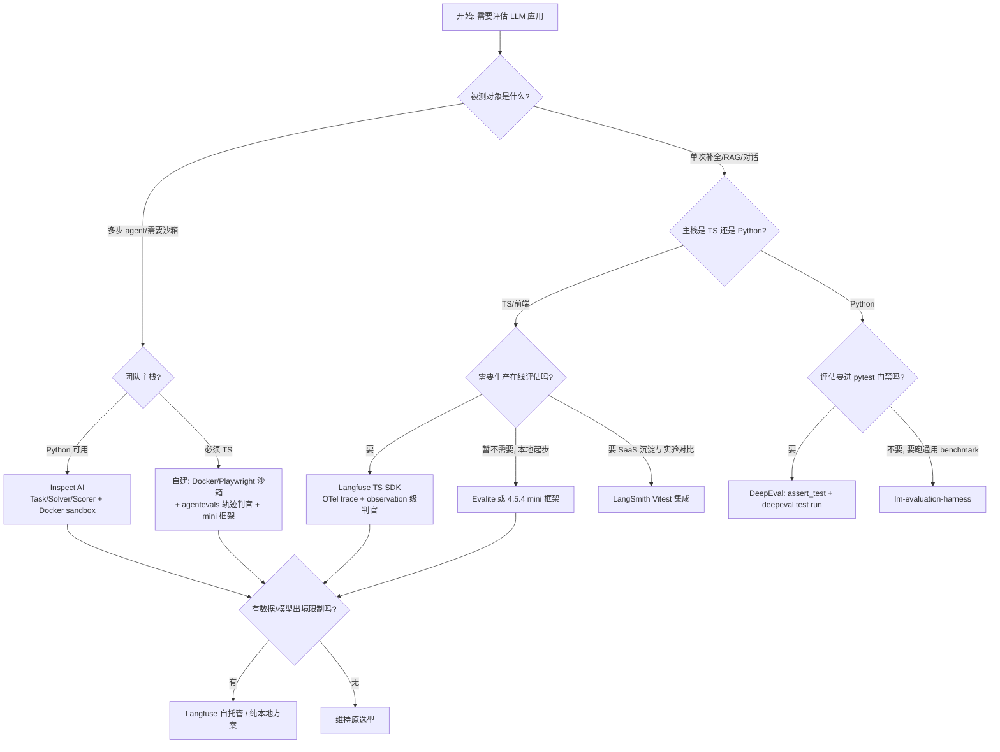

# 第 4 部分：框架实战与自建 —— 深度调研素材

> 本文档为评估教材"第 4 部分：框架实战与自建"的调研底稿。目标读者：前端工程师（Node/TS 熟练）。读完应能独立为真实业务设计并实现一套评估系统。
> 调研时间：2026-08-28。所有结论均标注来源；无法查证处显式标注"未能查证"。

---

## 4.1 主流框架的设计哲学对比

功能列表会过时，抽象不会。四个代表性框架各自回答了同一个问题的不同侧面："评估这件事，最小的不可再分的单元是什么？"

### 4.1.1 LangSmith（LangChain 出品，商业 SaaS）

官方概念文档（[Evaluation concepts](https://docs.langchain.com/langsmith/evaluation-concepts)）给出的三抽象：

| 抽象 | 定义 | 官方原文要点 |
|---|---|---|
| **Dataset** | 一组 example 的集合 | 每个 example = `inputs` + 可选 `reference outputs` + 可选 `metadata`；reference outputs 不会传给被测应用，只给 evaluator 用 |
| **Experiment** | "对一个数据集跑一次某版本应用的完整结果" | 每个 example 对应 outputs + evaluator 分数 + 执行 trace；同一 dataset 可并排比较多个 experiment |
| **Evaluator** | 打分函数，workspace 级资源 | 返回 feedback：`{ key: 指标名, score: 数值 / value: 类别值, comment: 解释 }`；一个 evaluator 可同时挂到多个 tracing project 和 dataset |

LangSmith 的设计重点有三个，都写在其概念页里：

1. **评估挂在 trace 上（trace-linked eval）**。offline evaluator 收到 `example + run`（run 即完整执行 trace，含中间步骤）；online evaluator 收到生产 `run` 或 `thread`（多轮会话）。评估结果以 feedback 形式回流到 trace 上，点开任何一条线上流量都能看到当时的质量分。
2. **在线评估是一等公民（online evaluation / production sampling）**。官方把评估分为 offline（benchmarking / regression / unit test / backtesting，跑在 dataset 上）与 online（实时监控 / 异常检测 / 生产反馈，跑在 runs 和 threads 上），并强调"没有 reference outputs 时，evaluator 依靠质量启发式、安全检查和 reference-free 技术"。evaluator 挂载时可按 project 配置**采样率、过滤条件和花费上限**——这是把评估当作生产可观测系统而非测试工具来设计的信号。
3. **把"人工"也纳入抽象**：annotation queue（单条队列支持 assertions——把人工审过的验收标准沉淀为 offline evaluator 可执行的规则；成对队列支持 A/B 对比）。

TS/Node 支持度：SDK 有 Python 与 TypeScript 双实现，且提供 Vitest/Jest 原生集成（见 4.5.2，官方页 [How to run evaluations with Vitest/Jest](https://docs.langchain.com/langsmith/vitest-jest)）。

适合什么团队：已重度使用 LangChain 生态、需要"开发→测试→生产监控"一条龙的团队；愿意为托管平台付费、对数据出境不敏感的团队。

锁风险：数据与 experiment 历史沉淀在 SaaS；evaluator 是 workspace 级资源，跨工作区复用依赖导出。官方无本地部署选项（未查证到 LangSmith 自托管方案，截至抓取日其产品页未提供）。

### 4.1.2 Langfuse（开源可自托管，TS SDK 友好）

与 LangSmith 最本质的差异在**数据模型**，而不是功能清单。Langfuse 的核心实体是 `trace → observation（span/generation）→ score`，且 score 可以挂在 trace、observation、session、experiment run 任意一层。这带来两个架构后果：

1. **评估粒度可下钻到单次操作**。2026-02 的 changelog（[Observation-level evals](https://langfuse.com/changelog/2026-02-13-observation-level-evals)）把 LLM-as-Judge 评估目标从 trace 级迁移到 observation 级（LLM 调用、检索、工具执行各自可独立评估），官方 agent 评估指南（[AI agent evaluation](https://langfuse.com/resources/engineering/ai-agent-evaluation)）明确"trace-level judge evaluators 是 legacy"，推荐目标是 root observation。这与 LangSmith "一个 evaluator 吃整条 run" 的做法形成对照。
2. **评分类型系统显式化**。score 有四种 data type：`NUMERIC`（连续量，如 helpfulness 0~1）、`CATEGORICAL`（标签，如 `correct` / `partially_correct` / `incorrect`）、`BOOLEAN`、`TEXT`（自由笔记）（来源：[LLM-as-a-Judge](https://langfuse.com/docs/evaluation/evaluation-methods/llm-as-a-judge)、[Scores overview](https://langfuse.com/docs/evaluation/scores/overview)）。教材里设计指标时可直接借用这套四分类。

为什么前端团队更该关注它：(a) JS/TS SDK 完全异步、类型化，支持 Node/Edge/Deno，官方文档直接给了 `LangfuseWeb` 浏览器端上报（[JS/TS SDK guide](https://langfuse.com/docs/sdk/typescript/guide)）；(b) v4 SDK 基于 OpenTelemetry 重构，trace 上报即 OTel span 上报（[Experiments via SDK](https://langfuse.com/docs/evaluation/experiments/experiments-via-sdk)），与现有前端 APM 可以共用一套管线；(c) 开源可自托管（MIT/核心开源），云版只有 EU/US 两区，国内业务可以自建；(d) experiment runner 的 TS API（`langfuse.experiment.run`）抽象层级干净，见 4.5.3 真实代码。

锁风险：自托管需要维护 OTel/存储栈；experiment 与 evaluator 配置的版本管理要自己接 API 做（官方提供了稳定版 Evaluators / Evaluation Rules API 用于把配置纳入版本控制）。

### 4.1.3 Inspect AI（UK AI Security Institute，Python）

官方教程（[Inspect tutorial](https://inspect.aisi.org.uk/tutorial.html)）第一句话就是设计宣言：

> "An Inspect evaluation is a Task that brings together three things: a **dataset** of samples, a **solver** that produces an answer for each sample, and a **scorer** that grades the answers."

关键设计决策及其理由：

- **Solver 是流水线而非"被测应用"**：`solver=[system_message(...), generate()]` 是最简形态，最复杂形态是完整 agent 循环（内置 `react()`）。把"被测对象"做成可组合的 solver 链，意味着你可以用同一个 scorer 对比"单次生成 vs CoT vs agent"——安全研究最关心的正是能力边界的系统测量。Hamel Husain 的笔记（[Notes on Inspect](https://hamel.dev/notes/llm/evals/inspect.html)）将这一原则概括为 **composition**：自定义 solver/scorer 都是可复用组件。
- **Scorer 是异步函数并自带 metrics 声明**：`@scorer(metrics=[accuracy(), stderr()])`，scorer 内部可以再调模型（官方 math equivalence 示例中 `await get_model().generate(prompt)` 判断两个表达式是否等价）——"判官调用被显式建模进评估框架"。
- **Sandbox 是 Task 的一等参数**：`Task(..., sandbox="docker")`，bash/python 工具在该容器内执行；还支持 token、时间、消息数、成本上限（`message_limit=30`）来"给失控 agent 系上安全绳"。这是 agent 评估框架区别于普通测试框架的标志性设计。
- **评估代码代理（coding agent）也是 solver**：`inspect-swe` 包提供 `claude_code()` / `codex_cli()` / `gemini_cli()`，直接塞进 `solver=` 槽位，在 sandbox 内运行真实的 CLI agent 并桥接到被测模型。官方教程甚至提供了 `inspect-skills` 插件教 coding agent 自己看 eval 日志。
- **日志与事后分析**：每次评估写结构化日志，`inspect view` 打开浏览器查看器；`evals_df()` / `samples_df()` 直接转 Pandas DataFrame 做统计。另提供 `inspect_scout` 扫描器对 transcript 做事后审查（如检测拒答）。

适合什么团队：安全研究、前沿模型能力测量、需要跑大规模多模型多任务矩阵（`eval_set` 支持断点续跑）的团队。

锁风险与 TS 支持度：Python only，无 TS SDK；被测应用必须能以 Python 函数（solver）形式表达——对纯前端团队，接入成本主要在语言栈。Apache-2.0 开源（GitHub: [UKGovernmentBEIS/inspect_ai](https://github.com/UKGovernmentBEIS/inspect_ai)），无厂商锁定。

### 4.1.4 DeepEval（Confident AI，pytest 风格）

哲学一句话：**把 LLM 评估做成单元测试**。官方文档（[Introduction](https://deepeval.com/docs/introduction)、[Introduction to LLM Evals](https://deepeval.com/docs/evaluation-introduction)）的核心构件：

- `LLMTestCase`（输入 / 实际输出 / 可选检索上下文）+ `Golden`（数据集里的裸条目）+ `EvaluationDataset`（golden 集合）+ 50+ Metric。
- 两条执行路径：脚本里 `evaluate(dataset, metrics)`，或 pytest 风格：

```python
@pytest.mark.parametrize("test_case", dataset.test_cases)
def test_customer_chatbot(test_case: LLMTestCase):
    assert_test(test_case, [AnswerRelevancyMetric(threshold=0.7)])
```

然后用 `deepeval test run test_example.py` 跑（官方明确警告不要直接用 `pytest` 跑，因为其报告插件需要走自家 CLI）。

- **pass/fail 语义被严格定义**（这对教材非常重要）："test case 只有在**每一个带 verdict 的 metric 都成功**时才通过"；`threshold=None` 的 metric 只产分数不产判决、不决定用例状态；`flaky=True` 的 metric/用例失败只告警不阻塞——这三个开关构成一套"评估结果如何映射为构建红灯"的完整词汇表，比大多数框架含糊的"分数越低越糟"严谨得多。另有重要变更：v4 起所有 metric 分数统一为"越高越好"。
- 组件级评估靠 `@observe(metrics=[AnswerRelevancyMetric()])` 装饰器 + `update_current_span`，把测试指标绑定到 trace 的具体 span 上（官方称 10 行内接入）。

适合什么团队：以 Python 为主、想直接把评估塞进现有 pytest CI 门禁的团队。

锁风险：本地优先、开源（Apache-2.0），云平台 Confident AI 纯可选；TS 生态无官方 SDK（社区另有 Vercel AI SDK 集成指南，见 4.5.1）。

### 4.1.5 横向对比表

| 维度 | LangSmith | Langfuse | Inspect AI | DeepEval |
|---|---|---|---|---|
| 出品方 | LangChain（商业） | Langfuse GmbH（开源+云） | UK AISI（政府研究机构） | Confident AI |
| 最小评估单元 | Experiment（dataset × app version） | trace/observation + score | Task（dataset+solver+scorer） | test case × metrics |
| 被测对象怎么接入 | SDK `evaluate()` target 函数 / Vitest 集成 | experiment runner `task` 函数 | Python solver（可组合、可塞 agent） | 直接构造 test case |
| trace 关联 | 评估挂在 run/thread 上 | score 挂任意层（root observation 推荐） | 结构化 eval log + viewer | 靠 `@observe` 打点 |
| sandbox/环境 | 无内置 | 无内置 | Docker sandbox + 多维限额 | 无内置 |
| 在线评估 | 一等公民（采样/过滤/限额） | observation 级 evaluator + 规则 + 采样 | 无（离线为主，可用 scout 扫描） | 无（走 Confident AI 平台） |
| TS/Node 支持 | 完整 SDK + Vitest/Jest 集成 | 一等公民（OTel 原生） | 无 | 无官方 SDK |
| 部署形态 | 仅 SaaS | 自托管/云 | 本地库 | 本地库 + 可选云 |
| 适合团队 | LangChain 生态、要生产监控 | 前端/全栈团队、数据敏感团队 | 安全研究、agent 能力测量 | Python 后端、CI 门禁优先 |
| 锁风险 | 中（SaaS 沉淀） | 低（开源可自托管） | 无（Apache-2.0） | 低（Apache-2.0） |

**设计哲学的共同点**：四家都收敛到"数据集 / 执行 / 打分"三段式；都把"评估结果是可查询的一等数据"当作核心承诺；都要求评估结果能回流（feedback/score/log）。

**分叉点**在于三件事：① 被测对象是"黑盒函数"还是"可组合的执行轨迹"；② 评估发生在"开发期"还是"生产期"；③ 评分语义是"模糊分数"还是"可判死刑的 assert"。选框架前先回答这三个问题，而不是比功能表。

---

## 4.2 LLM-as-Judge 的框架级实现

### 4.2.1 LangSmith 的 evaluator：自定义代码长什么样

LangSmith 提供四种评估技术（官方概念页原文分类）：**Human / Code / LLM-as-judge / Pairwise**。TS 侧的自定义 judge 即一个普通异步函数，返回 `{ key, score }`。以下为官方 [Vitest/Jest 集成文档](https://docs.langchain.com/langsmith/vitest-jest) 原样代码（依赖：`openai`、`langsmith`，环境变量 `OPENAI_API_KEY`、`LANGSMITH_API_KEY`、`LANGSMITH_TRACING=true`）：

```ts
import * as ls from "langsmith/vitest";
import { expect } from "vitest";
import OpenAI from "openai";
import { traceable } from "langsmith/traceable";
import { wrapOpenAI } from "langsmith/wrappers/openai";

const tracedClient = wrapOpenAI(new OpenAI());

const generateSql = traceable(async (userQuery: string) => {
  const result = await tracedClient.chat.completions.create({
    model: "gpt-5.4-mini",
    messages: [
      { role: "system", content: "Convert the user query to a SQL query." },
      { role: "user", content: userQuery },
    ],
  });
  return result.choices[0].message.content;
}, { name: "generate_sql" });

// —— 自定义 LLM judge：签名固定，返回 { key, score } ——
const myEvaluator = async (params: {
  outputs: { sql: string };
  referenceOutputs: { sql: string };
}) => {
  const { outputs, referenceOutputs } = params;
  const instructions = [
    "Return 1 if the ACTUAL and EXPECTED answers are semantically equivalent, ",
    "otherwise return 0. Return only 0 or 1 and nothing else.",
  ].join("\n");
  const grade = await tracedClient.chat.completions.create({
    model: "gpt-5.4-mini",
    messages: [
      { role: "system", content: instructions },
      { role: "user", content: `ACTUAL: ${outputs.sql}\nEXPECTED: ${referenceOutputs?.sql}` },
    ],
  });
  const score = parseInt(grade.choices[0].message.content ?? "");
  return { key: "correctness", score };
};

ls.describe("generate sql demo", () => {
  ls.test("generates select all", {
    inputs: { userQuery: "Get all users from the customers table" },
    referenceOutputs: { sql: "SELECT * FROM customers;" },
  }, async ({ inputs, referenceOutputs }) => {
    const sql = await generateSql(inputs.userQuery);
    ls.logOutputs({ sql });
    const wrappedEvaluator = ls.wrapEvaluator(myEvaluator); // judge 单独成 trace
    await wrappedEvaluator({ outputs: { sql }, referenceOutputs });
  });
});
```

值得教的三个工程细节（都来自官方文档）：

1. `ls.wrapEvaluator()` 让 judge 的 LLM 调用**独立成 trace**，避免污染被测 run 的调用树；返回值匹配 `{ key, score }` 形状时自动落成 feedback。
2. offline evaluator 的固定输入是 `{ example, run }`；online evaluator 只有 `{ run }`（无 reference）——同一个 judge 函数想同时用于离线和在线，必须写成 reference-free 版本（官方"Best practices"节明确推荐这一点以获得离线/在线一致性）。
3. Few-shot judge：官方指出"在 grader prompt 中包含输入/输出/期望等级的示例通常能提升表现"。

### 4.2.2 Langfuse 的 scoring：人工打分 API + model-based eval

人工打分走 SDK/API，浏览器端还能用 `LangfuseWeb` 收用户反馈（[JS/TS SDK guide](https://langfuse.com/docs/sdk/typescript/guide) 原文示例）：

```ts
await langfuse.score({
  traceId: message.traceId,
  observationId: message.generationId,   // 可选：细到某次生成
  name: "quality",
  value: 1,
  comment: "Factually correct",
});
```

model-based eval 的配置实体是两层的（官方 [LLM-as-a-Judge](https://langfuse.com/docs/evaluation/evaluation-methods/llm-as-a-judge)）：

- **Evaluator**（定义"怎么打"）：judge prompt（`{{input}}`/`{{output}}`/`{{ground_truth}}` 变量）、模型（可用项目默认模型）、输出结构（numeric/boolean/categorical + 类别集合）、默认变量映射；更新定义会产生新版本，激活的规则自动用最新版。
- **Evaluation Rule**（定义"打谁"）：过滤条件（含 `isRootObservation` 布尔过滤）、采样率、一个或多个 evaluator 挂载。

每次 judge 执行本身也生成完整 trace（environment 标记 `langfuse-llm-as-a-judge`），可查 token 用量、执行状态（Completed/Error/Delayed/Pending）。官方 FAQ 给出两组值得引用的数字：**强 judge（GPT-5 级）与人工在多数质量维度上达成 80–90% 一致**；**单次评估成本约 $0.01–0.10**（成本控制三板斧：采样、瞄准 observation 而非整条 trace、简单维度用便宜 judge 模型）。

### 4.2.3 校准工作流在框架里怎么落地

目标流程：人工标 50 条 → judge 跑同样 50 条 → 一致率 < 80% 改 rubric → 循环。四个框架的落地方式：

1. **人工标注**：LangSmith 用 annotation queue（官方文档）；Langfuse 用 annotation queues + session 级评分，或直接 SDK 写 score。
2. **跑 judge**：LangSmith 在 dataset 上 `evaluate()` 挂 judge；Langfuse 用 batch evaluation 对历史 observation 回填分数（官方"Backfill historical observation scores"节）。
3. **算一致率**：没有框架替你算 judge-human 一致率，这是一段 ~30 行的自写脚本（见下）。
4. **迭代**：改 rubric / 换 judge 模型 / 加 few-shot，重跑。Langfuse 的 evaluator 版本机制让每次 rubric 修改可追溯。

```ts
// judge 校准一致率计算（自写，无框架依赖）
// gold: [{ id, human: 0|1 }]，judgeScores: Map<id, 0|1>
function judgeAgreement(gold: { id: string; human: number }[], judge: Map<string, number>) {
  const rows = gold.filter(g => judge.has(g.id));
  const agree = rows.filter(g => judge.get(g.id) === g.human).length;
  const n = rows.length;
  const p = agree / n;
  // Wilson 95% 置信区间：不要只报点估计
  const z = 1.96;
  const denom = 1 + z * z / n;
  const center = (p + z * z / (2 * n)) / denom;
  const half = (z * Math.sqrt(p * (1 - p) / n + z * z / (4 * n * n))) / denom;
  return { n, agree, p, ci95: [center - half, center + half] };
}
```

校准依据的学界锚点：MT-Bench 论文（[arXiv:2306.05685](https://arxiv.org/abs/2306.05685)，Zheng et al.）的结论是"强 LLM judge（如 GPT-4）与人类偏好一致率超过 80%，与人类之间的一致率相当"，同时系统指出了**位置偏差、冗长偏差、自我增强偏差**三类系统性风险及缓解方案（如交换顺序重判）。OpenAI 的 [Graders 指南](https://developers.openai.com/api/docs/guides/graders) 则给出了工程侧的判官写法守则（见 4.2.4）。注意：MT-Bench 的 80% 是**成对偏好任务**上的数字；你的业务 rubric 上的一致率必须自己校准，不能外推。

### 4.2.4 判官 prompt 的设计五要素（综合各框架官方经验的公约数）

写一个"能用"的判官 prompt 很容易，写一个"能被信任"的很难。四个框架的官方文档中反复出现的要素可以归纳为五条：

1. **可操作的 rubric 而不是形容词**。"Score 1 if the answer is factually incorrect, 5 if fully accurate and well-sourced"（Langfuse 官方示例）之所以可用，是因为每一档都有可观察的证据条件；"请评估回答质量"之所以不可用，是因为没有给出区分档位的依据。
2. **显式的档位锚点 + few-shot**。LangSmith 官方明确指出"在 grader prompt 中包含输入、输出、期望等级的示例通常能提升表现"；OpenAI graders 指南同样要求"提供优秀、一般、差的 few-shot 示例"。
3. **结构化输出 + 理由字段**。分数必须伴随理由（LangSmith feedback 的 `comment`、Langfuse 的 score reasoning、OpenAI `score_model` 的 `{ result, steps }`），理由既是调试判官的入口，也是给人复核的成本最低的材料。
4. **长度与格式中立声明**。针对冗长偏差，rubric 中应显式声明"评分与回答长度、格式无关，只与是否满足判据有关"——这是 MT-Bench 论文识别出的三类偏差中工程上最容易缓解的一类。
5. **参考答案可选、判据自足**。判官 prompt 应设计成"没有参考答案也能按 rubric 打分"（reference-free），这样同一个判官才能同时服务离线测试与在线采样——LangSmith 概念页把这一点列为主要最佳实践。

### 4.2.5 OpenAI Graders 的设计经验（虽然 API 已弃用，方法论仍成立）

OpenAI [Graders 文档](https://developers.openai.com/api/docs/guides/graders) 定义了五种 grader 类型，值得教材借为分类法：

| 类型 | 形态 | 适用 |
|---|---|---|
| `string_check` | `eq/neq/like/ilike`，输出 0/1 | 确定性 pass/fail |
| `text_similarity` | fuzzy_match/bleu/rouge/cosine 等 + 阈值 | 开放文本与参考答案的相似度 |
| `score_model` | 聊天消息数组 + 模型 + 分数区间 + 采样参数 | LLM 判官（带 0~1 连续分与结构化推理） |
| `python` | 沙箱内执行 `grade(sample, item) -> float`（≤256kB、无网络、2 分钟、2GB 内存） | 任意确定性逻辑 |
| `multi` | 组合多个 grader + `calculate_output` 公式 | 多维度加权 |

其"Design tips"四条可直接进教材：**产出平滑分数而非通过/失败印章**；**防 reward hacking**（模型分数高而专家评估低即信号）；**避免标签倾斜**；**代码不够用时上 LLM judge 并提供 few-shot**。其判官 prompt 迭代方法（任务 prompt 细化 → 收集模型与专家答案 → 标定真值等级 → 验证 `model_grader(answer_1) > model_grader(answer_2) > model_grader(answer_3)`）就是"判官自身的回归测试"。

---

## 4.3 模型层评估 vs Agent 层评估的本质差异（教材核心论点）

### 4.3.1 八维对比表

| 维度 | 模型层评估（lm-eval 风格） | Agent 层评估（Inspect / SWE-bench / WebArena 风格） |
|---|---|---|
| 被测对象 | 单次补全（prompt → completion） | 多步轨迹 trajectory（计划→工具→观察→再决策→提交） |
| 评分单位 | 答案对错（exact match / choice / model_graded_fact） | 任务完成度 + 过程质量：步数效率、工具选择合理性、错误恢复（Langfuse 官方四维：trajectory / tool use / task completion / multi-turn） |
| 环境依赖 | 无状态，一问一答 | 需要 sandbox：Docker 容器（Inspect `sandbox="docker"`）、三层 Docker 镜像栈（SWE-bench：Base → Environment → Instance）、自托管真实网站集群（WebArena） |
| 单次成本模型 | 每题 1 次调用 | 每任务几十次调用 + 环境开销（SWE-bench Lite 全量约 120GB 磁盘、16 核 12 workers 约 30 分钟，官方 [Harness 文档](https://www.swebench.com/SWE-bench/reference/harness/)） |
| 失败模式 | 幻觉、知识错误 | 卡死 / 死循环 / 工具误用 / 环境破坏 / 空响应作弊 |
| 可复现性 | 高（prompt + 温度可控） | 低：环境漂移、外部依赖变化、镜像版本、网络抖动 |
| 结果验证方式 | 与标注答案比对 | 功能性验证（测试通过、目标状态达成）+ 判官评分 |
| 代表框架 | lm-evaluation-harness（YAML 声明 task + metric，[GitHub](https://github.com/eleutherai/lm-evaluation-harness)）、DeepEval 端到端模式 | Inspect AI、SWE-bench harness、WebArena、AgentEvals |

支撑表内"过程质量"维度的业界共识来自 Langfuse 官方 agent 评估指南的四维分解，其论述非常精炼，值得教材引用：

> "The dimensions fail independently. An agent can complete the task with a wasteful trajectory (twelve tool calls where two suffice), and an agent can execute a clean trajectory and still miss the goal. Tool-use errors are often invisible in the final answer: the agent recovers, but the retry burned tokens and time you are paying for."

以及三条"为什么输入-输出式评估在 agent 上失效"的论证：评估单元是 trace 而非 completion；中间步骤携带独立失败模式（检索错文档、参数畸形、重复失败调用）；会话而非单 trace 才是用户实际体验的单位。

### 4.3.2 Sandbox：agent 评估的工程骨架

- **Inspect AI**：`Task(..., sandbox="docker")` + `bash()`/`python()` 工具；`message_limit` / token / 时间 / 成本限额防失控；`eval_set` 提供重试与断点续跑（同 log_dir 重跑即续传）。
- **SWE-bench harness**：三层 Docker 镜像（Base 镜像管语言与工具链、Environment 镜像管仓库依赖、Instance 镜像管具体任务配置），`--cache_level` 四档（none/base/env/instance，全缓存约 2000GB）换取速度；评估五步：Setup → Patch Application → Test Execution → Grading → Reporting。**"用 golden patch 验证 harness 本身"**（`--predictions_path gold`）是所有自建 agent 评估都应学的动作——你的评分器必须能对已知正确答案打满分。
- **WebArena**：standalone、self-hostable，四个类别的全功能网站（电商 / GitLab / 内容站点 / 地图），812 个任务，奖励基于**功能正确性**（目标状态达成）而非文本比对（[webarena.dev](https://webarena.dev/og/)、[arXiv:2307.13854](https://arxiv.org/html/2307.13854v4)）。

### 4.3.3 Benchmark 有效性：连专业团队都会翻车的证据

教材核心论点最有力的证据是 2025 年的 ABC 论文（[Establishing Best Practices for Building Rigorous Agentic Benchmarks, arXiv:2507.02825](https://arxiv.org/abs/2507.02825)，Zhu et al.，含 Percy Liang / Matei Zaharia / Daniel Kang 等 25 位作者）：

> "Many agentic benchmarks have issues in task setup or reward design. For example, **SWE-bench Verified uses insufficient test cases, while TAU-bench counts empty responses as successful**. Such issues can lead to under- or overestimation of agents' performance by **up to 100% in relative terms**."

该文提出 Agentic Benchmark Checklist（ABC），应用于 CVE-Bench 后**将性能高估削减了 33%**。这两个数字（100% 相对偏差上界、33% 高估削减）建议直接进教材。

### 4.3.4 "用 MMLU 分数预测 agent 能力"为什么基本无效

- 机制层面：MMLU 测量无状态单轮知识问答（饱和：前沿模型普遍 88%+，分数差异压入统计噪声，见 [Algolia 的 agent 评估综述](https://www.algolia.com/blog/ai/ai-agent-evaluation-frameworks-metrics-testing-strategies)）；agent 能力由轨迹规划、工具使用、错误恢复、环境交互复合决定，二者测量的是不同构念。第三方对比图（[ResearchGate 图页](https://www.researchgate.net/figure/The-correlation-between-models-performance-on-general-benchmarks-MMLU-EvalPlus-and_fig1_397006984)）显示 **MMLU 86–88 分的同档模型在 SWE-Bench 上可相差 30 个百分点**——同档通用分对 agent 表现几乎没有区分度。
- 结论建议措辞：通用 benchmark 分数与 agent 任务表现在头部模型区间呈**弱相关/不敏感**，应视为"能力下限参考"而非"agent 表现预测器"。需要说明：**尚未查证到一篇以"MMLU 分数预测 agent 任务完成率"为直接命题、给出定量相关系数的同行评审研究**（未能查证）；支持该论点的现有证据是上述 ABC 论文（benchmark 奖励设计缺陷导致系统性偏差）与多份第三方对比（同 MMLU 档位、SWE-bench 分差 30 点）。教材行文时应区分"已证实的偏差证据"与"相关性缺失的机制推断"。

### 4.3.5 轨迹评估的即用工具：AgentEvals

LangChain 官方 [`agentevals`](https://github.com/langchain-ai/agentevals) 包（[JS 文档](https://docs.langchain.com/oss/javascript/langchain/test/evals)）给出了轨迹对比的四种模式，是 agent 评估教材可直接引用的**词汇表**：

| 模式 | 语义 | 用途 |
|---|---|---|
| `strict` | 消息结构与工具调用同序匹配（内容可不同） | 必须先查策略再授权这类顺序约束 |
| `unordered` | 同结构，工具调用可乱序 | 检索类任务不关心顺序 |
| `subset` | 只调用参考集合内的工具（不许超额） | 防止越权/超范围 |
| `superset` | 至少调用参考集合的工具 | 验证最低必要动作 |

另有 `createTrajectoryLLMAsJudge`（可带 `TRAJECTORY_ACCURACY_PROMPT_WITH_REFERENCE` 参考轨迹）用于语义级轨迹评分。这套"确定性匹配先行、判官兜底"的分层正是 4.4 节流水线的模板。

### 4.3.6 可复现性工程：模型层与 agent 层的差距有多大

"可复现性：高 vs 低"这行对比表背后是一整套工程差异，值得展开：

- **模型层**要锁定的变量只有四个：模型 snapshot、采样参数、prompt、数据集版本。四者都落进 run 记录后，重跑结果高度一致（temperature=0 时近乎确定）。
- **agent 层**在此基础上叠加至少六类漂移源：沙箱镜像的基础依赖版本（SWE-bench 需要专门的三层镜像栈来钉死它）、被测网站/外部 API 的状态（WebArena 为此选择自托管全功能站点而非打真实网站）、工具实现的版本、时间与随机性（日期类任务）、网络抖动、以及模型 provider 侧的静默 snapshot 更换。工程对策是一组纪律而非单一技巧：环境容器化并钉版本、外部依赖用录制回放（stub）替代真实调用、每个 run 记录环境指纹、对无法钉死的外部因素做多次采样取分布而非单次取点。
- 教材表述建议：模型层评估的复现是"锁变量"问题，agent 层评估的复现是"锁系统"问题——后者永远锁不全，因此 agent 评估的结论应始终以分布（多次 run 的区间）而非单点呈现。

---

## 4.4 自定义评估框架的设计课：从零写一个，要考虑什么

贯穿案例：**给一个客服 RAG 产品（"知识助手"）设计评估系统**。以下每一步都是决策，不是清单。

### 4.4.1 第一步：从业务目标倒推指标体系

业务北极星是 CSAT（客户满意度），但 CSAT 只能事后回收且稀疏。倒推链：

```
CSAT 低
 ├─ 答案错了            → 事实正确性（faithfulness / correctness）
 ├─ 答案不对题          → 相关性（answer relevancy）
 ├─ 该答不答/瞎编       → 拒答率（deflection 在应答范围内）+ 幻觉率
 ├─ 没说清楚出处        → 引用准确性（citation precision）
 └─ 绕圈子/答非所问意图  → 意图识别准确率
```

每个指标都必须能回答四件事（这是设计课的第一练习题）：

| 指标 | 定义 | 评分方式 | 目标值（示例） | 失败代价 |
|---|---|---|---|---|
| faithfulness | 回答中每个论断都能被检索上下文支持（RAGAS 公式：被支持论断数 / 总论断数，[官方文档](https://docs.ragas.io/en/stable/concepts/metrics/available_metrics/faithfulness/)） | 判官 LLM 逐论断核验（或 HHEM 分类器） | ≥ 0.95 | 客诉、法务风险：高 |
| answer relevancy | 回答对问题的针对程度 | 判官 LLM 生成问题相似度法 / 评分 | ≥ 0.9 | 用户流失：中 |
| 拒答率（应拒尽拒） | 超纲问题中被正确拒答的比例 | 确定性标注集比对 | ≥ 0.9 | 品牌风险：高 |
| citation precision | 给出的引用中真正支持论断的比例 | 判官逐引用核验 | ≥ 0.85 | 信任侵蚀：中 |
| 意图识别准确率 | top-1 意图与标注一致 | 精确匹配 | ≥ 0.92 | 路由错误：中 |

设计原则：**每个指标先绑定一种框架级评分类型**（借 Langfuse 的 NUMERIC/CATEGORICAL/BOOLEAN/TEXT 四分法）与**一个 owner**（谁对该指标恶化负责）。没有 owner 的指标会在第三个月变成无人维护的噪音——Langfuse 官方的告诫是"Expand only when a metric has caught a real regression; unused metrics are noise"。

### 4.4.2 第二步：数据飞轮（badcase 回流 → 聚类 → 入测试集 → 防泄漏）

官方最佳实践收敛到同一条环（LangSmith 概念页、Langfuse agent 评估指南均有几乎相同的表述）：

1. **回流**：线上负反馈 run（用户点踩、会话升级人工）、启发式异常（超长延迟、报错）、judge 发现的异常对话。
2. **聚类**：按意图 × 失败模式二维聚类，每周人工审一次 top 簇（不要试图全自动——新失败模式的识别必须有人）。
3. **入测试集**：每簇抽 N 条进 golden dataset，**同时写下"这次违反的性质"**（如"退款政策冲突时必须引用最新版本"），使之成为可执行的断言——这是 Langfuse 官方的"codify the bad trajectory"模式。
4. **防泄漏（关键工程约束）**：
   - **时间切分**：测试集与回流池按时间互斥——badcase 修复当天不能同时充当"训练依据"和"验收集"（对提示词迭代而言，把修 prompt 时盯着的案例直接算进回归分即是泄漏）。
   - **版本锁定**：CI 中 `dataset_version` 固定（Langfuse experiment runner 支持版本语义；LangSmith 有 dataset versions + splits），避免数据集变动污染历史分数可比性。
   - **split 纪律**：LangSmith 官方建议 ML 式 train/val/test 三分 + 每例单一归属为佳；用 metadata 记录来源与时间戳。

### 4.4.3 第三步：四层评估流水线

| 层 | 触发 | 数据量 | 成本预算 | 决策联动 |
|---|---|---|---|---|
| L1 PR 回归 | 每个 PR 的 CI | 50 题（核心安全集） | < $0.5 / 次，< 3 分钟 | 不过则禁止 merge |
| L2 夜间全量 | cron 每晚 | 500 题（全量 + 新增簇） | 数美元 / 晚 | 劣化 > 阈值则次日站会拉明细 |
| L3 发版前安全集 | release tag | 100 题（合规红线 + 高频场景）+ 全量对比 | 数美元 / 次 | 不过则阻断发版 |
| L4 在线采样 | 生产流量持续 | 1% 采样 judge 打分 + 100% 确定性检查 | 按流量恒定（LangSmith/Langfuse 的 sampling 限额） | 劣化告警 → 样本回流 L1 |

决策联动的核心是**分层阈值不同**：L1 是"硬门禁"（失败即红），L2/L3 是"趋势警报"（带置信区间），L4 是"漂移探测"（比历史窗口）。把 L1 阈值设得过紧会让 CI 天天红、团队学会绕过它——门禁的信用是稀缺资源。

CI 集成的现成轮子：Langfuse 官方 GitHub Action（`langfuse/experiment-action@v1.0.0`，要求 JS SDK v5.3.0+ / Python SDK v4.6.0+，分数越界抛 `RegressionError` 使 workflow 失败）；LangSmith 走 Vitest 的 exit code；DeepEval 走 `deepeval test run` 的退出码；自建框架用 `process.exitCode = failed ? 1 : 0`（见 4.5.4）。

### 4.4.4 第四步：存储 schema（可复现性是一切的前提）

评估运行记录的最小完备 schema（TS 类型，可直接落 JSON 文件或 SQLite）：

```ts
type EvalRun = {
  runId: string;                 // uuid，一次评估运行
  startedAt: string;             // ISO8601
  // —— 可复现性四要素：被测物、数据、判官、环境 ——
  subject: {
    name: string;                // 被测应用/提示词/模型标识
    version: string;             // git SHA 或 prompt 版本号
    config: Record<string, unknown>; // temperature、模型 snapshot、检索参数……
  };
  dataset: { name: string; version: string; split: string; itemCount: number };
  judge: { model: string; modelVersion: string; rubricVersion: string };
  env: { node: string; region: string; ciRunUrl?: string };
  // —— 结果 ——
  results: Array<{
    itemId: string;
    input: unknown;              // 冗余存一份快照，防止 dataset 演化后对不上
    output: unknown;
    scores: Array<{ key: string; value: number | string | boolean; comment?: string }>;
    latencyMs: number;
    costUsd?: number;
    traceRef?: string;           // 指向完整 trace（LangSmith/Langfuse/OTel）
  }>;
  aggregates: Record<string, { value: number; ci95?: [number, number] }>;
};
```

设计要点：(a) `input` 冗余快照是防"数据集漂移后历史 run 无法解释"的保险；(b) `judge.rubricVersion` 是判官可复现性的关键，多数团队会漏；(c) aggregates 必须带 `ci95`，为 4.4.5 铺垫。可对照现成系统：LangSmith 的 experiment = 本 schema 的 subject+dataset+aggregates，Langfuse 的 dataset run 同理。

### 4.4.5 第五步：统计护栏

- **回归阈值用区间不用点估计**：50 题数据集上，pass 率从 0.86 掉到 0.80 可能纯属抽样噪声（n=50 时 95% Wilson 区间半宽约 ±9~10 个百分点）。正确姿势：对两次 run 的 pass 率差做区间估计（或至少对比 Wilson 区间是否重叠），只有当新版本区间下界 < 基线区间上界且差值超过业务最小可感知差值（如 3 个百分点）时才判回归。
- **告警去抖**：(a) 连续 N 个 L2 周期越界才报警（防止单晚抖动）；(b) 报警携带证据链接（experiment diff URL / 具体失败 item 列表），让响应者 30 秒内能判断真伪；(c) 同一指标 24h 内不重复报警。
- **样本量决定结论粒度**：想检测 5 个百分点的回归，20 题的测试集在统计上就是摆设。经验法则：数据集规模 ≈ 想检测的最小效应量倒数平方的量级（粗略：5% 效应需数百条，10% 效应需约 100 条，80% 一致率校准需 ≥ 50 条人工标注）。

### 4.4.6 第六步：成本工程

1. **缓存**：确定性指标（exact match、结构校验）零 LLM 成本；judge 结果按 `(itemId, outputHash, rubricVersion, judgeModel)` 缓存——DeepEval 的 `CacheConfig`、LangSmith/Langfuse 的 playground 均内置此思路。同一 prompt+输出组合在温度 0 下重复判是纯浪费。
2. **模型分级（两段式判官）**：便宜模型（如 mini 档）先筛全量，低置信样本（分数接近阈值、或便宜判官与规则检查冲突）升级贵模型复核。按 Langfuse FAQ 的量级（$0.01–0.10/次），1% 采样 × 日均 10 万会话 × 2 次调用 ≈ $20–200/天，分级可压掉一半以上。
3. **批处理与并发**：TS 侧用有界并发池（`maxConcurrency`），OpenAI 侧用 batch API 跑夜间全量（价格减半，接受小时级延迟）；拒绝无限 `Promise.all`——rate limit 会让夜间任务静默丢数据。
4. **量纲前置**：把 token/成本作为评估 run 的一等公民（Inspect 的 cost limit、Langfuse 的 usage 自动计价都是这个设计），避免"分数涨了、账单爆了"。

### 4.4.7 第七步：评估系统自己的健康检查（失败注入）

评估系统是系统，也会坏。至少四项：

1. **判官漂移监控（金标准集回归）**：维护 50 条人工定标的"金标准集"，每周用固定 judge 配置跑一遍，一致率掉出区间即告警——触发原因可能是 provider 静默换 snapshot、rubric 被人改动、模型弃用（OpenAI 模型退役节奏下这不是杞人忧天，见 4.5.2）。判官配置变更后必须重跑金标准集。
2. **harness 自检**：SWE-bench 式 golden patch 验证——把"已知正确答案"喂进完整流水线，必须得满分；把"已知错误答案"喂进去，必须得零分。这两个断言写进 CI。
3. **环境探活**：夜间全量前置一次 sandbox 冒烟（容器能起、网络通、依赖装得上），失败则本次 run 标记 `env:degraded` 而不是混入正常数据。
4. **静默失败检测**：统计每 run 的 judge 调用错误率（Langfuse 的 Error/Delayed 状态即为此设计），错误率 > 5% 时整 run 作废重跑，而不是把失败当 0 分。

### 4.4.8 从设计到代码的落地顺序（给自建团队的施工序）

把上面七步按依赖关系重排成施工序，能避免最常见的返工：

1. **先定 schema（4.4.4），再写第一个判官**。存储结构决定你能复现什么；先写判官会让记录字段迁就代码，三个月后想加成本维度时历史数据全对不上。
2. **先跑通"一条样本端到端"**（被测应用 → 判官 → 落盘 → 报告），再谈并发与数据集规模。端到端没通之前的一切优化都是在给一个会重写的管线提速。
3. **第二批样本用人工标注**，同时把判官校准流程（4.2.3）跑起来。判官没校准前，评估数字只是装饰。
4. **接入 CI 前先手动跑两周**。门禁的阈值需要真实分布数据来定，第一天就上 merge 阻断只会教会团队绕过门禁。
5. **在线采样最后做**。它是唯一不能关掉重来的层——线上判官一旦跑了脏数据，回流测试集就永久污染。前面所有层都稳了再开采样，且首月采样率宁可 0.5% 也不要 5%。

---

## 4.5 TypeScript 生态实战

### 4.5.1 Vercel AI SDK：eval 不在核心包里，在"可测性"里

`ai` 包本身不提供评估框架，官方提供的是**测试基建**（[AI SDK Core: Testing](https://ai-sdk.dev/docs/ai-sdk-core/testing)）：`MockLanguageModelV2` 等 mock provider 与 `simulateReadableStream` 等测试助手，让业务代码里的 `generateText`/`streamText` 可以在无网络、确定性输出下单元测试。评估组合方式的社区事实标准有三条：

1. **AI SDK + Vitest 手搓**：Xata 的实战文（[Writing an LLM Eval with Vercel's AI SDK and Vitest](https://xata.io/blog/llm-evals-with-vercel-ai-and-vitest)）展示了把 eval 写成 Vitest 用例的模式。
2. **Evalite**：Matt Pocock 的 TS 原生评估 runner（[evalite.dev](https://www.evalite.dev/)，1.4k stars，MIT），主张 "`.eval.ts` is the new `.test.ts`"，基于 Vitest、本地 dev server 看结果、CI 可导出静态 HTML + 分数阈值失败构建、无厂商锁定——**目前 TS 原生生态里最接近 DeepEval 定位的选项**。
3. **DeepEval 集成指南**（[deepeval.com/integrations/frameworks/ai-sdk](https://deepeval.com/integrations/frameworks/ai-sdk)）：借 AI SDK 的 OpenTelemetry 埋点把 trace 喂给 DeepEval 指标。

另外，Vercel 官方知识库有一篇方法论综述（[An Introduction to Evals](https://vercel.com/kb/guide/an-introduction-to-evals)）可作教材引用。

### 4.5.2 OpenAI Evals API：先泼冷水——它已被宣布弃用

教材必须写清时间线（来源：[OpenAI Deprecations 页](https://developers.openai.com/api/docs/deprecations)，2026-06-03 公告）：

> **2026-06-03: Evals platform** — Deprecation announced for the Evals platform. **Oct 31, 2026**：existing evals become read-only；**Nov 30, 2026**：The Evals dashboard and API are scheduled to shut down. "Graders documented for eval workflows are part of this transition." 官方迁移指引："Moving from OpenAI Evals to Promptfoo"。

该平台 2025-04 推出（[Marktechpost 报道](https://www.marktechpost.com/2025/04/08/openai-introduces-the-evals-api-streamlined-model-evaluation-for-developers/)），生命周期仅约一年半——这本身就是教材级的教训：**把评估体系绑定在单一厂商的平台 API 上，锁风险真实存在**。

仍值得写进教材的是其 **Grader 抽象**（4.2.5 的五类型表）与运行模型：eval = 数据源（JSONL 上传或 stored completions）+ 采样配置（被测模型与参数）+ grader + run；grader 通过 `{{ item.xxx }}` / `{{ sample.output_text }}` 模板变量接入数据（[Working with evals](https://developers.openai.com/api/docs/guides/evals)、[Graders](https://developers.openai.com/api/docs/guides/graders)）。这套"数据源 × 采样 × 判官"的三元组设计与 LangSmith 的 dataset × target × evaluator 同构，说明**行业已收敛到同一抽象，具体 API 用哪家都行**。`score_model` grader 的结构化输出 `{ result: float, steps: ReasoningStep[] }` 是"判官必须给理由"的官方实现范本。

### 4.5.3 Langfuse TS SDK：真实 quickstart 代码

依赖：`npm i @langfuse/client @langfuse/otel @langfuse/openai openai @opentelemetry/sdk-node`（v4 OTel 原生架构）。以下为官方 [Experiments via SDK](https://langfuse.com/docs/evaluation/experiments/experiments-via-sdk) 的 JS/TS 示例（整理注释）：

```ts
import { OpenAI } from "openai";
import { NodeSDK } from "@opentelemetry/sdk-node";
import { LangfuseClient, ExperimentTask, ExperimentItem } from "@langfuse/client";
import { observeOpenAI } from "@langfuse/openai";
import { LangfuseSpanProcessor } from "@langfuse/otel";

const otelSdk = new NodeSDK({ spanProcessors: [new LangfuseSpanProcessor()] });
otelSdk.start();

const langfuse = new LangfuseClient();

// 数据集：本地数组或远端 Langfuse dataset
const localData: ExperimentItem[] = [
  { input: "What is the capital of France?", expectedOutput: "Paris" },
  { input: "What is the capital of Germany?", expectedOutput: "Berlin" },
];

// 被测任务
const myTask: ExperimentTask = async (item) => {
  const response = await observeOpenAI(new OpenAI()).chat.completions.create({
    model: "gpt-4.1",
    messages: [{ role: "user", content: item.input }],
  });
  return response;
};

// —— item 级判官：签名固定 { input, output, expectedOutput, metadata } ——
const accuracyEvaluator = async ({ output, expectedOutput }) => ({
  name: "accuracy",
  value: expectedOutput && output.toLowerCase().includes(expectedOutput.toLowerCase()) ? 1.0 : 0.0,
  comment: "substring match",
});

// —— run 级聚合判官 ——
const averageAccuracy = async ({ itemResults }) => {
  const acc = itemResults.flatMap(r => r.evaluations).filter(e => e.name === "accuracy");
  if (!acc.length) return { name: "avg_accuracy", value: null };
  return { name: "avg_accuracy", value: acc.reduce((s, e) => s + e.value, 0) / acc.length };
};

const result = await langfuse.experiment.run({
  name: "Geography Quiz",
  data: localData,
  task: myTask,
  evaluators: [accuracyEvaluator],
  runEvaluators: [averageAccuracy],
  maxConcurrency: 5,                       // 有界并发
  metadata: { model: "gpt-4.1", version: "v1.2.0" },
});

console.log(await result.format());
await otelSdk.shutdown();                  // serverless 环境必须显式关闭，否则丢 trace
```

远端数据集只需把 `data` 换成 `dataset.runExperiment({ name, description, task })`（自动生成 dataset run 供 UI 对比）。预置判官可用 `createEvaluatorFromAutoevals(Factuality(), { model })` 桥接 autoevals 库。人工分数/用户反馈走 `langfuse.score({ traceId, name, value, comment })`。

### 4.5.4 150 行内的 mini 评估框架（完整可运行）

设计目标：dataset 加载（JSONL）/ 有界并发 / 判官（规则 + LLM 混合）/ 报告 / CI 退出码 / 结果落盘可复现。零框架依赖，只需 `openai`。

```ts
// mini-eval.ts —— 依赖: npm i openai；Node >= 20；数据文件见下方注释
// 用法: OPENAI_API_KEY=sk-xxx npx tsx mini-eval.ts dataset.jsonl --threshold 0.8 --concurrency 4
// dataset.jsonl 每行: {"input":"...","expected":"..."}
import { readFileSync, writeFileSync, mkdirSync } from "node:fs";
import OpenAI from "openai";

// ---------- 类型：与 4.4.4 的 schema 对齐 ----------
type Example = { id: string; input: string; expected?: string };
type Score = { key: string; value: number; comment?: string };
type RowResult = { id: string; output: string; scores: Score[]; latencyMs: number };
type EvalRun = {
  runId: string; startedAt: string; dataset: string; itemCount: number;
  threshold: number; results: RowResult[];
  aggregates: Record<string, { value: number; ci95: [number, number] }>;
  passed: boolean;
};

// ---------- 判官协议：规则判官与 LLM 判官同一签名 ----------
type Judge = (ex: Example, output: string) => Promise<Score>;

const exactContains: Judge = async (ex, output) => ({
  key: "contains_expected",
  value: ex.expected && output.toLowerCase().includes(ex.expected.toLowerCase()) ? 1 : 0,
});

const llmJudge =
  (client: OpenAI, model = "gpt-4o-mini"): Judge =>
  async (ex, output) => {
    const r = await client.chat.completions.create({
      model,
      temperature: 0,
      messages: [
        {
          role: "system",
          content:
            "你是评估判官。按 0~1 打分评估 ANSWER 是否正确回答 QUESTION。只输出 JSON: " +
            '{"score": number, "reason": string}',
        },
        { role: "user", content: `QUESTION: ${ex.input}\nANSWER: ${output}\nEXPECTED: ${ex.expected ?? "(无参考)"}` },
      ],
      response_format: { type: "json_object" },
    });
    const parsed = JSON.parse(r.choices[0].message.content ?? "{}") as { score: number; reason?: string };
    return { key: "llm_judge", value: Math.min(1, Math.max(0, Number(parsed.score))), comment: parsed.reason };
  };

// ---------- 工具：Wilson 95% 置信区间 ----------
function wilson(p: number, n: number, z = 1.96): [number, number] {
  if (n === 0) return [0, 0];
  const d = 1 + (z * z) / n;
  const c = (p + (z * z) / (2 * n)) / d;
  const h = (z * Math.sqrt((p * (1 - p)) / n + (z * z) / (4 * n * n))) / d;
  return [c - h, c + h];
}

// ---------- 有界并发 map：失败隔离在 worker 循环内完成 ----------
async function mapPool<T, R>(items: T[], limit: number, fn: (t: T) => Promise<R>): Promise<R[]> {
  const out: R[] = new Array(items.length);
  let i = 0;
  await Promise.all(
    Array.from({ length: Math.min(limit, items.length) }, async () => {
      while (i < items.length) {
        const idx = i++;
        out[idx] = await fn(items[idx]);
      }
    }),
  );
  return out;
}

// ---------- 主流程 ----------
async function main() {
  const args = process.argv.slice(2);
  const file = args[0];
  const getNum = (flag: string, fallback: number) => {
    const at = args.indexOf(flag);
    return at >= 0 ? Number(args[at + 1]) : fallback;
  };
  const threshold = getNum("--threshold", 0.8);
  const concurrency = getNum("--concurrency", 4);

  const examples: Example[] = readFileSync(file, "utf8")
    .split("\n").filter(Boolean)
    .map((line, i) => ({ id: `ex-${i}`, ...JSON.parse(line) }));

  const client = new OpenAI();
  const solve = async (ex: Example) =>
    (await client.chat.completions.create({
      model: "gpt-4o-mini",
      messages: [{ role: "user", content: ex.input }],
    })).choices[0].message.content ?? "";

  const startedAt = new Date().toISOString();
  const results = await mapPool(examples, concurrency, async (ex): Promise<RowResult> => {
    const t0 = Date.now();
    try {
      const output = await solve(ex);
      const scores = await Promise.all([exactContains(ex, output), llmJudge(client)(ex, output)]);
      return { id: ex.id, output, scores, latencyMs: Date.now() - t0 };
    } catch (e) {
      // 失败隔离：单条异常计 0 分并继续，不拖垮整批（4.4.7 静默失败的反面）
      const msg = e instanceof Error ? e.message : String(e);
      return {
        id: ex.id, output: "", latencyMs: Date.now() - t0,
        scores: [{ key: "error", value: 0, comment: msg.slice(0, 200) }],
      };
    }
  });

  // 聚合：pass 判据 = 所有判官都 >= threshold（合取语义）
  const valid = results.filter(r => !r.scores.some(s => s.key === "error"));
  const passRows = valid.filter(r => r.scores.every(s => s.value >= threshold));
  const [lo, hi] = wilson(passRows.length / valid.length, valid.length);

  const run: EvalRun = {
    runId: crypto.randomUUID(),
    startedAt,
    dataset: file,
    itemCount: examples.length,
    threshold,
    results,
    aggregates: {
      pass_rate: { value: passRows.length / valid.length, ci95: [lo, hi] },
      error_rate: { value: (results.length - valid.length) / results.length, ci95: [0, 0] },
      avg_latency_ms: { value: results.reduce((s, r) => s + r.latencyMs, 0) / results.length, ci95: [0, 0] },
    },
    passed:
      passRows.length / valid.length >= threshold &&
      (results.length - valid.length) / results.length < 0.05, // 错误率护栏
  };

  mkdirSync("reports", { recursive: true });
  writeFileSync(`reports/${run.runId}.json`, JSON.stringify(run, null, 2));
  console.log(`pass_rate=${run.aggregates.pass_rate.value.toFixed(3)} ci95=[${lo.toFixed(3)},${hi.toFixed(3)}]`);
  console.log(`error_rate=${run.aggregates.error_rate.value.toFixed(3)} report=reports/${run.runId}.json`);

  // CI 退出码：门禁语义
  process.exitCode = run.passed ? 0 : 1;
}

main().catch(e => { console.error(e); process.exitCode = 1; });
```

约 150 行（含注释与空行），覆盖了教材要求的六要素：数据集加载（JSONL）、有界并发（`mapPool` 失败可用 try 包裹实现隔离）、双判官协议（规则 + LLM 同签名可插拔）、统计护栏（Wilson 区间而非点估计）、报告落盘（schema 与 4.4.4 对齐）、CI 退出码。读者扩展方向：加缓存键 `(id, outputHash, judgeVersion)`、加金标准集自检（4.4.7）、把 `solve` 换成被测应用的真实入口。

> 运行提示：示例中 `gpt-4o-mini` 仅为占位模型名，实际使用时替换为你账号可用的模型 snapshot；`crypto.randomUUID()` 需 Node 19+。

这段源码里有四个值得在课堂上展开的设计决策：

1. **判官是协议不是函数**：`Judge` 类型只约定 `(example, output) => Promise<Score>`，规则判官与 LLM 判官因此可以自由组合、逐条降级（LLM 判官抛错时退回规则判官就是三行代码）——这与 Langfuse 的 evaluator 抽象、LangSmith 的 evaluator 函数签名是同一个思想。
2. **失败隔离放在 mapPool 里做**：并发 worker 循环内是唯一能定位到"哪一条样本失败"的位置；把 try/catch 放在 mapPool 外只能拿到整批失败，放在调用方则会丢掉"失败样本继续跑完"的能力。
3. **阈值判定读的是分数语义**：`every(s => s.value >= threshold)` 隐含了"任一判官否决即失败"的合取语义——这正是 DeepEval"test case 只有在每个带 verdict 的 metric 都成功时才通过"的实现。想让指标有松紧之分（如 DeepEval 的 `flaky` 语义），把 `scores` 里每个 score 加一个 `blocking: boolean` 字段即可。
4. **退出码是框架与 CI 的唯一契约**：`process.exitCode = run.passed ? 0 : 1` 意味着这套东西天然可进 GitHub Actions / Jenkins / 任意流水线——不需要为每个 CI 平台写适配，这比"内置 CI 集成"重要得多。

### 4.5.5 TS 生态选型速查

| 场景 | 推荐组合 |
|---|---|
| 前端团队、想本地快速起步 | Evalite（Vitest 基建复用）或本节 mini 框架 |
| 要生产 trace + 评估一体 | Langfuse TS SDK（OTel）+ experiment runner |
| 已有 Vitest/Jest 且要 SaaS 沉淀 | LangSmith vitest 集成 |
| 提示词/模型对比矩阵、声明式 | Promptfoo YAML（开源 CLI，[promptfoo.dev](https://www.promptfoo.dev/docs/intro/)："test-driven LLM development"，本地运行、50+ provider） |

---

## 4.6 真实场景设计模式库（读者可直接套用的模板）

### 4.6.1 模式 A：RAG 知识助手

| 指标 | 定义 | 评分方式 | 目标值 | 数据来源 |
|---|---|---|---|---|
| faithfulness | 回答论断被检索上下文支持的比例 | RAGAS 公式：判官逐论断核验（或 HHEM 分类器） | ≥ 0.95 | generation 观测的 answer + context |
| answer relevancy | 回答对问题的针对度 | 判官评分（RAGAS Response Relevancy） | ≥ 0.9 | question + answer |
| context precision | 检索结果中相关文档排在靠前的程度 | RAGAS Context Precision | ≥ 0.85 | retriever 观测 |
| context recall | 应检回的内容被检回的比例 | RAGAS Context Recall（需参考答案） | ≥ 0.9 | 测试集参考答案 |
| 拒答正确率 | 超纲问题被正确拒答 | 精确匹配（标注集） | ≥ 0.9 | 超纲子集 |
| citation precision | 引用中真正支持论断的比例 | 判官逐引用核验 | ≥ 0.85 | answer + 引用字段 |

落地要点（引自 Langfuse agent 评估指南的 RAG agent 节）：检索步骤用 `retriever` 观测类型显式标记，判官只看它瞄准的那一层观测——"低 faithfulness + 高 context relevance = 生成 prompt 的问题；context 不相关 = 检索/索引的问题；没调用检索 = 工具选择的问题"。**分步归因是 RAG 评估的全部价值**。

首月路线：第 1 周手工标 30 条建立"好答案"样例（LangSmith 官方建议的起点）；第 2 周接通 trace + 四个 RAGAS 指标跑通离线 evaluate；第 3 周建立 badcase 回流 + 超纲拒答子集；第 4 周接入 PR CI 门禁（50 题）+ 判官金标准集。

### 4.6.2 模式 B：代码助手

| 指标 | 定义 | 评分方式 | 目标值 | 数据来源 |
|---|---|---|---|---|
| 单测通过率 | 补丁通过仓库测试套件比例 | 功能性验证（Docker 沙箱内跑测试，SWE-bench 式） | ≥ 基线+3pp | 沙箱 |
| 编译/构建成功率 | 补丁至少能构建 | 沙箱内构建命令退出码 | ≥ 0.98 | 沙箱 |
| 用户接受率 | 生成建议被开发者接受的比例 | 产品埋点（精确计数） | ≥ 0.3（行业基线因产品而异，未能查证到统一基准） | 生产埋点 |
| 修改距离 | 采纳前用户需要手改的行数 diff | diff 统计（确定性） | 中位数 ≤ 5 行 | IDE/评审埋点 |
| 回归引入率 | 合并后导致测试回退的比例 | 事后 CI 数据回查 | ≈ 0 | 仓库 CI |

落地要点：SWE-bench 式"golden patch 自检"（4.4.7）必做；ABC 论文点名 SWE-bench Verified "测试用例不足"——自建代码评估时**测试套件本身要审计**（是否能真正区分对错补丁）。

首月路线：第 1 周搭 Docker 沙箱 + 构建/测试两步冒烟；第 2 周接 10 个真实仓库任务 + golden patch 验证 harness；第 3 周上"通过率 + 构建率"CI 门禁；第 4 周接埋点补齐接受率/修改距离。

### 4.6.3 模式 C：客服 bot

| 指标 | 定义 | 评分方式 | 目标值 | 数据来源 |
|---|---|---|---|---|
| 意图识别准确率 | top-1 意图与标注一致 | 精确匹配 | ≥ 0.92 | 标注测试集 |
| 多轮状态保持 | 会话内关键槽位（订单号/问题类型）不丢失 | 判官对照会话轨迹 / 确定性槽位断言 | ≥ 0.95 | session 级评分 |
| 合规红线 | 违规承诺/泄露/超范围话术为零 | 规则 + 分类器 + 判官三层，任一命中即失败 | 100%（0 容忍） | 全量在线 + 发版安全集 |
| 转人工率 | 未解决转人工比例 | 确定性事件计数 | ≤ 基线-2pp | 业务系统 |
| CSAT 代理 | 会话结束评分/复诉率 | 产品埋点 | 趋势向好 | 业务系统 |
| 解决率（resolution） | 用户目标达成 | 判官判 session 级 `resolved/escalated/abandoned`（Langfuse 分类 score 范式） | ≥ 0.75 | session 评分 |

落地要点：合规红线走 L3 发版安全集 0 容忍 + L4 全量确定性扫描（正则/分类器免费）；多轮质量用 session 级 score（Langfuse 官方建议"per-turn 用观测级 evaluator，会话结果用 session score"分工）。

首月路线：第 1 周从历史工单抽 100 条建多轮测试集 + 意图标注；第 2 周上线确定性合规扫描（全量）；第 3 周接判官做 session 解决率（先人工标 50 条校准）；第 4 周接入发版门禁。

### 4.6.4 模式 D：Agent 任务

| 指标 | 定义 | 评分方式 | 目标值 | 数据来源 |
|---|---|---|---|---|
| 任务完成率 | 用户目标达成比例 | 判官（无 ground truth）或功能性验证（有） | ≥ 0.8 | root observation / 沙箱 |
| 步数效率 | 实际步数 / 最优步数 | 确定性计数 + 预算断言（`within_step_budget`） | ≤ 2× | 轨迹 |
| 工具调用准确率 | 选对工具 + 参数合法比例 | 确定性 schema 校验（agentevals 轨迹匹配） | ≥ 0.9 | tool_calls 字段 |
| 恢复率 | 工具失败后成功恢复的比例 | 确定性：失败调用后 N 步内达成子目标 | ≥ 0.7 | 轨迹 |
| 死循环检出 | 重复同参调用 ≥ 3 次 | 确定性模式匹配 | = 0 | 轨迹 |
| 成本/延迟 | 每 run token 与耗时 | trace 自动采集 | 预算内 | trace |

落地要点：分层方法（Langfuse 官方原文）——"便宜代码检查跑每个采样轨迹、判官只跑语义判断子集、分歧路由人工标注队列，人工标签再回来校准判官"。限额（消息数/token/成本）必须在 harness 层强制，不是建议。

首月路线：第 1 周给被测 agent 加结构化 tool_calls 埋点；第 2 周写三个确定性判官（必需工具、参数 schema、步数预算）上全量；第 3 周加任务完成判官（人工标 50 条校准，判官一致率 ≥ 80% 才上 CI）；第 4 周接 L1 门禁 + 在线 1% 采样。

### 4.6.5 反模式清单：自建评估系统最常见的七种死法

从各框架官方文档的"best practices / troubleshooting"章节与社区实践中反向提炼，比正面模式更有教学价值：

1. **虚荣指标（vanity metric）**：只汇报"平均分 0.87"，不报置信区间、不报分桶分布。平均分会掩盖"新版本在长尾场景全军覆没、在高频场景略升"的真实回归。
2. **判官即真理**：把判官分数当客观真值，从不与人工标注对齐。判官是另一个模型，有自己的偏差（4.2.4 五要素反着写就是灾难清单）。
3. **测试集腐烂**：入集无标准、无去重、无簇管理，一年后 5000 条里一半是重复 badcase、一半早已被修复，评估信号被稀释。数据集是需要代码评审的活资产。
4. **门禁过紧**：PR 层阈值设在统计噪声区间内，CI 天天红，团队第一反应是"重跑一次"或"调低阈值"——门禁的信用一旦破产，整个评估体系失去效力。
5. **数据泄漏**：把修 prompt 时反复盯着调的案例留在验收集里，本地分数涨了、线上没涨。时间切分（4.4.2）不是最佳实践而是硬约束。
6. **只评离线**：没有在线采样层，prompt 迭代的所有验证都发生在与生产分布不同的合成数据上，漂移无从察觉。
7. **评估系统无人值守**：判官模型被上游静默退役（4.5.2 的 OpenAI 弃用时间线就是实例）、沙箱镜像过期、数据集指针失效，评估继续"正常出数"——这正是金标准集回归与静默失败检测存在的理由。

---

## 4.7 框架选型决策树



选型补充判据（三条一句话版）：
1. 被测物是"函数"还是"轨迹"？轨迹优先 Inspect/自建沙箱。
2. 评估要陪生产还是只陪开发？陪生产优先 LangSmith/Langfuse 这类带在线评估的。
3. 能接受的数据与模型边界是什么？不能出境 → 自托管 Langfuse 或纯本地库。

---

## 4.8 自定义评估设计 checklist（26 条）

**指标与数据**
1. 每个指标能一句话回答：定义、评分方式、目标值、失败代价、owner。
2. 指标绑定了显式的评分类型（numeric / categorical / boolean / text）。
3. 从业务目标（CSAT/解决率/收入）到技术指标有可追溯的倒推链。
4. 有"拒答/超纲"子集，而不是只测会答的题。
5. 测试集覆盖高频场景 + 边界 case + 对抗 case 三层。
6. badcase 有回流通道（负反馈、异常启发式、judge 发现）。
7. badcase 入测试集前经过聚类归并，不是逐条堆砌。
8. 测试集按时间切分，修复当天的案例不进当期验收集（防泄漏）。
9. 数据集有版本号，CI 固定版本，历史 run 可对比。
10. 每条测试项记录了元数据（来源、时间、难度、所属簇）。

**判官（LLM-as-Judge）**
11. 判官 prompt 是版本化资产，有 rubric 与 few-shot 示例。
12. 判官经过人工校准：≥ 50 条人工标注，一致率 ≥ 80% 才投入使用。
13. 一致率报告的是 Wilson/精确置信区间，不是裸百分比。
14. 已检查并缓解三类已知偏差：位置偏差（成对任务交换顺序）、冗长偏差（rubric 明确长度中立）、自我偏好（判官模型 ≠ 被测模型）。
15. 判官输出是结构化的（分数 + 理由），理由字段有留存。
16. 维护金标准集，定期回归判官本身；判官配置变更必跑金标准集。

**流水线与门禁**
17. 分层流水线：PR 快集（~50 题）→ 夜间全量（~500 题）→ 发版安全集 → 在线采样，各层阈值不同。
18. PR 层失败即阻断 merge，但阈值经过校准（不会天天误红）。
19. 合规/安全类指标走 0 容忍 + 全量确定性扫描，不依赖判官采样。
20. CI 失败输出可点击的证据（experiment diff、失败 item 明细），而非只有分数。
21. 在线评估有采样率与花费上限配置。

**统计与告警**
22. 回归判定用区间比较，样本量与想检测的效应量匹配。
23. 告警有去抖（连续 N 次越界、24h 不重复），且附带归因入口。
24. 报表同时展示分数、成本、延迟三维，防止单维优化。

**工程与可复现**
25. 评估 run 记录含被测物版本、数据集版本、判官版本、环境四要素；input 有快照。
26. harness 自检：golden 输入必须得满分、已知错误必须得零分，此断言进 CI；被测应用有结构化 trace 埋点（tool_calls、检索步骤显式标记），评估瞄准的是观测节点而非裸文本。

---

## 参考链接清单（本部分抓取的官方/一手来源）

**框架官方文档**
- LangSmith Evaluation concepts: https://docs.langchain.com/langsmith/evaluation-concepts
- LangSmith Vitest/Jest 集成（TS 判官代码）: https://docs.langchain.com/langsmith/vitest-jest
- LangSmith Agent Evals / agentevals: https://docs.langchain.com/oss/javascript/langchain/test/evals
- Langfuse LLM-as-a-Judge: https://langfuse.com/docs/evaluation/evaluation-methods/llm-as-a-judge
- Langfuse Scores: https://langfuse.com/docs/evaluation/scores/overview
- Langfuse Observation-level evals changelog: https://langfuse.com/changelog/2026-02-13-observation-level-evals
- Langfuse JS/TS SDK guide: https://langfuse.com/docs/sdk/typescript/guide
- Langfuse Experiments via SDK（TS quickstart）: https://langfuse.com/docs/evaluation/experiments/experiments-via-sdk
- Langfuse AI agent evaluation: https://langfuse.com/resources/engineering/ai-agent-evaluation
- Langfuse experiment-action CI/CD: https://langfuse.com/docs/evaluation/experiments/experiments-ci-cd
- Inspect AI 官网与教程: https://inspect.aisi.org.uk/ 、 https://inspect.aisi.org.uk/tutorial.html
- Inspect AI GitHub: https://github.com/UKGovernmentBEIS/inspect_ai
- DeepEval Introduction: https://deepeval.com/docs/introduction
- DeepEval Introduction to LLM Evals: https://deepeval.com/docs/evaluation-introduction
- DeepEval GitHub: https://github.com/confident-ai/deepeval
- Promptfoo Intro: https://www.promptfoo.dev/docs/intro/
- RAGAS 指标总览与 Faithfulness: https://docs.ragas.io/en/stable/concepts/metrics/available_metrics/ 、 https://docs.ragas.io/en/stable/concepts/metrics/available_metrics/faithfulness/
- lm-evaluation-harness: https://github.com/eleutherai/lm-evaluation-harness
- SWE-bench Evaluation Harness: https://www.swebench.com/SWE-bench/reference/harness/
- WebArena: https://webarena.dev/og/ 、 https://arxiv.org/html/2307.13854v4

**平台与 API**
- OpenAI Evals guide: https://developers.openai.com/api/docs/guides/evals
- OpenAI Graders guide: https://developers.openai.com/api/docs/guides/graders
- OpenAI Deprecations（Evals platform 弃用时间线）: https://developers.openai.com/api/docs/deprecations
- OpenAI Evals API 发布报道: https://www.marktechpost.com/2025/04/08/openai-introduces-the-evals-api-streamlined-model-evaluation-for-developers/

**TS 生态**
- Vercel AI SDK Testing: https://ai-sdk.dev/docs/ai-sdk-core/testing
- Vercel Evals 知识库: https://vercel.com/kb/guide/an-introduction-to-evals
- Xata: AI SDK + Vitest 实战: https://xata.io/blog/llm-evals-with-vercel-ai-and-vitest
- Evalite 官网与 GitHub: https://www.evalite.dev/ 、 https://github.com/mattpocock/evalite
- DeepEval × Vercel AI SDK 集成: https://deepeval.com/integrations/frameworks/ai-sdk

**研究与论证**
- MT-Bench / LLM-as-a-Judge（Zheng et al.）: https://arxiv.org/abs/2306.05685
- Agentic Benchmark Checklist（Zhu et al.）: https://arxiv.org/abs/2507.02825
- 通用 benchmark 与 agent 表现分化的对比图（第三方）: https://www.researchgate.net/figure/The-correlation-between-models-performance-on-general-benchmarks-MMLU-EvalPlus-and_fig1_397006984
- Agent 评估框架综述（Algolia）: https://www.algolia.com/blog/ai/ai-agent-evaluation-frameworks-metrics-testing-strategies
- 位置偏差系统研究: https://arxiv.org/html/2406.07791v9
- 自偏好偏差: https://www.alphaxiv.org/overview/2410.21819
- Hamel Husain 论 Inspect 的组合式设计: https://hamel.dev/notes/llm/evals/inspect.html

**未能查证事项（显式声明）**
- "MMLU 分数预测 agent 能力"的直接定量相关性研究（给出相关系数的同行评审论文）：未能查证；现有证据为机制论证 + ABC 论文的 benchmark 缺陷证据 + 第三方分档对比图。
- LangSmith 自托管方案：未查证到官方提供。
- 代码助手"用户接受率"的行业统一基准值：未能查证（各家产品口径不一）。
- Langfuse FAQ 中"80–90% 一致率 / $0.01–0.10 每次评估"为官方文档自述的量级，非独立研究复现值，引用时应注明出处为 Langfuse 文档。
